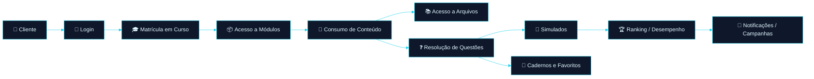
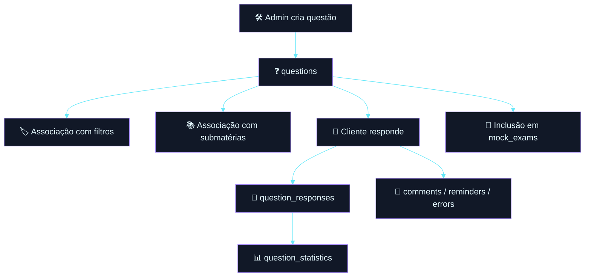

# 🗂️ Dicionário de Dados — Plataforma Educacional / Concursos

<div align="left">


</div>

---

> [!IMPORTANT]
> Este documento foi construído **exclusivamente com base nas tabelas e campos fornecidos**.
>  
> **Não foram inferidos relacionamentos, constraints ou regras de negócio não explicitadas** além do que é tecnicamente necessário para organização e leitura do modelo.

---

## 📚 Sumário

1. [Visão Geral](#1-visão-geral)
2. [Mapa de Domínios](#2-mapa-de-domínios)
3. [Diagrama ER — Visão Macro](#3-diagrama-er--visão-macro)
4. [Fluxos Funcionais](#4-fluxos-funcionais)
5. [Padrões Estruturais](#5-padrões-estruturais)
6. [Dicionário por Domínio](#6-dicionário-por-domínio)
7. [Catálogo Consolidado de Tabelas](#7-catálogo-consolidado-de-tabelas)
8. [Riscos e Observações Técnicas](#8-riscos-e-observações-técnicas)
9. [Resumo Executivo](#9-resumo-executivo)

---

# 1. Visão Geral

## 1.1 Objetivo

Este dicionário de dados documenta a estrutura funcional de uma plataforma educacional focada em:

- **clientes e autenticação**
- **cursos, módulos e conteúdos**
- **questões e simulados**
- **bibliotecas e materiais**
- **engajamento, ranking e marketing**
- **notificações, popups e campanhas**
- **integrações externas e migração**

## 1.2 Características do modelo

O banco apresenta um desenho fortemente orientado a produto digital de educação com os seguintes blocos:

- **Core de usuários**
- **Core educacional**
- **Motor de questões**
- **Motor de simulados**
- **Rastreamento de atividade**
- **Recursos de retenção e marketing**
- **Integrações operacionais**
- **Governança do schema**

---

# 2. Mapa de Domínios

## 2.1 Domínios principais

| Domínio | Objetivo |
|---|---|
| 👤 Identidade & Acesso | Clientes, administradores, papéis, login e logs |
| 🎓 Catálogo Educacional | Cursos, categorias, módulos, conteúdos e matrículas |
| ❓ Banco de Questões | Questões, filtros, comentários, respostas e estatísticas |
| 🧠 Estrutura Jurídica | Disciplinas, matérias e submatérias |
| 📝 Simulados | Simulados, categorias, resoluções e respostas |
| 📚 Biblioteca & Materiais | Bibliotecas, arquivos e progresso de leitura |
| 📒 Organização Pessoal | Cadernos, pastas e favoritos |
| 📣 Comunicação & Marketing | Anúncios, notificações, popups e landing pages |
| 🏆 Gamificação & Tracking | Rankings, trackings e comportamento |
| 🔌 Integrações & Operação | Webhooks, WhatsApp, migração e schema |

---

# 3. Diagrama ER — Visão Macro

```mermaid
%%{init: {
  "theme": "base",
  "themeVariables": {
    "background": "#0b1220",
    "primaryColor": "#111827",
    "primaryTextColor": "#e5f9ff",
    "primaryBorderColor": "#22d3ee",
    "lineColor": "#67e8f9",
    "secondaryColor": "#0f172a",
    "tertiaryColor": "#111827",
    "clusterBkg": "#0f172a",
    "clusterBorder": "#8b5cf6",
    "fontFamily": "Inter, Segoe UI, Arial",
    "fontSize": "14px"
  }
}}%%
erDiagram

    CLIENTS ||--o{ ADDRESSES : has
    CLIENTS ||--o{ CLIENT_LOGINS : logs
    CLIENTS ||--o{ CLIENT_LOGS : actions
    CLIENTS ||--o{ CLASS_CLIENTS : enrolls
    CLASSES ||--o{ CLASS_CLIENTS : receives
    CLASS_CODES ||--o{ CLASS_CLIENTS : used_by

    ADMINS ||--o{ ADMIN_ROLES : owns
    ROLES ||--o{ ADMIN_ROLES : grants

    CATEGORIES ||--o{ MODULES : groups
    MODULES ||--o{ CONTENTS : contains
    CLASSES ||--o{ CLASS_MODULES : links
    MODULES ||--o{ CLASS_MODULES : belongs_to
    CLIENTS ||--o{ MODULE_CLIENT_STATUSES : progresses
    CONTENTS ||--o{ MODULE_CLIENT_STATUSES : tracked_in

    QUESTIONS ||--o{ QUESTION_RESPONSES : answered
    CLIENTS ||--o{ QUESTION_RESPONSES : answers
    QUESTIONS ||--o{ QUESTION_STATISTICS : aggregates

    FILTER_TYPES ||--o{ FILTERS : categorizes
    FILTERS ||--o{ QUESTION_FILTERS : maps
    QUESTIONS ||--o{ QUESTION_FILTERS : receives
    CLIENTS ||--o{ CLIENT_FILTERS : saves
    CLIENTS ||--o{ CLIENT_FILTER_FOLDERS : organizes

    DISCIPLINES ||--o{ MATTERS : contains
    MATTERS ||--o{ SUB_MATTERS : contains
    SUB_MATTERS ||--o{ QUESTION_SUB_MATTERS : classifies
    QUESTIONS ||--o{ QUESTION_SUB_MATTERS : classified_by

    MOCK_CATEGORIES ||--o{ MOCK_EXAMS : groups
    MOCK_EXAMS ||--o{ MOCK_QUESTIONS : contains
    QUESTIONS ||--o{ MOCK_QUESTIONS : used_in
    MOCK_EXAMS ||--o{ MOCK_RESOLUTIONS : resolved
    CLIENTS ||--o{ MOCK_RESOLUTIONS : performs
    MOCK_RESOLUTIONS ||--o{ MOCK_RESPONSES : stores
    QUESTIONS ||--o{ MOCK_RESPONSES : answered
    CLASSES ||--o{ CLASS_MOCKS : links
    MOCK_EXAMS ||--o{ CLASS_MOCKS : assigned
    MOCK_CATEGORIES ||--o{ MOCK_CATEGORY_CLIENT_RATINGS : rated_by
    CLIENTS ||--o{ MOCK_CATEGORY_CLIENT_RATINGS : rates

    LIBRARIES ||--o{ LIBRARY_FILES : contains
    LIBRARY_FILES ||--o{ CONTENT_FILES : linked_to
    CONTENTS ||--o{ CONTENT_FILES : receives
    LIBRARY_FILES ||--o{ FILE_CLIENT_STATUSES : tracked
    CLIENTS ||--o{ FILE_CLIENT_STATUSES : accesses

    CLIENTS ||--o{ NOTEBOOKS : owns
    NOTEBOOK_FOLDERS ||--o{ NOTEBOOKS : organizes
    NOTEBOOKS ||--o{ NOTEBOOK_QUESTIONS : contains
    QUESTIONS ||--o{ NOTEBOOK_QUESTIONS : saved_in

    ANNOUNCEMENTS ||--o{ NOTIFICATIONS : generates
    CLASSES ||--o{ ANNOUNCEMENTS : targets
    CLASSES ||--o{ NOTIFICATIONS : contextualizes
    NOTIFICATIONS ||--o{ CLIENT_READED_NOTIFICATIONS : read_by
    CLIENTS ||--o{ CLIENT_READED_NOTIFICATIONS : reads

    CLASSES ||--o{ POPUPS : promotes
    POPUPS ||--o{ POPUPS_TRACKINGS : tracked_by
    CLIENTS ||--o{ POPUPS_TRACKINGS : interacts

    CLASSES ||--o{ PROMOTIONAL_LANDING_PAGES : promotes
    PROMOTIONAL_LANDING_PAGES ||--o{ PROMOTIONAL_LANDING_PAGE_LEADS : captures
    CLIENTS ||--o{ PROMOTIONAL_LANDING_PAGE_LEADS : becomes

    CLIENTS ||--o{ GENERAL_RANKINGS : ranks
    CLIENTS ||--o{ RANKING_TRACKINGS : tracked
    CLIENTS ||--o{ TRACKINGS : performs

    CLIENTS ||--o{ STATUS_MIGRATIONS : migrates
```



---

# 4. Fluxos Funcionais

## 4.1 Fluxo principal do aluno na plataforma



## 4.2 Fluxo de operação de questão



---

# 5. Padrões Estruturais

## 5.1 Convenções identificadas

| Padrão | Observação |
|---|---|
| `id` | Chave primária lógica em praticamente todas as tabelas |
| `created_at`, `updated_at` | Auditoria temporal padrão |
| tabelas pivot | Presença forte de tabelas de relacionamento N:N |
| status tables | Uso recorrente de tabelas de progresso / leitura / acompanhamento |
| rastreamento | Forte ênfase em analytics e comportamento do usuário |

## 5.2 Tipos de tabela encontrados

- **Entidades centrais**  
  Ex.: `clients`, `classes`, `questions`, `mock_exams`

- **Tabelas pivot / associação**  
  Ex.: `class_clients`, `question_filters`, `content_files`, `class_mocks`

- **Tabelas de rastreamento**  
  Ex.: `client_logs`, `trackings`, `ranking_trackings`, `popups_trackings`

- **Tabelas de status / progresso**  
  Ex.: `module_client_statuses`, `file_client_statuses`, `status_migrations`

---

# 6. Dicionário por Domínio

# 6.1 👤 Identidade & Acesso

## `clients`

**Descrição:** cadastro central de usuários da plataforma.

| Campo | Descrição |
|---|---|
| `id` | Identificador único do cliente |
| `name` | Nome do cliente |
| `email` | E-mail de acesso |
| `password` | Senha do cliente |
| `cpf_cnpj` | Documento do usuário |
| `phone` | Telefone principal |
| `whatsapp` | Contato via WhatsApp |
| `image_url` | Foto de perfil |
| `birthdate` | Data de nascimento |
| `code` | Código associado ao cliente |
| `token_migration` | Token de migração |
| `app_free_access` | Data limite de acesso gratuito ao app |
| `interest` | Área de interesse |
| `migrated` | Flag de migração |
| `created_at` | Data de criação |
| `updated_at` | Data de atualização |

**Relacionamentos relevantes:**
- 1:N com `addresses`
- 1:N com `client_logins`
- 1:N com `client_logs`
- 1:N com `class_clients`
- 1:N com `question_responses`
- 1:N com `mock_resolutions`
- 1:N com `notebooks`
- 1:N com `trackings`

---

## `addresses`

**Descrição:** endereços físicos vinculados ao cliente.

| Campo | Descrição |
|---|---|
| `id` | Identificador único |
| `client_id` | Cliente relacionado |
| `street` | Rua |
| `number` | Número |
| `district` | Bairro |
| `cep` | CEP |
| `city` | Cidade |
| `uf` | UF |
| `created_at` | Data de criação |
| `updated_at` | Data de atualização |

---

## `client_logins`

**Descrição:** histórico de login do cliente.

| Campo | Descrição |
|---|---|
| `id` | Identificador único |
| `client_id` | Cliente relacionado |
| `platform` | Plataforma utilizada |
| `os_version` | Versão do sistema operacional |
| `created_at` | Data/hora do login |
| `updated_at` | Data/hora de atualização |

---

## `client_logs`

**Descrição:** trilha de ações relevantes executadas pelo cliente.

| Campo | Descrição |
|---|---|
| `id` | Identificador único |
| `client_id` | Cliente relacionado |
| `action` | Ação realizada |
| `color` | Cor visual associada |
| `icon` | Ícone visual associado |
| `description` | Descrição da ação |
| `client_side_show` | Exibição para o cliente |
| `created_at` | Data da ação |

---

## `admins`

**Descrição:** administradores da plataforma.

| Campo | Descrição |
|---|---|
| `id` | Identificador único |
| `name` | Nome |
| `email` | E-mail |
| `password` | Senha |
| `image_url` | Foto de perfil |
| `created_at` | Data de criação |
| `updated_at` | Data de atualização |

---

## `roles`

**Descrição:** papéis/funções administrativas.

| Campo | Descrição |
|---|---|
| `id` | Identificador único |
| `name` | Nome do papel |
| `created_at` | Data de criação |
| `updated_at` | Data de atualização |

---

## `admin_roles`

**Descrição:** associação entre administradores e papéis.

| Campo | Descrição |
|---|---|
| `id` | Identificador único |
| `admin_id` | Administrador |
| `role_id` | Papel |
| `created_at` | Data de criação |
| `updated_at` | Data de atualização |

---

# 6.2 🎓 Catálogo Educacional

## `classes`

**Descrição:** cursos ofertados na plataforma.

| Campo | Descrição |
|---|---|
| `id` | Identificador único |
| `name` | Nome do curso |
| `period` | Período/duração |
| `pdf` | Flag de conteúdo PDF |
| `question` | Flag de questões |
| `general` | Flag de conteúdo geral |
| `collaborative` | Flag de conteúdo colaborativo |
| `is_paid` | Curso pago/gratuito |
| `show_expiration` | Exibição de expiração |
| `expiration_message` | Mensagem de expiração |
| `description` | Descrição |
| `image_url` | Imagem do curso |
| `created_at` | Data de criação |
| `updated_at` | Data de atualização |

---

## `class_clients`

**Descrição:** matrícula do cliente em cursos.

| Campo | Descrição |
|---|---|
| `id` | Identificador único |
| `client_id` | Cliente |
| `class_id` | Curso |
| `code_id` | Código de acesso usado |
| `is_canceled` | Matrícula cancelada |
| `cancellation_reason` | Motivo do cancelamento |
| `is_refunded` | Indica reembolso |
| `is_lifetime` | Acesso vitalício |
| `expiration_date` | Data de expiração |
| `created_at` | Data de criação |
| `updated_at` | Data de atualização |

---

## `class_codes`

**Descrição:** códigos vinculados a cursos.

| Campo | Descrição |
|---|---|
| `id` | Identificador único |
| `class_id` | Curso |
| `code` | Código |
| `type` | Tipo do código |
| `created_at` | Data de criação |
| `updated_at` | Data de atualização |

---

## `categories`

**Descrição:** categorias macro de organização do conteúdo.

| Campo | Descrição |
|---|---|
| `id` | Identificador único |
| `name` | Nome |
| `image_url` | Imagem representativa |
| `created_at` | Data de criação |
| `updated_at` | Data de atualização |

---

## `modules`

**Descrição:** módulos pertencentes a categorias.

| Campo | Descrição |
|---|---|
| `id` | Identificador único |
| `category_id` | Categoria |
| `name` | Nome |
| `description` | Descrição |
| `is_free` | Acesso gratuito |
| `show_percentage` | Exibição de progresso |
| `url` | Link associado |
| `image` | Imagem |
| `created_at` | Data de criação |
| `updated_at` | Data de atualização |

---

## `class_modules`

**Descrição:** associação entre cursos e módulos.

| Campo | Descrição |
|---|---|
| `id` | Identificador único |
| `module_id` | Módulo |
| `class_id` | Curso |
| `created_at` | Data de criação |
| `updated_at` | Data de atualização |

---

## `contents`

**Descrição:** conteúdos internos de um módulo.

| Campo | Descrição |
|---|---|
| `id` | Identificador único |
| `module_id` | Módulo |
| `name` | Nome |
| `description` | Descrição |
| `day` | Organização temporal |
| `position` | Ordem |
| `expiration_date` | Data de expiração |
| `created_at` | Data de criação |
| `updated_at` | Data de atualização |

---

## `module_client_statuses`

**Descrição:** progresso do cliente nos conteúdos.

| Campo | Descrição |
|---|---|
| `id` | Identificador único |
| `client_id` | Cliente |
| `content_id` | Conteúdo |
| `is_finished` | Conteúdo concluído |
| `created_at` | Data de criação |
| `updated_at` | Data de atualização |

---

# 6.3 ❓ Banco de Questões

## `questions`

**Descrição:** banco central de questões.

| Campo | Descrição |
|---|---|
| `id` | Identificador único |
| `user_id` | Administrador criador |
| `title` | Enunciado |
| `description` | Contexto/detalhamento |
| `explanation` | Explicação da resposta |
| `is_true` | Correção V/F |
| `is_accepted` | Questão aprovada |
| `reason_refused` | Motivo de recusa |
| `is_from_client` | Enviada por cliente |
| `ia_generated` | Gerada por IA |
| `created_at` | Data de criação |
| `updated_at` | Data de atualização |

---

## `question_responses`

**Descrição:** respostas dos clientes às questões.

| Campo | Descrição |
|---|---|
| `id` | Identificador único |
| `question_id` | Questão |
| `client_id` | Cliente |
| `client_response` | Resposta do cliente |
| `is_correct` | Resposta correta |
| `is_current` | Tentativa atual |
| `created_at` | Data de criação |
| `updated_at` | Data de atualização |

---

## `question_statistics`

**Descrição:** estatísticas agregadas de desempenho por questão.

| Campo | Descrição |
|---|---|
| `id` | Identificador único |
| `question_id` | Questão |
| `total_correct` | Total de acertos |
| `total_incorrect` | Total de erros |
| `created_at` | Data de criação |
| `updated_at` | Data de atualização |

---

## `filter_types`

**Descrição:** tipos de filtro aplicáveis às questões.

| Campo | Descrição |
|---|---|
| `id` | Identificador único |
| `name` | Nome |
| `created_at` | Data de criação |
| `updated_at` | Data de atualização |

---

## `filters`

**Descrição:** filtros disponíveis para classificação.

| Campo | Descrição |
|---|---|
| `id` | Identificador único |
| `name` | Nome |
| `type_id` | Tipo de filtro |
| `created_at` | Data de criação |
| `updated_at` | Data de atualização |

---

## `question_filters`

**Descrição:** associação entre questões e filtros.

| Campo | Descrição |
|---|---|
| `id` | Identificador único |
| `question_id` | Questão |
| `filter_id` | Filtro |
| `created_at` | Data de criação |
| `updated_at` | Data de atualização |

---

## `client_filters`

**Descrição:** filtros personalizados salvos pelo cliente.

| Campo | Descrição |
|---|---|
| `id` | Identificador único |
| `client_id` | Cliente |
| `name` | Nome do filtro salvo |
| `filter_ids` | Lista de filtros em JSON |
| `created_at` | Data de criação |
| `updated_at` | Data de atualização |

---

## `client_filter_folders`

**Descrição:** pastas de organização de filtros do cliente.

| Campo | Descrição |
|---|---|
| `id` | Identificador único |
| `name` | Nome da pasta |
| `client_id` | Cliente |
| `created_at` | Data de criação |
| `updated_at` | Data de atualização |

---

## `question_comments`

**Descrição:** comentários do cliente sobre questões.

| Campo | Descrição |
|---|---|
| `id` | Identificador único |
| `question_id` | Questão |
| `client_id` | Cliente |
| `text` | Conteúdo |
| `is_readed` | Lido |
| `is_corrected` | Corrigido |
| `is_accepted` | Aceito |
| `created_at` | Data de criação |
| `updated_at` | Data de atualização |

---

## `question_errors`

**Descrição:** registro de erros reportados em questões.

| Campo | Descrição |
|---|---|
| `id` | Identificador único |
| `question_id` | Questão |
| `client_id` | Cliente |
| `text` | Conteúdo |
| `is_readed` | Lido |
| `is_corrected` | Corrigido |
| `is_accepted` | Aceito |
| `created_at` | Data de criação |
| `updated_at` | Data de atualização |

---

## `question_reminders`

**Descrição:** lembretes associados a questões.

| Campo | Descrição |
|---|---|
| `id` | Identificador único |
| `question_id` | Questão |
| `client_id` | Cliente |
| `text` | Conteúdo |
| `is_readed` | Lido |
| `is_corrected` | Corrigido |
| `is_accepted` | Aceito |
| `created_at` | Data de criação |
| `updated_at` | Data de atualização |

---

# 6.4 🧠 Estrutura Jurídica

## `disciplines`

| Campo | Descrição |
|---|---|
| `id` | Identificador único |
| `name` | Nome da disciplina |
| `position` | Ordem de exibição |
| `created_at` | Data de criação |
| `updated_at` | Data de atualização |

## `matters`

| Campo | Descrição |
|---|---|
| `id` | Identificador único |
| `name` | Nome da matéria |
| `position` | Ordem |
| `discipline_id` | Disciplina |
| `created_at` | Data de criação |
| `updated_at` | Data de atualização |

## `sub_matters`

| Campo | Descrição |
|---|---|
| `id` | Identificador único |
| `name` | Nome da submatéria |
| `position` | Ordem |
| `matter_id` | Matéria |
| `created_at` | Data de criação |
| `updated_at` | Data de atualização |

## `question_sub_matters`

| Campo | Descrição |
|---|---|
| `id` | Identificador único |
| `question_id` | Questão |
| `sub_matter_id` | Submatéria |
| `position` | Ordem/relevância |
| `created_at` | Data de criação |
| `updated_at` | Data de atualização |

---

# 6.5 📝 Simulados

## `mock_categories`

| Campo | Descrição |
|---|---|
| `id` | Identificador único |
| `name` | Nome da categoria |
| `is_free` | Categoria gratuita |
| `created_at` | Data de criação |
| `updated_at` | Data de atualização |

## `mock_exams`

| Campo | Descrição |
|---|---|
| `id` | Identificador único |
| `category_id` | Categoria |
| `name` | Nome do simulado |
| `position` | Ordem |
| `created_at` | Data de criação |
| `updated_at` | Data de atualização |

## `mock_questions`

| Campo | Descrição |
|---|---|
| `id` | Identificador único |
| `question_id` | Questão |
| `mock_id` | Simulado |
| `position` | Ordem da questão |
| `created_at` | Data de criação |
| `updated_at` | Data de atualização |

## `mock_resolutions`

| Campo | Descrição |
|---|---|
| `id` | Identificador único |
| `mock_id` | Simulado |
| `client_id` | Cliente |
| `points` | Pontuação |
| `conclusion_time` | Tempo de conclusão |
| `created_at` | Data de início/registro |
| `updated_at` | Data de atualização |

## `mock_responses`

| Campo | Descrição |
|---|---|
| `id` | Identificador único |
| `question_id` | Questão |
| `resolution_id` | Resolução do simulado |
| `client_response` | Resposta do cliente |
| `created_at` | Data de criação |
| `updated_at` | Data de atualização |

## `class_mocks`

| Campo | Descrição |
|---|---|
| `id` | Identificador único |
| `mock_id` | Simulado |
| `class_id` | Curso |
| `created_at` | Data de criação |
| `updated_at` | Data de atualização |

## `mock_category_client_ratings`

| Campo | Descrição |
|---|---|
| `id` | Identificador único |
| `category_id` | Categoria |
| `client_id` | Cliente |
| `rating` | Nota atribuída |
| `created_at` | Data de criação |
| `updated_at` | Data de atualização |

---

# 6.6 📚 Biblioteca & Materiais

## `libraries`

| Campo | Descrição |
|---|---|
| `id` | Identificador único |
| `name` | Nome da biblioteca |
| `created_at` | Data de criação |
| `updated_at` | Data de atualização |

## `library_files`

| Campo | Descrição |
|---|---|
| `id` | Identificador único |
| `library_id` | Biblioteca |
| `name` | Nome do arquivo |
| `file` | Caminho/URL |
| `created_at` | Data de criação |
| `updated_at` | Data de atualização |

## `content_files`

| Campo | Descrição |
|---|---|
| `id` | Identificador único |
| `file_id` | Arquivo |
| `content_id` | Conteúdo |
| `created_at` | Data de criação |
| `updated_at` | Data de atualização |

## `file_client_statuses`

| Campo | Descrição |
|---|---|
| `id` | Identificador único |
| `file_id` | Arquivo |
| `client_id` | Cliente |
| `created_at` | Data de criação |
| `updated_at` | Data de atualização |

---

# 6.7 📒 Organização Pessoal

## `notebook_folders`

| Campo | Descrição |
|---|---|
| `id` | Identificador único |
| `client_id` | Cliente proprietário |
| `name` | Nome da pasta |
| `created_at` | Data de criação |
| `updated_at` | Data de atualização |

## `notebooks`

| Campo | Descrição |
|---|---|
| `id` | Identificador único |
| `client_id` | Cliente proprietário |
| `notebook_folder_id` | Pasta do caderno |
| `name` | Nome do caderno |
| `created_at` | Data de criação |
| `updated_at` | Data de atualização |

## `notebook_questions`

| Campo | Descrição |
|---|---|
| `id` | Identificador único |
| `question_id` | Questão |
| `notebook_id` | Caderno |
| `created_at` | Data de criação |
| `updated_at` | Data de atualização |

---

# 6.8 📣 Comunicação & Marketing

## `announcements`

| Campo | Descrição |
|---|---|
| `id` | Identificador único |
| `name` | Nome |
| `text` | Conteúdo |
| `class_id` | Curso relacionado |
| `type` | Tipo |
| `created_at` | Data de criação |
| `updated_at` | Data de atualização |

## `notifications`

| Campo | Descrição |
|---|---|
| `id` | Identificador único |
| `title` | Título |
| `description` | Descrição |
| `icon` | Ícone |
| `announcement_id` | Anúncio relacionado |
| `class_id` | Curso relacionado |
| `created_at` | Data de criação |
| `updated_at` | Data de atualização |

## `client_readed_notifications`

| Campo | Descrição |
|---|---|
| `id` | Identificador único |
| `client_id` | Cliente |
| `notification_id` | Notificação |
| `created_at` | Data de criação |
| `updated_at` | Data de atualização |

## `popups`

| Campo | Descrição |
|---|---|
| `id` | Identificador único |
| `class_id` | Curso relacionado |
| `for_paid_classes` | Exibição para alunos pagantes |
| `access_time` | Tempo de exibição |
| `mobile_picture` | Imagem mobile |
| `desktop_picture` | Imagem desktop |
| `link` | URL de destino |
| `created_at` | Data de criação |
| `updated_at` | Data de atualização |

## `popups_trackings`

| Campo | Descrição |
|---|---|
| `id` | Identificador único |
| `total_clicks` | Total de cliques |
| `click_date` | Data do clique |
| `popup_id` | Popup |
| `client_id` | Cliente |
| `created_at` | Data de criação |
| `updated_at` | Data de atualização |

## `promotional_landing_pages`

| Campo | Descrição |
|---|---|
| `id` | Identificador único |
| `promotional_title` | Título promocional |
| `promotional_subtitle` | Subtítulo |
| `promotional_text` | Texto principal |
| `promotional_image` | Imagem |
| `promotional_button_text` | Texto do CTA |
| `promotional_rdstation_tag` | Tag RD Station |
| `class_id` | Curso promovido |
| `is_active` | Página ativa |
| `created_at` | Data de criação |
| `updated_at` | Data de atualização |

## `promotional_landing_page_leads`

| Campo | Descrição |
|---|---|
| `id` | Identificador único |
| `client_id` | Cliente |
| `class_id` | Curso |
| `promo_lp_id` | Landing page |
| `created_at` | Data de criação |
| `updated_at` | Data de atualização |

---

# 6.9 🏆 Gamificação & Tracking

## `general_rankings`

| Campo | Descrição |
|---|---|
| `id` | Identificador único |
| `client_id` | Cliente ranqueado |
| `total` | Pontuação total |
| `created_at` | Data de criação |
| `updated_at` | Data de atualização |

## `ranking_trackings`

| Campo | Descrição |
|---|---|
| `id` | Identificador único |
| `client_id` | Cliente relacionado |
| `total_responses` | Total de respostas |
| `created_at` | Data de criação |
| `updated_at` | Data de atualização |

## `trackings`

| Campo | Descrição |
|---|---|
| `id` | Identificador único |
| `client_id` | Cliente |
| `action` | Ação rastreada |
| `created_at` | Data de criação |
| `updated_at` | Data de atualização |

---

# 6.10 🔌 Integrações & Operação

## `webhooks`

| Campo | Descrição |
|---|---|
| `id` | Identificador único |
| `webhook_code` | Código do webhook |
| `data` | Dados do evento |
| `webhook` | Tipo/origem do webhook |
| `created_at` | Data de criação |
| `updated_at` | Data de atualização |

## `whatsapp_events`

| Campo | Descrição |
|---|---|
| `id` | Identificador único |
| `phone_number` | Número de telefone |
| `wa_id` | Identificador WhatsApp |
| `ctwa_id` | Identificador complementar |
| `webhook_data` | Payload bruto do evento |
| `created_at` | Data de criação |
| `updated_at` | Data de atualização |

## `whatsapp_event_clients`

| Campo | Descrição |
|---|---|
| `id` | Identificador único |
| `phone_number` | Telefone relacionado |
| `wa_id` | ID WhatsApp |
| `ctwa_id` | ID complementar |
| `created_at` | Data de criação |
| `updated_at` | Data de atualização |

## `status_migrations`

| Campo | Descrição |
|---|---|
| `client_id` | Cliente em migração |
| `status` | Estado atual |
| `info` | Informações adicionais em JSON |
| `exception` | Registro de erro |
| `started_at` | Início |
| `finished_at` | Fim |

## `adonis_schema`

| Campo | Descrição |
|---|---|
| `id` | Identificador |
| `name` | Nome da migration |
| `batch` | Lote |
| `migration_time` | Tempo de execução |

## `adonis_schema_versions`

| Campo | Descrição |
|---|---|
| `version` | Versão atual do schema |

---

# 7. Catálogo Consolidado de Tabelas

## 7.1 Visão rápida

| Grupo | Tabelas |
|---|---|
| Identidade | `clients`, `addresses`, `client_logins`, `client_logs`, `admins`, `roles`, `admin_roles` |
| Catálogo educacional | `classes`, `class_clients`, `class_codes`, `categories`, `modules`, `class_modules`, `contents`, `module_client_statuses` |
| Questões | `questions`, `question_responses`, `question_statistics`, `filters`, `filter_types`, `question_filters`, `client_filters`, `client_filter_folders`, `question_comments`, `question_errors`, `question_reminders` |
| Estrutura jurídica | `disciplines`, `matters`, `sub_matters`, `question_sub_matters` |
| Simulados | `mock_categories`, `mock_exams`, `mock_questions`, `mock_resolutions`, `mock_responses`, `class_mocks`, `mock_category_client_ratings` |
| Biblioteca | `libraries`, `library_files`, `content_files`, `file_client_statuses` |
| Organização pessoal | `notebooks`, `notebook_folders`, `notebook_questions` |
| Comunicação | `announcements`, `notifications`, `client_readed_notifications` |
| Marketing | `popups`, `popups_trackings`, `promotional_landing_pages`, `promotional_landing_page_leads` |
| Engajamento | `general_rankings`, `ranking_trackings`, `trackings` |
| Operação | `webhooks`, `whatsapp_events`, `whatsapp_event_clients`, `status_migrations`, `adonis_schema`, `adonis_schema_versions` |

---

# 8. Riscos e Observações Técnicas

## 8.1 Pontos relevantes do modelo

> [!NOTE]
> Os itens abaixo são **observações técnicas de documentação**, não julgamento arquitetural definitivo.

### a) Alta fragmentação funcional
O modelo possui muitos submódulos especializados, o que é positivo para cobertura de produto, mas aumenta custo de manutenção e entendimento.

### b) Forte presença de tabelas de rastreamento
Há múltiplas tabelas voltadas a:
- progresso
- interação
- analytics
- leitura
- performance
- migração

Isso sugere um produto com forte preocupação em:
- retenção
- acompanhamento pedagógico
- comportamento do aluno

### c) Núcleo educacional bem definido
O backbone principal parece ser:

```text
clients
└── class_clients
    └── classes
        └── class_modules
            └── modules
                └── contents
                    ├── content_files
                    ├── module_client_statuses
                    └── experiências derivadas
```

### d) Questões como ativo central de negócio
O sistema de questões é um dos domínios mais ricos do banco e se conecta com:

- filtros
- submatérias
- respostas
- estatísticas
- comentários
- simulados
- cadernos
- rankings

---

# 9. Resumo Executivo

## 9.1 Síntese

Este banco representa uma plataforma com **maturidade funcional considerável**, organizada em torno de cinco eixos centrais:

- **usuário**
- **curso**
- **conteúdo**
- **questão**
- **simulado**

## 9.2 Backbone funcional mais importante

```text
👤 Cliente
  ├── 🎓 Curso
  │   ├── 📦 Módulo
  │   │   ├── 📄 Conteúdo
  │   │   └── 📚 Arquivos
  │   └── 📝 Simulados
  ├── ❓ Questões
  ├── 📒 Cadernos / Filtros
  ├── 🏆 Ranking / Tracking
  └── 📣 Comunicação / Marketing
```

## 9.3 Valor deste documento

Este material serve como base para:

- onboarding técnico
- discovery de domínio
- arquitetura de integração
- desenho de APIs
- modelagem de ACL / BFF / serviços
- planejamento de refatoração
- documentação de legado
- sustentação de produto

---

> [!TIP]
> Próximo passo recomendado:
> gerar uma **versão 2 deste documento com “Matriz de Relacionamentos + Chaves Estrangeiras Inferidas + Sugestão de Índices + Mapa para futura arquitetura modular”**.

