# 🗂️ Dicionário de Dados — Plataforma Educacional / Concursos

<div align="left">


</div>

---

## 📚 Sumário

1. [Visão Geral](#1-visão-geral)
2. [Mapa de Domínios](#2-mapa-de-domínios)
3. [Diagrama ER — Visão Geral com Ênfase em Questions](#3-diagrama-er--visão-geral-com-ênfase-em-questions)
4. [Matriz de Relacionamentos](#4-matriz-de-relacionamentos)
5. [Domínio Prioritário — Questions](#5-domínio-prioritário--questions)
6. [Dicionário por Domínio](#6-dicionário-por-domínio)
7. [Catálogo Consolidado de Tabelas](#7-catálogo-consolidado-de-tabelas)
8. [Resumo Executivo](#8-resumo-executivo)

---

# 1. Visão Geral

## 1.1 Objetivo

Este documento registra a estrutura de dados de uma plataforma educacional voltada a concursos, cobrindo todas as tabelas fornecidas, com maior ênfase no domínio de **questions**.

## 1.2 Eixos do modelo

O banco se organiza em torno de blocos funcionais de:

- identidade e acesso
- catálogo educacional
- banco de questões
- simulados
- biblioteca e materiais
- organização pessoal
- comunicação e marketing
- tracking e ranking
- integrações e operação

---

# 2. Mapa de Domínios

| Domínio | Escopo |
|---|---|
| 👤 Identidade & Acesso | clientes, admins, roles, logins, logs e permissões |
| 🎓 Catálogo Educacional | classes, categories, modules, contents e vínculos de acesso |
| ❓ Questions | questões, filtros, respostas, estatísticas, comentários, erros e lembretes |
| 🧠 Classificação Jurídica | disciplines, matters, sub_matters e classificação temática |
| 📝 Simulados | mock_exams, mock_questions, resoluções e respostas |
| 📚 Biblioteca & Materiais | libraries, files e status de consumo |
| 📒 Organização Pessoal | notebooks, folders e questões salvas |
| 📣 Comunicação & Marketing | anúncios, notificações, popups e landing pages |
| 🏆 Engajamento & Tracking | rankings, trackings e métricas de uso |
| 🔌 Integrações & Operação | webhooks, WhatsApp, migração e controle de schema |

---

# 3. Diagrama ER — Visão Geral com Ênfase em Questions

```mermaid
%%{init: {
  "theme": "base",
  "themeVariables": {
    "background": "#0b1220",
    "primaryColor": "#111827",
    "primaryTextColor": "#e5f9ff",
    "primaryBorderColor": "#22d3ee",
    "lineColor": "#67e8f9",
    "secondaryColor": "#0f172a",
    "tertiaryColor": "#111827",
    "clusterBkg": "#0f172a",
    "clusterBorder": "#8b5cf6",
    "fontFamily": "Inter, Segoe UI, Arial",
    "fontSize": "14px"
  }
}}%%
erDiagram

    CLIENTS ||--o{ ADDRESSES : has
    CLIENTS ||--o{ CLIENT_LOGINS : logs
    CLIENTS ||--o{ CLIENT_LOGS : records
    CLIENTS ||--o{ CLASS_CLIENTS : enrolls
    CLIENTS ||--o{ QUESTION_RESPONSES : answers
    CLIENTS ||--o{ QUESTION_COMMENTS : writes
    CLIENTS ||--o{ QUESTION_ERRORS : reports
    CLIENTS ||--o{ QUESTION_REMINDERS : creates
    CLIENTS ||--o{ CLIENT_FILTERS : saves
    CLIENTS ||--o{ CLIENT_FILTER_FOLDERS : organizes
    CLIENTS ||--o{ NOTEBOOKS : owns
    CLIENTS ||--o{ MOCK_RESOLUTIONS : resolves
    CLIENTS ||--o{ FILE_CLIENT_STATUSES : accesses
    CLIENTS ||--o{ GENERAL_RANKINGS : ranks
    CLIENTS ||--o{ RANKING_TRACKINGS : tracked
    CLIENTS ||--o{ TRACKINGS : performs

    ADMINS ||--o{ ADMIN_ROLES : owns
    ROLES ||--o{ ADMIN_ROLES : grants
    ADMINS ||--o{ QUESTIONS : creates

    CATEGORIES ||--o{ MODULES : groups
    MODULES ||--o{ CONTENTS : contains
    CLASSES ||--o{ CLASS_MODULES : links
    MODULES ||--o{ CLASS_MODULES : linked
    CONTENTS ||--o{ MODULE_CLIENT_STATUSES : tracked
    CONTENTS ||--o{ CONTENT_FILES : receives

    QUESTIONS ||--o{ QUESTION_RESPONSES : receives
    QUESTIONS ||--o{ QUESTION_STATISTICS : aggregates
    QUESTIONS ||--o{ QUESTION_FILTERS : classified
    QUESTIONS ||--o{ QUESTION_SUB_MATTERS : categorized
    QUESTIONS ||--o{ QUESTION_COMMENTS : commented
    QUESTIONS ||--o{ QUESTION_ERRORS : flagged
    QUESTIONS ||--o{ QUESTION_REMINDERS : reminded
    QUESTIONS ||--o{ NOTEBOOK_QUESTIONS : saved
    QUESTIONS ||--o{ MOCK_QUESTIONS : reused

    FILTER_TYPES ||--o{ FILTERS : types
    FILTERS ||--o{ QUESTION_FILTERS : applied

    DISCIPLINES ||--o{ MATTERS : contains
    MATTERS ||--o{ SUB_MATTERS : contains
    SUB_MATTERS ||--o{ QUESTION_SUB_MATTERS : classifies

    MOCK_CATEGORIES ||--o{ MOCK_EXAMS : groups
    MOCK_EXAMS ||--o{ MOCK_QUESTIONS : contains
    MOCK_EXAMS ||--o{ MOCK_RESOLUTIONS : resolved
    MOCK_RESOLUTIONS ||--o{ MOCK_RESPONSES : stores

    LIBRARIES ||--o{ LIBRARY_FILES : contains
    LIBRARY_FILES ||--o{ CONTENT_FILES : linked
    LIBRARY_FILES ||--o{ FILE_CLIENT_STATUSES : tracked

    NOTEBOOK_FOLDERS ||--o{ NOTEBOOKS : organizes
    NOTEBOOKS ||--o{ NOTEBOOK_QUESTIONS : stores

    ANNOUNCEMENTS ||--o{ NOTIFICATIONS : originates
    NOTIFICATIONS ||--o{ CLIENT_READED_NOTIFICATIONS : read_by

    POPUPS ||--o{ POPUPS_TRACKINGS : tracked
    PROMOTIONAL_LANDING_PAGES ||--o{ PROMOTIONAL_LANDING_PAGE_LEADS : captures
```



---

# 4. Matriz de Relacionamentos

## 4.1 Identity & Acesso

| Origem | Campo | Destino | Cardinalidade |
|---|---|---|---|
| `addresses` | `client_id` | `clients.id` | N:1 |
| `client_logins` | `client_id` | `clients.id` | N:1 |
| `client_logs` | `client_id` | `clients.id` | N:1 |
| `admin_roles` | `admin_id` | `admins.id` | N:1 |
| `admin_roles` | `role_id` | `roles.id` | N:1 |

## 4.2 Educacional

| Origem | Campo | Destino | Cardinalidade |
|---|---|---|---|
| `class_clients` | `client_id` | `clients.id` | N:1 |
| `class_clients` | `class_id` | `classes.id` | N:1 |
| `class_clients` | `code_id` | `class_codes.id` | N:1 |
| `class_codes` | `class_id` | `classes.id` | N:1 |
| `modules` | `category_id` | `categories.id` | N:1 |
| `class_modules` | `module_id` | `modules.id` | N:1 |
| `class_modules` | `class_id` | `classes.id` | N:1 |
| `contents` | `module_id` | `modules.id` | N:1 |
| `module_client_statuses` | `client_id` | `clients.id` | N:1 |
| `module_client_statuses` | `content_id` | `contents.id` | N:1 |
| `client_favorite_modules` | `client_id` | `clients.id` | N:1 |
| `client_favorite_modules` | `module_id` | `modules.id` | N:1 |
| `client_last_access_modules` | `client_id` | `clients.id` | N:1 |
| `client_last_access_modules` | `module_id` | `modules.id` | N:1 |
| `module_comments` | `content_id` | `contents.id` | N:1 |
| `module_comments` | `client_id` | `clients.id` | N:1 |
| `module_errors` | `content_id` | `contents.id` | N:1 |
| `module_errors` | `client_id` | `clients.id` | N:1 |

## 4.3 Questions

| Origem | Campo | Destino | Cardinalidade |
|---|---|---|---|
| `questions` | `user_id` | `admins.id` | N:1 |
| `question_responses` | `question_id` | `questions.id` | N:1 |
| `question_responses` | `client_id` | `clients.id` | N:1 |
| `question_statistics` | `question_id` | `questions.id` | N:1 |
| `filters` | `type_id` | `filter_types.id` | N:1 |
| `question_filters` | `question_id` | `questions.id` | N:1 |
| `question_filters` | `filter_id` | `filters.id` | N:1 |
| `client_filters` | `client_id` | `clients.id` | N:1 |
| `client_filter_folders` | `client_id` | `clients.id` | N:1 |
| `question_comments` | `question_id` | `questions.id` | N:1 |
| `question_comments` | `client_id` | `clients.id` | N:1 |
| `question_errors` | `question_id` | `questions.id` | N:1 |
| `question_errors` | `client_id` | `clients.id` | N:1 |
| `question_reminders` | `question_id` | `questions.id` | N:1 |
| `question_reminders` | `client_id` | `clients.id` | N:1 |
| `question_sub_matters` | `question_id` | `questions.id` | N:1 |
| `question_sub_matters` | `sub_matter_id` | `sub_matters.id` | N:1 |

## 4.4 Classificação Jurídica

| Origem | Campo | Destino | Cardinalidade |
|---|---|---|---|
| `matters` | `discipline_id` | `disciplines.id` | N:1 |
| `sub_matters` | `matter_id` | `matters.id` | N:1 |

## 4.5 Simulados

| Origem | Campo | Destino | Cardinalidade |
|---|---|---|---|
| `mock_exams` | `category_id` | `mock_categories.id` | N:1 |
| `mock_questions` | `question_id` | `questions.id` | N:1 |
| `mock_questions` | `mock_id` | `mock_exams.id` | N:1 |
| `mock_resolutions` | `mock_id` | `mock_exams.id` | N:1 |
| `mock_resolutions` | `client_id` | `clients.id` | N:1 |
| `mock_responses` | `question_id` | `questions.id` | N:1 |
| `mock_responses` | `resolution_id` | `mock_resolutions.id` | N:1 |
| `class_mocks` | `mock_id` | `mock_exams.id` | N:1 |
| `class_mocks` | `class_id` | `classes.id` | N:1 |
| `mock_category_client_ratings` | `category_id` | `mock_categories.id` | N:1 |
| `mock_category_client_ratings` | `client_id` | `clients.id` | N:1 |

## 4.6 Biblioteca & Materiais

| Origem | Campo | Destino | Cardinalidade |
|---|---|---|---|
| `library_files` | `library_id` | `libraries.id` | N:1 |
| `content_files` | `file_id` | `library_files.id` | N:1 |
| `content_files` | `content_id` | `contents.id` | N:1 |
| `file_client_statuses` | `file_id` | `library_files.id` | N:1 |
| `file_client_statuses` | `client_id` | `clients.id` | N:1 |

## 4.7 Organização Pessoal

| Origem | Campo | Destino | Cardinalidade |
|---|---|---|---|
| `notebooks` | `client_id` | `clients.id` | N:1 |
| `notebooks` | `notebook_folder_id` | `notebook_folders.id` | N:1 |
| `notebook_folders` | `client_id` | `clients.id` | N:1 |
| `notebook_questions` | `question_id` | `questions.id` | N:1 |
| `notebook_questions` | `notebook_id` | `notebooks.id` | N:1 |

## 4.8 Comunicação, Marketing e Engajamento

| Origem | Campo | Destino | Cardinalidade |
|---|---|---|---|
| `announcements` | `class_id` | `classes.id` | N:1 |
| `notifications` | `announcement_id` | `announcements.id` | N:1 |
| `notifications` | `class_id` | `classes.id` | N:1 |
| `client_readed_notifications` | `client_id` | `clients.id` | N:1 |
| `client_readed_notifications` | `notification_id` | `notifications.id` | N:1 |
| `popups` | `class_id` | `classes.id` | N:1 |
| `popups_trackings` | `popup_id` | `popups.id` | N:1 |
| `popups_trackings` | `client_id` | `clients.id` | N:1 |
| `promotional_landing_pages` | `class_id` | `classes.id` | N:1 |
| `promotional_landing_page_leads` | `client_id` | `clients.id` | N:1 |
| `promotional_landing_page_leads` | `class_id` | `classes.id` | N:1 |
| `promotional_landing_page_leads` | `promo_lp_id` | `promotional_landing_pages.id` | N:1 |
| `general_rankings` | `client_id` | `clients.id` | N:1 |
| `ranking_trackings` | `client_id` | `clients.id` | N:1 |
| `trackings` | `client_id` | `clients.id` | N:1 |

## 4.9 Integrações e Operação

| Origem | Campo | Destino | Cardinalidade |
|---|---|---|---|
| `status_migrations` | `client_id` | `clients.id` | N:1 |

---

# 5. Domínio Prioritário — Questions

## 5.1 Núcleo funcional

O domínio de **questions** é o bloco mais rico do modelo. Ele se organiza em torno da entidade central `questions` e de quatro grupos auxiliares:

- **resolução**: `question_responses`, `question_statistics`
- **classificação**: `filter_types`, `filters`, `question_filters`, `question_sub_matters`
- **interação do aluno**: `question_comments`, `question_errors`, `question_reminders`
- **reuso funcional**: `mock_questions`, `notebook_questions`

## 5.2 Backbone reduzido

```text
admins
└── questions
    ├── question_responses
    │   └── clients
    ├── question_statistics
    ├── question_filters
    │   └── filters
    │       └── filter_types
    ├── question_sub_matters
    │   └── sub_matters
    │       └── matters
    │           └── disciplines
    ├── question_comments
    ├── question_errors
    ├── question_reminders
    ├── notebook_questions
    └── mock_questions
```

## 5.3 Tabelas centrais do domínio

### `questions`

Tabela principal do banco de questões.

| Campo | Descrição |
|---|---|
| `id` | identificador da questão |
| `user_id` | administrador criador |
| `title` | enunciado |
| `description` | detalhamento |
| `explanation` | explicação da resposta |
| `is_true` | resposta correta em modelo V/F |
| `is_accepted` | status de aceite |
| `reason_refused` | motivo de recusa |
| `is_from_client` | origem em cliente |
| `ia_generated` | origem por IA |
| `created_at` | criação |
| `updated_at` | atualização |

### `question_responses`

Respostas dos clientes às questões.

| Campo | Descrição |
|---|---|
| `id` | identificador |
| `question_id` | questão |
| `client_id` | cliente |
| `client_response` | resposta enviada |
| `is_correct` | acerto/erro |
| `is_current` | tentativa atual |
| `created_at` | criação |
| `updated_at` | atualização |

### `question_statistics`

Agregados de desempenho por questão.

| Campo | Descrição |
|---|---|
| `id` | identificador |
| `question_id` | questão |
| `total_correct` | total de acertos |
| `total_incorrect` | total de erros |
| `created_at` | criação |
| `updated_at` | atualização |

### `question_filters`

Associação entre questões e filtros.

| Campo | Descrição |
|---|---|
| `id` | identificador |
| `question_id` | questão |
| `filter_id` | filtro |
| `created_at` | criação |
| `updated_at` | atualização |

### `question_sub_matters`

Associação entre questões e submatérias.

| Campo | Descrição |
|---|---|
| `id` | identificador |
| `question_id` | questão |
| `sub_matter_id` | submatéria |
| `position` | ordem/relevância |
| `created_at` | criação |
| `updated_at` | atualização |

### `question_comments`

Comentários do cliente sobre questões.

| Campo | Descrição |
|---|---|
| `id` | identificador |
| `question_id` | questão |
| `client_id` | cliente |
| `text` | conteúdo |
| `is_readed` | leitura |
| `is_corrected` | correção |
| `is_accepted` | aceite |
| `created_at` | criação |
| `updated_at` | atualização |

### `question_errors`

Registros de erro vinculados às questões.

| Campo | Descrição |
|---|---|
| `id` | identificador |
| `question_id` | questão |
| `client_id` | cliente |
| `text` | conteúdo |
| `is_readed` | leitura |
| `is_corrected` | correção |
| `is_accepted` | aceite |
| `created_at` | criação |
| `updated_at` | atualização |

### `question_reminders`

Lembretes associados às questões.

| Campo | Descrição |
|---|---|
| `id` | identificador |
| `question_id` | questão |
| `client_id` | cliente |
| `text` | conteúdo |
| `is_readed` | leitura |
| `is_corrected` | correção |
| `is_accepted` | aceite |
| `created_at` | criação |
| `updated_at` | atualização |

---

# 6. Dicionário por Domínio

## 6.1 👤 Identidade & Acesso

### `clients`

| Campo | Descrição |
|---|---|
| `id` | identificador do cliente |
| `name` | nome |
| `email` | e-mail |
| `password` | senha |
| `cpf_cnpj` | documento |
| `phone` | telefone |
| `whatsapp` | WhatsApp |
| `image_url` | imagem de perfil |
| `birthdate` | data de nascimento |
| `code` | código associado |
| `token_migration` | token de migração |
| `app_free_access` | acesso gratuito ao app |
| `interest` | interesse |
| `created_at` | criação |
| `updated_at` | atualização |
| `migrated` | indicador de migração |

### `admins`

| Campo | Descrição |
|---|---|
| `id` | identificador |
| `name` | nome |
| `email` | e-mail |
| `password` | senha |
| `image_url` | imagem |
| `created_at` | criação |
| `updated_at` | atualização |

### `roles`

| Campo | Descrição |
|---|---|
| `id` | identificador |
| `name` | nome da função |
| `created_at` | criação |
| `updated_at` | atualização |

### `admin_roles`

| Campo | Descrição |
|---|---|
| `id` | identificador |
| `admin_id` | administrador |
| `role_id` | papel |
| `created_at` | criação |
| `updated_at` | atualização |

### `addresses`

| Campo | Descrição |
|---|---|
| `id` | identificador |
| `client_id` | cliente |
| `street` | rua |
| `number` | número |
| `district` | bairro |
| `cep` | CEP |
| `city` | cidade |
| `uf` | UF |
| `created_at` | criação |
| `updated_at` | atualização |

### `client_logins`

| Campo | Descrição |
|---|---|
| `id` | identificador |
| `client_id` | cliente |
| `platform` | plataforma |
| `os_version` | versão do sistema |
| `created_at` | criação |
| `updated_at` | atualização |

### `client_logs`

| Campo | Descrição |
|---|---|
| `id` | identificador |
| `client_id` | cliente |
| `action` | ação |
| `color` | cor |
| `icon` | ícone |
| `description` | descrição |
| `client_side_show` | exibição para o cliente |
| `created_at` | criação |

---

## 6.2 🎓 Catálogo Educacional

### `classes`

| Campo | Descrição |
|---|---|
| `id` | identificador do curso |
| `name` | nome |
| `period` | período |
| `pdf` | flag de PDF |
| `question` | flag de questões |
| `general` | flag geral |
| `collaborative` | flag colaborativa |
| `is_paid` | curso pago/gratuito |
| `show_expiration` | exibição de expiração |
| `expiration_message` | mensagem de expiração |
| `description` | descrição |
| `image_url` | imagem |
| `created_at` | criação |
| `updated_at` | atualização |

### `class_clients`

| Campo | Descrição |
|---|---|
| `id` | identificador da matrícula |
| `client_id` | cliente |
| `class_id` | curso |
| `code_id` | código de acesso |
| `is_canceled` | cancelamento |
| `cancellation_reason` | motivo |
| `is_refunded` | reembolso |
| `is_lifetime` | acesso vitalício |
| `expiration_date` | expiração |
| `created_at` | criação |
| `updated_at` | atualização |

### `class_codes`

| Campo | Descrição |
|---|---|
| `id` | identificador |
| `class_id` | curso |
| `code` | código |
| `type` | tipo |
| `created_at` | criação |
| `updated_at` | atualização |

### `categories`

| Campo | Descrição |
|---|---|
| `id` | identificador |
| `name` | nome |
| `image_url` | imagem |
| `created_at` | criação |
| `updated_at` | atualização |

### `modules`

| Campo | Descrição |
|---|---|
| `id` | identificador |
| `category_id` | categoria |
| `name` | nome |
| `description` | descrição |
| `is_free` | gratuito |
| `show_percentage` | exibição de percentual |
| `url` | URL |
| `image` | imagem |
| `created_at` | criação |
| `updated_at` | atualização |

### `class_modules`

| Campo | Descrição |
|---|---|
| `id` | identificador |
| `module_id` | módulo |
| `class_id` | curso |
| `created_at` | criação |
| `updated_at` | atualização |

### `contents`

| Campo | Descrição |
|---|---|
| `id` | identificador |
| `module_id` | módulo |
| `name` | nome |
| `description` | descrição |
| `day` | organização temporal |
| `position` | ordem |
| `expiration_date` | expiração |
| `created_at` | criação |
| `updated_at` | atualização |

### `module_client_statuses`

| Campo | Descrição |
|---|---|
| `id` | identificador |
| `client_id` | cliente |
| `content_id` | conteúdo |
| `is_finished` | concluído |
| `created_at` | criação |
| `updated_at` | atualização |

### `client_favorite_modules`

| Campo | Descrição |
|---|---|
| `id` | identificador |
| `client_id` | cliente |
| `module_id` | módulo |
| `created_at` | criação |
| `updated_at` | atualização |

### `client_last_access_modules`

| Campo | Descrição |
|---|---|
| `id` | identificador |
| `client_id` | cliente |
| `module_id` | módulo |
| `created_at` | criação |
| `updated_at` | atualização |

### `module_comments`

| Campo | Descrição |
|---|---|
| `id` | identificador |
| `content_id` | conteúdo |
| `client_id` | cliente |
| `text` | conteúdo |
| `is_readed` | leitura |
| `is_corrected` | correção |
| `is_accepted` | aceite |
| `created_at` | criação |
| `updated_at` | atualização |

### `module_errors`

| Campo | Descrição |
|---|---|
| `id` | identificador |
| `content_id` | conteúdo |
| `client_id` | cliente |
| `text` | conteúdo |
| `is_readed` | leitura |
| `is_corrected` | correção |
| `is_accepted` | aceite |
| `created_at` | criação |
| `updated_at` | atualização |

---

## 6.3 ❓ Questions

### `questions`

| Campo | Descrição |
|---|---|
| `id` | identificador |
| `user_id` | administrador criador |
| `title` | enunciado |
| `description` | contexto |
| `explanation` | explicação |
| `is_true` | valor correto em V/F |
| `is_accepted` | aceite |
| `reason_refused` | motivo de recusa |
| `is_from_client` | origem em cliente |
| `ia_generated` | origem por IA |
| `created_at` | criação |
| `updated_at` | atualização |

### `question_responses`

| Campo | Descrição |
|---|---|
| `id` | identificador |
| `question_id` | questão |
| `client_id` | cliente |
| `client_response` | resposta |
| `is_correct` | acerto/erro |
| `is_current` | tentativa atual |
| `created_at` | criação |
| `updated_at` | atualização |

### `question_statistics`

| Campo | Descrição |
|---|---|
| `id` | identificador |
| `question_id` | questão |
| `total_correct` | acertos |
| `total_incorrect` | erros |
| `created_at` | criação |
| `updated_at` | atualização |

### `filter_types`

| Campo | Descrição |
|---|---|
| `id` | identificador |
| `name` | nome |
| `created_at` | criação |
| `updated_at` | atualização |

### `filters`

| Campo | Descrição |
|---|---|
| `id` | identificador |
| `name` | nome |
| `type_id` | tipo de filtro |
| `created_at` | criação |
| `updated_at` | atualização |

### `question_filters`

| Campo | Descrição |
|---|---|
| `id` | identificador |
| `question_id` | questão |
| `filter_id` | filtro |
| `created_at` | criação |
| `updated_at` | atualização |

### `client_filters`

| Campo | Descrição |
|---|---|
| `id` | identificador |
| `client_id` | cliente |
| `name` | nome do filtro |
| `filter_ids` | lista de filtros |
| `created_at` | criação |
| `updated_at` | atualização |

### `client_filter_folders`

| Campo | Descrição |
|---|---|
| `id` | identificador |
| `name` | nome da pasta |
| `client_id` | cliente |
| `created_at` | criação |
| `updated_at` | atualização |

### `question_comments`

| Campo | Descrição |
|---|---|
| `id` | identificador |
| `question_id` | questão |
| `client_id` | cliente |
| `text` | conteúdo |
| `is_readed` | leitura |
| `is_corrected` | correção |
| `is_accepted` | aceite |
| `created_at` | criação |
| `updated_at` | atualização |

### `question_errors`

| Campo | Descrição |
|---|---|
| `id` | identificador |
| `question_id` | questão |
| `client_id` | cliente |
| `text` | conteúdo |
| `is_readed` | leitura |
| `is_corrected` | correção |
| `is_accepted` | aceite |
| `created_at` | criação |
| `updated_at` | atualização |

### `question_reminders`

| Campo | Descrição |
|---|---|
| `id` | identificador |
| `question_id` | questão |
| `client_id` | cliente |
| `text` | conteúdo |
| `is_readed` | leitura |
| `is_corrected` | correção |
| `is_accepted` | aceite |
| `created_at` | criação |
| `updated_at` | atualização |

---

## 6.4 🧠 Classificação Jurídica

### `disciplines`

| Campo | Descrição |
|---|---|
| `id` | identificador |
| `name` | nome da disciplina |
| `position` | ordem |
| `created_at` | criação |
| `updated_at` | atualização |

### `matters`

| Campo | Descrição |
|---|---|
| `id` | identificador |
| `name` | nome da matéria |
| `position` | ordem |
| `discipline_id` | disciplina |
| `created_at` | criação |
| `updated_at` | atualização |

### `sub_matters`

| Campo | Descrição |
|---|---|
| `id` | identificador |
| `name` | nome da submatéria |
| `position` | ordem |
| `matter_id` | matéria |
| `created_at` | criação |
| `updated_at` | atualização |

### `question_sub_matters`

| Campo | Descrição |
|---|---|
| `id` | identificador |
| `question_id` | questão |
| `sub_matter_id` | submatéria |
| `position` | relevância/ordem |
| `created_at` | criação |
| `updated_at` | atualização |

---

## 6.5 📝 Simulados

### `mock_categories`

| Campo | Descrição |
|---|---|
| `id` | identificador |
| `name` | nome |
| `is_free` | gratuito |
| `created_at` | criação |
| `updated_at` | atualização |

### `mock_exams`

| Campo | Descrição |
|---|---|
| `id` | identificador |
| `category_id` | categoria |
| `name` | nome |
| `position` | ordem |
| `created_at` | criação |
| `updated_at` | atualização |

### `mock_questions`

| Campo | Descrição |
|---|---|
| `id` | identificador |
| `question_id` | questão |
| `mock_id` | simulado |
| `position` | ordem da questão |
| `created_at` | criação |
| `updated_at` | atualização |

### `mock_resolutions`

| Campo | Descrição |
|---|---|
| `id` | identificador |
| `mock_id` | simulado |
| `client_id` | cliente |
| `points` | pontuação |
| `conclusion_time` | tempo de conclusão |
| `created_at` | criação |
| `updated_at` | atualização |

### `mock_responses`

| Campo | Descrição |
|---|---|
| `id` | identificador |
| `question_id` | questão |
| `resolution_id` | resolução |
| `client_response` | resposta |
| `created_at` | criação |
| `updated_at` | atualização |

### `class_mocks`

| Campo | Descrição |
|---|---|
| `id` | identificador |
| `mock_id` | simulado |
| `class_id` | curso |
| `created_at` | criação |
| `updated_at` | atualização |

### `mock_category_client_ratings`

| Campo | Descrição |
|---|---|
| `id` | identificador |
| `category_id` | categoria |
| `client_id` | cliente |
| `rating` | nota |
| `created_at` | criação |
| `updated_at` | atualização |

---

## 6.6 📚 Biblioteca & Materiais

### `libraries`

| Campo | Descrição |
|---|---|
| `id` | identificador |
| `name` | nome |
| `created_at` | criação |
| `updated_at` | atualização |

### `library_files`

| Campo | Descrição |
|---|---|
| `id` | identificador |
| `library_id` | biblioteca |
| `name` | nome do arquivo |
| `file` | caminho/URL |
| `created_at` | criação |
| `updated_at` | atualização |

### `content_files`

| Campo | Descrição |
|---|---|
| `id` | identificador |
| `file_id` | arquivo |
| `content_id` | conteúdo |
| `created_at` | criação |
| `updated_at` | atualização |

### `file_client_statuses`

| Campo | Descrição |
|---|---|
| `id` | identificador |
| `file_id` | arquivo |
| `client_id` | cliente |
| `created_at` | criação |
| `updated_at` | atualização |

---

## 6.7 📒 Organização Pessoal

### `notebook_folders`

| Campo | Descrição |
|---|---|
| `id` | identificador |
| `client_id` | cliente |
| `name` | nome |
| `created_at` | criação |
| `updated_at` | atualização |

### `notebooks`

| Campo | Descrição |
|---|---|
| `id` | identificador |
| `client_id` | cliente |
| `notebook_folder_id` | pasta |
| `name` | nome |
| `created_at` | criação |
| `updated_at` | atualização |

### `notebook_questions`

| Campo | Descrição |
|---|---|
| `id` | identificador |
| `question_id` | questão |
| `notebook_id` | caderno |
| `created_at` | criação |
| `updated_at` | atualização |

---

## 6.8 📣 Comunicação & Marketing

### `announcements`

| Campo | Descrição |
|---|---|
| `id` | identificador |
| `name` | nome |
| `text` | conteúdo |
| `class_id` | curso |
| `type` | tipo |
| `created_at` | criação |
| `updated_at` | atualização |

### `notifications`

| Campo | Descrição |
|---|---|
| `id` | identificador |
| `title` | título |
| `description` | descrição |
| `icon` | ícone |
| `announcement_id` | anúncio |
| `class_id` | curso |
| `created_at` | criação |
| `updated_at` | atualização |

### `client_readed_notifications`

| Campo | Descrição |
|---|---|
| `id` | identificador |
| `client_id` | cliente |
| `notification_id` | notificação |
| `created_at` | criação |
| `updated_at` | atualização |

### `popups`

| Campo | Descrição |
|---|---|
| `id` | identificador |
| `class_id` | curso |
| `for_paid_classes` | alunos pagantes |
| `access_time` | tempo de exibição |
| `mobile_picture` | imagem mobile |
| `desktop_picture` | imagem desktop |
| `link` | URL |
| `created_at` | criação |
| `updated_at` | atualização |

### `popups_trackings`

| Campo | Descrição |
|---|---|
| `id` | identificador |
| `total_clicks` | total de cliques |
| `click_date` | data do clique |
| `popup_id` | popup |
| `client_id` | cliente |
| `created_at` | criação |
| `updated_at` | atualização |

### `promotional_landing_pages`

| Campo | Descrição |
|---|---|
| `id` | identificador |
| `promotional_title` | título |
| `promotional_subtitle` | subtítulo |
| `promotional_text` | texto |
| `promotional_image` | imagem |
| `promotional_button_text` | texto do CTA |
| `promotional_rdstation_tag` | tag RD Station |
| `class_id` | curso |
| `is_active` | ativo |
| `created_at` | criação |
| `updated_at` | atualização |

### `promotional_landing_page_leads`

| Campo | Descrição |
|---|---|
| `id` | identificador |
| `client_id` | cliente |
| `class_id` | curso |
| `promo_lp_id` | landing page |
| `created_at` | criação |
| `updated_at` | atualização |

---

## 6.9 🏆 Engajamento & Tracking

### `general_rankings`

| Campo | Descrição |
|---|---|
| `id` | identificador |
| `client_id` | cliente |
| `total` | pontuação total |
| `created_at` | criação |
| `updated_at` | atualização |

### `ranking_trackings`

| Campo | Descrição |
|---|---|
| `id` | identificador |
| `client_id` | cliente |
| `total_responses` | total de respostas |
| `created_at` | criação |
| `updated_at` | atualização |

### `trackings`

| Campo | Descrição |
|---|---|
| `id` | identificador |
| `client_id` | cliente |
| `action` | ação |
| `created_at` | criação |
| `updated_at` | atualização |

---

## 6.10 🔌 Integrações & Operação

### `webhooks`

| Campo | Descrição |
|---|---|
| `id` | identificador |
| `webhook_code` | código |
| `data` | dados |
| `webhook` | origem/tipo |
| `created_at` | criação |
| `updated_at` | atualização |

### `whatsapp_events`

| Campo | Descrição |
|---|---|
| `id` | identificador |
| `phone_number` | número |
| `wa_id` | id WhatsApp |
| `ctwa_id` | id complementar |
| `webhook_data` | payload |
| `created_at` | criação |
| `updated_at` | atualização |

### `whatsapp_event_clients`

| Campo | Descrição |
|---|---|
| `id` | identificador |
| `phone_number` | número |
| `wa_id` | id WhatsApp |
| `ctwa_id` | id complementar |
| `created_at` | criação |
| `updated_at` | atualização |

### `status_migrations`

| Campo | Descrição |
|---|---|
| `client_id` | cliente |
| `status` | estado |
| `info` | informações adicionais |
| `exception` | erro |
| `started_at` | início |
| `finished_at` | término |

### `adonis_schema`

| Campo | Descrição |
|---|---|
| `id` | identificador |
| `name` | migration |
| `batch` | lote |
| `migration_time` | tempo de execução |

### `adonis_schema_versions`

| Campo | Descrição |
|---|---|
| `version` | versão atual do schema |

---

# 7. Catálogo Consolidado de Tabelas

## 7.1 Tabelas por grupo

| Grupo | Tabelas |
|---|---|
| Identidade & Acesso | `clients`, `admins`, `roles`, `admin_roles`, `addresses`, `client_logins`, `client_logs` |
| Educacional | `classes`, `class_clients`, `class_codes`, `categories`, `modules`, `class_modules`, `contents`, `module_client_statuses`, `client_favorite_modules`, `client_last_access_modules`, `module_comments`, `module_errors` |
| Questions | `questions`, `question_responses`, `question_statistics`, `filter_types`, `filters`, `question_filters`, `client_filters`, `client_filter_folders`, `question_comments`, `question_errors`, `question_reminders` |
| Classificação Jurídica | `disciplines`, `matters`, `sub_matters`, `question_sub_matters` |
| Simulados | `mock_categories`, `mock_exams`, `mock_questions`, `mock_resolutions`, `mock_responses`, `class_mocks`, `mock_category_client_ratings` |
| Biblioteca & Materiais | `libraries`, `library_files`, `content_files`, `file_client_statuses` |
| Organização Pessoal | `notebook_folders`, `notebooks`, `notebook_questions` |
| Comunicação & Marketing | `announcements`, `notifications`, `client_readed_notifications`, `popups`, `popups_trackings`, `promotional_landing_pages`, `promotional_landing_page_leads` |
| Engajamento & Tracking | `general_rankings`, `ranking_trackings`, `trackings` |
| Integrações & Operação | `webhooks`, `whatsapp_events`, `whatsapp_event_clients`, `status_migrations`, `adonis_schema`, `adonis_schema_versions` |

---

# 8. Resumo Executivo

## 8.1 Síntese do recorte

O modelo cobre todas as áreas principais da plataforma, mas o eixo de maior densidade funcional é o domínio de **questions**, que centraliza:

- autoria administrativa
- classificação por filtros
- classificação jurídica
- respostas do aluno
- estatísticas
- comentários
- registro de erros
- lembretes
- reuso em simulados
- salvamento em cadernos

## 8.2 Backbone principal

```text
clients
├── class_clients
├── question_responses
├── question_comments
├── question_errors
├── question_reminders
├── notebooks
├── mock_resolutions
└── trackings

admins
└── questions
    ├── question_statistics
    ├── question_filters
    ├── question_sub_matters
    ├── mock_questions
    └── notebook_questions
```

## 8.3 Uso recomendado deste documento

Este material é adequado para:

- documentação de legado
- onboarding técnico
- entendimento de domínio
- desenho de integrações
- base para futura modularização
