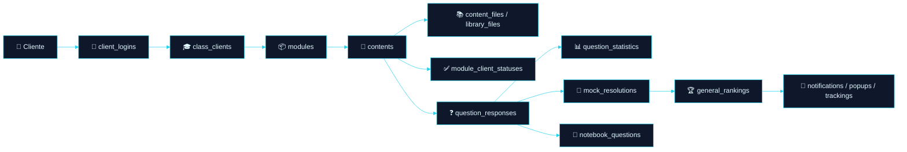
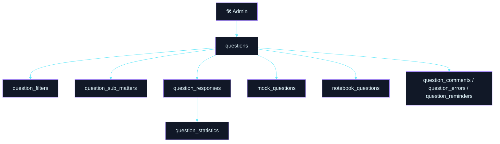
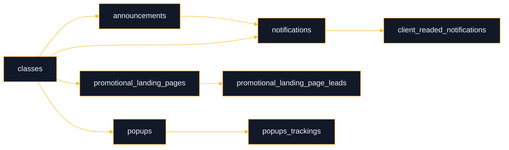

# 🗂️ Dicionário de Dados — Plataforma Educacional / Concursos
## Modelo lógico-funcional consolidado do legado

<div align="left">


</div>

---

> [!IMPORTANT]
> Este documento foi consolidado **exclusivamente a partir das informações fornecidas**.
>
> A seção de **chaves estrangeiras, tipos de relacionamento e cardinalidade** foi construída com base em:
>
> - nomes dos campos
> - descrições funcionais das tabelas
> - convenções relacionais usuais do modelo
>
> Onde o relacionamento **não foi explicitamente declarado no material base**, ele está tratado como **inferido com alta confiança** e identificado como tal.

---

## 📚 Sumário

1. [Visão executiva](#1-visão-executiva)
2. [Princípios de leitura do modelo](#2-princípios-de-leitura-do-modelo)
3. [Mapa de domínios](#3-mapa-de-domínios)
4. [Diagrama ER macro](#4-diagrama-er-macro)
5. [Fluxos funcionais](#5-fluxos-funcionais)
6. [Matriz de chaves estrangeiras e cardinalidade](#6-matriz-de-chaves-estrangeiras-e-cardinalidade)
7. [Catálogo relacional por domínio](#7-catálogo-relacional-por-domínio)
8. [Dicionário de dados por tabela](#8-dicionário-de-dados-por-tabela)
9. [Tabelas técnicas e operacionais](#9-tabelas-técnicas-e-operacionais)
10. [Observações técnicas do legado](#10-observações-técnicas-do-legado)
11. [Resumo final](#11-resumo-final)

---

# 1. Visão executiva

## 1.1 Objetivo do documento

Este material documenta de forma estruturada o banco de dados de uma plataforma educacional voltada a cursos, questões, simulados, biblioteca de materiais, engajamento, ranking, marketing e integrações operacionais.

O documento foi ampliado para incluir:

- **dicionário de dados**
- **matriz de chaves estrangeiras**
- **tipos de relacionamento**
- **cardinalidade**
- **visão macro de domínio**
- **fluxos funcionais**
- **organização relacional do legado**

## 1.2 Eixos centrais do modelo

O desenho do banco gira em torno de cinco núcleos principais:

```text
👤 Cliente
  ├── 🎓 Cursos / Matrículas
  ├── 📦 Módulos / Conteúdos
  ├── ❓ Questões / Filtros / Estatísticas
  ├── 📝 Simulados / Resoluções
  └── 📣 Comunicação / Tracking / Marketing
```

## 1.3 Natureza do legado

O banco apresenta características típicas de plataforma madura:

- forte decomposição funcional
- múltiplas tabelas de rastreamento
- entidades pivot para relacionamentos N:N
- domínio educacional rico
- preocupação com analytics, retenção e operação

---

# 2. Princípios de leitura do modelo

## 2.1 Convenções assumidas

| Convenção | Interpretação adotada |
|---|---|
| `id` | Chave primária lógica da tabela |
| `*_id` | Campo de referência relacional |
| tabelas pivot | Implementam relações N:N |
| `created_at`, `updated_at` | Auditoria temporal |
| tabelas de status | Estado, progresso, leitura, acompanhamento |
| tabelas de tracking | Registro comportamental, analytics ou operação |

## 2.2 Classificação dos relacionamentos

Neste documento, os relacionamentos foram classificados como:

- **1:1** → um registro se relaciona a um único registro do outro lado
- **1:N** → um registro pai possui vários registros filhos
- **N:N** → relacionamento materializado por tabela intermediária

## 2.3 Nível de confiança relacional

| Nível | Significado |
|---|---|
| Explícito | A relação foi descrita diretamente pelo material base |
| Inferido — alta confiança | A relação decorre claramente da nomenclatura e da descrição funcional |
| Inferido — moderado | A relação é provável, mas o material não fecha todos os detalhes |

---

# 3. Mapa de domínios

| Domínio | Objetivo |
|---|---|
| 👤 Identidade & Acesso | Clientes, admins, papéis, login e logs |
| 🎓 Catálogo Educacional | Cursos, categorias, módulos, conteúdos, matrículas |
| ❓ Banco de Questões | Questões, respostas, filtros, comentários, erros, lembretes |
| 🧠 Estrutura Jurídica | Disciplinas, matérias e submatérias |
| 📝 Simulados | Simulados, categorias, respostas e resoluções |
| 📚 Biblioteca & Materiais | Bibliotecas, arquivos e vínculo com conteúdos |
| 📒 Organização Pessoal | Cadernos, pastas e favoritos |
| 📣 Comunicação & Marketing | Avisos, notificações, popups, LPs e leads |
| 🏆 Engajamento & Ranking | Rankings, tracking e atividade |
| 🔌 Integrações & Operação | Webhooks, WhatsApp, migração e schema técnico |

---

# 4. Diagrama ER macro

```mermaid
%%{init: {
  "theme": "base",
  "themeVariables": {
    "background": "#0b1220",
    "primaryColor": "#111827",
    "primaryTextColor": "#e5f9ff",
    "primaryBorderColor": "#22d3ee",
    "lineColor": "#67e8f9",
    "secondaryColor": "#0f172a",
    "tertiaryColor": "#111827",
    "clusterBkg": "#0f172a",
    "clusterBorder": "#8b5cf6",
    "fontFamily": "Inter, Segoe UI, Arial",
    "fontSize": "14px"
  }
}}%%
erDiagram

    CLIENTS ||--o{ ADDRESSES : has
    CLIENTS ||--o{ CLIENT_LOGINS : has
    CLIENTS ||--o{ CLIENT_LOGS : has

    ADMINS ||--o{ ADMIN_ROLES : owns
    ROLES ||--o{ ADMIN_ROLES : grants

    CLASSES ||--o{ CLASS_CLIENTS : enrolls
    CLIENTS ||--o{ CLASS_CLIENTS : joins
    CLASS_CODES ||--o{ CLASS_CLIENTS : used_by

    CATEGORIES ||--o{ MODULES : organizes
    MODULES ||--o{ CONTENTS : contains
    CLASSES ||--o{ CLASS_MODULES : maps
    MODULES ||--o{ CLASS_MODULES : maps
    CLIENTS ||--o{ MODULE_CLIENT_STATUSES : progresses
    CONTENTS ||--o{ MODULE_CLIENT_STATUSES : tracked

    QUESTIONS ||--o{ QUESTION_RESPONSES : receives
    CLIENTS ||--o{ QUESTION_RESPONSES : answers
    QUESTIONS ||--o{ QUESTION_STATISTICS : aggregates

    FILTER_TYPES ||--o{ FILTERS : groups
    FILTERS ||--o{ QUESTION_FILTERS : tags
    QUESTIONS ||--o{ QUESTION_FILTERS : tagged_by

    CLIENTS ||--o{ CLIENT_FILTERS : saves
    CLIENTS ||--o{ CLIENT_FILTER_FOLDERS : organizes

    DISCIPLINES ||--o{ MATTERS : contains
    MATTERS ||--o{ SUB_MATTERS : contains
    QUESTIONS ||--o{ QUESTION_SUB_MATTERS : classified_by
    SUB_MATTERS ||--o{ QUESTION_SUB_MATTERS : receives

    MOCK_CATEGORIES ||--o{ MOCK_EXAMS : groups
    MOCK_EXAMS ||--o{ MOCK_QUESTIONS : contains
    QUESTIONS ||--o{ MOCK_QUESTIONS : used_in
    MOCK_EXAMS ||--o{ MOCK_RESOLUTIONS : resolved_by
    CLIENTS ||--o{ MOCK_RESOLUTIONS : performs
    MOCK_RESOLUTIONS ||--o{ MOCK_RESPONSES : stores
    QUESTIONS ||--o{ MOCK_RESPONSES : answered
    MOCK_EXAMS ||--o{ CLASS_MOCKS : assigned
    CLASSES ||--o{ CLASS_MOCKS : receives
    MOCK_CATEGORIES ||--o{ MOCK_CATEGORY_CLIENT_RATINGS : rated_in
    CLIENTS ||--o{ MOCK_CATEGORY_CLIENT_RATINGS : rates

    LIBRARIES ||--o{ LIBRARY_FILES : contains
    LIBRARY_FILES ||--o{ CONTENT_FILES : linked
    CONTENTS ||--o{ CONTENT_FILES : uses
    LIBRARY_FILES ||--o{ FILE_CLIENT_STATUSES : tracked
    CLIENTS ||--o{ FILE_CLIENT_STATUSES : accesses

    NOTEBOOK_FOLDERS ||--o{ NOTEBOOKS : groups
    CLIENTS ||--o{ NOTEBOOKS : owns
    NOTEBOOKS ||--o{ NOTEBOOK_QUESTIONS : saves
    QUESTIONS ||--o{ NOTEBOOK_QUESTIONS : collected_in

    ANNOUNCEMENTS ||--o{ NOTIFICATIONS : generates
    CLASSES ||--o{ ANNOUNCEMENTS : contextualizes
    CLASSES ||--o{ NOTIFICATIONS : targets
    NOTIFICATIONS ||--o{ CLIENT_READED_NOTIFICATIONS : read_by
    CLIENTS ||--o{ CLIENT_READED_NOTIFICATIONS : reads

    CLASSES ||--o{ POPUPS : targets
    POPUPS ||--o{ POPUPS_TRACKINGS : tracked
    CLIENTS ||--o{ POPUPS_TRACKINGS : interacts

    CLASSES ||--o{ PROMOTIONAL_LANDING_PAGES : promotes
    PROMOTIONAL_LANDING_PAGES ||--o{ PROMOTIONAL_LANDING_PAGE_LEADS : captures
    CLIENTS ||--o{ PROMOTIONAL_LANDING_PAGE_LEADS : converts

    CLIENTS ||--o{ GENERAL_RANKINGS : scores
    CLIENTS ||--o{ RANKING_TRACKINGS : tracked
    CLIENTS ||--o{ TRACKINGS : acts
    CLIENTS ||--o{ STATUS_MIGRATIONS : migrates
```



---

# 5. Fluxos funcionais

## 5.1 Jornada principal do cliente



## 5.2 Fluxo de questão e classificação



## 5.3 Fluxo de marketing e comunicação



---

# 6. Matriz de chaves estrangeiras e cardinalidade

> [!IMPORTANT]
> A matriz abaixo consolida os relacionamentos identificados no material base.
>
> Campo **Confiança**:
> - **Explícito**: descrito diretamente
> - **Inferido**: derivado da modelagem e descrição funcional

## 6.1 Matriz consolidada

| Tabela origem | Campo FK | Tabela destino | Campo destino | Tipo | Cardinalidade | Confiança | Observação |
|---|---|---|---|---|---|---|---|
| `addresses` | `client_id` | `clients` | `id` | 1:N | um cliente possui vários endereços | Explícito | Endereço pertence ao cliente |
| `client_logins` | `client_id` | `clients` | `id` | 1:N | um cliente possui vários logins | Explícito | Histórico de login |
| `client_logs` | `client_id` | `clients` | `id` | 1:N | um cliente possui vários logs | Explícito | Histórico operacional |
| `admin_roles` | `admin_id` | `admins` | `id` | 1:N | um admin possui vários vínculos de papel | Explícito | Pivot de permissão |
| `admin_roles` | `role_id` | `roles` | `id` | 1:N | um papel está em vários vínculos | Explícito | Pivot de permissão |
| `class_clients` | `client_id` | `clients` | `id` | 1:N | um cliente possui várias matrículas | Explícito | Matrícula por curso |
| `class_clients` | `class_id` | `classes` | `id` | 1:N | um curso possui várias matrículas | Explícito | Matrícula por curso |
| `class_clients` | `code_id` | `class_codes` | `id` | 1:N | um código pode aparecer em várias matrículas | Explícito | Código utilizado no acesso |
| `class_codes` | `class_id` | `classes` | `id` | 1:N | um curso possui vários códigos | Explícito | Código pertence ao curso |
| `modules` | `category_id` | `categories` | `id` | 1:N | uma categoria possui vários módulos | Explícito | Hierarquia de catálogo |
| `class_modules` | `module_id` | `modules` | `id` | 1:N | um módulo aparece em vários vínculos | Explícito | Pivot curso-módulo |
| `class_modules` | `class_id` | `classes` | `id` | 1:N | um curso aparece em vários vínculos | Explícito | Pivot curso-módulo |
| `contents` | `module_id` | `modules` | `id` | 1:N | um módulo possui vários conteúdos | Explícito | Conteúdo interno do módulo |
| `module_client_statuses` | `client_id` | `clients` | `id` | 1:N | um cliente possui vários status de conteúdo | Explícito | Progresso individual |
| `module_client_statuses` | `content_id` | `contents` | `id` | 1:N | um conteúdo possui vários registros de status | Explícito | Progresso por usuário |
| `questions` | `user_id` | `admins` | `id` | 1:N | um admin cria várias questões | Inferido | Descrição: administrador que criou a questão |
| `question_responses` | `question_id` | `questions` | `id` | 1:N | uma questão possui várias respostas | Explícito | Tentativas do cliente |
| `question_responses` | `client_id` | `clients` | `id` | 1:N | um cliente possui várias respostas | Explícito | Respostas individuais |
| `question_statistics` | `question_id` | `questions` | `id` | 1:1 ou 1:N | uma questão possui estatística agregada | Inferido | Funcionalmente tende a 1:1 |
| `filters` | `type_id` | `filter_types` | `id` | 1:N | um tipo possui vários filtros | Explícito | Taxonomia de filtros |
| `question_filters` | `question_id` | `questions` | `id` | 1:N | uma questão participa de vários vínculos | Explícito | Pivot questão-filtro |
| `question_filters` | `filter_id` | `filters` | `id` | 1:N | um filtro participa de vários vínculos | Explícito | Pivot questão-filtro |
| `client_filters` | `client_id` | `clients` | `id` | 1:N | um cliente salva vários filtros | Explícito | Filtro personalizado |
| `client_filter_folders` | `client_id` | `clients` | `id` | 1:N | um cliente possui várias pastas | Explícito | Organização de filtros |
| `question_comments` | `question_id` | `questions` | `id` | 1:N | uma questão recebe vários comentários | Explícito | Interação do cliente |
| `question_comments` | `client_id` | `clients` | `id` | 1:N | um cliente faz vários comentários | Explícito | Interação do cliente |
| `question_errors` | `question_id` | `questions` | `id` | 1:N | uma questão recebe vários apontamentos | Explícito | Report de erro |
| `question_errors` | `client_id` | `clients` | `id` | 1:N | um cliente reporta vários erros | Explícito | Report de erro |
| `question_reminders` | `question_id` | `questions` | `id` | 1:N | uma questão possui vários lembretes | Explícito | Anotação do cliente |
| `question_reminders` | `client_id` | `clients` | `id` | 1:N | um cliente possui vários lembretes | Explícito | Anotação do cliente |
| `matters` | `discipline_id` | `disciplines` | `id` | 1:N | uma disciplina possui várias matérias | Explícito | Hierarquia jurídica |
| `sub_matters` | `matter_id` | `matters` | `id` | 1:N | uma matéria possui várias submatérias | Explícito | Hierarquia jurídica |
| `question_sub_matters` | `question_id` | `questions` | `id` | 1:N | uma questão possui vários vínculos | Explícito | Pivot questão-submatéria |
| `question_sub_matters` | `sub_matter_id` | `sub_matters` | `id` | 1:N | uma submatéria possui vários vínculos | Explícito | Pivot questão-submatéria |
| `mock_exams` | `category_id` | `mock_categories` | `id` | 1:N | uma categoria possui vários simulados | Explícito | Catálogo de simulados |
| `mock_questions` | `question_id` | `questions` | `id` | 1:N | uma questão entra em vários simulados | Explícito | Pivot questão-simulado |
| `mock_questions` | `mock_id` | `mock_exams` | `id` | 1:N | um simulado possui várias questões | Explícito | Pivot questão-simulado |
| `mock_resolutions` | `mock_id` | `mock_exams` | `id` | 1:N | um simulado possui várias resoluções | Explícito | Resolução por cliente |
| `mock_resolutions` | `client_id` | `clients` | `id` | 1:N | um cliente possui várias resoluções | Explícito | Resolução por cliente |
| `mock_responses` | `question_id` | `questions` | `id` | 1:N | uma questão aparece em várias respostas de simulado | Explícito | Resposta dentro da resolução |
| `mock_responses` | `resolution_id` | `mock_resolutions` | `id` | 1:N | uma resolução possui várias respostas | Explícito | Resposta por item do simulado |
| `class_mocks` | `mock_id` | `mock_exams` | `id` | 1:N | um simulado aparece em vários vínculos | Explícito | Pivot curso-simulado |
| `class_mocks` | `class_id` | `classes` | `id` | 1:N | um curso aparece em vários vínculos | Explícito | Pivot curso-simulado |
| `mock_category_client_ratings` | `category_id` | `mock_categories` | `id` | 1:N | uma categoria recebe várias avaliações | Explícito | Avaliação por cliente |
| `mock_category_client_ratings` | `client_id` | `clients` | `id` | 1:N | um cliente avalia várias categorias | Explícito | Avaliação por cliente |
| `library_files` | `library_id` | `libraries` | `id` | 1:N | uma biblioteca possui vários arquivos | Explícito | Estrutura documental |
| `content_files` | `file_id` | `library_files` | `id` | 1:N | um arquivo participa de vários vínculos | Explícito | Pivot conteúdo-arquivo |
| `content_files` | `content_id` | `contents` | `id` | 1:N | um conteúdo possui vários vínculos | Explícito | Pivot conteúdo-arquivo |
| `file_client_statuses` | `file_id` | `library_files` | `id` | 1:N | um arquivo possui vários registros de acesso | Explícito | Rastreamento de consumo |
| `file_client_statuses` | `client_id` | `clients` | `id` | 1:N | um cliente acessa vários arquivos | Explícito | Rastreamento de consumo |
| `notebooks` | `client_id` | `clients` | `id` | 1:N | um cliente possui vários cadernos | Explícito | Organização pessoal |
| `notebooks` | `notebook_folder_id` | `notebook_folders` | `id` | 1:N | uma pasta possui vários cadernos | Explícito | Organização pessoal |
| `notebook_folders` | `client_id` | `clients` | `id` | 1:N | um cliente possui várias pastas | Explícito | Organização pessoal |
| `notebook_questions` | `question_id` | `questions` | `id` | 1:N | uma questão está em vários cadernos | Explícito | Pivot questão-caderno |
| `notebook_questions` | `notebook_id` | `notebooks` | `id` | 1:N | um caderno possui várias questões | Explícito | Pivot questão-caderno |
| `announcements` | `class_id` | `classes` | `id` | 1:N | um curso possui vários anúncios | Explícito | Comunicação contextual |
| `notifications` | `announcement_id` | `announcements` | `id` | 1:N | um anúncio gera várias notificações | Explícito | Comunicação derivada |
| `notifications` | `class_id` | `classes` | `id` | 1:N | um curso possui várias notificações | Explícito | Comunicação contextual |
| `client_readed_notifications` | `client_id` | `clients` | `id` | 1:N | um cliente lê várias notificações | Explícito | Leitura individual |
| `client_readed_notifications` | `notification_id` | `notifications` | `id` | 1:N | uma notificação é lida por vários clientes | Explícito | Leitura individual |
| `popups` | `class_id` | `classes` | `id` | 1:N | um curso possui vários popups | Explícito | Campanha contextual |
| `popups_trackings` | `popup_id` | `popups` | `id` | 1:N | um popup possui vários registros | Explícito | Tracking de cliques |
| `popups_trackings` | `client_id` | `clients` | `id` | 1:N | um cliente interage várias vezes | Explícito | Tracking de cliques |
| `promotional_landing_pages` | `class_id` | `classes` | `id` | 1:N | um curso possui várias LPs | Explícito | Campanha promocional |
| `promotional_landing_page_leads` | `client_id` | `clients` | `id` | 1:N | um cliente pode gerar vários leads | Explícito | Conversão promocional |
| `promotional_landing_page_leads` | `class_id` | `classes` | `id` | 1:N | um curso possui vários leads | Explícito | Conversão promocional |
| `promotional_landing_page_leads` | `promo_lp_id` | `promotional_landing_pages` | `id` | 1:N | uma LP gera vários leads | Explícito | Conversão promocional |
| `general_rankings` | `client_id` | `clients` | `id` | 1:N | um cliente possui registros de ranking | Explícito | Ranking consolidado |
| `ranking_trackings` | `client_id` | `clients` | `id` | 1:N | um cliente possui tracking de ranking | Explícito | Acompanhamento |
| `trackings` | `client_id` | `clients` | `id` | 1:N | um cliente possui vários trackings | Explícito | Tracking comportamental |
| `status_migrations` | `client_id` | `clients` | `id` | 1:1 ou 1:N | cliente em processo de migração | Explícito | Pode variar pela estratégia de execução |

## 6.2 Relações N:N materializadas por pivots

| Relação conceitual | Tabela pivot | Cardinalidade material |
|---|---|---|
| `admins` ↔ `roles` | `admin_roles` | N:N |
| `clients` ↔ `classes` | `class_clients` | N:N |
| `classes` ↔ `modules` | `class_modules` | N:N |
| `questions` ↔ `filters` | `question_filters` | N:N |
| `questions` ↔ `sub_matters` | `question_sub_matters` | N:N |
| `questions` ↔ `mock_exams` | `mock_questions` | N:N |
| `mock_exams` ↔ `classes` | `class_mocks` | N:N |
| `contents` ↔ `library_files` | `content_files` | N:N |
| `questions` ↔ `notebooks` | `notebook_questions` | N:N |

## 6.3 Relações que merecem validação futura

| Relação | Motivo |
|---|---|
| `question_statistics.question_id -> questions.id` | Funcionalmente parece 1:1, mas pode ser 1:N se houver snapshots históricos |
| `status_migrations.client_id -> clients.id` | Pode existir um único processo por cliente ou múltiplas execuções históricas |
| `general_rankings.client_id -> clients.id` | A descrição sugere ranking consolidado, mas a persistência temporal não está explícita |
| `whatsapp_events` e `whatsapp_event_clients` | O material descreve o grupo, mas não explicita as FKs internas entre as tabelas |

---

# 7. Catálogo relacional por domínio

## 7.1 👤 Identidade & Acesso

```text
clients
├── addresses
├── client_logins
├── client_logs
├── class_clients
├── question_responses
├── client_filters
├── client_filter_folders
├── question_comments
├── question_errors
├── question_reminders
├── mock_resolutions
├── mock_category_client_ratings
├── file_client_statuses
├── notebooks
├── notebook_folders
├── client_readed_notifications
├── popups_trackings
├── promotional_landing_page_leads
├── general_rankings
├── ranking_trackings
├── trackings
└── status_migrations

admins
└── admin_roles

roles
└── admin_roles
```

## 7.2 🎓 Catálogo educacional

```text
classes
├── class_clients
├── class_codes
├── class_modules
├── class_mocks
├── announcements
├── notifications
├── popups
└── promotional_landing_pages

categories
└── modules
    └── contents
        ├── module_client_statuses
        └── content_files
```

## 7.3 ❓ Questões, taxonomia e resposta

```text
questions
├── question_responses
├── question_statistics
├── question_filters
├── question_comments
├── question_errors
├── question_reminders
├── question_sub_matters
├── mock_questions
├── mock_responses
└── notebook_questions

filter_types
└── filters
    └── question_filters

disciplines
└── matters
    └── sub_matters
        └── question_sub_matters
```

## 7.4 📝 Simulados

```text
mock_categories
├── mock_exams
│   ├── mock_questions
│   ├── mock_resolutions
│   │   └── mock_responses
│   └── class_mocks
└── mock_category_client_ratings
```

## 7.5 📚 Biblioteca e organização pessoal

```text
libraries
└── library_files
    ├── content_files
    └── file_client_statuses

notebook_folders
└── notebooks
    └── notebook_questions
```

## 7.6 📣 Comunicação, marketing e engajamento

```text
announcements
└── notifications
    └── client_readed_notifications

popups
└── popups_trackings

promotional_landing_pages
└── promotional_landing_page_leads

clients
├── general_rankings
├── ranking_trackings
└── trackings
```

---

# 8. Dicionário de dados por tabela

> [!NOTE]
> Nesta seção, cada tabela é descrita com:
>
> - finalidade
> - campos
> - relacionamentos principais
> - tipo relacional dominante

---

## 8.1 👤 Identidade & Acesso

### `clients`

**Descrição:** cadastro central de usuários da plataforma.

| Campo | Descrição |
|---|---|
| `id` | Identificador único do cliente |
| `name` | Nome do cliente |
| `email` | E-mail de acesso |
| `password` | Senha |
| `cpf_cnpj` | Documento |
| `phone` | Telefone |
| `whatsapp` | WhatsApp |
| `image_url` | Imagem de perfil |
| `birthdate` | Data de nascimento |
| `code` | Código associado |
| `token_migration` | Token de migração |
| `app_free_access` | Limite de acesso gratuito |
| `interest` | Área de interesse |
| `created_at` | Criação |
| `updated_at` | Atualização |
| `migrated` | Indicador de migração |

**Relações principais:**
- pai de várias tabelas do sistema
- centro relacional do modelo
- dominante em relações 1:N

**Tipo relacional dominante:** entidade raiz

---

### `addresses`

**Descrição:** endereços físicos do cliente.

| Campo | Descrição |
|---|---|
| `id` | Identificador |
| `client_id` | Cliente relacionado |
| `street` | Rua |
| `number` | Número |
| `district` | Bairro |
| `cep` | CEP |
| `city` | Cidade |
| `uf` | UF |
| `created_at` | Criação |
| `updated_at` | Atualização |

**Relacionamento principal:** `addresses.client_id -> clients.id`  
**Tipo relacional dominante:** filho 1:N de `clients`

---

### `client_logins`

**Descrição:** histórico de acessos do cliente.

| Campo | Descrição |
|---|---|
| `id` | Identificador |
| `client_id` | Cliente |
| `platform` | Plataforma |
| `os_version` | Versão do SO |
| `created_at` | Criação |
| `updated_at` | Atualização |

**Relacionamento principal:** `client_logins.client_id -> clients.id`  
**Tipo relacional dominante:** rastreamento 1:N

---

### `client_logs`

**Descrição:** trilha operacional de ações do cliente.

| Campo | Descrição |
|---|---|
| `id` | Identificador |
| `client_id` | Cliente |
| `action` | Ação |
| `color` | Cor de exibição |
| `icon` | Ícone |
| `description` | Descrição |
| `client_side_show` | Exibição ao cliente |
| `created_at` | Criação |

**Relacionamento principal:** `client_logs.client_id -> clients.id`  
**Tipo relacional dominante:** rastreamento 1:N

---

### `admins`

**Descrição:** administradores da plataforma.

| Campo | Descrição |
|---|---|
| `id` | Identificador |
| `name` | Nome |
| `email` | E-mail |
| `password` | Senha |
| `image_url` | Imagem |
| `created_at` | Criação |
| `updated_at` | Atualização |

**Relacionamentos principais:**
- `admin_roles.admin_id -> admins.id`
- `questions.user_id -> admins.id` (inferido)

---

### `roles`

**Descrição:** papéis do sistema administrativo.

| Campo | Descrição |
|---|---|
| `id` | Identificador |
| `name` | Nome do papel |
| `created_at` | Criação |
| `updated_at` | Atualização |

**Relacionamento principal:** `admin_roles.role_id -> roles.id`

---

### `admin_roles`

**Descrição:** associação entre administradores e papéis.

| Campo | Descrição |
|---|---|
| `id` | Identificador |
| `admin_id` | Administrador |
| `role_id` | Papel |
| `created_at` | Criação |
| `updated_at` | Atualização |

**Tipo relacional dominante:** pivot N:N entre `admins` e `roles`

---

## 8.2 🎓 Catálogo Educacional

### `classes`

**Descrição:** cursos oferecidos.

| Campo | Descrição |
|---|---|
| `id` | Identificador |
| `name` | Nome |
| `period` | Duração/período |
| `pdf` | Flag PDF |
| `question` | Flag questões |
| `general` | Flag conteúdo geral |
| `collaborative` | Flag colaborativo |
| `is_paid` | Pago/gratuito |
| `show_expiration` | Exibe expiração |
| `expiration_message` | Mensagem de expiração |
| `description` | Descrição |
| `image_url` | Imagem |
| `created_at` | Criação |
| `updated_at` | Atualização |

**Relacionamentos principais:**
- `class_clients`
- `class_codes`
- `class_modules`
- `class_mocks`
- `announcements`
- `notifications`
- `popups`
- `promotional_landing_pages`

**Tipo relacional dominante:** entidade núcleo de oferta

---

### `class_clients`

**Descrição:** matrícula do cliente em um curso.

| Campo | Descrição |
|---|---|
| `id` | Identificador |
| `client_id` | Cliente |
| `class_id` | Curso |
| `code_id` | Código de acesso |
| `is_canceled` | Cancelado |
| `cancellation_reason` | Motivo |
| `is_refunded` | Reembolsado |
| `is_lifetime` | Vitalício |
| `expiration_date` | Expiração |
| `created_at` | Criação |
| `updated_at` | Atualização |

**Tipo relacional dominante:** pivot N:N entre `clients` e `classes`

---

### `class_codes`

**Descrição:** códigos ligados a cursos.

| Campo | Descrição |
|---|---|
| `id` | Identificador |
| `class_id` | Curso |
| `code` | Código |
| `type` | Tipo |
| `created_at` | Criação |
| `updated_at` | Atualização |

**Relacionamento principal:** `class_codes.class_id -> classes.id`

---

### `categories`

**Descrição:** categorias de organização macro dos módulos.

| Campo | Descrição |
|---|---|
| `id` | Identificador |
| `name` | Nome |
| `image_url` | Imagem |
| `created_at` | Criação |
| `updated_at` | Atualização |

---

### `modules`

**Descrição:** módulos pertencentes a categorias.

| Campo | Descrição |
|---|---|
| `id` | Identificador |
| `category_id` | Categoria |
| `name` | Nome |
| `description` | Descrição |
| `is_free` | Gratuito |
| `show_percentage` | Exibição de progresso |
| `url` | URL |
| `image` | Imagem |
| `created_at` | Criação |
| `updated_at` | Atualização |

**Relacionamento principal:** `modules.category_id -> categories.id`

---

### `class_modules`

**Descrição:** vínculo entre cursos e módulos.

| Campo | Descrição |
|---|---|
| `id` | Identificador |
| `module_id` | Módulo |
| `class_id` | Curso |
| `created_at` | Criação |
| `updated_at` | Atualização |

**Tipo relacional dominante:** pivot N:N entre `classes` e `modules`

---

### `contents`

**Descrição:** conteúdos internos de um módulo.

| Campo | Descrição |
|---|---|
| `id` | Identificador |
| `module_id` | Módulo |
| `name` | Nome |
| `description` | Descrição |
| `day` | Dia/ordem temporal |
| `position` | Posição |
| `expiration_date` | Expiração |
| `created_at` | Criação |
| `updated_at` | Atualização |

**Relacionamento principal:** `contents.module_id -> modules.id`

---

### `module_client_statuses`

**Descrição:** progresso do cliente em conteúdos.

| Campo | Descrição |
|---|---|
| `id` | Identificador |
| `client_id` | Cliente |
| `content_id` | Conteúdo |
| `is_finished` | Concluído |
| `created_at` | Criação |
| `updated_at` | Atualização |

**Tipo relacional dominante:** associativa de status entre `clients` e `contents`

---

## 8.3 ❓ Banco de Questões

### `questions`

**Descrição:** base central das questões.

| Campo | Descrição |
|---|---|
| `id` | Identificador |
| `user_id` | Admin criador |
| `title` | Enunciado |
| `description` | Contexto |
| `explanation` | Explicação |
| `is_true` | Correta é verdadeira |
| `is_accepted` | Aprovada |
| `reason_refused` | Motivo de recusa |
| `is_from_client` | Enviada por cliente |
| `ia_generated` | Gerada por IA |
| `created_at` | Criação |
| `updated_at` | Atualização |

**Relacionamentos principais:**
- respostas
- estatísticas
- filtros
- submatérias
- comentários
- erros
- lembretes
- simulados
- cadernos

**Tipo relacional dominante:** entidade núcleo pedagógica

---

### `question_responses`

**Descrição:** respostas do cliente às questões.

| Campo | Descrição |
|---|---|
| `id` | Identificador |
| `question_id` | Questão |
| `client_id` | Cliente |
| `client_response` | Resposta |
| `is_correct` | Correção |
| `is_current` | Tentativa atual |
| `created_at` | Criação |
| `updated_at` | Atualização |

---

### `question_statistics`

**Descrição:** agregação de acertos e erros por questão.

| Campo | Descrição |
|---|---|
| `id` | Identificador |
| `question_id` | Questão |
| `total_correct` | Total de acertos |
| `total_incorrect` | Total de erros |
| `created_at` | Criação |
| `updated_at` | Atualização |

**Observação:** funcionalmente tende a agregação por questão única.

---

### `filter_types`

| Campo | Descrição |
|---|---|
| `id` | Identificador |
| `name` | Nome |
| `created_at` | Criação |
| `updated_at` | Atualização |

---

### `filters`

| Campo | Descrição |
|---|---|
| `id` | Identificador |
| `name` | Nome |
| `type_id` | Tipo de filtro |
| `created_at` | Criação |
| `updated_at` | Atualização |

---

### `question_filters`

| Campo | Descrição |
|---|---|
| `id` | Identificador |
| `question_id` | Questão |
| `filter_id` | Filtro |
| `created_at` | Criação |
| `updated_at` | Atualização |

**Tipo relacional dominante:** pivot N:N

---

### `client_filters`

| Campo | Descrição |
|---|---|
| `id` | Identificador |
| `client_id` | Cliente |
| `name` | Nome |
| `filter_ids` | Lista JSON de filtros |
| `created_at` | Criação |
| `updated_at` | Atualização |

**Observação:** mistura relação tradicional com armazenamento desnormalizado em JSON.

---

### `client_filter_folders`

| Campo | Descrição |
|---|---|
| `id` | Identificador |
| `name` | Nome |
| `client_id` | Cliente |
| `created_at` | Criação |
| `updated_at` | Atualização |

---

### `question_comments`

| Campo | Descrição |
|---|---|
| `id` | Identificador |
| `question_id` | Questão |
| `client_id` | Cliente |
| `text` | Texto |
| `is_readed` | Lido |
| `is_corrected` | Corrigido |
| `is_accepted` | Aceito |
| `created_at` | Criação |
| `updated_at` | Atualização |

---

### `question_errors`

| Campo | Descrição |
|---|---|
| `id` | Identificador |
| `question_id` | Questão |
| `client_id` | Cliente |
| `text` | Texto |
| `is_readed` | Lido |
| `is_corrected` | Corrigido |
| `is_accepted` | Aceito |
| `created_at` | Criação |
| `updated_at` | Atualização |

---

### `question_reminders`

| Campo | Descrição |
|---|---|
| `id` | Identificador |
| `question_id` | Questão |
| `client_id` | Cliente |
| `text` | Texto |
| `is_readed` | Lido |
| `is_corrected` | Corrigido |
| `is_accepted` | Aceito |
| `created_at` | Criação |
| `updated_at` | Atualização |

---

## 8.4 🧠 Estrutura Jurídica

### `disciplines`

| Campo | Descrição |
|---|---|
| `id` | Identificador |
| `name` | Nome |
| `position` | Ordem |
| `created_at` | Criação |
| `updated_at` | Atualização |

### `matters`

| Campo | Descrição |
|---|---|
| `id` | Identificador |
| `name` | Nome |
| `position` | Ordem |
| `discipline_id` | Disciplina |
| `created_at` | Criação |
| `updated_at` | Atualização |

### `sub_matters`

| Campo | Descrição |
|---|---|
| `id` | Identificador |
| `name` | Nome |
| `position` | Ordem |
| `matter_id` | Matéria |
| `created_at` | Criação |
| `updated_at` | Atualização |

### `question_sub_matters`

| Campo | Descrição |
|---|---|
| `id` | Identificador |
| `question_id` | Questão |
| `sub_matter_id` | Submatéria |
| `position` | Ordem/relevância |
| `created_at` | Criação |
| `updated_at` | Atualização |

**Tipo relacional dominante:** pivot N:N entre `questions` e `sub_matters`

---

## 8.5 📝 Simulados

### `mock_categories`

| Campo | Descrição |
|---|---|
| `id` | Identificador |
| `name` | Nome |
| `is_free` | Gratuito |
| `created_at` | Criação |
| `updated_at` | Atualização |

### `mock_exams`

| Campo | Descrição |
|---|---|
| `id` | Identificador |
| `category_id` | Categoria |
| `name` | Nome |
| `position` | Ordem |
| `created_at` | Criação |
| `updated_at` | Atualização |

### `mock_questions`

| Campo | Descrição |
|---|---|
| `id` | Identificador |
| `question_id` | Questão |
| `mock_id` | Simulado |
| `position` | Ordem |
| `created_at` | Criação |
| `updated_at` | Atualização |

### `mock_resolutions`

| Campo | Descrição |
|---|---|
| `id` | Identificador |
| `mock_id` | Simulado |
| `client_id` | Cliente |
| `points` | Pontuação |
| `conclusion_time` | Tempo de conclusão |
| `created_at` | Criação |
| `updated_at` | Atualização |

### `mock_responses`

| Campo | Descrição |
|---|---|
| `id` | Identificador |
| `question_id` | Questão |
| `resolution_id` | Resolução |
| `client_response` | Resposta |
| `created_at` | Criação |
| `updated_at` | Atualização |

### `class_mocks`

| Campo | Descrição |
|---|---|
| `id` | Identificador |
| `mock_id` | Simulado |
| `class_id` | Curso |
| `created_at` | Criação |
| `updated_at` | Atualização |

### `mock_category_client_ratings`

| Campo | Descrição |
|---|---|
| `id` | Identificador |
| `category_id` | Categoria |
| `client_id` | Cliente |
| `rating` | Nota |
| `created_at` | Criação |
| `updated_at` | Atualização |

---

## 8.6 📚 Biblioteca & Materiais

### `libraries`

| Campo | Descrição |
|---|---|
| `id` | Identificador |
| `name` | Nome |
| `created_at` | Criação |
| `updated_at` | Atualização |

### `library_files`

| Campo | Descrição |
|---|---|
| `id` | Identificador |
| `library_id` | Biblioteca |
| `name` | Nome do arquivo |
| `file` | Caminho ou URL |
| `created_at` | Criação |
| `updated_at` | Atualização |

### `content_files`

| Campo | Descrição |
|---|---|
| `id` | Identificador |
| `file_id` | Arquivo |
| `content_id` | Conteúdo |
| `created_at` | Criação |
| `updated_at` | Atualização |

### `file_client_statuses`

| Campo | Descrição |
|---|---|
| `id` | Identificador |
| `file_id` | Arquivo |
| `client_id` | Cliente |
| `created_at` | Criação |
| `updated_at` | Atualização |

---

## 8.7 📒 Organização Pessoal

### `notebook_folders`

| Campo | Descrição |
|---|---|
| `id` | Identificador |
| `client_id` | Cliente |
| `name` | Nome |
| `created_at` | Criação |
| `updated_at` | Atualização |

### `notebooks`

| Campo | Descrição |
|---|---|
| `id` | Identificador |
| `client_id` | Cliente |
| `notebook_folder_id` | Pasta |
| `name` | Nome |
| `created_at` | Criação |
| `updated_at` | Atualização |

### `notebook_questions`

| Campo | Descrição |
|---|---|
| `id` | Identificador |
| `question_id` | Questão |
| `notebook_id` | Caderno |
| `created_at` | Criação |
| `updated_at` | Atualização |

---

## 8.8 📣 Comunicação & Marketing

### `announcements`

| Campo | Descrição |
|---|---|
| `id` | Identificador |
| `name` | Nome |
| `text` | Texto |
| `class_id` | Curso |
| `type` | Tipo |
| `created_at` | Criação |
| `updated_at` | Atualização |

### `notifications`

| Campo | Descrição |
|---|---|
| `id` | Identificador |
| `title` | Título |
| `description` | Descrição |
| `icon` | Ícone |
| `announcement_id` | Anúncio |
| `class_id` | Curso |
| `created_at` | Criação |
| `updated_at` | Atualização |

### `client_readed_notifications`

| Campo | Descrição |
|---|---|
| `id` | Identificador |
| `client_id` | Cliente |
| `notification_id` | Notificação |
| `created_at` | Criação |
| `updated_at` | Atualização |

### `popups`

| Campo | Descrição |
|---|---|
| `id` | Identificador |
| `class_id` | Curso |
| `for_paid_classes` | Público pagante |
| `access_time` | Tempo de exibição |
| `mobile_picture` | Imagem mobile |
| `desktop_picture` | Imagem desktop |
| `link` | Destino |
| `created_at` | Criação |
| `updated_at` | Atualização |

### `popups_trackings`

| Campo | Descrição |
|---|---|
| `id` | Identificador |
| `total_clicks` | Total de cliques |
| `click_date` | Data do clique |
| `popup_id` | Popup |
| `client_id` | Cliente |
| `created_at` | Criação |
| `updated_at` | Atualização |

### `promotional_landing_pages`

| Campo | Descrição |
|---|---|
| `id` | Identificador |
| `promotional_title` | Título |
| `promotional_subtitle` | Subtítulo |
| `promotional_text` | Texto |
| `promotional_image` | Imagem |
| `promotional_button_text` | CTA |
| `promotional_rdstation_tag` | Tag RD |
| `class_id` | Curso |
| `is_active` | Ativa |
| `created_at` | Criação |
| `updated_at` | Atualização |

### `promotional_landing_page_leads`

| Campo | Descrição |
|---|---|
| `id` | Identificador |
| `client_id` | Cliente |
| `class_id` | Curso |
| `promo_lp_id` | Landing page |
| `created_at` | Criação |
| `updated_at` | Atualização |

---

## 8.9 🏆 Engajamento & Tracking

### `general_rankings`

| Campo | Descrição |
|---|---|
| `id` | Identificador |
| `client_id` | Cliente |
| `total` | Total/pontuação |
| `created_at` | Criação |
| `updated_at` | Atualização |

### `ranking_trackings`

| Campo | Descrição |
|---|---|
| `id` | Identificador |
| `client_id` | Cliente |
| `total_responses` | Total de respostas |
| `created_at` | Criação |
| `updated_at` | Atualização |

### `trackings`

| Campo | Descrição |
|---|---|
| `id` | Identificador |
| `client_id` | Cliente |
| `action` | Ação |
| `created_at` | Criação |
| `updated_at` | Atualização |

---

# 9. Tabelas técnicas e operacionais

## 9.1 `webhooks`

| Campo | Descrição |
|---|---|
| `id` | Identificador |
| `webhook_code` | Código |
| `data` | Dados |
| `webhook` | Tipo/origem |
| `created_at` | Criação |
| `updated_at` | Atualização |

## 9.2 `whatsapp_events`

| Campo | Descrição |
|---|---|
| `id` | Identificador |
| `phone_number` | Telefone |
| `wa_id` | ID WhatsApp |
| `ctwa_id` | ID complementar |
| `webhook_data` | Payload JSON |
| `created_at` | Criação |
| `updated_at` | Atualização |

## 9.3 `whatsapp_event_clients`

| Campo | Descrição |
|---|---|
| `id` | Identificador |
| `phone_number` | Telefone |
| `wa_id` | ID WhatsApp |
| `ctwa_id` | ID complementar |
| `created_at` | Criação |
| `updated_at` | Atualização |

> [!NOTE]
> O material base não detalha com precisão as chaves estrangeiras entre `webhooks`, `whatsapp_events` e `whatsapp_event_clients`.

## 9.4 `adonis_schema`

| Campo | Descrição |
|---|---|
| `id` | Identificador |
| `name` | Nome da migration |
| `batch` | Lote |
| `migration_time` | Tempo de execução |

## 9.5 `adonis_schema_versions`

| Campo | Descrição |
|---|---|
| `version` | Versão do schema |

## 9.6 `status_migrations`

| Campo | Descrição |
|---|---|
| `client_id` | Cliente |
| `status` | Estado da migração |
| `info` | Dados adicionais JSON |
| `exception` | Erro registrado |
| `started_at` | Início |
| `finished_at` | Fim |

---

# 10. Observações técnicas do legado

## 10.1 Características positivas

- separação funcional extensa
- domínio pedagógico bem detalhado
- presença clara de pivots para N:N
- rastreamento comportamental rico
- boa decomposição entre catálogo, questões, simulados e marketing

## 10.2 Pontos de atenção

### a) Alta centralidade de `clients`
A tabela `clients` é o principal hub do modelo. Isso é esperado, mas também cria forte acoplamento operacional.

### b) Mistura de normalização e payload flexível
Exemplo mais claro:
- `client_filters.filter_ids` em JSON

Isso indica coexistência de modelagem relacional com estratégia flexível de armazenamento.

### c) Ambiguidade temporal em tabelas agregadas
Tabelas como:
- `general_rankings`
- `ranking_trackings`
- `question_statistics`
- `status_migrations`

podem operar em modo snapshot, histórico ou consolidado. O material fornecido não fecha completamente essa semântica.

### d) Área de integrações ainda pouco explícita
O conjunto:
- `webhooks`
- `whatsapp_events`
- `whatsapp_event_clients`

aparece funcionalmente agrupado, mas sem desenho relacional detalhado.

## 10.3 Tabelas pivot mais importantes

| Pivot | Papel no negócio |
|---|---|
| `class_clients` | matrícula do aluno em cursos |
| `class_modules` | composição da oferta pedagógica |
| `question_filters` | classificação da questão |
| `question_sub_matters` | taxonomia jurídica |
| `mock_questions` | composição do simulado |
| `class_mocks` | associação de simulados a cursos |
| `content_files` | vínculo entre conteúdo e arquivo |
| `notebook_questions` | organização pessoal do aluno |
| `admin_roles` | autorização administrativa |

## 10.4 Backbone funcional do produto

```text
clients
└── class_clients
    └── classes
        ├── class_modules
        │   └── modules
        │       └── contents
        │           ├── content_files
        │           └── module_client_statuses
        ├── class_mocks
        │   └── mock_exams
        ├── announcements
        ├── notifications
        ├── popups
        └── promotional_landing_pages

questions
├── question_responses
├── question_statistics
├── question_filters
├── question_sub_matters
├── mock_questions
└── notebook_questions
```

---

# 11. Resumo final

## 11.1 Síntese técnica

Este banco modela uma plataforma com quatro núcleos fortemente conectados:

- **identidade do cliente**
- **oferta educacional**
- **motor de questões**
- **simulados e engajamento**

## 11.2 Entidades mais centrais

| Entidade | Papel estrutural |
|---|---|
| `clients` | hub principal do ecossistema |
| `classes` | núcleo da oferta comercial e educacional |
| `modules` / `contents` | trilha de consumo pedagógico |
| `questions` | ativo central de prática e avaliação |
| `mock_exams` | consolidação de avaliação estruturada |

## 11.3 Valor deste material

Este documento serve como base para:

- onboarding técnico
- leitura de legado
- planejamento de integração
- desenho de APIs
- refatoração de domínio
- modularização futura
- descoberta de constraints ausentes
- preparação para documentação arquitetural mais profunda

> [!TIP]
> Evolução natural deste material:
>
> **V2 — Data Dictionary Arquitetural**
>
> com:
>
> - matriz de índices sugeridos
> - constraints únicas prováveis
> - chaves compostas candidatas
> - risco de duplicidade por pivot
> - mapa de bounded contexts
> - proposta de modularização por domínio
> - visão de agregados e entidades raiz
