# 🗂️ Dicionário de Dados — Plataforma Educacional / Concursos

<div align="left">


</div>

---

## 📚 Sumário

1. [Visão Geral](#1-visão-geral)
2. [Mapa de Domínios](#2-mapa-de-domínios)
3. [Diagrama ER — Foco em Identity e Questions](#3-diagrama-er--foco-em-identity-e-questions)
4. [Matriz de Relacionamentos](#4-matriz-de-relacionamentos)
5. [Dicionário de Dados — Identity](#5-dicionário-de-dados--identity)
6. [Dicionário de Dados — Questions](#6-dicionário-de-dados--questions)
7. [Tabelas de Apoio Relacionadas](#7-tabelas-de-apoio-relacionadas)
8. [Catálogo Consolidado](#8-catálogo-consolidado)
9. [Resumo Executivo](#9-resumo-executivo)

---

# 1. Visão Geral

## 1.1 Objetivo

Este documento registra o modelo de dados de uma plataforma educacional com ênfase nos domínios de:

- **identidade**
- **acesso**
- **questões**
- **classificação de questões**
- **interação do aluno com questões**

## 1.2 Leitura do modelo

O recorte documentado concentra os blocos mais centrais para operação funcional de:

- usuários
- administradores
- banco de questões
- filtros
- classificação jurídica
- resposta e acompanhamento de questões

---

# 2. Mapa de Domínios

| Domínio | Papel no modelo |
|---|---|
| 👤 Identity | cadastro, autenticação, administração e trilhas de acesso |
| ❓ Questions | cadastro, classificação, resposta, comentário e estatística |
| 🧠 Classificação Jurídica | disciplina, matéria e submatéria aplicadas às questões |
| 📝 Simulados | reaproveitamento de questões em simulados |
| 🎓 Educacional | vínculo entre aluno, curso e contexto de acesso |

---

# 3. Diagrama ER — Foco em Identity e Questions

```mermaid
%%{init: {
  "theme": "base",
  "themeVariables": {
    "background": "#0b1220",
    "primaryColor": "#111827",
    "primaryTextColor": "#e5f9ff",
    "primaryBorderColor": "#22d3ee",
    "lineColor": "#67e8f9",
    "secondaryColor": "#0f172a",
    "tertiaryColor": "#111827",
    "clusterBkg": "#0f172a",
    "clusterBorder": "#8b5cf6",
    "fontFamily": "Inter, Segoe UI, Arial",
    "fontSize": "14px"
  }
}}%%
erDiagram

    CLIENTS ||--o{ ADDRESSES : has
    CLIENTS ||--o{ CLIENT_LOGINS : logs
    CLIENTS ||--o{ CLIENT_LOGS : records

    ADMINS ||--o{ ADMIN_ROLES : owns
    ROLES ||--o{ ADMIN_ROLES : grants

    ADMINS ||--o{ QUESTIONS : creates

    QUESTIONS ||--o{ QUESTION_RESPONSES : receives
    CLIENTS ||--o{ QUESTION_RESPONSES : answers

    QUESTIONS ||--o{ QUESTION_STATISTICS : aggregates

    FILTER_TYPES ||--o{ FILTERS : classifies
    QUESTIONS ||--o{ QUESTION_FILTERS : maps
    FILTERS ||--o{ QUESTION_FILTERS : applied_to

    CLIENTS ||--o{ CLIENT_FILTERS : saves
    CLIENTS ||--o{ CLIENT_FILTER_FOLDERS : organizes

    DISCIPLINES ||--o{ MATTERS : contains
    MATTERS ||--o{ SUB_MATTERS : contains
    QUESTIONS ||--o{ QUESTION_SUB_MATTERS : classified_in
    SUB_MATTERS ||--o{ QUESTION_SUB_MATTERS : categorizes

    QUESTIONS ||--o{ QUESTION_COMMENTS : receives
    QUESTIONS ||--o{ QUESTION_ERRORS : receives
    QUESTIONS ||--o{ QUESTION_REMINDERS : receives

    CLIENTS ||--o{ QUESTION_COMMENTS : writes
    CLIENTS ||--o{ QUESTION_ERRORS : reports
    CLIENTS ||--o{ QUESTION_REMINDERS : writes

    QUESTIONS ||--o{ MOCK_QUESTIONS : reused_in
```



---

# 4. Matriz de Relacionamentos

## 4.1 Identity

| Origem | Campo | Destino | Cardinalidade |
|---|---|---|---|
| `addresses` | `client_id` | `clients.id` | N:1 |
| `client_logins` | `client_id` | `clients.id` | N:1 |
| `client_logs` | `client_id` | `clients.id` | N:1 |
| `admin_roles` | `admin_id` | `admins.id` | N:1 |
| `admin_roles` | `role_id` | `roles.id` | N:1 |

## 4.2 Questions

| Origem | Campo | Destino | Cardinalidade |
|---|---|---|---|
| `questions` | `user_id` | `admins.id` | N:1 |
| `question_responses` | `question_id` | `questions.id` | N:1 |
| `question_responses` | `client_id` | `clients.id` | N:1 |
| `question_statistics` | `question_id` | `questions.id` | N:1 |
| `filters` | `type_id` | `filter_types.id` | N:1 |
| `question_filters` | `question_id` | `questions.id` | N:1 |
| `question_filters` | `filter_id` | `filters.id` | N:1 |
| `client_filters` | `client_id` | `clients.id` | N:1 |
| `client_filter_folders` | `client_id` | `clients.id` | N:1 |
| `question_comments` | `question_id` | `questions.id` | N:1 |
| `question_comments` | `client_id` | `clients.id` | N:1 |
| `question_errors` | `question_id` | `questions.id` | N:1 |
| `question_errors` | `client_id` | `clients.id` | N:1 |
| `question_reminders` | `question_id` | `questions.id` | N:1 |
| `question_reminders` | `client_id` | `clients.id` | N:1 |
| `matters` | `discipline_id` | `disciplines.id` | N:1 |
| `sub_matters` | `matter_id` | `matters.id` | N:1 |
| `question_sub_matters` | `question_id` | `questions.id` | N:1 |
| `question_sub_matters` | `sub_matter_id` | `sub_matters.id` | N:1 |
| `mock_questions` | `question_id` | `questions.id` | N:1 |

---

# 5. Dicionário de Dados — Identity

## 5.1 `clients`

**Descrição:** entidade principal de usuário da plataforma.

| Campo | Descrição |
|---|---|
| `id` | identificador do cliente |
| `name` | nome do cliente |
| `email` | e-mail de acesso |
| `password` | senha |
| `cpf_cnpj` | documento |
| `phone` | telefone |
| `whatsapp` | contato WhatsApp |
| `image_url` | imagem de perfil |
| `birthdate` | data de nascimento |
| `code` | código associado |
| `token_migration` | token de migração |
| `app_free_access` | controle de acesso gratuito |
| `interest` | interesse informado |
| `migrated` | indicador de migração |
| `created_at` | criação do registro |
| `updated_at` | atualização do registro |

**Relações diretas:**
- `addresses.client_id`
- `client_logins.client_id`
- `client_logs.client_id`
- `question_responses.client_id`
- `client_filters.client_id`
- `client_filter_folders.client_id`
- `question_comments.client_id`
- `question_errors.client_id`
- `question_reminders.client_id`

---

## 5.2 `addresses`

**Descrição:** endereços vinculados ao cliente.

| Campo | Descrição |
|---|---|
| `id` | identificador |
| `client_id` | cliente relacionado |
| `street` | rua |
| `number` | número |
| `district` | bairro |
| `cep` | CEP |
| `city` | cidade |
| `uf` | UF |
| `created_at` | criação |
| `updated_at` | atualização |

---

## 5.3 `client_logins`

**Descrição:** histórico de login do cliente.

| Campo | Descrição |
|---|---|
| `id` | identificador |
| `client_id` | cliente relacionado |
| `platform` | plataforma utilizada |
| `os_version` | versão do sistema |
| `created_at` | data/hora do login |
| `updated_at` | atualização |

---

## 5.4 `client_logs`

**Descrição:** trilha de ações registradas para o cliente.

| Campo | Descrição |
|---|---|
| `id` | identificador |
| `client_id` | cliente relacionado |
| `action` | ação registrada |
| `color` | cor associada |
| `icon` | ícone associado |
| `description` | descrição textual |
| `client_side_show` | indicador de exibição |
| `created_at` | data do evento |

---

## 5.5 `admins`

**Descrição:** usuários administrativos da plataforma.

| Campo | Descrição |
|---|---|
| `id` | identificador |
| `name` | nome |
| `email` | e-mail |
| `password` | senha |
| `image_url` | imagem |
| `created_at` | criação |
| `updated_at` | atualização |

---

## 5.6 `roles`

**Descrição:** catálogo de papéis administrativos.

| Campo | Descrição |
|---|---|
| `id` | identificador |
| `name` | nome do papel |
| `created_at` | criação |
| `updated_at` | atualização |

---

## 5.7 `admin_roles`

**Descrição:** associação entre administradores e papéis.

| Campo | Descrição |
|---|---|
| `id` | identificador |
| `admin_id` | administrador |
| `role_id` | papel |
| `created_at` | criação |
| `updated_at` | atualização |

---

# 6. Dicionário de Dados — Questions

## 6.1 `questions`

**Descrição:** tabela central do banco de questões.

| Campo | Descrição |
|---|---|
| `id` | identificador da questão |
| `user_id` | administrador relacionado |
| `title` | título ou enunciado |
| `description` | descrição complementar |
| `explanation` | explicação |
| `is_true` | valor lógico da resposta |
| `is_accepted` | indicador de aprovação |
| `reason_refused` | motivo de recusa |
| `is_from_client` | origem em cliente |
| `ia_generated` | origem por IA |
| `created_at` | criação |
| `updated_at` | atualização |

---

## 6.2 `question_responses`

**Descrição:** respostas dadas pelos clientes às questões.

| Campo | Descrição |
|---|---|
| `id` | identificador |
| `question_id` | questão respondida |
| `client_id` | cliente que respondeu |
| `client_response` | resposta enviada |
| `is_correct` | acerto/erro |
| `is_current` | tentativa atual |
| `created_at` | criação |
| `updated_at` | atualização |

---

## 6.3 `question_statistics`

**Descrição:** agregados numéricos por questão.

| Campo | Descrição |
|---|---|
| `id` | identificador |
| `question_id` | questão relacionada |
| `total_correct` | total de acertos |
| `total_incorrect` | total de erros |
| `created_at` | criação |
| `updated_at` | atualização |

---

## 6.4 `filter_types`

**Descrição:** categorias de filtros do domínio de questões.

| Campo | Descrição |
|---|---|
| `id` | identificador |
| `name` | nome |
| `created_at` | criação |
| `updated_at` | atualização |

---

## 6.5 `filters`

**Descrição:** valores de filtro aplicáveis às questões.

| Campo | Descrição |
|---|---|
| `id` | identificador |
| `name` | nome |
| `type_id` | tipo de filtro |
| `created_at` | criação |
| `updated_at` | atualização |

---

## 6.6 `question_filters`

**Descrição:** associação entre questões e filtros.

| Campo | Descrição |
|---|---|
| `id` | identificador |
| `question_id` | questão |
| `filter_id` | filtro |
| `created_at` | criação |
| `updated_at` | atualização |

---

## 6.7 `client_filters`

**Descrição:** filtros salvos pelo cliente.

| Campo | Descrição |
|---|---|
| `id` | identificador |
| `client_id` | cliente |
| `name` | nome do filtro salvo |
| `filter_ids` | composição do filtro |
| `created_at` | criação |
| `updated_at` | atualização |

---

## 6.8 `client_filter_folders`

**Descrição:** pastas de organização de filtros do cliente.

| Campo | Descrição |
|---|---|
| `id` | identificador |
| `name` | nome da pasta |
| `client_id` | cliente |
| `created_at` | criação |
| `updated_at` | atualização |

---

## 6.9 `question_comments`

**Descrição:** comentários enviados pelo cliente sobre uma questão.

| Campo | Descrição |
|---|---|
| `id` | identificador |
| `question_id` | questão |
| `client_id` | cliente |
| `text` | conteúdo |
| `is_readed` | leitura |
| `is_corrected` | correção |
| `is_accepted` | aceite |
| `created_at` | criação |
| `updated_at` | atualização |

---

## 6.10 `question_errors`

**Descrição:** apontamentos de erro vinculados a questões.

| Campo | Descrição |
|---|---|
| `id` | identificador |
| `question_id` | questão |
| `client_id` | cliente |
| `text` | conteúdo |
| `is_readed` | leitura |
| `is_corrected` | correção |
| `is_accepted` | aceite |
| `created_at` | criação |
| `updated_at` | atualização |

---

## 6.11 `question_reminders`

**Descrição:** lembretes criados em contexto de questão.

| Campo | Descrição |
|---|---|
| `id` | identificador |
| `question_id` | questão |
| `client_id` | cliente |
| `text` | conteúdo |
| `is_readed` | leitura |
| `is_corrected` | correção |
| `is_accepted` | aceite |
| `created_at` | criação |
| `updated_at` | atualização |

---

# 7. Tabelas de Apoio Relacionadas

## 7.1 Classificação jurídica

### `disciplines`

| Campo | Descrição |
|---|---|
| `id` | identificador |
| `name` | nome da disciplina |
| `position` | ordem |
| `created_at` | criação |
| `updated_at` | atualização |

### `matters`

| Campo | Descrição |
|---|---|
| `id` | identificador |
| `name` | nome da matéria |
| `position` | ordem |
| `discipline_id` | disciplina |
| `created_at` | criação |
| `updated_at` | atualização |

### `sub_matters`

| Campo | Descrição |
|---|---|
| `id` | identificador |
| `name` | nome da submatéria |
| `position` | ordem |
| `matter_id` | matéria |
| `created_at` | criação |
| `updated_at` | atualização |

### `question_sub_matters`

| Campo | Descrição |
|---|---|
| `id` | identificador |
| `question_id` | questão |
| `sub_matter_id` | submatéria |
| `position` | ordem/relevância |
| `created_at` | criação |
| `updated_at` | atualização |

---

## 7.2 Reuso em simulados

### `mock_questions`

| Campo | Descrição |
|---|---|
| `id` | identificador |
| `question_id` | questão |
| `mock_id` | simulado |
| `position` | posição no simulado |
| `created_at` | criação |
| `updated_at` | atualização |

---

## 7.3 Vínculo educacional do usuário

### `class_clients`

| Campo | Descrição |
|---|---|
| `id` | identificador |
| `client_id` | cliente |
| `class_id` | curso |
| `code_id` | código utilizado |
| `is_canceled` | cancelamento |
| `cancellation_reason` | motivo |
| `is_refunded` | reembolso |
| `is_lifetime` | acesso vitalício |
| `expiration_date` | expiração |
| `created_at` | criação |
| `updated_at` | atualização |

---

# 8. Catálogo Consolidado

## 8.1 Núcleo prioritário

| Grupo | Tabelas |
|---|---|
| Identity | `clients`, `addresses`, `client_logins`, `client_logs`, `admins`, `roles`, `admin_roles` |
| Questions | `questions`, `question_responses`, `question_statistics`, `filter_types`, `filters`, `question_filters`, `client_filters`, `client_filter_folders`, `question_comments`, `question_errors`, `question_reminders` |
| Classificação | `disciplines`, `matters`, `sub_matters`, `question_sub_matters` |

## 8.2 Apoio contextual

| Grupo | Tabelas |
|---|---|
| Simulados | `mock_questions` |
| Educacional | `class_clients` |

---

# 9. Resumo Executivo

## 9.1 Backbone principal

```text
admins
└── questions
    ├── question_responses
    │   └── clients
    ├── question_statistics
    ├── question_filters
    │   └── filters
    │       └── filter_types
    ├── question_sub_matters
    │   └── sub_matters
    │       └── matters
    │           └── disciplines
    ├── question_comments
    ├── question_errors
    ├── question_reminders
    └── mock_questions
```

## 9.2 Síntese

O modelo evidencia dois núcleos mais fortes neste recorte:

- **Identity**
- **Questions**

Esse conjunto já sustenta leitura suficiente para:

- entendimento de domínio
- documentação de legado
- desenho de integração
- refactor por contexto funcional
