# 💬 Discussion — Próximo Passo da Fase 1: Foundation de Redis + Database Access
## Proposta incremental de infraestrutura compartilhada após PR 06, PR 07 e PR 08

---

<div align="left">


</div>

---

> [!IMPORTANT]
> Esta discussion **não propõe uma nova arquitetura**.
>
> Ela organiza o próximo passo incremental da foundation da Fase 1 após:
>
> - **PR 06** → auth delegado mínimo
> - **PR 07** → propagação do usuário autenticado no boundary de `ingestion`
> - **PR 08** → estado inicial mínimo da operação no domínio
>
> O objetivo aqui é alinhar **o próximo recorte de infraestrutura compartilhada**, com foco em:
>
> - **Redis**
> - **database access**
> - **primeiras tabelas mínimas do fluxo**
>
> **Sem** antecipar fila, pipeline completo, abstrações genéricas ou fundação paralela.

---

## 📚 Sumário

1. [Contexto e Progressão](#1-contexto-e-progressão)
2. [Objetivo desta Discussion](#2-objetivo-desta-discussion)
3. [Decisão Arquitetural Proposta](#3-decisão-arquitetural-proposta)
4. [Por que Redis e Database agora?](#4-por-que-redis-e-database-agora)
5. [Escopo Proposto da PR 09](#5-escopo-proposto-da-pr-09)
6. [Fora de Escopo](#6-fora-de-escopo)
7. [Fluxo Arquitetural Proposto](#7-fluxo-arquitetural-proposto)
8. [Proposta de Estrutura Técnica](#8-proposta-de-estrutura-técnica)
9. [Proposta de Tabelas Iniciais](#9-proposta-de-tabelas-iniciais)
10. [Papel do Redis nesta Etapa](#10-papel-do-redis-nesta-etapa)
11. [Contratos e Regras de Implementação](#11-contratos-e-regras-de-implementação)
12. [Sugestão de Sequência de Entrega](#12-sugestão-de-sequência-de-entrega)
13. [Conclusão](#13-conclusão)

---

## 1. Contexto e Progressão

Até aqui, a progressão arquitetural da Fase 1 foi propositalmente incremental:

### PR 06 — Foundation do Auth Delegado

Resolveu a borda mínima de autenticação:

- receber `Authorization: Bearer <token>`
- consultar a API principal
- validar o usuário autenticado
- expor localmente `request.user.id`

### PR 07 — Propagação do Usuário Autenticado

Resolveu o primeiro uso funcional real da identidade autenticada:

- proteger o endpoint de `ingestion`
- propagar `request.user.id`
- usar `userId` explicitamente no service

### PR 08 — Estado Inicial Mínimo da Operação

Resolveu a materialização mínima do estado inicial da operação:

- `id`
- `status`
- `initiatedByUserId`
- `payload`
- `createdAt`
- `updatedAt`

---

## 2. Objetivo desta Discussion

Esta discussion existe para alinhar o próximo passo mínimo correto da Fase 1:

> **tirar a operação e a infraestrutura do campo conceitual e começar a estruturar a base real de conectividade e persistência da aplicação.**

Na prática, isso significa discutir e validar o recorte da próxima frente de foundation para:

- **Redis**
- **acesso aos bancos**
- **primeiras tabelas mínimas necessárias para o fluxo**

---

## 3. Decisão Arquitetural Proposta

A decisão arquitetural proposta é simples:

> **estruturar conectividade e estado operacional antes de sofisticar comportamento.**

Isso significa:

- primeiro consolidar **infra compartilhada mínima**
- depois permitir que módulos de domínio consumam essa base
- sem transformar isso em mini-framework de persistência
- sem antecipar pipeline, fila ou orquestração

### Princípios mantidos

- **incrementalidade**
- **baixo acoplamento**
- **sem fundação paralela**
- **sem overengineering**
- **sem implementar a próxima fase antes da hora**

---

## 4. Por que Redis e Database agora?

Depois das PRs 06, 07 e 08, já existe uma lacuna clara no fluxo:

- a aplicação já autentica
- já propaga a identidade
- já materializa um estado mínimo no domínio

Mas ainda faltam dois pilares da foundation operacional:

### 1. Estado operacional real

Hoje a operação pode nascer no código, mas ainda não existe como estrutura persistida e operacional do sistema.

### 2. Infra compartilhada reutilizável

Os próximos recortes vão naturalmente depender de:

- banco para estado do fluxo
- Redis para coordenação e apoio operacional

Ou seja:

> **esse é o momento certo para abrir a foundation de infra, sem ainda transformar isso em domínio completo.**

---

## 5. Escopo Proposto da PR 09

A proposta é que a próxima PR cubra **apenas** este recorte:

### Redis

- introduzir foundation mínima de Redis
- client centralizado
- config via `environment.ts`
- wiring simples e explícito

### Database access

- consolidar a base de acesso ao banco principal
- preparar o ponto de entrada para persistência operacional
- manter padrão já adotado no projeto

### Estado inicial persistível

- preparar a primeira estrutura real de persistência da operação de ingestion
- com tabela mínima coerente com o que já foi definido no domínio

### Em resumo

A PR 09 deve ser capaz de responder a isto:

> **a aplicação já tem onde persistir e coordenar o estado mínimo da operação?**

Se a resposta for “sim”, o recorte está correto.

---

## 6. Fora de Escopo

Esta etapa **não** deve incluir:

- BullMQ
- filas
- jobs
- retries
- DLQ
- pipeline assíncrono
- processing
- extraction
- classification
- publication
- ACL completa do legado
- repository pattern genérico
- abstração de storage
- state machine
- múltiplas tabelas de step/job/orchestration
- observabilidade expandida
- health checks sofisticados
- decorators, interceptors ou infra cosmética

> [!NOTE]
> A regra continua sendo a mesma das PRs anteriores:
>
> **não implementar a próxima fase dentro da fase atual.**

---

## 7. Fluxo Arquitetural Proposto

```mermaid
%%{init: {
  "theme": "base",
  "themeVariables": {
    "background": "#0b1020",
    "primaryColor": "#111827",
    "primaryTextColor": "#e5f0ff",
    "primaryBorderColor": "#22d3ee",
    "lineColor": "#38bdf8",
    "secondaryColor": "#0f172a",
    "tertiaryColor": "#111827",
    "fontFamily": "Inter, Segoe UI, Arial",
    "clusterBkg": "#0f172a",
    "clusterBorder": "#334155"
  }
}}%%
flowchart LR
    A[HTTP Request]:::http --> B[AuthGuard]:::auth
    B --> C[request.user.id]:::auth
    C --> D[IngestionController]:::controller
    D --> E[IngestionService]:::service
    E --> F[Create Initial Operation State]:::domain
    F --> G[Persist Operational State]:::database
    F --> H[Coordinate Runtime State]:::redis

    classDef http fill:#111827,stroke:#38bdf8,color:#e0f2fe,stroke-width:2px;
    classDef auth fill:#111827,stroke:#a78bfa,color:#f5f3ff,stroke-width:2px;
    classDef controller fill:#0b1220,stroke:#38bdf8,color:#e0f2fe,stroke-width:2px;
    classDef service fill:#111827,stroke:#22c55e,color:#ecfdf5,stroke-width:2px;
    classDef domain fill:#1e1b4b,stroke:#8b5cf6,color:#ede9fe,stroke-width:2px;
    classDef database fill:#052e16,stroke:#22c55e,color:#f0fdf4,stroke-width:2px;
    classDef redis fill:#451a03,stroke:#f59e0b,color:#fff7ed,stroke-width:2px;
```



---

## 8. Proposta de Estrutura Técnica

A estrutura sugerida para esse recorte deve continuar pequena e aderente ao padrão já existente.

### Shared infra

```text
src/
└── shared/
    ├── config/
    │   └── environment.ts
    └── infra/
        ├── database/
        │   ├── index.ts
        │   └── generated/
        └── redis/
            ├── redis.module.ts
            └── redis.service.ts
```

### Domínio (sem expansão indevida)

```text
src/
└── modules/
    └── ingestion/
        ├── infra/
        │   └── services/
        │       └── ingestion.service.ts
        └── model/
            └── v1/
                └── ingestion.contracts.ts
```

### Regra importante

A ideia aqui **não é** criar uma árvore bonita de infra.

A ideia é só deixar claro:

- onde nasce a conexão
- onde o domínio vai consumir essa conexão
- onde o estado mínimo da operação será salvo

---

## 9. Proposta de Tabelas Iniciais

### Princípio

A proposta aqui é criar **somente a tabela mínima necessária para o primeiro estado operacional real do fluxo**.

### Tabela inicial proposta

## `ingestions`

Esta tabela representa a abertura mínima de uma operação de ingestion.

### Campos propostos

| Campo | Tipo | Objetivo |
|---|---|---|
| `id` | UUID / string | Identificador da operação |
| `status` | string | Estado inicial da operação |
| `initiated_by_user_id` | integer / bigint | Usuário autenticado que iniciou |
| `payload` | JSON / JSONB | Payload bruto recebido na abertura |
| `created_at` | timestamp | Momento de criação |
| `updated_at` | timestamp | Momento da última atualização |

### Shape equivalente no domínio

```ts
export type IngestionRecord = {
  id: string;
  status: 'created';
  initiatedByUserId: number;
  payload: unknown;
  createdAt: Date;
  updatedAt: Date;
};
```

### O que essa tabela resolve

- a operação passa a existir de forma real
- o sistema passa a ter rastreabilidade mínima
- o fluxo deixa de ser apenas shape em memória

### O que ela ainda não tenta resolver

- múltiplas fases do pipeline
- steps internos
- jobs assíncronos
- publicação
- retries
- reprocessamento
- histórico completo

> [!IMPORTANT]
> A proposta aqui é intencionalmente pequena:
>
> **uma tabela mínima primeiro, antes de qualquer modelagem mais ambiciosa do pipeline.**

---

## 10. Papel do Redis nesta Etapa

Redis entra nesta etapa **como foundation**, e não como feature de negócio pronta.

### Papel esperado agora

Nesta fase, o Redis deve ser introduzido como suporte para necessidades operacionais futuras, como:

- coordenação
- idempotência
- locks
- apoio a processamento assíncrono futuro
- suporte à evolução para filas

### O que Redis não deve virar agora

Redis **não** deve entrar nesta etapa como:

- mini-plataforma de cache
- camada genérica de key-value arbitrária
- feature de domínio já acoplada
- fila funcional já implementada

### Em termos de foundation

O objetivo desta etapa com Redis é só responder a isto:

> **a aplicação já tem o ponto central de conectividade e uso futuro do Redis?**

Se sim, o recorte está correto.

---

## 11. Contratos e Regras de Implementação

### Contratos de domínio

Os contratos de domínio devem continuar mínimos e explícitos.

### Contratos de infraestrutura

Só devem existir se forem realmente necessários para:

- conexão
- configuração
- acesso interno

### Regras obrigatórias de implementação

#### Redis

- simples
- explícito
- sem wrapper desnecessário
- sem abstração genérica

#### Database

- reaproveitar padrão já existente
- sem reestruturar sem necessidade
- sem “framework próprio” de persistência

#### Configuração

- centralizada em `environment.ts`
- aderente ao padrão já adotado com Zod
- sem `process.env` espalhado

#### Domínio

- controller continua fino
- service continua simples
- nada de inflar `ingestion` com infraestrutura demais

---

## 12. Sugestão de Sequência de Entrega

A proposta incremental mais saudável para essa frente seria:

### Etapa 1

Foundation de Redis:

- config
- client
- wiring mínimo

### Etapa 2

Consolidação de database access:

- config
- conexão
- ponto central de acesso

### Etapa 3

Primeira persistência operacional mínima:

- tabela `ingestions`
- gravação do estado inicial da operação

### Leitura arquitetural correta

Isso mantém a progressão saudável:

- primeiro autentica
- depois propaga identidade
- depois define o shape mínimo
- agora conecta e persiste o estado operacional

---

## 13. Conclusão

A proposta desta discussion é manter a mesma linha arquitetural que funcionou bem nas PRs 06, 07 e 08:

> **um passo mínimo por vez, sem inflar a arquitetura antes da hora.**

O próximo passo mais coerente da Fase 1 parece ser exatamente este:

- abrir a foundation de **Redis**
- abrir a foundation de **database access**
- introduzir a **primeira tabela mínima do fluxo**

Em resumo:

- **PR 06** autenticou a borda
- **PR 07** propagou a identidade
- **PR 08** materializou o estado inicial no domínio
- **PR 09** pode iniciar a foundation real de infraestrutura operacional

A proposta aqui é fazer isso ainda de forma pequena, clara, revisável e sem overengineering.

