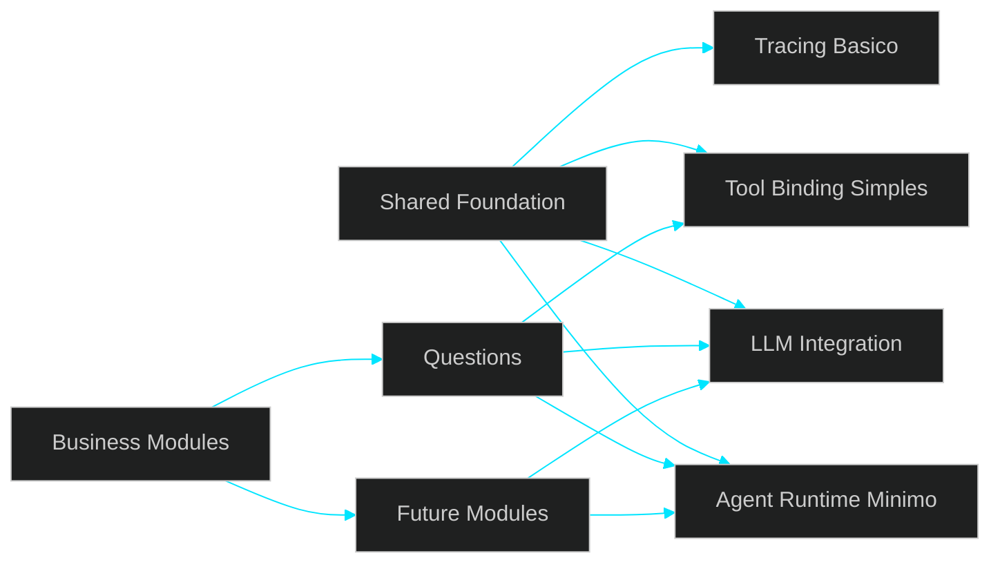

# 🚀 Discussion — Base Compartilhada de Agents Básicos Antes da Abertura do Módulo Questions

---

> [!IMPORTANT]
> O direcionamento desta discussão foi ajustado. O próximo passo do projeto não é abrir imediatamente o módulo **Questions**, mas consolidar antes uma **base compartilhada de agents básicos** em `shared`. Essa base deve ser pequena, reutilizável e suficiente para sustentar o primeiro fluxo real depois, sem antecipar uma plataforma completa de agents.

---

## 📌 Sumário

1. Contexto e Mudança de Direção
2. O Problema que Esta Discussão Precisa Resolver
3. O Que Significa “Agents Básicos”
4. O Que Deve Entrar em `shared`
5. Critério de Decisão: Build vs Buy
6. Direção Arquitetural
7. Sequência Recomendada
8. Resultado Esperado
9. Conclusão

---

## 1. Contexto e Mudança de Direção

O projeto já validou um conjunto importante de capacidades técnicas:

- ingestion
- processamento assíncrono
- persistência
- integração mínima com LLM
- embeddings
- fluxo ponta a ponta

Esse estágio mostra que a base técnica deixou de ser apenas hipotética. Ainda assim, a próxima decisão correta não é abrir o primeiro módulo de negócio por impulso. O ajuste pedido é outro: antes de plugar essas capacidades em `questions`, precisamos consolidar a camada compartilhada que sustentará os fluxos baseados em agents.

Em outras palavras, a ordem agora fica mais clara:

**capabilities validadas → foundation compartilhada de agents básicos → primeiro uso real em Questions**

Essa mudança não altera o destino do produto. `Questions` continua sendo o primeiro módulo de negócio mais aderente ao objetivo do sistema. O que muda é a ordem de construção: primeiro a base global reutilizável, depois o consumo dessa base em um fluxo de domínio.

---

## 2. O Problema que Esta Discussão Precisa Resolver

A pergunta principal deixa de ser:

- qual módulo vem primeiro
- quais fontes entram agora
- qual estratégia inicial de ingestão devemos seguir

E passa a ser:

- qual é a menor base de agents básicos que realmente precisa existir antes do módulo `questions`
- o que deve ser modelado como capacidade transversal em `shared`
- o que já existe no ecossistema e pode ser aproveitado
- o que realmente vale implementar internamente
- como fazer isso sem inflar escopo, arquitetura e manutenção

Sem esse fechamento, o risco é claro:

- entrar em `questions` cedo demais com foundation incompleta
- construir primitives ad hoc dentro do módulo de negócio
- duplicar responsabilidades que deveriam nascer em `shared`
- ou, no extremo oposto, tentar montar uma plataforma de agents grande demais antes do primeiro uso real

O recorte correto está no meio: **nem integração prematura ao domínio, nem plataforma genérica inflada**.

---

## 3. O Que Significa “Agents Básicos”

Nesta discussão, “agents básicos” não significa multi-agent avançado, planner complexo ou automação rica. O termo deve ser interpretado como a menor base operacional compartilhada capaz de suportar um primeiro fluxo real com consistência.

Na prática, isso tende a cobrir apenas blocos como:

- execução de workflow/prompt com estrutura mínima
- integração com provider de LLM
- tool calling simples quando houver necessidade real
- contratos previsíveis de entrada e saída
- algum controle mínimo de contexto/estado, se o fluxo exigir
- observabilidade básica para execução e debug

O ponto central é evitar dois erros comuns:

1. chamar qualquer chamada de LLM de “agent”
2. usar a ideia de “agent” como justificativa para criar uma microplataforma genérica cedo demais

O objetivo aqui não é sofisticação. É **reuso com disciplina**.

---

## 4. O Que Deve Entrar em `shared`

A regra arquitetural precisa ser simples: em `shared` entram apenas capacidades que tenham valor transversal claro e baixo acoplamento com domínio.

### Entradas naturais em `shared`

- runtime mínimo de execução
- adapters ou integração padronizada com provider/LLM
- contratos base de input/output quando forem realmente compartilhados
- registro ou binding simples de tools, se necessário
- configuração centralizada
- logging/tracing mínimo para acompanhar execuções
- helpers estritamente ligados ao fluxo comum de agent execution

### O que não deve entrar agora

- regras específicas do módulo `questions`
- taxonomia jurídica
- prompt library inflada
- planner genérico
- memória longa
- multi-agent orchestration
- abstrações para cenários ainda não existentes
- framework interno para todos os futuros casos imaginados

A base compartilhada precisa nascer pequena o bastante para ser revisável e útil, e não ambiciosa o bastante para parecer “completa”.

---

## 5. Critério de Decisão: Build vs Buy

A decisão mais importante desta etapa não é apenas técnica. Ela é estrutural: **o que vale reaproveitar do ecossistema e o que vale construir dentro do projeto**.

A recomendação correta aqui não é “comprar tudo pronto” nem “fazer tudo do zero”. O melhor caminho é adotar o que já resolve bem o recorte atual e construir internamente apenas o que for realmente específico do shape do projeto.

### Vale priorizar solução pronta quando:

- resolve bem o problema atual sem abrir novas camadas desnecessárias
- tem superfície pequena e compreensível
- reduz tempo de implementação e risco de erro
- se encaixa no shape técnico do projeto
- não força arquitetura paralela
- não gera dependência operacional desproporcional

### Vale implementar internamente quando:

- o comportamento é muito específico do fluxo do projeto
- a adaptação da solução pronta custa mais do que uma implementação simples
- a abstração externa adiciona complexidade sem ganho real
- é importante manter clareza total do fluxo principal
- o projeto precisa apenas de uma versão mínima e explícita

### Candidatos naturais para avaliação

- LangChain
- LangGraph
- padrões nativos do provider para tool calling / structured outputs
- componentes já existentes no projeto que podem ser reaproveitados sem nova camada
- observabilidade mínima já compatível com o shape atual

O critério não deve ser popularidade. Deve ser: **menor custo estrutural para o recorte atual**.

---

## 6. Direção Arquitetural

A separação correta precisa ficar visível desde agora:

- `shared` concentra a base reutilizável
- `questions` entra depois como primeiro consumidor real
- a foundation não é o produto final
- o módulo de negócio não deve nascer implementando primitives que deveriam ser compartilhadas

### Leitura do diagrama

- a base global nasce antes do uso de domínio
- `questions` não define a foundation, apenas a consome
- a foundation deve ser pequena o bastante para servir o primeiro caso real sem tentar antecipar todos os próximos
- novos módulos futuros podem reutilizar a mesma base sem recriar integração, execução e observabilidade do zero

---

## 7. Sequência Recomendada

### Fase 1 — Levantamento e decisão técnica

Objetivo:

- mapear o que a comunidade já oferece
- comparar opções com foco no recorte atual
- fechar uma stack mínima para agent execution compartilhada

### Fase 2 — Construção da base compartilhada mínima

Objetivo:

- implementar apenas o núcleo reutilizável necessário
- posicionar essa base em `shared`
- manter o fluxo explícito, simples e revisável

### Fase 3 — Primeiro consumo real em `questions`

Objetivo:

- usar a foundation compartilhada em um primeiro fluxo de domínio
- validar se a base atende o uso real sem reabrir arquitetura

### Fase 4 — Expansão por pressão real

Objetivo:

- evoluir somente onde o uso concreto pedir
- evitar abrir capabilities futuras por hipótese

---

## 8. Resultado Esperado

Ao final desta etapa, o projeto deve ter:

- uma decisão clara sobre o mínimo de agents básicos necessário
- uma posição objetiva sobre o que será reaproveitado vs implementado
- uma base pequena e compartilhada em `shared`
- um caminho mais limpo para abrir `questions` sem improviso estrutural
- menos risco de retrabalho, duplicação e abstração prematura

O ganho principal não é “ter agents”. O ganho principal é **entrar no primeiro módulo de produto com base melhor definida e com menor ruído arquitetural**.

---

## 9. Conclusão

A mudança pedida não altera a direção do produto, mas corrige a ordem de construção.

`Questions` continua sendo o primeiro módulo de negócio mais natural do sistema. Porém, antes dele, o projeto precisa fechar uma base compartilhada de agents básicos em `shared`, com recorte pequeno, reutilização real e decisão consciente entre reaproveitar o que já existe e implementar apenas o que fizer sentido manter interno.

A direção correta, portanto, é:

- consolidar primeiro a foundation global mínima
- fazer isso com avaliação pragmática de build vs buy
- evitar tanto integração prematura ao domínio quanto plataforma genérica inflada
- abrir `questions` somente depois que essa base estiver suficientemente clara e estável

Essa ordem torna a evolução mais natural, reduz retrabalho e deixa a próxima etapa mais defensável tecnicamente.
