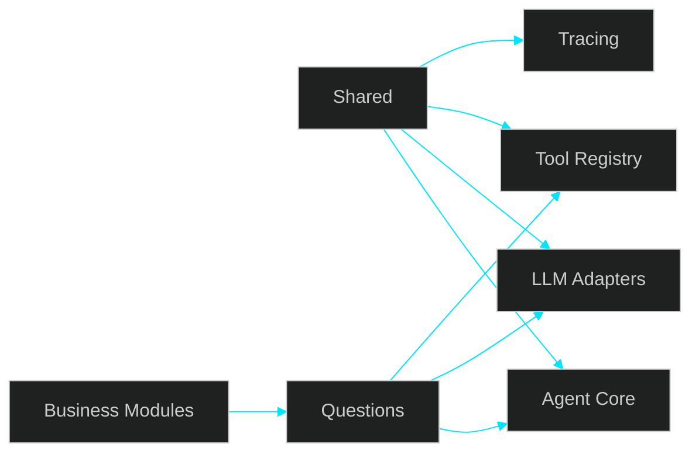

# 🚀 Discussion — Base Global de Agents Básicos

---

> [!IMPORTANT]
> O direcionamento foi ajustado: antes de entrar no módulo **Questions**, o próximo passo é consolidar a **base global de agents básicos** em `shared`, avaliando primeiro o que já existe no ecossistema antes de construir do zero.

---

## 📌 Sumário

1. Mudança de Direção
2. O Que Significa Agents Básicos
3. O Que Deve Ficar em Shared
4. Build vs Buy
5. Sequência Recomendada
6. Estrutura Proposta
7. Próximas PRs Sugeridas
8. Conclusão

---

## 1. Mudança de Direção

A decisão atual redefine a ordem de evolução:

**antes:** Questions-first  
**agora:** Shared agents foundation → Questions

Isso significa:

- Questions continua sendo o primeiro módulo de negócio
- porém depende antes de uma base reutilizável mínima
- essa base deve servir múltiplos módulos futuros
- evitar recriar manualmente o que a comunidade já resolveu

---

## 2. O Que Significa Agents Básicos

Não significa construir uma plataforma completa de agents.

Significa apenas o conjunto mínimo reutilizável para fluxos reais:

- execução de prompt/workflow
- tool calling básico
- memória simples se necessária
- orchestration mínima
- contratos de entrada/saída
- observabilidade mínima
- providers configuráveis

Tudo além disso deve ser adiado.

---

## 3. O Que Deve Ficar em Shared

Entram em `shared` somente capacidades transversais:

- agent runtime base
- adapters de LLM/provider
- tool registry simples
- prompt execution pipeline
- tracing/logging mínimo
- interfaces comuns
- config centralizada

Não entram agora:

- regras do módulo Questions
- taxonomia jurídica rica
- planners complexos
- multi-agent avançado
- automações sofisticadas

---

## 4. Build vs Buy

A próxima discussão correta é:

**o que usar pronto vs o que implementar internamente**

## Priorizar uso de mercado/comunidade quando:

- resolve 80% do problema atual
- reduz tempo de entrega
- possui boa maturidade
- baixo lock-in
- integração simples

## Implementar internamente quando:

- necessidade muito específica
- custo de adaptação alto
- abstração externa atrapalha
- controle interno traz simplicidade real

## Candidatos naturais para avaliar

- LangChain
- LangGraph
- OpenAI SDK patterns
- tool calling nativo do provider
- queues/workers já existentes no projeto

---

## 5. Sequência Recomendada

### Fase 1 — Levantamento Técnico

Mapear soluções existentes e decidir stack mínima.

### Fase 2 — Shared Foundation

Criar base pequena e reutilizável em `shared`.

### Fase 3 — Primeiro Fluxo Real

Consumir essa base no módulo Questions.

### Fase 4 — Evolução por Pressão Real

Expandir somente o que o uso exigir.

---

## 6. Estrutura Proposta

---

## 7. Próximas PRs Sugeridas

### PR A — Research / Decision Record
Comparar opções prontas e fechar stack inicial.

### PR B — Shared Agents Foundation
Implementar runtime mínimo reutilizável.

### PR C — Questions First Integration
Primeiro uso real da base no módulo Questions.

---

## 8. Conclusão

O ajuste principal é de ordem, não de destino.

- destino continua sendo **Questions**
- próximo passo agora é **base global de agents básicos**
- essa base fica em **shared**
- a implementação deve começar avaliando soluções prontas
- construir do zero só onde houver ganho real

Isso preserva velocidade, reduz retrabalho e cria fundação correta para o módulo de produto.
