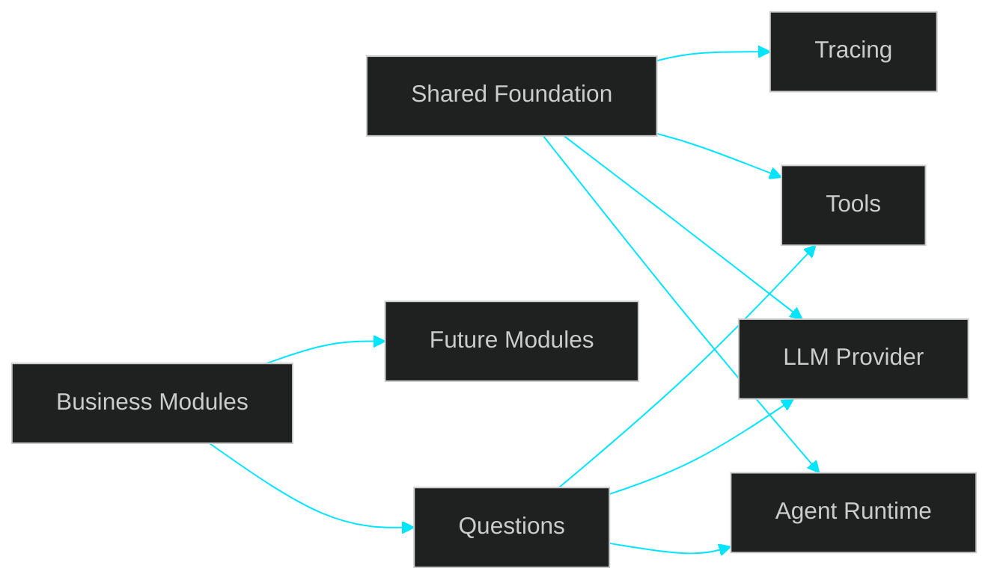

# 🚀 Discussion — Foundation Compartilhada de Agents Básicos e Stack Mínima Antes do Módulo Questions


---

> [!IMPORTANT]
> O próximo passo proposto não é abrir imediatamente o módulo **Questions**. Antes disso, o projeto pode consolidar uma **foundation mínima e compartilhada de agents básicos** em `shared`, escolhendo com pragmatismo a menor stack viável para execução real, reuso e evolução controlada.

---

## 📌 Sumário

1. [Contexto Atual](#1-contexto-atual)  
2. [Problema a Resolver](#2-problema-a-resolver)  
3. [O Que São Agents Básicos Neste Contexto](#3-o-que-são-agents-básicos-neste-contexto)  
4. [Mapeamento do Ecossistema](#4-mapeamento-do-ecossistema)  
5. [Comparação Objetiva para o Recorte Atual](#5-comparação-objetiva-para-o-recorte-atual)  
6. [Stack Mínima Recomendada](#6-stack-mínima-recomendada)  
7. [Fases Propostas (com exemplos)](#7-fases-propostas-com-exemplos)  
8. [Direção Arquitetural](#8-direção-arquitetural)  
9. [Decisões a Fechar](#9-decisões-a-fechar)  
10. [Conclusão](#10-conclusão)

---

## 1. Contexto Atual

O projeto já validou capacidades importantes:

- ingestion
- processamento assíncrono
- persistência
- integração com LLM
- embeddings
- fluxo ponta a ponta

Isso reduz a incerteza técnica inicial. O desafio atual passa a ser **organizar a próxima evolução sem dispersão arquitetural**.

A leitura proposta é:

**capabilities validadas → foundation compartilhada → primeiro módulo de negócio**

O destino continua sendo `questions`, porém a entrada pode ser mais sólida se existir antes uma base reutilizável.

---

## 2. Problema a Resolver

A discussão deixa de ser apenas “qual módulo vem primeiro” e passa a ser:

- qual base mínima precisa existir antes de `questions`
- o que deve nascer em `shared`
- o que já existe pronto no mercado
- o que vale construir internamente
- qual decisão reduz retrabalho e overengineering

O risco de não fechar isso agora:

- primitives espalhadas em módulos de negócio
- duplicação futura
- integração inconsistente
- abstração excessiva depois para corrigir o passado

---

## 3. O Que São Agents Básicos Neste Contexto

Não significa multi-agent complexo.

Significa apenas o conjunto mínimo para suportar fluxos reais:

- execução de prompt/workflow
- integração com provider LLM
- tool calling simples
- structured output
- contexto mínimo quando necessário
- logging/tracing básico
- contratos previsíveis de entrada e saída

Objetivo: **reuso com simplicidade**.

---

## 4. Mapeamento do Ecossistema

## A. OpenAI Responses API

Melhor encaixe quando se busca fluxo enxuto e próximo do provider.

**Entrega nativa:**
- text generation
- structured outputs
- tool calling
- multimodal support
- menor quantidade de camada externa

**Leitura prática:** excelente candidato para base mínima explícita em NestJS.

---

## B. LangChain

Framework popular para agent engineering.

**Entrega comum:**
- chains prontas
- tool abstractions
- memory patterns
- prompts utilities
- integrations diversas

**Leitura prática:** acelera experimentação, porém adiciona convenções e superfície maior.

---

## C. LangGraph

Camada de orquestração mais avançada.

**Entrega comum:**
- state graphs
- durable execution
- retries
- human-in-the-loop
- flows complexos

**Leitura prática:** poderoso, porém tende a ser acima da necessidade do slice atual.

---

## D. Vercel AI SDK

Toolkit TypeScript moderno.

**Entrega comum:**
- unified provider API
- object generation
- streaming
- tool usage
- boa ergonomia TS

**Leitura prática:** opção forte para stack TS, especialmente multi-provider.

---

## 5. Comparação Objetiva para o Recorte Atual

| Opção | Velocidade Inicial | Simplicidade | Poder Futuro | Overhead Inicial | Fit Atual |
|---|---|---|---|---|---|
| OpenAI Responses API | Alta | Alta | Médio | Baixo | Muito Alto |
| LangChain | Alta | Média | Alto | Médio | Alto |
| LangGraph | Média | Baixa | Muito Alto | Alto | Médio |
| Vercel AI SDK | Alta | Média | Alto | Médio | Alto |

### Leitura recomendada

#### Se o foco é menor caminho até produção controlada:
**OpenAI Responses API**

#### Se o foco é acelerar patterns prontos:
**LangChain**

#### Se já existe necessidade real de fluxo complexo:
**LangGraph**

#### Se a prioridade é ergonomia TS e flexibilidade:
**Vercel AI SDK**

---

## 6. Stack Mínima Recomendada

Para o estágio atual, a recomendação mais conservadora e pragmática é:

### Núcleo

- OpenAI Responses API
- NestJS services próprios
- Zod para schemas
- logs/tracing já existentes no projeto

### Estrutura

```text
src/shared/agents/
  agent.service.ts
  llm.provider.ts
  tool.registry.ts
  agent.types.ts
```

### Responsabilidades

#### agent.service.ts
Coordena execução do fluxo.

#### llm.provider.ts
Integra com provider escolhido.

#### tool.registry.ts
Registra tools simples reutilizáveis.

#### agent.types.ts
Contratos mínimos.

### Exemplo de uso

```ts
await agentService.execute({
  prompt: "Generate one question about contracts law",
  tools: ["retrieveContext"]
});
```

---

## 7. Fases Propostas (com exemplos)

## Fase 1 — Levantamento e Decisão Técnica

**Objetivo:** escolher a menor stack viável.

### Ações

- comparar 2 ou 3 opções reais
- testar prompt simples
- testar structured output
- testar tool calling básico
- medir clareza de código

### Entrega esperada

- documento decisório
- PoC pequena
- stack escolhida

---

## Fase 2 — Foundation Compartilhada

**Objetivo:** criar base mínima em `shared`.

### Exemplo de implementação

```ts
await agentService.execute({
  prompt: "...",
  tools: []
});
```

### Entrega esperada

- módulo shared funcional
- contratos básicos
- testes mínimos
- logs básicos

---

## Fase 3 — Primeiro Uso Real em Questions

**Objetivo:** consumir a base em fluxo de negócio.

### Exemplo de entrada

```json
{
  "tema": "Licitações",
  "nivel": "medio"
}
```

### Fluxo

1. Questions chama shared agents  
2. Tool busca contexto se necessário  
3. LLM gera saída estruturada  
4. módulo retorna resposta

### Exemplo de saída

```json
{
  "enunciado": "...",
  "alternativas": ["A","B","C","D"],
  "gabarito": "A"
}
```

---

## Fase 4 — Expansão por Pressão Real

**Objetivo:** evoluir somente após uso concreto.

### Exemplos

Se faltar contexto:
- melhorar retrieval

Se crescer número de fluxos:
- organizar templates/strategies

Se execução ficar complexa:
- avaliar LangGraph

Se faltar rastreabilidade:
- expandir tracing

### O que evitar agora

- planner genérico
- multi-agent platform
- memória longa
- framework interno grande

---

## 8. Direção Arquitetural



---

## 9. Decisões a Fechar

1. Foundation compartilhada antes de `questions` faz sentido?
2. `shared/agents` é o local correto?
3. OpenAI Responses API é o melhor ponto de partida?
4. LangChain entra só se houver necessidade real?
5. Escopo mínimo está adequado para evitar overengineering?

---

## 10. Conclusão

A proposta não muda o destino do produto. Ela melhora a ordem de construção.

- primeiro: foundation mínima compartilhada
- depois: primeiro fluxo real em `questions`
- depois: expansão guiada por uso concreto

A decisão central é escolher a menor stack que entregue valor agora sem criar passivo estrutural depois.
