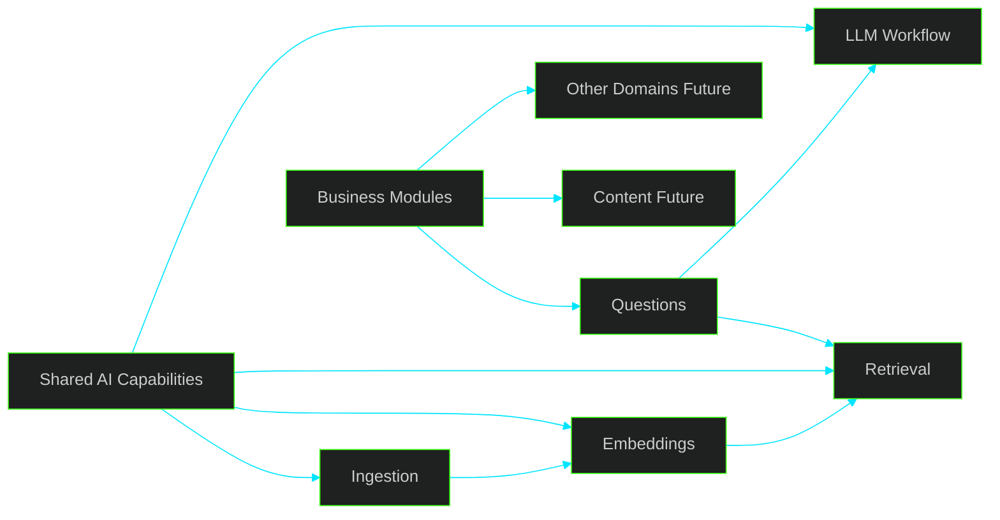

# 🚀 Discussion — Definição do Primeiro Módulo, Fontes e Estratégia Inicial de Ingestão

---

> [!IMPORTANT]
> O núcleo técnico inicial já foi validado. O próximo passo correto não é expandir capability por inércia, e sim **fechar direção de produto com disciplina**: definir **qual módulo entrega valor primeiro**, **quais fontes entram agora** e **qual nível de ingestão é sustentável sem inflar custo, manutenção e ruído operacional**.

---

## 📌 Sumário

1. Contexto Atual
2. Decisão que Precisa Ser Fechada
3. Critério de Escolha do Primeiro Módulo
4. Análise Crítica das Opções
5. Fontes Recomendadas por Prioridade
6. Estratégia Inicial de Ingestão e Captura
7. Direção Estrutural
8. Recomendação Objetiva
9. Sequência Sugerida de Execução
10. Perguntas para Fechamento
11. Conclusão

---

## 1. Contexto Atual

Capacidades já validadas no projeto:

- ingestion
- processamento assíncrono
- integração mínima com LLM
- embeddings
- persistência
- fluxo ponta a ponta

Esse estágio muda a natureza da decisão.

O problema principal já não é mais “como provar capability técnica”.
O problema agora é **evitar dispersão de produto**.

A mudança natural é:

**de capability-first → para product-first**

Ou seja:

- capability compartilhada passa a ser meio
- módulo de negócio passa a ser fim
- fonte de dados passa a ser escolhida pelo valor no fluxo real
- scraping passa a ser subordinado ao recorte do produto, e não o contrário

---

## 2. Decisão que Precisa Ser Fechada

As definições que precisam sair deste documento são objetivas:

- qual será o primeiro módulo real de produto
- quais fontes entram na primeira fase operacional
- que tipo de captura de conteúdo faz sentido agora
- o que deve ser explicitamente adiado
- como organizar a estrutura para crescer sem misturar capability com domínio

Sem esse fechamento, o projeto corre risco de:

- continuar tecnicamente ativo, mas semanticamente difuso
- acumular base sem uso real
- inflar scraping cedo demais
- validar infraestrutura sem validar valor
- gerar arquitetura correta no papel, mas sem direção de produto clara

---

## 3. Critério de Escolha do Primeiro Módulo

O primeiro módulo não deve ser escolhido pelo que parece mais elegante tecnicamente.
Deve ser escolhido pelo melhor equilíbrio entre:

1. aderência ao objetivo central do produto
2. capacidade de aproveitar o pipeline já existente
3. velocidade para gerar valor observável
4. baixo risco de expansão artificial de escopo
5. clareza para orientar as próximas PRs

Na prática, o primeiro módulo ideal precisa responder bem a quatro perguntas:

- ele entrega valor reconhecível por si só?
- ele força uso real das capabilities já construídas?
- ele ajuda a decidir melhor as próximas fontes?
- ele pode nascer pequeno sem exigir plataforma completa antes?

Se a resposta não for claramente “sim”, o módulo não deve vir primeiro.

---

## 4. Análise Crítica das Opções

### 🥇 Opção A — Questions

Primeiro módulo orientado ao objetivo mais explícito do projeto:

- receber prova, enunciado, gabarito ou material-base
- processar o conteúdo
- apoiar geração de questão útil
- devolver saída pronta para o domínio principal

**Pontos fortes**

- máxima aderência ao propósito do sistema
- transforma capability em produto real
- força integração entre ingestion, retrieval, embeddings e LLM de forma útil
- reduz o risco de construir infraestrutura desconectada do resultado esperado
- ajuda a decidir qualidade mínima de input e output desde cedo

**Riscos reais**

- pode induzir geração prematura “bonita”, mas pouco confiável, se a base estiver fraca
- pode misturar cedo demais geração, correção, explicação e grounding, inflando o recorte

**Leitura crítica**

É a melhor opção **desde que o primeiro slice seja extremamente disciplinado**.
Questions deve começar como **módulo de saída controlada**, não como “motor completo de autoria jurídica”.

---

### 🧠 Opção B — Knowledge Base Jurídica

Foco em base compartilhada:

- legislação oficial
- indexação vetorial
- recuperação semântica
- grounding jurídico

**Pontos fortes**

- melhora a qualidade estrutural futura
- reduz alucinação quando bem executada
- gera reaproveitamento transversal
- cria fundação útil para múltiplos fluxos

**Riscos reais**

- é fácil virar projeto-fim em vez de fundação-meio
- pode consumir energia demais em coleta, limpeza e normalização
- pode mascarar falta de definição de produto com discurso de base robusta

**Leitura crítica**

É necessária, mas **não deve ser posicionada como primeiro módulo de produto**.
Ela deve existir como capability compartilhada que serve ao módulo Questions.

---

### 🔎 Opção C — Retrieval

Foco no consumo da base:

- query
- embedding
- busca similar
- retorno contextual

**Pontos fortes**

- slice pequeno
- baixo risco técnico
- excelente como validação de uso da base
- útil como peça intermediária do fluxo real

**Riscos reais**

- isolado, ainda não é produto final percebido
- pode virar demo técnica elegante, mas insuficiente para justificar a direção do sistema

**Leitura crítica**

Não deve ser o primeiro módulo oficial de produto.
Deve ser tratado como **capability operacional mínima a serviço do módulo Questions**.

---

### 📚 Opção D — Materiais Didáticos

Escopo possível:

- livros
- apostilas
- PDFs complementares
- doutrina
- materiais explicativos

**Pontos fortes**

- amplia repertório
- melhora potencialmente explicações e contextualização
- pode enriquecer geração comentada depois

**Riscos reais**

- alta heterogeneidade documental
- custo maior de limpeza e segmentação
- risco jurídico e operacional maior dependendo da origem
- mistura cedo demais conteúdo oficial com interpretação secundária

**Leitura crítica**

É importante, mas claramente **não deve entrar na primeira camada operacional**.
Trazer isso cedo é trocar foco por volume.

---

## 5. Fontes Recomendadas por Prioridade

A escolha das fontes deve seguir um princípio simples:

**primeiro confiança e previsibilidade; depois cobertura e variedade**

### 🟢 Prioridade 1 — Fontes Oficiais

Entram primeiro:

- Planalto
- CNJ
- tribunais
- conselhos e órgãos reguladores quando fizer sentido
- portais normativos
- diários oficiais apenas quando houver necessidade concreta do fluxo

**Por que entram primeiro**

- maior confiança jurídica
- menor ruído semântico
- melhor base para grounding
- menor necessidade de interpretação editorial
- maior defensabilidade do sistema nas primeiras iterações

**Observação crítica**

“Fonte oficial” não significa “ingestão irrestrita de tudo que existir”.
O correto é começar por **conjuntos oficiais delimitados por utilidade**.

---

### 🟡 Prioridade 2 — Fontes Curadas e Controladas

Entram logo depois:

- PDFs selecionados manualmente
- materiais homologados pela equipe
- conjuntos pequenos e bem conhecidos
- provas e gabaritos previamente revisados

**Por que entram cedo**

- baixo custo operacional
- previsibilidade de formato
- melhor controle de qualidade
- ótima relação entre esforço e valor

**Observação crítica**

Curadoria manual no começo não é retrocesso.
É uma forma deliberada de preservar qualidade e reduzir ruído enquanto o produto ainda está sendo calibrado.

---

### 🟠 Prioridade 3 — Provas Reais e Gabaritos

Entram como input de negócio:

- concursos anteriores
- provas em PDF
- gabaritos comentados quando houver boa qualidade
- conjuntos controlados para experimentação real de geração

**Por que são estratégicos**

- aderência direta ao produto
- ajudam a calibrar formato de saída
- tornam mais realista a avaliação do módulo Questions

**Observação crítica**

Essas fontes são fundamentais para o produto, mas o uso inicial deve ser controlado.
Não é necessário começar com massa enorme de provas.
É melhor começar com um conjunto pequeno, limpo e comparável.

---

### 🔴 Fontes que Não Devem Entrar Agora

Devem ficar fora da primeira fase:

- scraping amplo de blogs e sites informais
- fóruns e conteúdo gerado por usuários
- doutrina variada sem critério forte
- múltiplos portais instáveis ao mesmo tempo
- acervos grandes sem política clara de segmentação e priorização

**Motivo**

Isso aumenta ruído, custo de manutenção e ambiguidade de verdade útil antes de o produto provar forma mínima.

---

## 6. Estratégia Inicial de Ingestão e Captura

A pergunta correta não é “qual scraping conseguimos fazer?”.
A pergunta correta é:

**qual captura mínima gera base suficiente para o primeiro fluxo real sem criar passivo técnico desnecessário?**

### ✅ O que faz sentido agora

Priorizar:

- upload manual de arquivos
- ingestão por arquivo controlado
- leitura de HTML oficial simples
- páginas estáticas
- URLs conhecidas e previsíveis
- conectores pequenos e específicos por fonte

### ✅ Estratégia recomendada

Começar com três modos de entrada apenas:

1. **arquivo enviado manualmente**
   - melhor para provas, gabaritos e PDFs curados
2. **URL explícita de página oficial**
   - melhor para legislação e conteúdo institucional estável
3. **lista controlada de fontes conhecidas**
   - melhor para ingestão recorrente de poucos sites confiáveis

### ⚠️ O que deve ser adiado

Adiar explicitamente:

- crawlers genéricos
- browser automation pesada
- navegação multi-step frágil
- scraping agressivo
- descoberta automática de novas páginas sem critério forte
- captura transversal de múltiplos domínios em paralelo

### Leitura crítica

No estágio atual, scraping sofisticado tende a ser vaidade de plataforma.
O projeto ainda ganha mais com:

- previsibilidade
- repetibilidade
- baixo custo
- facilidade de debug
- clareza do dataset ingerido

---

## 7. Direção Estrutural

A arquitetura precisa refletir a separação correta entre **capability compartilhada** e **módulo de negócio**.

### Interpretação

- ingestion, embeddings, retrieval e workflow com LLM são capacidades compartilhadas
- Questions é o primeiro módulo real de negócio
- a base não concorre com o produto; ela serve o produto
- novas capacidades devem nascer por pressão do fluxo real, não por hipótese abstrata

### Consequência prática

A próxima fase não deve ser apresentada como “vamos construir a plataforma de conhecimento”.
Deve ser apresentada como:

**vamos fazer o primeiro módulo de Questions funcionar com base mínima, retrieval mínimo e fontes controladas**

---

## 8. Recomendação Objetiva

A recomendação mais sólida, pragmática e coerente com o estágio atual é:

### 1. Assumir oficialmente direção **questions-first**

Porque é o eixo que mais aproxima capability validada de valor real.

### 2. Tratar retrieval como capability mínima de suporte

Não como produto isolado, mas como parte do fluxo que sustenta Questions.

### 3. Iniciar base com fontes **oficiais + curadas**

Porque oferecem melhor relação entre confiança, previsibilidade e baixo custo operacional.

### 4. Trazer provas e gabaritos em lote controlado

Como insumo real de calibração do produto, sem volume excessivo no início.

### 5. Restringir ingestão inicial a captura simples e auditável

Sem crawler genérico, sem browser automation pesada e sem cobertura ampla de fontes frágeis.

---

## 9. Sequência Sugerida de Execução

### Fase 1 — Fechar o primeiro fluxo útil de Questions

Objetivo:

- receber input controlado
- consultar base mínima quando necessário
- gerar uma saída útil e verificável

### Fase 2 — Consolidar retrieval mínimo no fluxo real

Objetivo:

- usar a base de forma explícita
- validar se grounding melhora utilidade prática
- medir ruído, relevância e formato de recuperação

### Fase 3 — Expandir base oficial com critério

Objetivo:

- aumentar cobertura sem perder previsibilidade
- consolidar taxonomia mínima de fontes e tipos documentais

### Fase 4 — Só então ampliar repertório documental

Objetivo:

- incluir materiais didáticos e conteúdos complementares quando houver pressão real por explicação mais rica

---

## 10. Perguntas para Fechamento

1. O projeto assume oficialmente direção **questions-first** como primeiro módulo de produto?
2. Retrieval fica posicionado como capability de suporte, e não como módulo principal?
3. A base inicial será limitada a **fontes oficiais + conjuntos curados**?
4. Provas e gabaritos entram já agora, mas em lote pequeno e controlado?
5. A ingestão inicial fica restrita a **arquivo manual + URL explícita + fontes conhecidas**, sem crawler genérico?
6. Faz sentido formalizar a separação entre:
   - shared AI capabilities
   - business modules

---

## 11. Conclusão

A decisão mais consistente neste momento não é expandir horizontalmente o sistema.
É **estreitar a direção**.

A recomendação final é:

- **Produto inicial:** Questions
- **Capacidades de suporte:** retrieval mínimo + base mínima + workflow LLM já validado
- **Fontes iniciais:** oficiais + curadas
- **Input de calibração:** provas e gabaritos em conjunto controlado
- **Captura:** simples, barata, previsível e auditável
- **Estrutura:** shared para capabilities; módulos separados para negócio

Essa direção reduz ambiguidade, protege escopo, evita scraping inflado cedo demais e cria uma trilha mais clara para as próximas decisões de implementação.
