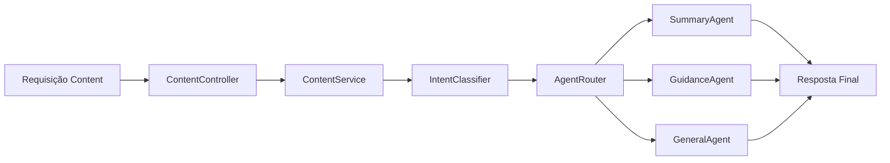

# 🧩 PR 43 — Fase 2: Classificação Estruturada de Intenção no AgentRouter
## Evolução mínima da decisão interna dos agents após a foundation inicial já consolidada

---

<div align="left">


</div>

---

> [!IMPORTANT]
> Esta PR continua diretamente a PR 42. Depois da foundation inicial de agents e do roteamento interno já estabelecidos, o próximo passo mínimo correto é introduzir uma classificação explícita de intenção antes da resolução final do `AgentRouter`, mantendo o mesmo boundary público de `content`.
>
> - preserva endpoint e contratos externos atuais
> - centraliza a leitura de intenção do request
> - reduz heurísticas dispersas no fluxo de decisão
> - mantém `ContentService` como owner do fluxo
> - evolui a base sem reabrir arquitetura aprovada
>
> **Este PR não adiciona NLP avançado, classificação por LLM, planner, memória persistente, tools externas ou nova API paralela.**

---

## 📌 Sumário

1. [Síntese Executiva](#1-síntese-executiva)
2. [Objetivo do PR](#2-objetivo-do-pr)
3. [Decisão Arquitetural](#3-decisão-arquitetural)
4. [Escopo](#4-escopo)
5. [Fora de Escopo](#5-fora-de-escopo)
6. [Fluxo Arquitetural](#6-fluxo-arquitetural)
7. [Contratos Mínimos](#7-contratos-mínimos)
8. [Regras de Implementação](#8-regras-de-implementação)
9. [Critérios de Review](#9-critérios-de-review)
10. [Critérios de Aceite](#10-critérios-de-aceite)
11. [Conclusão](#11-conclusão)

---

## 1. Síntese Executiva

A PR 42 consolidou a foundation inicial de agents dentro de `content`, com roteamento interno e preservação do contrato público já existente. Com essa base estabilizada, o próximo avanço incremental não é expandir a arquitetura, mas tornar a decisão interna mais explícita e previsível.

A PR 43 introduz uma classificação estruturada de intenção como etapa anterior à seleção do agent. Em vez de depender apenas de heurísticas distribuídas entre pontos diferentes do fluxo, a leitura da intenção passa a ocorrer de forma centralizada e controlada, mantendo `ContentService` como coordenador principal e `AgentRouter` como ponto de resolução. O ganho desta PR está na clareza da decisão, não na ampliação da superfície do módulo.

---

## 2. Objetivo do PR

- introduzir classificação explícita de intenção no fluxo de `content`
- centralizar a regra de decisão antes do roteamento final
- reduzir heurísticas dispersas entre router e agents
- preservar endpoint, contrato de entrada e formato de saída atuais
- melhorar clareza e previsibilidade do fluxo interno

---

## 3. Decisão Arquitetural

A arquitetura já aprovada é mantida. `ContentService` continua como owner do fluxo e `AgentRouter` permanece responsável pela escolha do agent que executará a resposta. Esta PR adiciona apenas uma etapa mínima e explícita de classificação entre a entrada do conteúdo e a resolução final do roteamento.

Essa decisão mantém o boundary público inalterado, evita redistribuir lógica de intenção entre os agents e reduz acoplamento entre leitura de intenção e execução. O efeito desejado é deixar o fluxo mais claro para manutenção e review, sem introduzir foundation paralela, sem criar novas camadas genéricas e sem antecipar fases futuras.

---

## 4. Escopo

- criar o contrato mínimo de intenção usado no roteamento
- implementar um classifier simples, baseado em regras explícitas e previsíveis
- adaptar `AgentRouter` para decidir a partir da intenção classificada
- remover ou reduzir heurísticas dispersas no fluxo atual, quando fizer sentido no próprio recorte
- atualizar testes para cobrir classificação e roteamento preservando compatibilidade externa

---

## 5. Fora de Escopo

- processamento semântico avançado
- classificação por LLM
- múltiplas intenções simultâneas
- score de confiança
- fallback probabilístico
- planner multi-step
- memória entre execuções
- tools externas
- novo endpoint ou contrato público alternativo

---

## 6. Fluxo Arquitetural



O fluxo continua interno ao módulo `content` e não altera a superfície pública já consolidada. A mudança desta PR está apenas em tornar explícita a etapa de classificação antes da seleção do agent.

---

## 7. Contratos Mínimos

```ts
type ContentIntent = 'summary' | 'guidance' | 'general';
```

```ts
interface ContentIntentClassifier {
  classify(content: string): ContentIntent;
}
```

Os contratos permanecem pequenos e suficientes para o recorte. Esta PR não altera o contrato público de `content`; apenas introduz o tipo mínimo necessário para tornar a decisão interna mais explícita.

---

## 8. Regras de Implementação

- manter controller fino e sem regra de negócio
- preservar `ContentService` como owner do fluxo principal
- manter o classifier simples, explícito e previsível
- usar `AgentRouter` como ponto de decisão a partir da intenção classificada
- manter agents focados em execução, não em leitura de intenção
- evitar abstrações genéricas antecipadas ou runtime paralelo de decisão
- adicionar apenas testes proporcionais ao slice
- não preparar, dentro desta PR, capacidades da fase seguinte

Quando houver dúvida entre sofisticação e clareza, a escolha correta neste recorte é clareza.

---

## 9. Critérios de Review

- a classificação de intenção ficou centralizada, explícita e fácil de seguir
- `AgentRouter` passou a operar com decisão mais clara e menos heurística dispersa
- o contrato atual de `content` foi preservado sem impacto externo indevido
- a mudança permaneceu incremental e aderente à foundation da PR 42
- os agents seguem pequenos e focados em execução
- não houve expansão arquitetural fora do recorte
- os testes cobrem o novo fluxo de classificação e roteamento de forma proporcional
- a documentação permanece coerente com o tamanho real da entrega

---

## 10. Critérios de Aceite

- [ ] requests recebem uma intenção classificada válida dentro do fluxo interno
- [ ] `AgentRouter` utiliza a intenção classificada para selecionar o agent compatível
- [ ] endpoint atual permanece funcional sem mudança de contrato externo
- [ ] resposta segue compatível com consumidores existentes
- [ ] testes cobrem classificação e roteamento no novo fluxo
- [ ] nenhuma expansão fora do recorte desta PR foi introduzida

---

## 11. Conclusão

A PR 43 evolui de forma direta a foundation estabelecida na PR 42 ao tornar explícita a leitura de intenção antes do roteamento final dos agents. O ganho desta entrega está em melhorar clareza, previsibilidade e manutenção do fluxo interno, sem alterar o boundary público, sem inflar a arquitetura e sem antecipar capacidades que pertencem às próximas fases.
