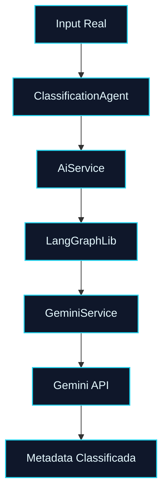

# 🤖 PR 60 — Fase 2: Primeira Validação Operacional Real do Classification Agent via Gemini
## Confirmação ponta a ponta do fluxo real de classificação usando provider externo já integrado

---

<div align="left">


</div>

---

> [!IMPORTANT]
> Esta PR representa o próximo passo natural após a PR 59: confirmar em execução real que o `ClassificationAgent` já opera ponta a ponta via Gemini.
>
> - executa fluxo real com `GEMINI_API_KEY` válida
> - confirma geração de prompt e resposta do provider
> - valida metadata útil retornada ao agent
> - mantém recorte pequeno e sem expansão arquitetural
>
> **Este PR não introduz novos providers, não adiciona fallback, não cria observabilidade expandida e não redesenha o pipeline.**

---

## Sumário

1. Síntese Executiva
2. Objetivo do PR
3. Decisão Arquitetural
4. Escopo
5. Fora de Escopo
6. Fluxo Arquitetural
7. Contratos Mínimos
8. Regras de Implementação
9. Critérios de Review
10. Critérios de Aceite
11. Conclusão

---

## 1. Síntese Executiva

A PR 59 conectou o `ClassificationAgent` ao `AiService`, tornando possível o uso funcional do runtime Gemini dentro de uma responsabilidade real do domínio. O próximo passo mínimo correto é comprovar esse fluxo em execução operacional real, usando credencial válida e resposta concreta do provider externo.

Esta PR foca nessa validação ponta a ponta. O objetivo não é expandir a solução, e sim confirmar que a arquitetura já aprovada responde corretamente fora do ambiente puramente mockado, preservando o boundary existente e sem adicionar novas camadas.

Com isso, o projeto evolui de integração funcional validada em testes para confirmação operacional controlada do primeiro agent em execução real.

---

## 2. Objetivo do PR

- Executar o `ClassificationAgent` com `GEMINI_API_KEY` válida.
- Confirmar geração real de prompt no fluxo atual.
- Confirmar resposta real retornada pelo Gemini.
- Validar metadata útil consumida pelo agent.
- Tratar falha explícita de execução real sem inflar o desenho atual.

---

## 3. Decisão Arquitetural

A arquitetura permanece inalterada. O fluxo continua passando por `ClassificationAgent`, `AiService`, `LangGraphLib` e `GeminiService`, sem atalhos e sem acesso direto ao provider fora das fronteiras já aprovadas.

A decisão central desta PR é validar operacionalmente o caminho existente, em vez de criar novos componentes de inspeção, adapters paralelos ou soluções específicas de debug. O ganho está na confirmação real do que já foi construído, não em nova estrutura.

---

## 4. Escopo

- execução real do `ClassificationAgent`
- uso de `GEMINI_API_KEY` configurada
- confirmação de prompt enviado no fluxo atual
- confirmação de resposta recebida do provider
- validação de metadata retornada
- tratamento explícito de falha operacional mínima
- documentação simples de reprodução

---

## 5. Fora de Escopo

- multi-provider
- fallback entre modelos
- retry avançado
- telemetria ampliada
- dashboards
- tracing distribuído
- redesign do pipeline
- refactor amplo de agents

---

## 6. Fluxo Arquitetural



---

## 7. Contratos Mínimos

Nenhum contrato público novo é introduzido. O fluxo reutiliza os contratos já aprovados na PR 59.

```ts
type ExecuteAiInput = {
  prompt: string;
};

type ExecuteAiResult = {
  output: string;
};
```

---

## 8. Regras de Implementação

A validação real deve ocorrer usando o fluxo oficial já existente. Qualquer logging necessário deve ser mínimo, temporário e proporcional ao recorte. O objetivo é observar prompt, resposta e comportamento funcional sem transformar esta etapa em foundation de observabilidade.

Erros reais do provider devem permanecer explícitos e legíveis. Não adicionar fallback, retries complexos ou abstrações novas apenas para esta validação.

---

## 9. Critérios de Review

Validar se a execução real ocorre pelo caminho arquitetural correto, se o provider externo responde no fluxo esperado e se o `ClassificationAgent` recebe metadata útil sem dependência direta de `GeminiService`.

Confirmar também que a PR permaneceu pequena, sem adicionar estrutura paralela de debug e sem ampliar o escopo para temas operacionais maiores do que o necessário.

---

## 10. Critérios de Aceite

- [ ] `ClassificationAgent` executa com credencial real válida
- [ ] o prompt percorre o fluxo oficial existente
- [ ] há resposta real retornada pelo Gemini
- [ ] metadata útil é produzida no agent
- [ ] falhas reais são explícitas quando ocorrerem
- [ ] nenhuma nova camada arquitetural foi introduzida
- [ ] documentação de reprodução está clara
- [ ] recorte permanece pequeno e revisável

---

## 11. Conclusão

A PR 60 consolida o primeiro ciclo completo do uso real de IA no pipeline de classificação. Após integrar o runtime e conectá-lo ao domínio nas etapas anteriores, o projeto confirma agora a execução operacional ponta a ponta com provider externo real, mantendo simplicidade, fronteiras claras e evolução incremental.

O resultado é uma validação objetiva do caminho já construído, sem inflar a arquitetura e sem antecipar fases futuras.
