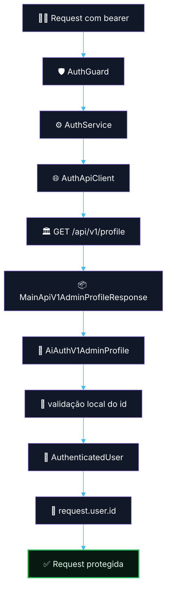

# 🔐 PR 06 — Fase 1: Foundation do Auth Delegado
## Slice mínimo para consumir a identidade administrativa da API principal

---

<div align="left">


</div>

---

## Sumário

- [1. Síntese executiva](#1-síntese-executiva)
- [2. Contexto e objetivo](#2-contexto-e-objetivo)
- [3. Decisão arquitetural](#3-decisão-arquitetural)
- [4. Escopo e fora de escopo](#4-escopo-e-fora-de-escopo)
- [5. Contratos e versionamento](#5-contratos-e-versionamento)
- [6. Estrutura técnica](#6-estrutura-técnica)
- [7. Fluxo do auth delegado](#7-fluxo-do-auth-delegado)
- [8. Responsabilidades por arquivo](#8-responsabilidades-por-arquivo)
- [9. Environment e configuração](#9-environment-e-configuração)
- [10. Regras de simplicidade aplicadas](#10-regras-de-simplicidade-aplicadas)
- [11. Segurança e falha](#11-segurança-e-falha)
- [12. Rotas técnicas](#12-rotas-técnicas)
- [13. Critérios de aceite](#13-critérios-de-aceite)
- [14. Conclusão](#14-conclusão)

---

> [!IMPORTANT]
> Este PR implementa apenas o recorte mínimo do auth delegado da API de IA:
>
> - receber `Authorization: Bearer <token>`;
> - consultar a API principal;
> - reconhecer o contrato do endpoint de perfil;
> - reduzir localmente o payload autenticado para `request.user.id`;
> - proteger rotas HTTP locais.
>
> Este PR **não** implementa autorização local por role/scope, cache, retry avançado, circuit breaker, decorators customizados ou expansão prematura do slice.

---

## 1. Síntese executiva

A API principal continua sendo a autoridade de autenticação e identidade administrativa do ecossistema.

Este PR faz a API de IA consumir remotamente essa identidade, sem duplicar login, emissão de token, guard do sistema principal ou acesso direto ao Redis do auth legado.

### Resultado

- a API principal continua autenticando;
- a API de IA consome o perfil autenticado remotamente;
- a API de IA reconhece explicitamente o boundary do endpoint de perfil;
- a API de IA reduz localmente apenas o payload anexado em `request.user`;
- a API de IA protege rotas locais com `AuthGuard`.

```text
API principal autentica.
API de IA consome o perfil autenticado.
API de IA reconhece o boundary da integração.
API de IA reduz apenas request.user.id.
API de IA protege a borda HTTP local.
```

---

## 2. Contexto e objetivo

A API principal já possui autenticação administrativa própria e permanece como fonte da verdade para identidade.

Com base no mapeamento realizado na API principal:

- o auth administrativo usa o guard `admin`;
- o guard `admin` usa driver `oat`;
- o token provider do guard `admin` usa Redis;
- o provider do guard `admin` usa o model `Admin`;
- o endpoint de perfil autenticado retorna o admin autenticado;
- o payload de perfil pode conter dados administrativos além do `id`, inclusive `roles`.

### Implicação para a API de IA

A API de IA:

- não replica o guard da API principal;
- não acessa o Redis do auth principal;
- não reimplementa login administrativo;
- não adiciona autorização rica local neste slice;
- reconhece o contrato útil do endpoint remoto;
- reduz localmente apenas o payload anexado à request.

---

## 3. Decisão arquitetural

### Decisão central

**Auth delegado mínimo com consumo remoto de identidade**

### Regra implementada

```text
Auth continua centralizado na API principal.
A API de IA consome a identidade autenticada via HTTP.
A API de IA reconhece o contrato do endpoint de perfil.
A API de IA reduz apenas request.user ao mínimo necessário.
```

> [!NOTE]
> O objetivo deste PR não é sofisticar o módulo de auth.
>
> O objetivo é estabelecer a foundation mínima, segura e revisável para:
>
> - consumo remoto de identidade;
> - proteção de rotas locais;
> - boundary de integração explícito;
> - payload local reduzido ao que o recorte realmente precisa.

---

## 4. Escopo e fora de escopo

### Escopo deste PR

- receber `Authorization: Bearer <token>`;
- chamar `GET /api/v1/profile` da API principal;
- representar o contrato externo relevante;
- reconhecer esse contrato no boundary da API de IA;
- validar o `id` recebido;
- transformar o resultado em `AuthenticatedUser`;
- anexar `request.user`;
- proteger rotas HTTP locais com `AuthGuard`;
- expor endpoints técnicos de validação ponta a ponta.

### Fora de escopo neste PR

- login administrativo;
- emissão de token;
- acesso Redis do auth principal;
- cache de introspecção;
- retry avançado;
- circuit breaker;
- autorização local por roles/scopes;
- decorators customizados;
- enriquecimento adicional de `request.user`;
- expansões prematuras de observabilidade específicas do slice.

---

## 5. Contratos e versionamento

Para manter o boundary explícito sem inflar o slice, este PR usa versionamento simples apenas onde isso agrega clareza.

### 5.1 Contrato externo da API principal

Tudo que representa o contrato real da API principal usa o prefixo:

- `MainApiV1...`

### 5.2 Contrato reconhecido pela API de IA

Tudo que representa o contrato do boundary de integração reconhecido dentro da API de IA usa o prefixo:

- `AiAuthV1...`

### 5.3 Contrato interno mínimo

O contrato interno resolvido para uso local continua mínimo e direto:

- `AuthenticatedUser`

### 5.4 Endpoint autenticado consumido

```http
GET /api/v1/profile
Authorization: Bearer <token>
Accept: application/json
```

### 5.5 Contrato externo relevante

```ts
export type MainApiV1AdminRoleResponse = {
  id: number;
  name?: string;
  slug?: string;
};

export type MainApiV1AdminProfileResponse = {
  id: number | string;
  name?: string;
  email?: string;
  roles?: MainApiV1AdminRoleResponse[];
};
```

### 5.6 Contrato reconhecido pela API de IA

```ts
export type AiAuthV1Role = {
  id: number;
  name?: string;
  slug?: string;
};

export type AiAuthV1AdminProfile = {
  id: number | string;
  name?: string;
  email?: string;
  roles?: AiAuthV1Role[];
};
```

### 5.7 Contrato interno mínimo anexado à request

```ts
export type AuthenticatedUser = {
  id: number;
};
```

> [!IMPORTANT]
> O contrato reconhecido pela API de IA não deve empobrecer artificialmente o contrato da API principal.
>
> A simplificação acontece apenas no payload local anexado à request.

### 5.8 Regra de transformação

```text
MainApiV1AdminProfileResponse
→ AiAuthV1AdminProfile
→ validação local do id
→ AuthenticatedUser
```

---

## 6. Estrutura técnica

### Estrutura final do slice

```text
src/
├── app.module.ts
├── main.ts
├── modules/
│   ├── auth/
│   │   ├── infra/
│   │   │   ├── clients/
│   │   │   │   └── auth-api.client.ts
│   │   │   ├── guards/
│   │   │   │   └── auth.guard.ts
│   │   │   └── services/
│   │   │       └── auth.service.ts
│   │   ├── model/
│   │   │   └── v1/
│   │   │       └── auth.contracts.ts
│   │   └── auth.module.ts
│   └── health/
│       ├── infra/
│       │   ├── controllers/
│       │   │   └── health.controller.ts
│       │   └── services/
│       │       └── health.service.ts
│       └── health.module.ts
└── shared/
    └── config/
        └── environment.ts
```

### Leitura da estrutura

- `infra` concentra client, guard e service;
- `model/v1` concentra contrato externo, contrato reconhecido e contrato interno mínimo;
- `auth.module.ts` compõe o módulo;
- `health` valida o fluxo ponta a ponta;
- `app.module.ts` e `main.ts` fecham o wiring mínimo da aplicação;
- `environment.ts` centraliza a configuração necessária para integração.

> [!TIP]
> A arquitetura do projeto foi preservada sem criar fundação paralela nem espalhar cerimônia desnecessária pelo slice.

---

## 7. Fluxo do auth delegado



---

## 8. Responsabilidades por arquivo

### `src/modules/auth/model/v1/auth.contracts.ts`

Define:

- `MainApiV1...`
- `AiAuthV1...`
- `AuthenticatedUser`

### `src/modules/auth/infra/clients/auth-api.client.ts`

Responsável por:

- chamar `GET /api/v1/profile`;
- enviar `Authorization: Bearer <token>`;
- retornar o contrato externo da API principal.

### `src/modules/auth/infra/services/auth.service.ts`

Responsável por:

- chamar o client;
- reconhecer o contrato da integração dentro da IA;
- validar o `id` do payload;
- transformar o resultado em `AuthenticatedUser`.

### `src/modules/auth/infra/guards/auth.guard.ts`

Responsável por:

- validar o header;
- extrair o token;
- autenticar;
- anexar `request.user`.

### `src/modules/auth/auth.module.ts`

Responsável por:

- registrar `HttpModule`;
- registrar client, service e guard;
- compor o módulo de auth.

### `src/modules/health/infra/services/health.service.ts`

Responsável por:

- responder o health público;
- responder o health protegido com `userId`.

### `src/modules/health/infra/controllers/health.controller.ts`

Responsável por:

- expor `GET /health/live`;
- expor `GET /health/protected`;
- aplicar `AuthGuard` apenas na rota protegida.

### `src/modules/health/health.module.ts`

Responsável por:

- registrar controller e service de health;
- importar `AuthModule`.

### `src/shared/config/environment.ts`

Responsável por:

- centralizar schema e leitura de env;
- declarar a URL da API principal consumida pela integração.

### `src/app.module.ts`

Responsável por:

- compor `AuthModule` e `HealthModule`.

### `src/main.ts`

Responsável por:

- subir a aplicação com o bootstrap mínimo.

---

## 9. Environment e configuração

O projeto mantém configuração centralizada em `environment.ts`.

### Regras aplicadas

- não ler `process.env` espalhado no módulo;
- não criar sistema paralelo de config;
- declarar novas variáveis no schema central;
- consumir config pronta no client/bootstrap;
- usar `HttpModule` e `HttpService` para integração HTTP externa.

### Variável adicionada neste slice

```env
MAIN_API_V1_URL=http://localhost:3333
```

> [!NOTE]
> O nome da env foi mantido explícito para identificar claramente a integração com a API principal e seu boundary versionado.

---

## 10. Regras de simplicidade aplicadas

Este PR foi ajustado para refletir o feedback técnico recebido e o padrão aprovado do projeto.

### Regras aplicadas

- usar `HttpService` / NestAxios;
- usar `firstValueFrom` para a chamada HTTP;
- não usar `Object.freeze`;
- não criar helpers sem reuso real;
- não criar funções soltas sem ganho concreto;
- não inflar o slice com preparação futura;
- manter guard, service e client simples;
- preservar fidelidade ao contrato externo;
- reduzir apenas o payload local de `request.user`;
- preferir código fácil de explicar e revisar.

> [!IMPORTANT]
> Simplificar não significa empobrecer o contrato da integração.
>
> Simplificar significa reduzir a implementação ao necessário, mantendo fidelidade ao que a API principal realmente entrega e ao que o recorte atual realmente precisa.

---

## 11. Segurança e falha

### Regras de segurança

- aceitar apenas `Authorization: Bearer <token>`;
- negar ausência de token;
- negar scheme inválido;
- negar token vazio;
- negar payload remoto sem `id` válido;
- nunca trafegar token por query string;
- nunca considerar falha remota como sucesso.

### Matriz mínima de falha

| Situação | Resultado esperado |
|---|---|
| Header ausente | `401 Unauthorized` |
| Header vazio | `401 Unauthorized` |
| Scheme inválido | `401 Unauthorized` |
| Token vazio | `401 Unauthorized` |
| Token inválido na API principal | `401 Unauthorized` |
| Falha remota de auth | bloqueio controlado |
| Payload sem `id` válido | `401 Unauthorized` |

---

## 12. Rotas técnicas

```http
GET /health/live
GET /health/protected
```

| Endpoint | Proteção | Objetivo |
|---|---|---|
| `GET /health/live` | pública | validar subida da aplicação |
| `GET /health/protected` | protegida | validar auth delegado ponta a ponta |

---

## 13. Critérios de aceite

### Funcionais

- requests sem token devem ser rejeitadas;
- requests com bearer inválido devem ser rejeitadas;
- requests com token inválido na API principal devem ser rejeitadas;
- requests com payload remoto sem `id` confiável devem ser rejeitadas;
- requests válidas devem resolver `request.user.id`;
- `GET /health/protected` deve responder apenas com autenticação válida.

### Arquiteturais

- a API de IA não cria login próprio;
- a API de IA não emite token;
- a API de IA não acessa Redis do auth principal;
- a API de IA não replica autorização por role;
- a API de IA mantém boundary de integração explícito;
- apenas o payload da request local é reduzido ao mínimo;
- o código permanece simples, direto e aderente ao padrão do projeto.

---

## 14. Conclusão

Este PR implementa a foundation correta do auth da Fase 1:

**consumo remoto da identidade administrativa da API principal, reconhecimento explícito do contrato do endpoint de perfil e resolução segura de `request.user.id` na API de IA.**

### Síntese final

A API principal autentica.  
A API de IA consome a identidade autenticada.  
A API de IA reconhece o boundary da integração.  
A API de IA reduz apenas o payload anexado à request.  
A API de IA protege a borda HTTP local.
