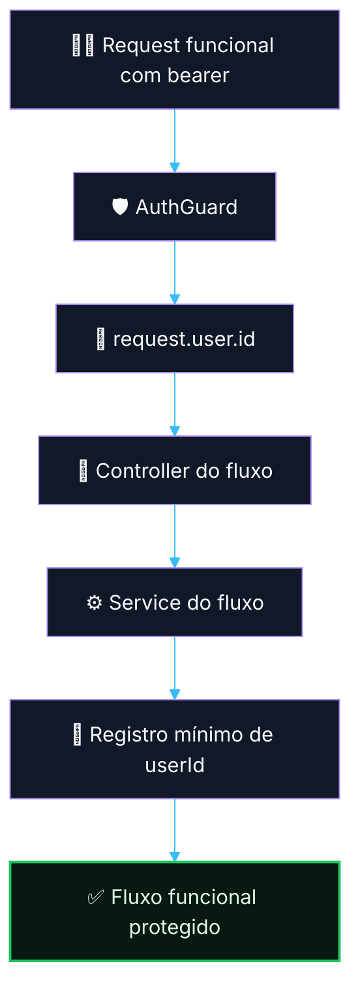

# 🔐 PR 07 — Fase 1: Propagação do Usuário Autenticado no Primeiro Fluxo Protegido
## Uso inicial do `request.user.id` para rastreabilidade e auditoria mínima na API de IA

---

<div align="left">


</div>

---

## Sumário

- [1. Síntese executiva](#1-síntese-executiva)
- [2. Contexto e objetivo](#2-contexto-e-objetivo)
- [3. Decisão arquitetural](#3-decisão-arquitetural)
- [4. Escopo e fora de escopo](#4-escopo-e-fora-de-escopo)
- [5. Estratégia técnica](#5-estratégia-técnica)
- [6. Estrutura técnica](#6-estrutura-técnica)
- [7. Fluxo do request autenticado](#7-fluxo-do-request-autenticado)
- [8. Responsabilidades por arquivo](#8-responsabilidades-por-arquivo)
- [9. Contratos mínimos](#9-contratos-mínimos)
- [10. Regras de simplicidade aplicadas](#10-regras-de-simplicidade-aplicadas)
- [11. Segurança e rastreabilidade](#11-segurança-e-rastreabilidade)
- [12. Critérios de aceite](#12-critérios-de-aceite)
- [13. Conclusão](#13-conclusão)

---

> [!IMPORTANT]
> Este PR não expande o slice de auth.
>
> Este PR consome a foundation já validada no PR 06 para:
>
> - aplicar `AuthGuard` ao primeiro endpoint funcional da aplicação;
> - propagar `request.user.id` para a camada de serviço;
> - registrar o `userId` como dado mínimo de rastreabilidade do fluxo;
> - validar, na prática, o uso do auth delegado fora da rota técnica de health.
>
> Este PR **não** implementa roles/scopes, decorators de usuário atual, request context genérico, cache de introspecção ou enriquecimento adicional de identidade.

---

## 1. Síntese executiva

O PR 06 estabeleceu a foundation mínima do auth delegado:

- bearer token recebido na borda HTTP;
- introspecção remota via `GET /api/v1/profile`;
- preservação do contrato externo relevante;
- validação local do `id`;
- anexação de `request.user.id`.

Este PR dá o próximo passo natural:

**usar essa identidade autenticada em um fluxo real da API de IA.**

### Resultado esperado

- o primeiro endpoint funcional passa a ser protegido por `AuthGuard`;
- o `userId` autenticado deixa de existir apenas em rota técnica;
- a camada de serviço recebe explicitamente o identificador do usuário autenticado;
- a aplicação passa a ter rastreabilidade mínima do ator que iniciou o fluxo;
- o recorte continua pequeno, direto e revisável.

```text
PR 06 autenticou.
PR 07 começa a usar a autenticação.
O userId autenticado entra no fluxo real.
A aplicação ganha rastreabilidade mínima.
Sem expandir auth além do necessário.
```

---

## 2. Contexto e objetivo

Após a foundation do auth delegado, o próximo ganho arquitetural não é sofisticar autenticação.
O próximo ganho é **colocar a autenticação para gerar valor real no fluxo da aplicação**.

Hoje já existe capacidade para resolver:

- quem é o usuário autenticado;
- se o token é válido;
- se a request deve ser bloqueada ou permitida.

O que ainda falta é:

- usar esse `userId` no primeiro caso real de uso;
- garantir rastreabilidade mínima do ator autenticado;
- provar que a borda HTTP autenticada já se conecta ao fluxo da aplicação.

### Objetivo deste PR

Estabelecer o primeiro uso concreto do `request.user.id` em um endpoint funcional da API de IA, preservando:

- simplicidade;
- recorte mínimo;
- controller fino;
- service direto;
- ausência de expansão prematura do auth.

---

## 3. Decisão arquitetural

### Decisão central

**Consumir o auth delegado já resolvido para propagar `userId` ao primeiro fluxo protegido da aplicação.**

### Regra implementada

```text
A borda HTTP continua autenticando via AuthGuard.
O controller recebe request.user.id.
O service recebe userId como dado explícito.
O fluxo passa a registrar o ator autenticado.
O auth não é expandido além do necessário.
```

> [!NOTE]
> Este PR não reabre discussão sobre contrato externo, introspecção, roles ou scopes.
>
> O foco aqui é validar o uso do auth já resolvido em um fluxo real e mínimo da aplicação.

---

## 4. Escopo e fora de escopo

### Escopo deste PR

- escolher o primeiro endpoint funcional protegido da aplicação;
- aplicar `AuthGuard` a esse endpoint;
- propagar `request.user.id` do controller para o service;
- registrar esse `userId` como dado mínimo de rastreabilidade do fluxo;
- manter controller fino e service simples;
- preservar o recorte mínimo e alinhado ao padrão do projeto.

### Fora de escopo neste PR

- roles/scopes;
- decorators customizados para current user;
- request context global;
- cache de introspecção;
- retry/circuit breaker do auth;
- enriquecimento adicional de `request.user`;
- observabilidade expandida do slice;
- qualquer reestruturação paralela no módulo de auth.

---

## 5. Estratégia técnica

A estratégia deste PR é simples:

1. manter a foundation do auth intacta;
2. escolher um único fluxo funcional para uso inicial;
3. proteger esse fluxo com `AuthGuard`;
4. receber o `userId` autenticado no controller;
5. repassar `userId` para o service como dado explícito;
6. registrar o ator autenticado no estado mínimo do fluxo.

### Princípio aplicado

```text
Não expandir auth.
Usar auth.
Não criar abstração nova.
Propagar userId de forma direta.
Não generalizar antes do segundo caso real.
```

---

## 6. Estrutura técnica

### Estrutura esperada do recorte

```text
src/
├── modules/
│   ├── auth/
│   │   └── ...
│   └── <primeiro-domínio>/
│       ├── infra/
│       │   ├── controllers/
│       │   │   └── <fluxo>.controller.ts
│       │   └── services/
│       │       └── <fluxo>.service.ts
│       ├── model/
│       │   └── ...
│       └── <fluxo>.module.ts
```

### Leitura da estrutura

- `AuthGuard` continua no módulo de auth;
- o domínio funcional consome apenas `request.user.id`;
- o controller delega ao service;
- o service recebe `userId` como argumento simples;
- o fluxo passa a ter rastreabilidade mínima sem inflar o desenho.

> [!TIP]
> O segundo uso real de identidade é o melhor momento para avaliar qualquer abstração adicional.
>
> Neste PR, a prioridade é manter tudo explícito, pequeno e revisável.

---

## 7. Fluxo do request autenticado



---

## 8. Responsabilidades por arquivo

### `src/modules/auth/...`

Continua responsável por:

- autenticar a request;
- resolver `request.user.id`;
- bloquear requests inválidas.

### `src/modules/<primeiro-domínio>/infra/controllers/<fluxo>.controller.ts`

Responsável por:

- receber a request protegida;
- ler `request.user.id`;
- delegar o fluxo ao service.

### `src/modules/<primeiro-domínio>/infra/services/<fluxo>.service.ts`

Responsável por:

- receber o `userId`;
- executar a regra mínima do fluxo;
- registrar o ator autenticado no estado mínimo do processo.

### `src/modules/<primeiro-domínio>/<fluxo>.module.ts`

Responsável por:

- compor controller e service do fluxo;
- importar o módulo necessário para uso de `AuthGuard`.

---

## 9. Contratos mínimos

Este PR não amplia o contrato de auth.

O único contrato adicional relevante do recorte é:

- o `userId` autenticado propagado como dado explícito do fluxo.

### Exemplo de forma esperada

```ts
type AuthenticatedUser = {
  id: number;
};

type CreateSomethingInput = {
  userId: number;
  // outros campos reais do fluxo
};
```

> [!IMPORTANT]
> O objetivo aqui não é criar um request context genérico nem uma abstração para identidade.
>
> O objetivo é propagar `userId` de forma simples e explícita no primeiro caso real.

---

## 10. Regras de simplicidade aplicadas

Este PR deve seguir as mesmas regras consolidadas no slice anterior:

- não criar decorators de current user;
- não criar helpers sem reuso real;
- não criar abstração para “contexto autenticado”;
- não introduzir camadas novas sem necessidade;
- manter controller fino;
- manter service simples;
- propagar `userId` como argumento explícito;
- evitar antecipação de extensões futuras.

### Regra de ouro do recorte

```text
Primeiro uso real.
Menor solução correta.
Sem generalização antes da hora.
```

---

## 11. Segurança e rastreabilidade

### Segurança preservada

- requests sem bearer continuam bloqueadas;
- requests com token inválido continuam bloqueadas;
- o fluxo funcional só executa após autenticação válida.

### Rastreabilidade mínima adicionada

- o `userId` autenticado passa a compor o estado do fluxo;
- a aplicação passa a saber quem iniciou a operação;
- o recorte já abre caminho para auditoria básica futura sem inflar a foundation.

---

## 12. Critérios de aceite

### Funcionais

- o primeiro endpoint funcional protegido deve exigir autenticação válida;
- o controller deve receber `request.user.id`;
- o service deve receber `userId` explicitamente;
- o fluxo deve registrar o ator autenticado no estado mínimo da operação;
- requests inválidas devem continuar bloqueadas pelo `AuthGuard`.

### Arquiteturais

- o PR não deve expandir o módulo de auth além do necessário;
- o fluxo deve consumir a foundation existente, não reimplementá-la;
- o código deve permanecer simples, direto e aderente ao padrão do projeto;
- não deve haver abstração prematura para identidade ou request context.

---

## 13. Conclusão

Este PR representa o próximo passo correto após a foundation do auth delegado:

**tirar o `userId` autenticado da rota técnica e colocá-lo no primeiro fluxo funcional real da aplicação.**

### Síntese final

O auth delegado continua simples.  
A autenticação já validada passa a ser usada de forma concreta.  
O `userId` autenticado entra no fluxo real.  
A aplicação ganha rastreabilidade mínima.  
Sem expandir auth além do que a fase atual precisa.
