# 🔐 PR 07 — Fase 1: Propagação do Usuário Autenticado
## Primeiro uso real da identidade autenticada no domínio

---

<div align="left">


</div>

---

> [!IMPORTANT]
> Este PR aplica a foundation da autenticação no primeiro fluxo funcional do domínio.
>
> - protege o endpoint funcional de `ingestion`
> - consome `request.user.id`
> - propaga `userId` explicitamente ao service
> - registra autoria mínima da operação
>
> **Este PR não expande auth, não cria abstrações transversais e não reabre decisões da PR 06.**

---

## 📚 Sumário

1. [Síntese Executiva](#1-síntese-executiva)
2. [Objetivo do PR](#2-objetivo-do-pr)
3. [Decisão Arquitetural](#3-decisão-arquitetural)
4. [Escopo](#4-escopo)
5. [Fora de Escopo](#5-fora-de-escopo)
6. [Fluxo Arquitetural](#6-fluxo-arquitetural)
7. [Contratos Mínimos](#7-contratos-mínimos)
8. [Regras de Implementação](#8-regras-de-implementação)
9. [Critérios de Review](#9-critérios-de-review)
10. [Critérios de Aceite](#10-critérios-de-aceite)
11. [Conclusão](#11-conclusão)

---

## 1. Síntese Executiva

A PR 06 consolidou a foundation mínima do auth delegado: validação do bearer token na borda, consulta da identidade administrativa na API principal e exposição local apenas de `request.user.id`.

Com essa base aprovada, o próximo passo correto não é expandir auth. O próximo passo é usar essa identidade em um fluxo real da aplicação. Esta PR faz isso no módulo de `ingestion`, que é o boundary onde a operação nasce e onde a autoria mínima precisa ser registrada.

---

## 2. Objetivo do PR

Este PR tem como objetivo aplicar a identidade autenticada no primeiro caso de uso funcional do domínio:

- proteger o endpoint inicial de `ingestion` com `AuthGuard`;
- ler `request.user.id` no controller;
- propagar `userId` explicitamente ao service;
- registrar `initiatedByUserId` na operação criada.

---

## 3. Decisão Arquitetural

A decisão central é manter a arquitetura aprovada na PR 06 e apenas atravessar a identidade autenticada para o primeiro boundary de domínio.

O controller continua sendo o ponto de adaptação HTTP. O service recebe somente o dado necessário para abrir a operação. O módulo de auth permanece isolado e não é reestruturado neste recorte.

> **PR 06 autentica a borda.  
> PR 07 faz a identidade autenticada entrar no primeiro fluxo real.**

---

## 4. Escopo

Este PR inclui somente:

- aplicação do `AuthGuard` no endpoint funcional de `ingestion`;
- leitura explícita de `request.user.id`;
- propagação de `userId` para o service;
- persistência mínima da autoria da operação.

---

## 5. Fora de Escopo

Este PR não inclui:

- mudanças estruturais no módulo `auth`;
- decorator `CurrentUser`;
- request context global;
- roles/scopes locais;
- enriquecimento do contrato interno de usuário;
- pipeline assíncrono completo;
- BullMQ;
- extraction, classification, quality ou publication;
- auditoria expandida;
- solução transversal para múltiplos módulos.

---

## 6. Fluxo Arquitetural

```mermaid
%%{init: {
  "theme": "base",
  "themeVariables": {
    "background": "#050b16",
    "primaryColor": "#0b1220",
    "primaryTextColor": "#ffffff",
    "primaryBorderColor": "#22d3ee",
    "lineColor": "#94a3b8",
    "secondaryColor": "#0b1220",
    "tertiaryColor": "#0b1220",
    "fontFamily": "Inter, Arial, sans-serif"
  },
  "flowchart": {
    "htmlLabels": true,
    "curve": "linear",
    "nodeSpacing": 48,
    "rankSpacing": 56
  }
}}%%
flowchart LR
    A["HTTP Request<br/>Authorization Bearer"] --> B["AuthGuard"]
    B --> C["request.user.id"]
    C --> D["IngestionController"]
    D --> E["IngestionService"]
    E --> F["Persistir<br/>initiatedByUserId"]

    classDef step1 fill:#0b1325,stroke:#3b82f6,stroke-width:2px,color:#ffffff;
    classDef step2 fill:#0a1a22,stroke:#22d3ee,stroke-width:2px,color:#ffffff;
    classDef step3 fill:#201d10,stroke:#eab308,stroke-width:2px,color:#ffffff;
    classDef step4 fill:#181629,stroke:#a78bfa,stroke-width:2px,color:#ffffff;
    classDef step5 fill:#25170f,stroke:#f97316,stroke-width:2px,color:#ffffff;
    classDef step6 fill:#112015,stroke:#84cc16,stroke-width:2px,color:#ffffff;

    class A step1;
    class B step2;
    class C step3;
    class D step4;
    class E step5;
    class F step6;

    linkStyle 0 stroke:#9ca3af,stroke-width:2px;
    linkStyle 1 stroke:#9ca3af,stroke-width:2px;
    linkStyle 2 stroke:#9ca3af,stroke-width:2px;
    linkStyle 3 stroke:#9ca3af,stroke-width:2px;
    linkStyle 4 stroke:#9ca3af,stroke-width:2px;
```



---

## 7. Contratos Mínimos

O contrato mínimo passa a carregar o identificador do usuário autenticado até a abertura da operação:

```ts
export type CreateIngestionInput = {
  userId: number;
  payload: unknown;
};
```

A persistência da operação deve refletir a autoria mínima:

```ts
export type IngestionRecord = {
  id: string;
  status: 'created';
  initiatedByUserId: number;
  payload: unknown;
  createdAt: Date;
  updatedAt: Date;
};
```

---

## 8. Regras de Implementação

O controller deve permanecer fino: aplicar o guard, ler `request.user.id` e delegar ao service. O service não deve conhecer a request HTTP, apenas receber `userId` e criar a operação com autoria mínima.

O módulo de auth permanece como foundation já aprovada. Este PR não deve criar abstrações adicionais, não deve preparar próximos passos e não deve transformar o primeiro uso real da identidade em uma solução genérica antecipada.

---

## 9. Critérios de Review

O review deve validar se:

- a continuidade com a PR 06 está clara;
- `ingestion` é usado como primeiro boundary funcional;
- `request.user.id` é consumido de forma mínima;
- o controller não concentra regra de domínio;
- o service não depende da request HTTP;
- a persistência de `initiatedByUserId` está objetiva;
- não houve expansão indevida do auth;
- não há abstração prematura ou granularidade desnecessária.

---

## 10. Critérios de Aceite

- [ ] O endpoint de `ingestion` está protegido por `AuthGuard`.
- [ ] `request.user.id` está acessível no controller.
- [ ] `userId` é propagado explicitamente ao service.
- [ ] A operação criada registra `initiatedByUserId`.
- [ ] O service não recebe a request HTTP.
- [ ] O módulo de auth não foi expandido.
- [ ] O recorte permanece pequeno, funcional e revisável.

---

## 11. Conclusão

A PR 07 é a continuação direta da PR 06. Ela não sofistica a foundation de auth nem reabre arquitetura já aprovada; apenas valida o primeiro uso real da identidade autenticada no domínio.

O ganho é pequeno e objetivo: a operação de `ingestion` passa a nascer associada ao usuário que a iniciou, mantendo simplicidade, baixo acoplamento e clareza de review.
