# 🔐 PR 07 — Fase 1: Propagação do Usuário Autenticado
## Primeiro uso real da identidade autenticada no domínio

---

<div align="left">


</div>

---

> [!IMPORTANT]
> Este PR **não evolui o módulo de auth**.
>
> Ele apenas aplica a foundation da **PR 06** no primeiro caso de uso real:
>
> - proteger o primeiro endpoint funcional de `ingestion`
> - consumir `request.user.id`
> - propagar `userId` explicitamente até a camada de serviço
> - registrar **quem iniciou a operação**
>
> O objetivo é validar o primeiro uso real da identidade autenticada **sem abstração prematura**.

---

## 1. Sumário

- [1. Sumário](#1-sumário)
- [2. Síntese Executiva](#2-síntese-executiva)
- [3. Decisão Arquitetural](#3-decisão-arquitetural)
- [4. Por que `ingestion` agora?](#4-por-que-ingestion-agora)
- [5. Escopo](#5-escopo)
- [6. Fora de Escopo](#6-fora-de-escopo)
- [7. Fluxo Arquitetural](#7-fluxo-arquitetural)
- [8. Estrutura Proposta do PR](#8-estrutura-proposta-do-pr)
- [9. Boundary e Propagação](#9-boundary-e-propagação)
- [10. Regras de Implementação](#10-regras-de-implementação)
- [11. Critérios de Review](#11-critérios-de-review)
- [12. Critérios de Aceite](#12-critérios-de-aceite)
- [13. Conclusão](#13-conclusão)

---

## 2. Síntese Executiva

A **PR 06** resolveu a foundation mínima do auth delegado:

- receber `Authorization: Bearer <token>`
- consultar a identidade administrativa na API principal
- validar o usuário autenticado
- expor localmente apenas `request.user.id`

Com essa foundation pronta, o próximo passo correto não é expandir auth.

O próximo passo correto é **usar essa identidade em um fluxo real da aplicação**.

Este PR propõe exatamente isso:

- aplicar `AuthGuard` no primeiro endpoint funcional de `ingestion`
- ler `request.user.id` no controller
- propagar `userId` explicitamente ao service
- persistir **quem iniciou a operação**

---

## 3. Decisão Arquitetural

A decisão deste PR é simples:

> **PR 06 autentica a borda.  
> PR 07 faz a identidade autenticada atravessar o primeiro boundary de domínio.**

A intenção aqui não é criar uma solução transversal de identidade.

A intenção é validar o primeiro uso real da foundation já entregue.

### Princípio aplicado

- **usar antes de abstrair**
- **validar antes de generalizar**
- **persistir o mínimo necessário**
- **não sofisticar antes do segundo caso real**

---

## 4. Por que `ingestion` agora?

`Ingestion` é o melhor módulo para iniciar essa propagação porque ele representa o **ponto de entrada operacional do pipeline**.

É nesse boundary que a aplicação:

- recebe uma requisição autenticada
- abre uma operação
- associa essa operação a quem a iniciou

Portanto, `ingestion` é o lugar mais natural para introduzir o primeiro uso real de `request.user.id`.

### O que isso valida

- que a identidade autenticada resolvida na borda é útil no domínio
- que o pipeline nasce com autoria mínima registrada
- que a propagação de identidade pode acontecer sem request context global
- que o service pode receber apenas `userId`, sem acoplamento ao request

### Por que não outro módulo?

| Módulo | Motivo para não iniciar por ele |
|---|---|
| `processing` | já pressupõe uma operação iniciada |
| `extraction` | já é etapa interna |
| `classification` | não é boundary de entrada |
| `publication` | ocorre depois no fluxo |
| `auth` | já foi tratado na PR 06 |

**Conclusão:**  
Se a intenção é validar o primeiro uso real da identidade autenticada, `ingestion` é o boundary correto.

---

## 5. Escopo

Este PR inclui:

- proteção do primeiro endpoint funcional de `ingestion` com `AuthGuard`
- leitura de `request.user.id` no controller
- propagação explícita de `userId` ao service
- persistência mínima da autoria da abertura da operação

---

## 6. Fora de Escopo

Este PR **não** inclui:

- mudanças estruturais no módulo `auth`
- `CurrentUser` decorator
- request context global
- abstração genérica de propagation de identidade
- roles/scopes locais
- enriquecimento de `request.user`
- expansão do contrato interno de usuário
- pipeline completo
- BullMQ
- processing assíncrono
- extraction
- classification
- quality
- publication
- audit completo
- solução transversal entre múltiplos módulos

> [!NOTE]
> A regra aqui é objetiva:
>
> **não generalizar antes do segundo caso real.**

---

## 7. Fluxo Arquitetural

```mermaid
%%{init: {
  "theme": "base",
  "themeVariables": {
    "background": "#0b1220",
    "primaryColor": "#111827",
    "primaryTextColor": "#e5f7ff",
    "primaryBorderColor": "#22d3ee",
    "lineColor": "#38bdf8",
    "secondaryColor": "#0f172a",
    "tertiaryColor": "#111827",
    "fontFamily": "Inter, Segoe UI, Arial",
    "clusterBkg": "#0f172a",
    "clusterBorder": "#22d3ee",
    "nodeBorder": "#22d3ee",
    "mainBkg": "#111827"
  }
}}%%

flowchart LR
    A[HTTP Request<br/>Authorization Bearer] --> B[AuthGuard]
    B --> C[request.user.id]
    C --> D[IngestionController]
    D --> E[IngestionService]
    E --> F[Create Operation]
    F --> G[Persist initiatedByUserId]

    classDef cyan fill:#0f172a,stroke:#22d3ee,color:#e0f7ff,stroke-width:1.5px;
    classDef violet fill:#111827,stroke:#a78bfa,color:#f3e8ff,stroke-width:1.5px;
    classDef green fill:#052e16,stroke:#22c55e,color:#dcfce7,stroke-width:1.5px;

    class A,B,C,D cyan;
    class E,F violet;
    class G green;
```



---

## 8. Estrutura Proposta do PR

> [!IMPORTANT]
> A árvore abaixo mostra **apenas o recorte novo da PR 07**.
>
> O módulo `auth` já foi descrito e consolidado na **PR 06**, então não é repetido aqui.

```text
src/
└── modules/
    └── ingestion/
        ├── ingestion.module.ts
        ├── infra/
        │   ├── controllers/
        │   │   └── ingestion.controller.ts
        │   └── services/
        │       └── ingestion.service.ts
        └── model/
            └── ingestion.types.ts
```

---

## 9. Boundary e Propagação

### Controller

O controller recebe a request já autenticada e usa apenas o dado necessário:

```ts
request.user.id
```

### Propagação proposta

```ts
@Post()
@UseGuards(AuthGuard)
create(@Req() request: Request) {
  return this.ingestionService.create({
    userId: request.user.id,
  });
}
```

### Service

O service não deve conhecer a request HTTP.

Ele deve receber apenas o dado necessário:

```ts
create(input: { userId: number }) {
  // create operation with initiatedByUserId
}
```

### Estado mínimo esperado

```ts
{
  id: string;
  status: 'created';
  initiatedByUserId: number;
  createdAt: Date;
}
```

> [!IMPORTANT]
> Este PR não tenta modelar o fluxo completo.
>
> Ele só garante que a identidade autenticada entre corretamente no domínio.

---

## 10. Regras de Implementação

### Controller

- deve permanecer fino
- lê `request.user.id`
- delega ao service
- não concentra regra de domínio

### Service

- recebe `userId` explicitamente
- inicia a operação
- registra autoria mínima

### Auth

- permanece isolado no módulo de auth
- não deve ser reestruturado neste PR
- não deve ser expandido para roles/scopes/decorators

### Princípios

- simplicidade
- clareza
- baixo acoplamento
- sem abstração prematura
- implementação pequena e revisável

---

## 11. Critérios de Review

O review deste PR deve validar se:

- a continuidade com a PR 06 está clara
- a escolha de `ingestion` como primeiro boundary faz sentido
- `request.user.id` está sendo usado de forma mínima e correta
- o controller continua fino
- o service recebe `userId` explicitamente
- a persistência mínima de autoria está correta
- não houve expansão indevida de escopo
- não surgiram abstrações novas sem segundo caso real

---

## 12. Critérios de Aceite

Este PR pode ser considerado aceito se:

- [ ] o endpoint de `ingestion` estiver protegido por `AuthGuard`
- [ ] `request.user.id` estiver acessível no controller
- [ ] `userId` for propagado explicitamente ao service
- [ ] a operação criada registrar `initiatedByUserId`
- [ ] não houver abstração prematura
- [ ] não houver expansão indevida do auth
- [ ] o recorte permanecer pequeno, funcional e revisável

---

## 13. Conclusão

Este PR é a continuação direta da PR 06.

Ele não tenta sofisticar a foundation.

Ele apenas valida o primeiro uso real da identidade autenticada no domínio.

A escolha de `ingestion` é intencional porque ele é:

- o ponto de entrada do pipeline
- o lugar onde a operação nasce
- o boundary mais natural para registrar autoria mínima

Em resumo:

> **PR 06 autenticou a borda.  
> PR 07 começa a conectar essa identidade ao fluxo real da aplicação.**
