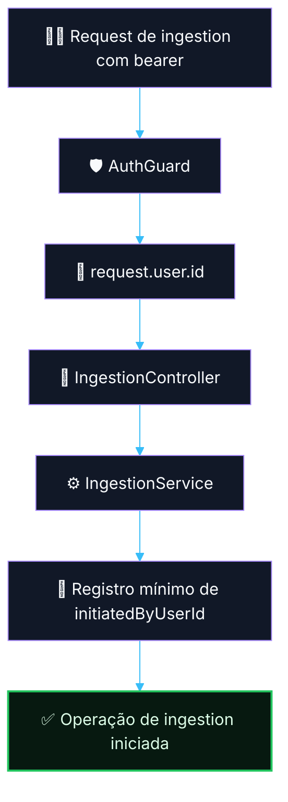

# 🔐 PR 07 — Fase 1: Propagação do Usuário Autenticado no Módulo de Ingestion
## Uso inicial do `request.user.id` no primeiro fluxo real da API de IA

---

<div align="left">


</div>

---

## Sumário

- [1. Síntese executiva](#1-síntese-executiva)
- [2. Por que o módulo de ingestion](#2-por-que-o-módulo-de-ingestion)
- [3. Contexto e objetivo](#3-contexto-e-objetivo)
- [4. Decisão arquitetural](#4-decisão-arquitetural)
- [5. Escopo e fora de escopo](#5-escopo-e-fora-de-escopo)
- [6. Estratégia técnica](#6-estratégia-técnica)
- [7. Estrutura técnica](#7-estrutura-técnica)
- [8. Fluxo do request autenticado em ingestion](#8-fluxo-do-request-autenticado-em-ingestion)
- [9. Responsabilidades por arquivo](#9-responsabilidades-por-arquivo)
- [10. Contratos mínimos](#10-contratos-mínimos)
- [11. Regras de simplicidade aplicadas](#11-regras-de-simplicidade-aplicadas)
- [12. Segurança e rastreabilidade](#12-segurança-e-rastreabilidade)
- [13. Critérios de aceite](#13-critérios-de-aceite)
- [14. Conclusão](#14-conclusão)

---

> [!IMPORTANT]
> Este PR não expande o slice de auth.
>
> Este PR consome a foundation já validada no PR 06 para:
>
> - aplicar `AuthGuard` ao primeiro endpoint funcional real da aplicação;
> - propagar `request.user.id` para o módulo de `ingestion`;
> - registrar o `userId` como dado mínimo de rastreabilidade do início do fluxo;
> - validar, na prática, o uso do auth delegado fora da rota técnica de health.
>
> Este PR **não** implementa roles/scopes, decorators de usuário atual, request context genérico, cache de introspecção ou enriquecimento adicional de identidade.

---

## 1. Síntese executiva

O PR 06 estabeleceu a foundation mínima do auth delegado:

- bearer token recebido na borda HTTP;
- introspecção remota via `GET /api/v1/profile`;
- preservação do contrato externo relevante;
- validação local do `id`;
- anexação de `request.user.id`.

O próximo passo natural não é sofisticar auth.

O próximo passo é **usar essa identidade autenticada no primeiro fluxo real da aplicação**.

O módulo escolhido para esse recorte é `ingestion`, porque ele representa o ponto inicial do pipeline: a entrada de uma nova operação na plataforma. É o lugar mais natural para começar a propagar o ator autenticado de forma explícita e auditável.

### Resultado esperado

- o primeiro endpoint funcional do módulo de `ingestion` passa a ser protegido por `AuthGuard`;
- o `userId` autenticado deixa de existir apenas em rota técnica;
- a camada de serviço recebe explicitamente o identificador do usuário autenticado;
- o início do fluxo passa a registrar quem solicitou a operação;
- o recorte continua pequeno, direto e revisável.

```text
PR 06 autenticou.
PR 07 começa a usar a autenticação.
O userId autenticado entra em ingestion.
O início do fluxo ganha rastreabilidade mínima.
Sem expandir auth além do necessário.
```

---

## 2. Por que o módulo de ingestion

O módulo de `ingestion` é o melhor ponto para essa propagação inicial por quatro motivos:

### 2.1 É o início natural do fluxo

`ingestion` representa a entrada do material/processo que será tratado pela plataforma. É o primeiro lugar onde faz sentido registrar quem iniciou a operação.

### 2.2 Gera valor imediato de rastreabilidade

Assim que um request autenticado cria ou inicia uma operação de ingestion, o sistema já passa a saber:

- quem iniciou;
- quando iniciou;
- qual operação foi aberta.

Isso gera valor concreto sem precisar expandir o módulo de auth.

### 2.3 Evita abstração prematura

Propagar `userId` em `ingestion` permite validar o uso real da identity foundation sem criar:

- request context global;
- decorator de current user;
- estrutura genérica para todos os módulos;
- solução preparada para múltiplos cenários ainda inexistentes.

### 2.4 Está alinhado com a arquitetura do projeto IA

Pelo desenho macro já consolidado, `ingestion` é um dos primeiros módulos do pipeline e um candidato natural para iniciar rastreabilidade do ator autenticado.

> [!NOTE]
> O objetivo deste PR não é fechar todo o pipeline de ingestion.
>
> O objetivo é apenas fazer o primeiro uso real do `userId` autenticado dentro de um domínio funcional da aplicação.

---

## 3. Contexto e objetivo

Após a foundation do auth delegado, o próximo ganho arquitetural não é adicionar mais capacidade ao auth.
O próximo ganho é **colocar o auth para gerar valor real no fluxo da aplicação**.

Hoje já existe capacidade para resolver:

- quem é o usuário autenticado;
- se o token é válido;
- se a request deve ser bloqueada ou permitida.

O que ainda falta é:

- usar esse `userId` em um caso real de uso;
- garantir rastreabilidade mínima do ator autenticado;
- provar que a borda HTTP autenticada já se conecta ao fluxo da aplicação.

### Objetivo deste PR

Estabelecer o primeiro uso concreto do `request.user.id` no módulo de `ingestion`, preservando:

- simplicidade;
- recorte mínimo;
- controller fino;
- service direto;
- ausência de expansão prematura do auth.

---

## 4. Decisão arquitetural

### Decisão central

**Consumir o auth delegado já resolvido para propagar `userId` ao primeiro fluxo protegido do módulo de ingestion.**

### Regra implementada

```text
A borda HTTP continua autenticando via AuthGuard.
O controller de ingestion recebe request.user.id.
O service de ingestion recebe userId como dado explícito.
O fluxo registra o ator autenticado na abertura da operação.
O auth não é expandido além do necessário.
```

> [!IMPORTANT]
> Este PR não reabre discussão sobre contrato externo, introspecção, roles ou scopes.
>
> O foco aqui é validar o uso do auth já resolvido em um fluxo real, pequeno e auditável de `ingestion`.

---

## 5. Escopo e fora de escopo

### Escopo deste PR

- criar ou proteger o primeiro endpoint funcional de `ingestion`;
- aplicar `AuthGuard` a esse endpoint;
- ler `request.user.id` no controller;
- propagar `userId` do controller para o service;
- persistir ou registrar esse `userId` no estado mínimo da operação de ingestion;
- manter controller fino e service simples;
- preservar o recorte mínimo e aderente ao padrão do projeto.

### Fora de escopo neste PR

- fechar o pipeline completo de ingestion;
- orquestração assíncrona completa;
- jobs, filas ou BullMQ;
- processing, extraction, classification ou publication;
- roles/scopes;
- decorators customizados para current user;
- request context global;
- cache de introspecção;
- observabilidade expandida do slice;
- qualquer reestruturação paralela no módulo de auth.

---

## 6. Estratégia técnica

A estratégia do recorte é simples:

1. manter a foundation do auth intacta;
2. introduzir o primeiro endpoint real de `ingestion`;
3. proteger esse endpoint com `AuthGuard`;
4. receber `userId` autenticado no controller;
5. repassar `userId` ao service como dado explícito;
6. registrar o ator autenticado no estado mínimo da operação.

### Forma esperada do fluxo

- request autenticada entra na API;
- `AuthGuard` resolve `request.user.id`;
- controller de `ingestion` recebe payload + `userId`;
- service de `ingestion` cria/inicia a operação;
- o estado mínimo registra quem iniciou a operação.

### Princípio aplicado

```text
Não expandir auth.
Usar auth.
Não criar abstração nova.
Propagar userId de forma direta.
Não generalizar antes do segundo caso real.
```

---

## 7. Estrutura técnica

### Estrutura esperada do recorte

```text
src/
├── modules/
│   ├── auth/
│   │   └── ...
│   └── ingestion/
│       ├── infra/
│       │   ├── controllers/
│       │   │   └── ingestion.controller.ts
│       │   └── services/
│       │       └── ingestion.service.ts
│       ├── model/
│       │   └── ...
│       └── ingestion.module.ts
```

### Leitura da estrutura

- `AuthGuard` continua no módulo de auth;
- `ingestion` consome apenas `request.user.id`;
- o controller delega ao service;
- o service recebe `userId` como argumento simples;
- o fluxo passa a ter rastreabilidade mínima sem inflar o desenho.

> [!TIP]
> O segundo uso real de identidade é o melhor momento para avaliar qualquer abstração adicional.
>
> Neste PR, a prioridade é manter tudo explícito, pequeno e revisável.

---

## 8. Fluxo do request autenticado em ingestion



---

## 9. Responsabilidades por arquivo

### `src/modules/auth/...`

Continua responsável por:

- autenticar a request;
- resolver `request.user.id`;
- bloquear requests inválidas.

### `src/modules/ingestion/infra/controllers/ingestion.controller.ts`

Responsável por:

- receber a request protegida;
- ler `request.user.id`;
- delegar o fluxo ao service.

### `src/modules/ingestion/infra/services/ingestion.service.ts`

Responsável por:

- receber o `userId`;
- executar a regra mínima de abertura da operação;
- registrar o ator autenticado no estado mínimo do fluxo.

### `src/modules/ingestion/ingestion.module.ts`

Responsável por:

- compor controller e service de ingestion;
- importar o módulo necessário para uso de `AuthGuard`.

---

## 10. Contratos mínimos

Este PR não amplia o contrato de auth.

O único contrato adicional relevante do recorte é o input mínimo de `ingestion` com propagação explícita de `userId`.

### Exemplo de forma esperada

```ts
export type CreateIngestionInput = {
  userId: number;
  // demais campos mínimos reais do fluxo
};
```

### Exemplo de estado mínimo esperado

```ts
export type IngestionRecord = {
  id: string;
  initiatedByUserId: number;
  // demais campos mínimos reais do fluxo
};
```

> [!IMPORTANT]
> O objetivo aqui não é criar um request context genérico nem uma abstração para identidade.
>
> O objetivo é propagar `userId` de forma simples e explícita no primeiro caso real do pipeline.

---

## 11. Regras de simplicidade aplicadas

Este PR deve seguir as mesmas regras consolidadas no slice anterior:

- não criar decorators de current user;
- não criar helpers sem reuso real;
- não criar abstração para “contexto autenticado”;
- não introduzir camadas novas sem necessidade;
- manter controller fino;
- manter service simples;
- propagar `userId` como argumento explícito;
- evitar antecipação de extensões futuras.

### Regra de ouro do recorte

```text
Primeiro uso real.
Menor solução correta.
Sem generalização antes da hora.
```

---

## 12. Segurança e rastreabilidade

### Segurança preservada

- requests sem bearer continuam bloqueadas;
- requests com token inválido continuam bloqueadas;
- o fluxo funcional só executa após autenticação válida.

### Rastreabilidade mínima adicionada

- o `userId` autenticado passa a compor o estado da operação de ingestion;
- a aplicação passa a saber quem iniciou a operação;
- o recorte já abre caminho para auditoria básica futura sem inflar a foundation.

---

## 13. Critérios de aceite

### Funcionais

- o primeiro endpoint de `ingestion` deve exigir autenticação válida;
- o controller deve receber `request.user.id`;
- o service deve receber `userId` explicitamente;
- o fluxo deve registrar o ator autenticado no estado mínimo da operação;
- requests inválidas devem continuar bloqueadas pelo `AuthGuard`.

### Arquiteturais

- o PR não deve expandir o módulo de auth além do necessário;
- `ingestion` deve consumir a foundation existente, não reimplementá-la;
- o código deve permanecer simples, direto e aderente ao padrão do projeto;
- não deve haver abstração prematura para identidade ou request context.

---

## 14. Conclusão

Este PR representa o próximo passo correto após a foundation do auth delegado:

**tirar o `userId` autenticado da rota técnica e colocá-lo no primeiro fluxo funcional real da aplicação, começando pelo módulo de ingestion.**

### Síntese final

O auth delegado continua simples.  
A autenticação já validada passa a ser usada de forma concreta.  
O `userId` autenticado entra em ingestion.  
A aplicação ganha rastreabilidade mínima desde o início do fluxo.  
Sem expandir auth além do que a fase atual precisa.
