# 🔌 PR 09 — Fase 1: Foundation de Redis e Persistência Inicial de Ingestion
## Primeiro recorte de infraestrutura compartilhada para estado operacional real da aplicação

---

<div align="left">


</div>

---

> [!IMPORTANT]
> Esta PR é continuação direta das **PRs 06, 07 e 08** e introduz apenas o próximo passo funcional mínimo da infraestrutura compartilhada da aplicação:
>
> - estruturar o acesso ao **Redis**
> - consolidar o acesso ao **banco operacional**
> - persistir o primeiro estado real da operação de `ingestion`
>
> O foco desta PR é **infraestrutura mínima compartilhada + persistência operacional inicial**, sem inflar o recorte.

---

## 📚 Sumário

1. [Síntese Executiva](#1-síntese-executiva)
2. [Objetivo do PR](#2-objetivo-do-pr)
3. [Decisão Arquitetural](#3-decisão-arquitetural)
4. [Escopo](#4-escopo)
5. [Fora de Escopo](#5-fora-de-escopo)
6. [Fluxo Arquitetural](#6-fluxo-arquitetural)
7. [Estrutura Envolvida](#7-estrutura-envolvida)
8. [Foundation Compartilhada Proposta](#8-foundation-compartilhada-proposta)
9. [Persistência Inicial de Ingestion](#9-persistência-inicial-de-ingestion)
10. [Contratos Mínimos](#10-contratos-mínimos)
11. [Regras de Implementação](#11-regras-de-implementação)
12. [Critérios de Review](#12-critérios-de-review)
13. [Critérios de Aceite](#13-critérios-de-aceite)
14. [Conclusão](#14-conclusão)

---

## 1. Síntese Executiva

A progressão da Fase 1 até aqui foi:

- **PR 06** → foundation mínima de autenticação delegada
- **PR 07** → propagação do usuário autenticado até `ingestion`
- **PR 08** → persistência inicial mínima da operação

A **PR 09** continua esse fluxo sem reprojetar a aplicação.

O objetivo agora é consolidar o primeiro recorte de infraestrutura compartilhada necessário para sustentar estado operacional real com clareza estrutural e baixo acoplamento:

- foundation mínima de **Redis**
- foundation mínima de **database access**
- persistência real da operação inicial de `ingestion` sobre um ponto compartilhado mais explícito

Esta PR **não resolve o pipeline completo**.

Ela resolve o próximo passo correto: fazer a aplicação ter infraestrutura compartilhada mínima, explícita e reutilizável para o estado operacional inicial da fase.

---

## 2. Objetivo do PR

Introduzir a foundation mínima de infraestrutura compartilhada necessária para sustentar o primeiro estado operacional real da aplicação.

### Em termos práticos

Esta PR deve permitir:

- centralizar o acesso ao **Redis**
- consolidar o acesso ao **banco operacional**
- manter a persistência real da operação inicial de `ingestion`
- preservar `initiatedByUserId` como metadado operacional explícito

### Resultado esperado

Ao final desta PR, a aplicação deve ser capaz de:

- subir com a foundation mínima de Redis estruturada
- acessar o banco operacional por meio de um ponto compartilhado claro
- persistir a operação inicial de `ingestion` com estado mínimo consistente
- manter rastreabilidade operacional básica da abertura da operação

---

## 3. Decisão Arquitetural

A decisão central desta PR é:

> **conectar e consolidar antes de orquestrar.**

Isso significa:

- estruturar primeiro a base mínima de conectividade compartilhada
- consolidar o acesso às dependências operacionais reais
- manter a persistência inicial simples, explícita e rastreável
- não antecipar fila, jobs, steps, coordenação distribuída ou pipeline completo

### Princípios aplicados

- **persistir antes de sofisticar**
- **infra mínima antes de comportamento avançado**
- **sem fundação paralela**
- **sem overengineering**
- **sem implementar a próxima fase antes da hora**

---

## 4. Escopo

Esta PR inclui:

- foundation mínima de **Redis**
- foundation mínima de **database access**
- consolidação da persistência operacional mínima de `ingestion`
- manutenção explícita de `initiatedByUserId`
- alinhamento da abertura da operação ao ponto compartilhado de infraestrutura

### Em termos de implementação

Espera-se que esta PR cubra:

- configuração centralizada de Redis no `environment.ts`
- módulo e service mínimo de Redis em `shared/infra`
- consolidação do acesso ao banco em `shared/infra/database`
- persistência inicial real da operação de `ingestion`
- preservação do contrato mínimo já estabelecido nas PRs anteriores

---

## 5. Fora de Escopo

Esta PR **não** inclui:

- BullMQ
- filas
- jobs
- retries
- DLQ
- processing
- extraction
- classification
- publication
- reprocessamento
- repository pattern genérico
- abstração de storage
- múltiplas tabelas de pipeline, step ou orchestration
- state machine
- observabilidade expandida
- health checks avançados
- expansão estrutural de comportamento ainda não usado

> [!NOTE]
> A regra permanece a mesma:
>
> **não implementar a próxima fase dentro da fase atual.**

---

## 6. Fluxo Arquitetural

```mermaid
%%{init: {
  "theme": "base",
  "themeVariables": {
    "background": "#0b1020",
    "primaryColor": "#111827",
    "primaryTextColor": "#e5f0ff",
    "primaryBorderColor": "#22d3ee",
    "lineColor": "#38bdf8",
    "secondaryColor": "#0f172a",
    "tertiaryColor": "#111827",
    "fontFamily": "Inter, Segoe UI, Arial",
    "clusterBkg": "#0f172a",
    "clusterBorder": "#334155"
  }
}}%%
flowchart LR
    A[HTTP Request]:::http --> B[AuthGuard]:::auth
    B --> C[request.user.id]:::auth
    C --> D[IngestionController]:::controller
    D --> E[IngestionService]:::service
    E --> F[Create Initial Operation State]:::domain
    F --> G[Persist Ingestion Record]:::database
    E -. foundation available .-> H[Redis Module / Redis Service]:::redis

    classDef http fill:#111827,stroke:#38bdf8,color:#e0f2fe,stroke-width:2px;
    classDef auth fill:#111827,stroke:#a78bfa,color:#f5f3ff,stroke-width:2px;
    classDef controller fill:#0b1220,stroke:#38bdf8,color:#e0f2fe,stroke-width:2px;
    classDef service fill:#111827,stroke:#22c55e,color:#ecfdf5,stroke-width:2px;
    classDef domain fill:#1e1b4b,stroke:#8b5cf6,color:#ede9fe,stroke-width:2px;
    classDef database fill:#052e16,stroke:#22c55e,color:#f0fdf4,stroke-width:2px;
    classDef redis fill:#451a03,stroke:#f59e0b,color:#fff7ed,stroke-width:2px;
```



> [!IMPORTANT]
> Neste recorte, o Redis entra como **foundation mínima de infraestrutura compartilhada**.
>
> Ele **não precisa participar ainda do comportamento funcional de ingestion** além da disponibilização da base de conectividade para os próximos slices.

---

## 7. Estrutura Envolvida

A evolução desta PR preserva a estrutura já consolidada de `ingestion` e adiciona apenas a foundation compartilhada necessária em `shared/infra`.

```text
src/
├── modules/
│   └── ingestion/
│       ├── ingestion.module.ts
│       ├── infra/
│       │   ├── controllers/
│       │   │   └── ingestion.controller.ts
│       │   └── services/
│       │       └── ingestion.service.ts
│       └── model/
│           └── v1/
│               └── ingestion.contracts.ts
└── shared/
    ├── config/
    │   └── environment.ts
    └── infra/
        ├── database/
        │   ├── index.ts
        │   └── generated/
        └── redis/
            ├── redis.module.ts
            └── redis.service.ts
```

### Regra importante

Esta PR **não reprojeta** o módulo de `ingestion`.

Ela apenas evolui o próximo passo funcional mínimo a partir da estrutura já existente.

---

## 8. Foundation Compartilhada Proposta

A infraestrutura compartilhada deste recorte deve continuar pequena, explícita e aderente ao padrão do projeto.

### `shared/config/environment.ts`

Responsável por centralizar as variáveis de ambiente necessárias para:

- Redis
- banco operacional
- acessos mínimos previstos para a Fase 1

### `shared/infra/database`

Responsável por:

- concentrar a conexão com o banco operacional
- expor o client aderente ao padrão do projeto
- servir como ponto único de acesso para a persistência operacional mínima

### `shared/infra/redis`

Responsável por:

- centralizar o acesso ao Redis
- expor module/service mínimo
- evitar múltiplos pontos soltos de conexão ao longo da aplicação

> [!TIP]
> O objetivo aqui não é criar uma camada genérica de infraestrutura, e sim um ponto compartilhado simples e claro para dependências operacionais reais.

---

## 9. Persistência Inicial de Ingestion

A persistência desta PR representa a abertura mínima de uma operação real de `ingestion`.

### Tabela proposta

## `ingestions`

### Campos mínimos

| Campo | Tipo | Objetivo |
|---|---|---|
| `id` | UUID / string | Identificador da operação |
| `status` | string | Estado inicial da operação |
| `initiated_by_user_id` | integer | Usuário que iniciou a operação |
| `payload` | JSON / JSONB | Payload bruto recebido |
| `created_at` | timestamp | Momento de criação |
| `updated_at` | timestamp | Momento da última atualização |

### Intenção da modelagem

A tabela existe para resolver **somente** o primeiro estado operacional real do fluxo.

Ela não tenta modelar ainda:

- pipeline
- jobs
- steps
- retry
- publicação
- histórico rico de eventos

### Shape equivalente no domínio

```ts
export type IngestionRecord = {
  id: string;
  status: 'created';
  initiatedByUserId: number;
  payload: unknown;
  createdAt: Date;
  updatedAt: Date;
};
```

> [!IMPORTANT]
> A proposta é intencionalmente pequena:
>
> **uma tabela mínima primeiro, antes de qualquer modelagem mais ambiciosa do pipeline.**

---

## 10. Contratos Mínimos

Os contratos de domínio permanecem mínimos e alinhados ao recorte já validado.

```ts
export type CreateIngestionInput = {
  userId: number;
  payload: unknown;
};

export type IngestionRecord = {
  id: string;
  status: 'created';
  initiatedByUserId: number;
  payload: unknown;
  createdAt: Date;
  updatedAt: Date;
};
```

### Regra importante

Esta PR não deve inventar contratos de negócio novos além do que o recorte exige.

Contratos de infraestrutura só devem existir quando forem realmente necessários para:

- configuração
- conexão
- consumo interno

---

## 11. Regras de Implementação

### Redis

A implementação de Redis deve ser:

- simples
- explícita
- centralizada
- sem wrapper desnecessário
- sem abstração genérica de cache

### Database

O acesso ao banco deve:

- reaproveitar o padrão já existente em `shared/infra/database`
- evitar reestruturação desnecessária
- permanecer fácil de entender e consumir

### Ingestion

O `IngestionService` deve:

- continuar simples
- continuar recebendo dados explícitos
- persistir o estado inicial da operação
- não absorver infraestrutura futura desnecessária

### Configuração

A configuração deve:

- permanecer centralizada no `environment.ts`
- seguir o padrão já adotado com Zod
- não espalhar leitura de `process.env`

---

## 12. Critérios de Review

O review desta PR deve validar se:

- a PR 09 é continuação natural das PRs 06, 07 e 08
- Redis foi introduzido sem overengineering
- o acesso ao banco foi estruturado sem fundação paralela
- a tabela `ingestions` está pequena e adequada ao recorte
- o `IngestionService` continua simples
- o recorte permaneceu pequeno, revisável e coerente
- a foundation compartilhada realmente melhora clareza estrutural sem inflar a solução

---

## 13. Critérios de Aceite

Esta PR pode ser considerada aceita se:

- [ ] existir foundation mínima de Redis no padrão do projeto
- [ ] existir foundation mínima de database access no padrão do projeto
- [ ] a configuração necessária estiver centralizada no `environment.ts`
- [ ] existir a tabela mínima `ingestions`
- [ ] a operação inicial de `ingestion` puder ser persistida de forma real
- [ ] `initiatedByUserId` for preservado corretamente
- [ ] não houver abstração desnecessária de infraestrutura
- [ ] o recorte permanecer pequeno, funcional e revisável

---

## 14. Conclusão

A PR 09 não tenta resolver o pipeline completo.

Ela introduz o próximo passo correto da Fase 1:

> **consolidar a foundation mínima de Redis, database access e persistência operacional inicial para sustentar os próximos slices com uma base compartilhada explícita e enxuta.**

Em resumo:

- **PR 06** consolidou a borda autenticada
- **PR 07** propagou a identidade até o domínio
- **PR 08** materializou a persistência inicial mínima
- **PR 09** consolida a foundation compartilhada de Redis, database access e persistência operacional inicial

Esta PR abre, portanto, o primeiro recorte claro de infraestrutura compartilhada da Fase 1 — ainda pequeno, explícito, incremental e sem overengineering.
