# 🔌 PR 09 — Fase 1: Foundation de Redis e Persistência Inicial de Ingestion
## Primeiro recorte de infraestrutura compartilhada para estado operacional real da aplicação

---

<div align="left">


</div>

---

> [!IMPORTANT]
> Esta PR é continuação direta das **PRs 06, 07 e 08** e **não redefine a arquitetura**.
>
> Ela introduz apenas o próximo passo funcional mínimo da foundation de infraestrutura:
>
> - estruturar o acesso ao **Redis**
> - consolidar o acesso ao **banco operacional**
> - persistir o primeiro estado real da operação de `ingestion`
>
> **Este PR não cria login local, não cria tabela de login, não expande auth e não introduz fila, pipeline completo ou abstrações genéricas de storage.**

---

## 📚 Sumário

1. [Síntese Executiva](#1-síntese-executiva)
2. [Objetivo do PR](#2-objetivo-do-pr)
3. [Decisão Arquitetural](#3-decisão-arquitetural)
4. [Escopo](#4-escopo)
5. [Fora de Escopo](#5-fora-de-escopo)
6. [Fluxo Arquitetural](#6-fluxo-arquitetural)
7. [Estrutura do Módulo de Ingestion](#7-estrutura-do-módulo-de-ingestion)
8. [Proposta de Infra Compartilhada](#8-proposta-de-infra-compartilhada)
9. [Proposta de Tabela Inicial](#9-proposta-de-tabela-inicial)
10. [Por que não existe tabela de login aqui?](#10-por-que-não-existe-tabela-de-login-aqui)
11. [Contratos Mínimos](#11-contratos-mínimos)
12. [Regras de Implementação](#12-regras-de-implementação)
13. [Critérios de Review](#13-critérios-de-review)
14. [Critérios de Aceite](#14-critérios-de-aceite)
15. [Conclusão](#15-conclusão)

---

## 1. Síntese Executiva

A progressão arquitetural da Fase 1 até aqui foi:

- **PR 06** → autenticação delegada mínima
- **PR 07** → propagação do usuário autenticado até o domínio de `ingestion`
- **PR 08** → materialização do estado inicial mínimo da operação no domínio

A lacuna que permanece depois dessas três PRs é objetiva:

> a operação já nasce com shape correto no domínio, mas ainda não existe como estado operacional real persistido.

A **PR 09** propõe fechar exatamente esse gap, sem inflar a arquitetura:

- introduzir a foundation mínima de **Redis**
- consolidar a foundation mínima de **database access**
- persistir a primeira operação real de `ingestion`

O foco desta PR **não é** resolver o pipeline completo.

O foco é apenas garantir que a aplicação passe a ter:

- conectividade de infraestrutura compartilhada
- estado operacional mínimo persistido
- base concreta para os próximos slices

---

## 2. Objetivo do PR

Introduzir a foundation mínima de infraestrutura compartilhada necessária para que a aplicação deixe de operar apenas em memória nos pontos iniciais do fluxo.

### Em termos práticos, esta PR deve permitir

- centralizar o acesso ao **Redis**
- centralizar o acesso ao **banco operacional**
- persistir a primeira operação de `ingestion`
- preservar o vínculo com o usuário autenticado que iniciou a operação

### Resultado esperado

Ao final desta PR, a aplicação deve ser capaz de:

- subir com a infra mínima de Redis estruturada
- acessar o banco operacional via foundation compartilhada
- criar e persistir uma operação de `ingestion` com estado inicial mínimo

---

## 3. Decisão Arquitetural

A decisão central desta PR é:

> **conectar e persistir antes de orquestrar.**

Isso significa:

- primeiro estruturar a base de conectividade compartilhada
- depois persistir o estado mínimo real da operação
- sem antecipar fila, jobs, steps ou pipeline completo

### A arquitetura-base permanece a mesma

Esta PR mantém integralmente o desenho arquitetural já consolidado:

- auth delegado continua na API principal
- a aplicação de IA continua **sem login próprio**
- `shared/infra` continua restrito a componentes realmente transversais
- `ingestion` continua como primeiro boundary funcional do pipeline
- o recorte permanece pequeno, funcional e revisável

### Princípios aplicados

- **persistir antes de sofisticar**
- **infra mínima antes de comportamento avançado**
- **sem fundação paralela**
- **sem overengineering**
- **sem implementar a próxima fase antes da hora**

---

## 4. Escopo

Esta PR inclui:

- foundation mínima de **Redis**
- foundation mínima de **database access**
- primeira tabela operacional mínima de `ingestion`
- persistência real do estado inicial da operação
- manutenção explícita de `initiatedByUserId`

### Em termos de implementação

Espera-se que esta PR cubra:

- config centralizada de Redis no `environment.ts`
- client ou service mínimo de Redis em `shared/infra`
- consolidação do acesso ao banco em `shared/infra/database`
- persistência da operação inicial de `ingestion`
- integração dessa persistência ao `IngestionService`

---

## 5. Fora de Escopo

Esta PR **não** inclui:

- login local
- tabela de login
- emissão local de token
- cache de auth
- ACL completa do legado
- BullMQ
- filas
- jobs
- retries
- DLQ
- processing
- extraction
- classification
- publication
- reprocessamento
- repository pattern genérico
- abstração de storage
- múltiplas tabelas de pipeline, step ou orchestration
- state machine
- observabilidade expandida
- health checks avançados

> [!NOTE]
> A regra continua a mesma das PRs anteriores:
>
> **não implementar a próxima fase dentro da fase atual.**

---

## 6. Fluxo Arquitetural

```mermaid
%%{init: {
  "theme": "base",
  "themeVariables": {
    "background": "#0b1020",
    "primaryColor": "#111827",
    "primaryTextColor": "#e5f0ff",
    "primaryBorderColor": "#22d3ee",
    "lineColor": "#38bdf8",
    "secondaryColor": "#0f172a",
    "tertiaryColor": "#111827",
    "fontFamily": "Inter, Segoe UI, Arial",
    "clusterBkg": "#0f172a",
    "clusterBorder": "#334155"
  }
}}%%
flowchart LR
    A[HTTP Request]:::http --> B[AuthGuard]:::auth
    B --> C[request.user.id]:::auth
    C --> D[IngestionController]:::controller
    D --> E[IngestionService]:::service
    E --> F[Create Initial Operation State]:::domain
    F --> G[Persist Ingestion Record]:::database
    F --> H[Prepare Runtime Coordination]:::redis

    classDef http fill:#111827,stroke:#38bdf8,color:#e0f2fe,stroke-width:2px;
    classDef auth fill:#111827,stroke:#a78bfa,color:#f5f3ff,stroke-width:2px;
    classDef controller fill:#0b1220,stroke:#38bdf8,color:#e0f2fe,stroke-width:2px;
    classDef service fill:#111827,stroke:#22c55e,color:#ecfdf5,stroke-width:2px;
    classDef domain fill:#1e1b4b,stroke:#8b5cf6,color:#ede9fe,stroke-width:2px;
    classDef database fill:#052e16,stroke:#22c55e,color:#f0fdf4,stroke-width:2px;
    classDef redis fill:#451a03,stroke:#f59e0b,color:#fff7ed,stroke-width:2px;
```



---

## 7. Estrutura do Módulo de Ingestion

A árvore atual de `ingestion` permanece esta:

```text
src/
└── modules/
    └── ingestion/
        ├── ingestion.module.ts
        ├── infra/
        │   ├── controllers/
        │   │   └── ingestion.controller.ts
        │   └── services/
        │       └── ingestion.service.ts
        └── model/
            └── v1/
                └── ingestion.contracts.ts
```

### Regra importante

Esta PR **não reprojeta** o módulo de `ingestion`.

Ela apenas evolui o próximo passo funcional mínimo a partir dessa estrutura já consolidada.

---

## 8. Proposta de Infra Compartilhada

A infraestrutura compartilhada proposta para este recorte deve continuar simples e explícita.

### Estrutura sugerida

```text
src/
└── shared/
    ├── config/
    │   └── environment.ts
    └── infra/
        ├── database/
        │   ├── index.ts
        │   └── generated/
        └── redis/
            ├── redis.module.ts
            └── redis.service.ts
```

### Papel de cada parte

#### `shared/config/environment.ts`
Responsável por centralizar as variáveis de ambiente necessárias para:

- Redis
- banco operacional
- eventuais acessos mínimos previstos para a Fase 1

#### `shared/infra/database`
Responsável por:

- concentrar a conexão com o banco operacional
- expor o client já aderente ao padrão do projeto
- servir como ponto único de acesso para persistência operacional

#### `shared/infra/redis`
Responsável por:

- centralizar o acesso ao Redis
- expor client/service mínimo
- evitar múltiplos pontos soltos de conexão ao longo da aplicação

---

## 9. Proposta de Tabela Inicial

### Tabela proposta

## `ingestions`

Esta tabela representa a abertura mínima de uma operação de `ingestion`.

### Campos propostos

| Campo | Tipo | Objetivo |
|---|---|---|
| `id` | UUID / string | Identificador da operação |
| `status` | string | Estado inicial da operação |
| `initiated_by_user_id` | integer / bigint | Usuário autenticado que iniciou |
| `payload` | JSON / JSONB | Payload bruto recebido na abertura |
| `created_at` | timestamp | Momento de criação |
| `updated_at` | timestamp | Momento da última atualização |

### Intenção da tabela

A tabela existe para resolver **somente** o primeiro estado operacional real do fluxo.

Ela não tenta modelar ainda:

- pipeline
- jobs
- steps
- retry
- publication
- histórico rico de eventos

### Shape equivalente no domínio

```ts
export type IngestionRecord = {
  id: string;
  status: 'created';
  initiatedByUserId: number;
  payload: unknown;
  createdAt: Date;
  updatedAt: Date;
};
```

> [!IMPORTANT]
> A proposta aqui é intencionalmente pequena:
>
> **uma tabela mínima primeiro, antes de qualquer modelagem mais ambiciosa do pipeline.**

---

## 10. Por que não existe tabela de login aqui?

Não.

### Não é interessante introduzir tabela de login nesta PR.

E o motivo é arquitetural, não apenas de escopo.

### O auth da aplicação já foi definido na PR 06

A decisão já consolidada foi:

- a **API principal** continua como autoridade de autenticação
- a aplicação de IA **não cria login próprio**
- a aplicação de IA **não emite token próprio**
- a aplicação de IA **não persiste identidade local como sistema de auth**

### O que esta aplicação precisa armazenar neste momento

Ela só precisa armazenar:

- o **identificador do usuário autenticado** que iniciou a operação
- como metadado operacional do fluxo

Ou seja:

```ts
initiatedByUserId
```

### O que isso significa na prática

A PR 09 **não precisa** de:

- tabela de usuários locais
- tabela de login
- sessão local
- refresh token
- credenciais

Porque tudo isso reabriria uma decisão que já foi encerrada na PR 06.

---

## 11. Contratos Mínimos

### Contratos de domínio

Os contratos de domínio continuam mínimos e alinhados ao que já foi introduzido na PR 08.

```ts
export type CreateIngestionInput = {
  userId: number;
  payload: unknown;
};

export type IngestionRecord = {
  id: string;
  status: 'created';
  initiatedByUserId: number;
  payload: unknown;
  createdAt: Date;
  updatedAt: Date;
};
```

### Contratos de infraestrutura

Só devem existir se forem realmente necessários para:

- conexão
- configuração
- acesso interno

### Regra importante

Esta PR não deve inventar contratos de negócio novos além do que o recorte já exige.

---

## 12. Regras de Implementação

### Redis

A implementação de Redis deve ser:

- simples
- explícita
- centralizada
- sem wrapper desnecessário
- sem abstração genérica de cache

### Database

O acesso ao banco deve:

- reaproveitar o padrão já existente em `shared/infra/database`
- evitar reestruturação desnecessária
- permanecer fácil de entender e consumir

### Ingestion

O `IngestionService` deve:

- continuar simples
- continuar recebendo dados explícitos
- passar a persistir o estado inicial da operação
- não absorver infraestrutura futura desnecessária

### Configuração

A configuração deve:

- permanecer centralizada no `environment.ts`
- seguir o padrão já adotado com Zod
- não espalhar leitura de `process.env`

---

## 13. Critérios de Review

O review desta PR deve validar se:

- a PR 09 é continuação natural das PRs 06, 07 e 08
- Redis foi introduzido sem overengineering
- o acesso ao banco foi estruturado sem fundação paralela
- a tabela `ingestions` está pequena e adequada ao recorte
- não houve reabertura indevida da arquitetura de auth
- não surgiu tabela de login local sem necessidade
- o `IngestionService` continua simples
- o recorte permaneceu pequeno, revisável e coerente

---

## 14. Critérios de Aceite

Esta PR pode ser considerada aceita se:

- [ ] existir foundation mínima de Redis no padrão do projeto
- [ ] existir foundation mínima de database access no padrão do projeto
- [ ] a configuração necessária estiver centralizada no `environment.ts`
- [ ] existir a tabela mínima `ingestions`
- [ ] a operação inicial de `ingestion` puder ser persistida de forma real
- [ ] `initiatedByUserId` for preservado corretamente
- [ ] não houver login local nem tabela de login
- [ ] não houver repository pattern ou abstração desnecessária
- [ ] o recorte permanecer pequeno, funcional e revisável

---

## 15. Conclusão

A PR 09 não tenta resolver o pipeline completo nem reabrir decisões já consolidadas.

Ela apenas introduz o próximo passo correto depois das PRs 06, 07 e 08:

> **se a borda já autentica, a identidade já propaga e o domínio já materializa o estado inicial, agora a aplicação precisa da foundation mínima de infraestrutura e da primeira persistência real da operação.**

Em resumo:

- **PR 06** autenticou a borda
- **PR 07** propagou a identidade
- **PR 08** materializou o estado inicial mínimo
- **PR 09** introduz Redis, database access e a primeira persistência real de `ingestion`

Esta PR, portanto, abre o primeiro estado operacional real da Fase 1 — ainda pequeno, explícito, incremental e sem overengineering.
