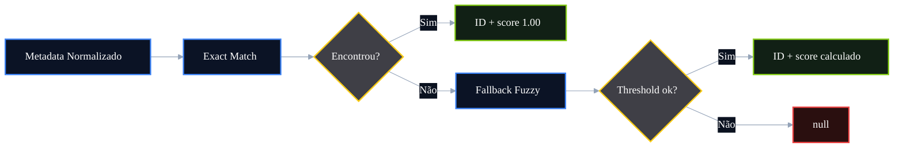

# 🧾 PR 101 — Fase 2: Score de Confiança na Resolução de IDs

## Introdução de confiança explícita no fallback semântico da resolução de IDs

---

<div align="left">


</div>

---

> [!IMPORTANT]
> Esta PR evolui a sequência após os guardrails e consolidações anteriores, adicionando um indicador explícito de confiança na resolução de IDs.
>
> - mantém match exato como prioridade
> - mantém fallback semântico/fuzzy quando necessário
> - explicita confiança da decisão tomada
> - preserva fluxo atual e contratos externos quando possível
>
> **Este PR não cria novo agent, não altera pipeline e não redesenha a arquitetura.**

## Sumário

1. [Síntese Executiva](#1-síntese-executiva)
2. [Objetivo do PR](#2-objetivo-do-pr)
3. [Decisão Arquitetural](#3-decisão-arquitetural)
4. [Escopo](#4-escopo)
5. [Fora de Escopo](#5-fora-de-escopo)
6. [Fluxo Arquitetural](#6-fluxo-arquitetural)
7. [Contratos Mínimos](#7-contratos-mínimos)
8. [Regras de Implementação](#8-regras-de-implementação)
9. [Critérios de Review](#9-critérios-de-review)
10. [Critérios de Aceite](#10-critérios-de-aceite)
11. [Conclusão](#11-conclusão)

# 1. Síntese Executiva

Após introduzir match exato prioritário e fallback fuzzy para a resolução de IDs, o próximo avanço funcional é tornar a decisão observável.

A PR 101 adiciona um score de confiança para cada resolução realizada, permitindo distinguir matches fortes, matches aproximados e ausência de confiança suficiente.

O objetivo é elevar previsibilidade sem aumentar complexidade estrutural.

# 2. Objetivo do PR

- adicionar score de confiança na resolução de IDs
- explicitar qualidade do match encontrado
- manter match exato como melhor caminho
- manter fallback fuzzy existente
- facilitar futuras decisões baseadas em confiança

# 3. Decisão Arquitetural

O score permanece local ao fluxo de resolução de IDs.

Não será criada nova camada de ranking global. O cálculo fica encapsulado no ponto onde a decisão já acontece hoje, preservando baixo acoplamento e recorte pequeno.

# 4. Escopo

- calcular score para match exato
- calcular score para fallback fuzzy
- retornar score junto da resolução interna
- permitir `null` quando não houver candidato confiável
- ajustar testes do fluxo de resolução

# 5. Fora de Escopo

- novo agent
- alteração de API pública externa
- banco de dados
- embeddings
- vector store
- fila
- redesign do orchestrator
- múltiplos thresholds dinâmicos por domínio

# 6. Fluxo Arquitetural



# 7. Contratos Mínimos

Exemplo interno:

```ts
{
  id: "123",
  confidence: 1
}
```

Ou:

```ts
{
  id: "456",
  confidence: 0.82
}
```

Ou ausência de match:

```ts
null
```

# 8. Regras de Implementação

- score 1.00 para match exato
- score proporcional para fallback fuzzy
- manter comportamento atual de resolução
- não expandir escopo para observabilidade global
- testes cobrindo exato, fuzzy e ausência de match

# 9. Critérios de Review

- score está coerente com o tipo de match
- exact match continua prioritário
- fallback continua controlado
- recorte permanece pequeno
- sem novas dependências
- sem regressão funcional

# 10. Critérios de Aceite

- [ ] exact match retorna score máximo
- [ ] fuzzy match retorna score intermediário
- [ ] ausência de match confiável retorna null
- [ ] testes verdes
- [ ] sem alteração indevida do fluxo atual

# 11. Conclusão

A PR 101 adiciona uma camada útil de inteligência operacional à resolução de IDs: além de resolver, o sistema passa a indicar quão confiável foi a decisão. É evolução funcional real, localizada e proporcional ao estágio atual do projeto.
