# 🛡️ PR 103 — Fase 2: Guardrail HTTP do Payload de Processamento de Questões

## Validação mínima e explícita da entrada pública do endpoint do fluxo avançado

---

<div align="left">


</div>

---

> [!IMPORTANT]
> Esta PR adiciona validação mínima e explícita ao boundary HTTP recém-exposto para o fluxo avançado de processamento de questões.
>
> - rejeita payloads estruturalmente inválidos antes da execução do pipeline interno;
> - preserva a delegação direta para o `AgentsFlowOrchestratorService`;
> - mantém o recorte pequeno, sem DTO rico, pipe customizado ou redesign do fluxo.
>
> **Este PR não altera o pipeline de agents, não adiciona persistência e não reabre a arquitetura aprovada na PR anterior.**

---

## Sumário

1. [Síntese Executiva](#1-síntese-executiva)
2. [Objetivo do PR](#2-objetivo-do-pr)
3. [Decisão Arquitetural](#3-decisão-arquitetural)
4. [Escopo](#4-escopo)
5. [Fora de Escopo](#5-fora-de-escopo)
6. [Fluxo Arquitetural](#6-fluxo-arquitetural)
7. [Contratos Mínimos](#7-contratos-mínimos)
8. [Regras de Implementação](#8-regras-de-implementação)
9. [Critérios de Review](#9-critérios-de-review)
10. [Critérios de Aceite](#10-critérios-de-aceite)
11. [Conclusão](#11-conclusão)

---

## 1. Síntese Executiva

A PR 102 expôs o fluxo avançado por HTTP com um endpoint fino, mantendo a responsabilidade de execução concentrada no `AgentsFlowOrchestratorService`.

A PR 103 dá o próximo passo mínimo: proteger esse endpoint contra entradas públicas estruturalmente inválidas antes de acionar o fluxo interno. A validação proposta atua apenas no limite HTTP, garantindo que o controller não encaminhe payloads ausentes, incompletos ou incompatíveis com o contrato mínimo de processamento de questões.

O recorte permanece intencionalmente pequeno. Não há criação de camada declarativa ampla, DTO rico, pipe customizado, mapper ou novo serviço intermediário. A mudança apenas fecha o boundary recém-exposto com um guardrail simples, revisável e proporcional ao momento da Fase 2.

---

## 2. Objetivo do PR

Adicionar validação básica ao endpoint:

```txt
POST /ai/questions/process
```

A PR deve garantir que somente payloads compatíveis com o contrato mínimo de processamento sejam delegados ao `AgentsFlowOrchestratorService`. Entradas inválidas devem ser rejeitadas com `BadRequestException`, sem executar o pipeline interno.

---

## 3. Decisão Arquitetural

A validação permanece no controller porque o problema tratado é de boundary HTTP. O controller continua fino: valida apenas a estrutura mínima necessária para proteger a entrada pública e, quando o payload é válido, delega diretamente ao orchestrator.

O `AgentsFlowOrchestratorService` segue responsável pelo fluxo interno já consolidado:

```txt
classification → id-resolution → initial-processing → answer-key
```

A decisão central é preservar a arquitetura aprovada na PR anterior e adicionar apenas o guardrail mínimo no ponto de entrada. Não há redistribuição de responsabilidades, criação de nova fundação ou antecipação de validações futuras.

---

## 4. Escopo

Entra nesta PR:

- validação de body ausente ou inválido;
- validação de `question` ausente ou inválido;
- validação de `question.statement` como string não vazia;
- validação de `question.alternatives` como array com quantidade mínima;
- validação de alternativas como strings não vazias;
- validação de `question.correctAnswer`, quando presente, como `A | B | C | D | E`;
- preservação da chamada direta ao `AgentsFlowOrchestratorService.execute(input)`;
- ampliação do spec do controller para cobrir sucesso e rejeições principais.

---

## 5. Fora de Escopo

Não faz parte desta PR:

- introduzir `class-validator`;
- criar DTOs ricos;
- criar pipes customizados;
- adicionar Swagger/OpenAPI;
- alterar contratos internos dos agents;
- mover providers para novo módulo;
- alterar autenticação;
- adicionar persistência;
- alterar fila ou processamento assíncrono;
- modificar o `AgentsFlowOrchestratorService`;
- alterar a ordem do pipeline;
- criar mapper, service intermediário ou abstração de validação.

---

## 6. Fluxo Arquitetural

```mermaid
%%{init: {
  "theme": "base",
  "themeVariables": {
    "background": "#050b16",
    "primaryColor": "#0b1220",
    "primaryTextColor": "#ffffff",
    "primaryBorderColor": "#22d3ee",
    "lineColor": "#94a3b8",
    "secondaryColor": "#0b1220",
    "tertiaryColor": "#0b1220",
    "fontFamily": "Inter, Arial, sans-serif"
  },
  "flowchart": {
    "htmlLabels": true,
    "curve": "linear",
    "nodeSpacing": 34,
    "rankSpacing": 44
  }
}}%%
flowchart LR
    A["HTTP Request"] --> B{"Payload mínimo válido?"}
    B -- "Não" --> C["400 Bad Request"]
    B -- "Sim" --> D["AiQuestionProcessingController"]
    D --> E["AgentsFlowOrchestratorService"]
    E --> F["InitialQuestionProcessingOutput"]

    classDef step1 fill:#0b1325,stroke:#3b82f6,stroke-width:2px,color:#ffffff;
    classDef step2 fill:#0a1a22,stroke:#22d3ee,stroke-width:2px,color:#ffffff;
    classDef step3 fill:#201d10,stroke:#eab308,stroke-width:2px,color:#ffffff;
    classDef step4 fill:#181629,stroke:#a78bfa,stroke-width:2px,color:#ffffff;
    classDef step5 fill:#25170f,stroke:#f97316,stroke-width:2px,color:#ffffff;
    classDef step6 fill:#112015,stroke:#84cc16,stroke-width:2px,color:#ffffff;
    classDef step7 fill:#10243a,stroke:#38bdf8,stroke-width:2px,color:#ffffff;
    classDef step8 fill:#221b2f,stroke:#f472b6,stroke-width:2px,color:#ffffff;
    classDef step9 fill:#14281d,stroke:#34d399,stroke-width:2px,color:#ffffff;
    classDef step10 fill:#2a160f,stroke:#fb7185,stroke-width:2px,color:#ffffff;
    classDef step11 fill:#1e293b,stroke:#f8fafc,stroke-width:2px,color:#ffffff;
    classDef decision fill:#181629,stroke:#a78bfa,stroke-width:2px,color:#ffffff;
    classDef successBox fill:#112015,stroke:#84cc16,stroke-width:2px,color:#ffffff;
    classDef failureBox fill:#2a160f,stroke:#fb7185,stroke-width:2px,color:#ffffff;
    classDef outputBox fill:#1e293b,stroke:#f8fafc,stroke-width:2px,color:#ffffff;
    classDef foundationBox fill:#1e293b,stroke:#f8fafc,stroke-width:2px,color:#ffffff;
    classDef coreBox fill:#1e293b,stroke:#f8fafc,stroke-width:2px,color:#ffffff;

    class A step1;
    class B decision;
    class C failureBox;
    class D step2;
    class E coreBox;
    class F outputBox;

    linkStyle 0 stroke:#9ca3af,stroke-width:2px;
    linkStyle 1 stroke:#fb7185,stroke-width:2px;
    linkStyle 2 stroke:#84cc16,stroke-width:2px;
    linkStyle 3 stroke:#9ca3af,stroke-width:2px;
    linkStyle 4 stroke:#9ca3af,stroke-width:2px;
```



---

## 7. Contratos Mínimos

A entrada esperada continua baseada no contrato já utilizado pelo fluxo avançado:

```ts
type InitialQuestionProcessingInput = {
  question: {
    statement: string;
    alternatives: string[];
    comments?: string;
    correctAnswer?: 'A' | 'B' | 'C' | 'D' | 'E';
  };
};
```

Para esta PR, a validação mínima cobre apenas `question`, `statement`, `alternatives` e o formato de `correctAnswer` quando informado. A saída permanece preservada como `InitialQuestionProcessingOutput`, sem alteração de shape, enriquecimento ou normalização adicional no controller.

---

## 8. Regras de Implementação

A implementação deve manter o controller como boundary HTTP fino. Ele valida o shape básico, lança `BadRequestException` para payload inválido e delega o caso válido ao `AgentsFlowOrchestratorService` sem criar camada intermediária.

Exemplo de direção esperada:

```ts
@Post('process')
processQuestion(
  @Body() input: InitialQuestionProcessingInput,
): Promise<InitialQuestionProcessingOutput> {
  this.validateInput(input);

  return this.agentsFlowOrchestratorService.execute(input);
}
```

A validação não deve duplicar regras profundas do pipeline, inferir dados, normalizar conteúdo, acionar agents parcialmente ou mover regra de negócio para o controller. O guardrail é estrutural e limitado ao ponto de entrada HTTP.

---

## 9. Critérios de Review

Durante o review, validar se:

- o endpoint continua isolado em `AiQuestionProcessingController`;
- o controller rejeita payload inválido antes de chamar o orchestrator;
- o fluxo válido segue delegando diretamente para `AgentsFlowOrchestratorService.execute`;
- o output retornado permanece exatamente o output do orchestrator;
- o orchestrator não foi alterado sem necessidade;
- não houve introdução de DTO rico, pipe customizado, mapper ou service intermediário;
- os testes cobrem o caso feliz e as rejeições principais;
- a PR não expande escopo para autenticação, persistência, fila ou versionamento.

---

## 10. Critérios de Aceite

- [ ] Payload válido chama `AgentsFlowOrchestratorService.execute`.
- [ ] Payload válido retorna exatamente o output do orchestrator.
- [ ] Body ausente ou inválido retorna `BadRequestException`.
- [ ] `question` ausente ou inválido retorna `BadRequestException`.
- [ ] `statement` ausente, vazio ou inválido retorna `BadRequestException`.
- [ ] `alternatives` ausente, vazio ou inválido retorna `BadRequestException`.
- [ ] Alternativa vazia ou inválida retorna `BadRequestException`.
- [ ] `correctAnswer` inválido retorna `BadRequestException`.
- [ ] Specs do controller passam sem regressão.
- [ ] Nenhum novo service, mapper, pipe customizado ou redesign é introduzido.

---

## 11. Conclusão

A PR 103 fecha o boundary HTTP criado na PR 102 com validação mínima e explícita de entrada, sem alterar o pipeline interno de agents.

O ganho é direto: payloads malformados deixam de atravessar o endpoint público e o fluxo avançado permanece limpo, previsível e concentrado no orchestrator. O recorte continua pequeno, funcional e alinhado com a progressão incremental da Fase 2.
