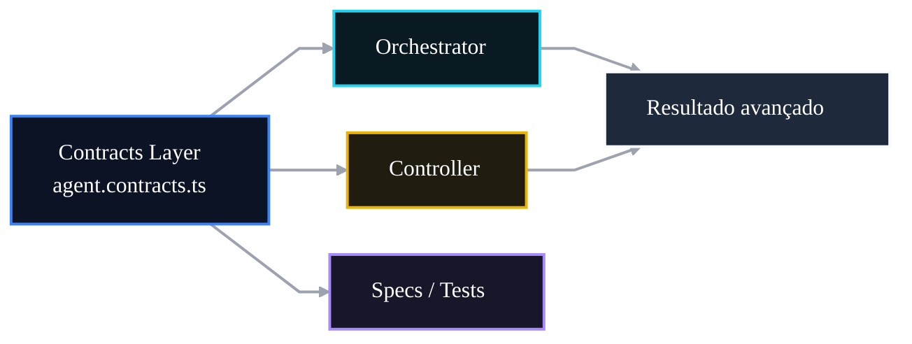

# 🧬 PR 107 — Fase 2: Contrato Tipado do Resultado Avançado

## Consolidação do shape compartilhado do output avançado em nível de contratos

---

<div align="left">


</div>

---

> [!IMPORTANT]
> Esta PR fortalece o contrato compartilhado do resultado avançado em `agent.contracts.ts`, formalizando em nível de tipagem e testes a estrutura consumida pelo controller, orchestrator e demais consumidores internos.
>
> - Consolida a fonte de verdade do shape avançado.
> - Reduz risco de drift entre camadas.
> - Mantém zero mudança comportamental.
>
> **Este PR não altera runtime, não muda fluxo de negócio e não introduz novas camadas.**

---

# 📚 Sumário

1. [Síntese Executiva](#1-síntese-executiva)
2. [Objetivo do PR](#2-objetivo-do-pr)
3. [Decisão Arquitetural](#3-decisão-arquitetural)
4. [Escopo](#4-escopo)
5. [Fora de Escopo](#5-fora-de-escopo)
6. [Fluxo Arquitetural](#6-fluxo-arquitetural)
7. [Contratos Mínimos](#7-contratos-mínimos)
8. [Regras de Implementação](#8-regras-de-implementação)
9. [Critérios de Review](#9-critérios-de-review)
10. [Critérios de Aceite](#10-critérios-de-aceite)
11. [Conclusão](#11-conclusão)

---

# 1. Síntese Executiva

A PR 106 tornou explícito o contrato HTTP do endpoint de processamento avançado. O próximo passo natural é consolidar esse mesmo shape na camada de contratos compartilhados, para que controller, orchestrator e testes dependam de uma definição única.

Esta PR fortalece `InitialQuestionProcessingOutput` como fonte de verdade tipada do resultado avançado. O foco é estabilidade estrutural e previsibilidade entre camadas, sem qualquer alteração comportamental.

---

# 2. Objetivo do PR

Garantir que `InitialQuestionProcessingOutput` represente de forma explícita, coesa e testada o output avançado completo.

O recorte cobre:

- formalização tipada de `legalSearch`;
- formalização tipada de `adaptedStatement`;
- formalização tipada de `answerKey`;
- formalização tipada de `metadata`;
- formalização tipada de `ids`;
- formalização tipada de `idResolutionConfidence`;
- reforço de testes em `agent.contracts.spec.ts`;
- proteção contra regressão estrutural do shape.

---

# 3. Decisão Arquitetural

A evolução acontece na camada `model/v1`, local correto para contratos compartilhados. Em vez de replicar tipos em controller, orchestrator ou specs isolados, o projeto mantém uma definição central reutilizável.

A decisão preserva simplicidade: nenhum impacto runtime, nenhuma nova abstração e nenhuma redistribuição artificial de responsabilidades. O contrato tipado passa a ser o ponto de alinhamento entre consumidores internos.

---

# 4. Escopo

Entra nesta PR:

- revisão de `agent.contracts.ts`;
- consolidação do tipo `InitialQuestionProcessingOutput`;
- expansão de `agent.contracts.spec.ts`;
- validação do shape esperado em testes;
- proteção contra drift estrutural do output avançado.

---

# 5. Fora de Escopo

Não entra nesta PR:

- alteração do controller;
- alteração do orchestrator;
- mudança de agentes;
- persistência;
- novos endpoints;
- mudança funcional de negócio;
- refactor estrutural amplo;
- validação runtime;
- alteração do contrato HTTP já exposto.

---

# 6. Fluxo Arquitetural



---

# 7. Contratos Mínimos

Shape esperado:

```ts
type InitialQuestionProcessingOutput = {
  legalSearch: unknown;
  adaptedStatement: string;
  answerKey: {
    correctAlternative: string;
    justification: string;
    source: string;
  };
  metadata: unknown;
  ids: unknown;
  idResolutionConfidence: unknown;
};
```

Garantias mínimas:

- contrato compartilhado explícito;
- campos centrais centralizados em uma única definição;
- menor risco de divergência entre consumidores;
- evolução futura mais previsível.

---

# 8. Regras de Implementação

A implementação deve permanecer restrita aos arquivos de contratos e seus testes. O objetivo é consolidar shape, não mover lógica de negócio ou introduzir validações em runtime.

Sempre que possível, preferir ajuste direto no contrato existente em vez de criar tipos paralelos ou aliases ornamentais. O recorte precisa continuar pequeno, claro e revisável.

---

# 9. Critérios de Review

Validar se a PR:

- torna o contrato mais explícito e legível;
- mantém definição centralizada;
- evita duplicação de tipos;
- não gera impacto runtime acidental;
- possui testes aderentes ao shape principal;
- preserva nomenclatura atual do projeto;
- não adiciona complexidade desnecessária;
- mantém proporcionalidade do slice.

---

# 10. Critérios de Aceite

- [ ] `InitialQuestionProcessingOutput` compila corretamente.
- [ ] Shape avançado contém os campos esperados.
- [ ] `agent.contracts.spec.ts` cobre o contrato principal.
- [ ] Não há regressão em suítes dependentes.
- [ ] Nenhum comportamento runtime foi alterado.
- [ ] A suíte de testes permanece verde.

---

# 11. Conclusão

A PR 107 consolida o resultado avançado na camada correta: contratos compartilhados. É uma evolução enxuta e incremental após a formalização do response contract, reforçando consistência entre camadas sem inflar a arquitetura nem expandir o escopo funcional.
