# 🔄 PR 13 — Fase 1: Primeiro Tratamento Operacional Mínimo de Falha da Ingestion
## Introdução do primeiro caminho terminal de erro controlado no fluxo mínimo da ingestion

---

<div align="left">


</div>

---

> [!IMPORTANT]
> Esta PR é continuação direta das **PRs 06, 07, 08, 09, 10, 11 e 12** e introduz apenas o próximo passo funcional mínimo da operação de `ingestion`.
>
> - manter a abertura persistida da operação
> - manter o primeiro dispatch mínimo já introduzido
> - manter o primeiro consumo operacional mínimo já introduzido
> - manter o primeiro fechamento operacional mínimo já introduzido
> - introduzir o **primeiro tratamento operacional mínimo de falha**
>
> **Esta PR não implementa retries, DLQ, backoff, múltiplas filas, state machine, histórico rico de execução, observabilidade expandida ou pipeline completo de processamento.**

---

## 📚 Sumário

1. [Síntese Executiva](#1-síntese-executiva)
2. [Objetivo do PR](#2-objetivo-do-pr)
3. [Decisão Arquitetural](#3-decisão-arquitetural)
4. [Escopo](#4-escopo)
5. [Fora de Escopo](#5-fora-de-escopo)
6. [Fluxo Arquitetural](#6-fluxo-arquitetural)
7. [Contratos Mínimos](#7-contratos-mínimos)
8. [Regras de Implementação](#8-regras-de-implementação)
9. [Critérios de Review](#9-critérios-de-review)
10. [Critérios de Aceite](#10-critérios-de-aceite)
11. [Conclusão](#11-conclusão)

---

## 1. Síntese Executiva

A progressão da Fase 1 até aqui foi:

- **PR 06** → foundation mínima de autenticação delegada
- **PR 07** → propagação do usuário autenticado até `ingestion`
- **PR 08** → persistência inicial mínima da operação
- **PR 09** → foundation mínima de Redis e database access compartilhado
- **PR 10** → primeiro dispatch operacional mínimo
- **PR 11** → primeiro consumo operacional mínimo
- **PR 12** → primeiro fechamento operacional mínimo

A **PR 13** continua esse fluxo sem reprojetar a aplicação.

O próximo passo correto agora é fazer a operação de `ingestion` deixar de existir apenas como fluxo de sucesso, passando a reconhecer também seu **primeiro caminho terminal mínimo de falha operacional**.

Esta PR resolve exatamente esse ponto: **materializar o primeiro encerramento mínimo de erro da operação consumida, preservando coerência de estado quando a execução falhar**.

---

## 2. Objetivo do PR

Introduzir o primeiro tratamento operacional mínimo de falha da operação de `ingestion`, reaproveitando exclusivamente a foundation já consolidada nas PRs anteriores.

### Em termos práticos

Esta PR deve permitir apenas:

- receber uma `ingestion` já consumida
- validar a existência da operação em processamento
- capturar falha mínima de execução
- concluir a operação de forma mínima e explícita em caso de erro
- atualizar o estado da `ingestion` de `processing` para `failed`

### Resultado esperado

Ao final desta PR, a aplicação deve ser capaz de:

- manter o caminho feliz já existente até `completed`
- refletir também um caminho terminal mínimo de falha
- evitar que uma operação com erro fique sem estado final coerente
- manter rastreabilidade básica do ciclo **abertura → dispatch → consumo → processamento → encerramento terminal**

> [!NOTE]
> O objetivo desta PR **não** é implementar estratégia completa de resiliência.
>
> O objetivo é apenas materializar o **primeiro caminho terminal mínimo de erro da operação já consumida**, com evolução explícita e pequena de estado.

---

## 3. Decisão Arquitetural

A decisão central desta PR é:

> **manter o caminho feliz já introduzido e adicionar apenas o primeiro caminho terminal mínimo de falha, sem introduzir infraestrutura expandida de resiliência.**

A arquitetura-base já foi consolidada nas PRs anteriores e permanece a mesma.

Esta PR apenas adiciona o próximo comportamento funcional mínimo necessário sobre a estrutura já existente.

### Isso significa

- reaproveitar a foundation mínima de persistência e Redis já introduzida
- reaproveitar o consumo mínimo já introduzido
- reaproveitar o fechamento mínimo de sucesso já introduzido
- introduzir apenas o **primeiro encerramento operacional controlado de falha**
- manter o fluxo explícito, pequeno e revisável
- evitar antecipação de retries, backoff, DLQ, múltiplas filas ou coordenação rica

### Boundary exato desta PR

O tratamento de falha introduzido aqui deve ser entendido apenas como:

- captura mínima de erro durante a execução consumida
- validação de existência da `ingestion`
- conclusão mínima da operação em erro
- atualização mínima de estado para `failed`

Nesta PR, **tratamento mínimo de falha** significa apenas concluir a operação em erro de forma explícita, mediante validação de existência da `ingestion` e atualização de status de `processing` para `failed`, **sem introduzir sistema de resiliência completo**.

Nada além disso é objetivo desta entrega.

---

## 4. Escopo

Esta PR inclui:

- primeiro tratamento operacional mínimo de falha da `ingestion`
- evolução mínima do estado da operação em caso de erro durante o processamento
- reaproveitamento da foundation de Redis já existente
- preservação da rastreabilidade da operação aberta, despachada, consumida, concluída com sucesso ou concluída com falha mínima
- evolução do comportamento do módulo de ingestion sem abrir nova fundação

### Em termos de implementação

Espera-se que esta PR cubra:

- resolução do `ingestionId` já consumido
- validação da existência da operação persistida
- captura mínima de erro na execução consumida
- atualização objetiva de status de `processing` para `failed` quando necessário
- manutenção do contrato pequeno e aderente ao recorte

### Unidade mínima concluída nesta PR

A unidade operacional mínima desta entrega deve continuar sendo simples:

- origem: item já consumido do Redis
- unidade operacional: `ingestionId`
- efeito persistido: atualização do status terminal da operação em caso de falha

> [!IMPORTANT]
> O recorte desta PR termina na introdução controlada do estado terminal `failed`.
>
> Qualquer expansão para retries, recuperação automática, reprocessamento ou infraestrutura de resiliência fica fora desta entrega.

---

## 5. Fora de Escopo

Esta PR **não** inclui:

- retries
- backoff
- DLQ
- múltiplas filas
- flows
- reprocessamento automático
- tabela de eventos
- state machine
- taxonomia rica de erros
- observabilidade expandida
- histórico rico de execução
- abstração genérica de worker
- infraestrutura expandida de resiliência
- pipeline completo de processamento
- handlers genéricos, processors reutilizáveis ou infraestrutura preparada para próximos consumers

> [!NOTE]
> A regra permanece a mesma:
>
> **não implementar a próxima fase dentro da fase atual.**

---

## 6. Fluxo Arquitetural

```mermaid
%%{init: {
  "theme": "base",
  "themeVariables": {
    "background": "#0b1020",
    "primaryColor": "#111827",
    "primaryTextColor": "#e5f0ff",
    "primaryBorderColor": "#22d3ee",
    "lineColor": "#38bdf8",
    "secondaryColor": "#0f172a",
    "tertiaryColor": "#111827",
    "fontFamily": "Inter, Segoe UI, Arial",
    "clusterBkg": "#0f172a",
    "clusterBorder": "#334155"
  }
}}%%
flowchart LR
    A[HTTP Request]:::http --> B[AuthGuard]:::auth
    B --> C[request.user.id]:::auth
    C --> D[IngestionController]:::controller
    D --> E[IngestionService]:::service
    E --> F[Persist Initial Ingestion State]:::database
    F --> G[Dispatch Initial Ingestion Step]:::redis
    G --> H[Update Ingestion Status to Queued]:::database
    H --> I[Consume Queued Ingestion Id]:::consumer
    I --> J[Update Ingestion Status to Processing]:::database
    J --> K{Minimal Execution Result}:::decision
    K -->|Success| L[Update Ingestion Status to Completed]:::database
    K -->|Failure| M[Update Ingestion Status to Failed]:::database

    classDef http fill:#111827,stroke:#38bdf8,color:#e0f2fe,stroke-width:2px;
    classDef auth fill:#111827,stroke:#a78bfa,color:#f5f3ff,stroke-width:2px;
    classDef controller fill:#0b1220,stroke:#38bdf8,color:#e0f2fe,stroke-width:2px;
    classDef service fill:#111827,stroke:#22c55e,color:#ecfdf5,stroke-width:2px;
    classDef database fill:#052e16,stroke:#22c55e,color:#f0fdf4,stroke-width:2px;
    classDef redis fill:#451a03,stroke:#f59e0b,color:#fff7ed,stroke-width:2px;
    classDef consumer fill:#172554,stroke:#60a5fa,color:#eff6ff,stroke-width:2px;
    classDef decision fill:#1e1b4b,stroke:#c084fc,color:#f5f3ff,stroke-width:2px;
```



> [!IMPORTANT]
> Neste recorte, o caminho de falha entra apenas como **primeira conclusão terminal mínima de erro após o consumo**, e não como modelagem de resiliência completa.

---

## 7. Contratos Mínimos

Os contratos devem continuar pequenos e aderentes ao recorte.

### Evolução mínima esperada

```ts
export type IngestionStatus =
  | 'created'
  | 'queued'
  | 'processing'
  | 'completed'
  | 'failed';

export type CreateIngestionInput = {
  userId: number;
  payload: unknown;
};

export type IngestionRecord = {
  id: string;
  status: IngestionStatus;
  initiatedByUserId: number;
  payload: unknown;
  createdAt: Date;
  updatedAt: Date;
};
```

### Evolução de estado esperada nesta PR

```ts
created -> queued -> processing -> completed
created -> queued -> processing -> failed
```

### Regra importante

Fora a materialização explícita do estado `failed`, esta PR **não amplia** contratos de payload, processamento ou execução.

Esta PR não deve inflar os contratos com:

- metadados ricos de erro
- taxonomia de falha
- payloads completos de observabilidade
- contratos de retry
- estruturas futuras ainda não consumidas

---

## 8. Regras de Implementação

### Ingestion

O fluxo de `ingestion` deve:

- continuar simples
- continuar recebendo dados explícitos
- manter a persistência inicial da operação
- manter o dispatch mínimo já introduzido
- manter o consumo mínimo já introduzido
- manter o fechamento mínimo de sucesso já introduzido
- introduzir o tratamento mínimo de falha operacional
- manter rastreabilidade do avanço operacional
- não absorver infraestrutura futura desnecessária

### Consumer

O consumer deve continuar sendo:

- mínimo
- explícito
- específico para este caso de uso
- aderente à foundation já introduzida
- sem abstração genérica de worker
- sem mini-framework de processamento
- sem preparação estrutural para múltiplos consumers futuros

### Tratamento mínimo de falha esperado

O tratamento desta PR deve fazer apenas:

1. receber a operação já consumida
2. resolver o `ingestionId`
3. validar a existência da operação
4. capturar erro mínimo da execução
5. atualizar o status da operação para `failed`

Se fizer além disso, o recorte está expandindo indevidamente.

### Database

A persistência deve:

- continuar usando o ponto compartilhado já consolidado
- manter o fluxo fácil de seguir
- preservar o estado operacional mínimo da operação

### Configuração

A configuração deve:

- permanecer centralizada no `environment.ts`
- seguir o padrão já adotado com Zod
- não espalhar leitura de `process.env`

---

## 9. Critérios de Review

O review desta PR deve validar se:

- a PR 13 é continuação natural das PRs 06, 07, 08, 09, 10, 11 e 12
- a `ingestion` passa a ter primeiro caminho terminal mínimo de falha
- o tratamento de falha foi introduzido sem overengineering
- Redis foi usado de forma mínima e aderente ao recorte
- o fluxo continua simples
- a evolução de estado da operação permanece pequena e coerente
- o recorte continua pequeno, revisável e sem infraestrutura prematura de resiliência
- o tratamento introduzido está limitado a **captura mínima de erro + conclusão terminal explícita + atualização de status**
- não há retry engine, DLQ, framework de worker ou fundação paralela escondida nesta entrega

---

## 10. Critérios de Aceite

Esta PR pode ser considerada aceita se:

- [ ] a operação de `ingestion` continuar sendo aberta corretamente
- [ ] o dispatch mínimo continuar funcionando
- [ ] o primeiro consumo operacional mínimo continuar funcionando
- [ ] o primeiro fechamento operacional mínimo de sucesso continuar funcionando
- [ ] existir o primeiro tratamento operacional mínimo de falha da operação
- [ ] a operação puder refletir a transição de `processing` para `failed`
- [ ] Redis for utilizado de forma mínima e sem abstração excessiva
- [ ] o recorte permanecer pequeno, funcional e revisável
- [ ] não houver antecipação indevida de retries, DLQ ou resiliência expandida
- [ ] não houver expansão indevida para framework de erro, processor genérico ou infraestrutura assíncrona mais rica

---

## 11. Conclusão

A PR 13 introduz o próximo passo correto da Fase 1:

> **fazer a operação de `ingestion` deixar de depender exclusivamente do caminho feliz e passar a ter seu primeiro encerramento terminal mínimo de erro, explícito e rastreável.**

Em resumo:

- **PR 06** consolidou a borda autenticada
- **PR 07** propagou a identidade até o domínio
- **PR 08** materializou a operação inicial
- **PR 09** consolidou a foundation compartilhada
- **PR 10** introduziu o primeiro dispatch operacional real
- **PR 11** introduziu o primeiro consumo operacional
- **PR 12** introduziu o primeiro fechamento operacional de sucesso
- **PR 13** introduz o primeiro tratamento operacional mínimo de falha

As próximas evoluções devem ser tratadas em PR própria, apenas se houver necessidade real e **sem expandir indevidamente o recorte desta fase**.

