# 🔄 PR 14 — Fase 1: Primeiro Registro Operacional Mínimo do Motivo de Falha da Ingestion
## Introdução do primeiro motivo mínimo persistido para o caminho terminal de erro da ingestion

---

<div align="left">


</div>

---

> [!IMPORTANT]
> Esta PR é continuação direta das **PRs 06, 07, 08, 09, 10, 11, 12 e 13** e introduz apenas o próximo passo funcional mínimo da operação de `ingestion`.
>
> - manter a abertura persistida da operação
> - manter o primeiro dispatch mínimo já introduzido
> - manter o primeiro consumo operacional mínimo já introduzido
> - manter o primeiro fechamento operacional mínimo de sucesso já introduzido
> - manter o primeiro tratamento operacional mínimo de falha já introduzido
> - introduzir o **primeiro registro operacional mínimo do motivo de falha**
>
> **Esta PR não implementa retries, DLQ, backoff, múltiplas filas, state machine, taxonomia rica de erros, histórico rico de execução, observabilidade expandida ou pipeline completo de processamento.**

---

## 📚 Sumário

1. [Síntese Executiva](#1-síntese-executiva)
2. [Objetivo do PR](#2-objetivo-do-pr)
3. [Decisão Arquitetural](#3-decisão-arquitetural)
4. [Escopo](#4-escopo)
5. [Fora de Escopo](#5-fora-de-escopo)
6. [Fluxo Arquitetural](#6-fluxo-arquitetural)
7. [Contratos Mínimos](#7-contratos-mínimos)
8. [Regras de Implementação](#8-regras-de-implementação)
9. [Critérios de Review](#9-critérios-de-review)
10. [Critérios de Aceite](#10-critérios-de-aceite)
11. [Conclusão](#11-conclusão)

---

## 1. Síntese Executiva

A progressão da Fase 1 até aqui foi:

- **PR 06** → foundation mínima de autenticação delegada
- **PR 07** → propagação do usuário autenticado até `ingestion`
- **PR 08** → persistência inicial mínima da operação
- **PR 09** → foundation mínima de Redis e database access compartilhado
- **PR 10** → primeiro dispatch operacional mínimo
- **PR 11** → primeiro consumo operacional mínimo
- **PR 12** → primeiro fechamento operacional mínimo
- **PR 13** → primeiro tratamento operacional mínimo de falha

A **PR 14** continua esse fluxo sem reprojetar a aplicação.

Depois de introduzir o primeiro caminho terminal `failed`, o próximo passo correto agora é fazer a operação deixar de falhar de forma completamente opaca, passando a registrar também um **primeiro motivo mínimo persistido de falha operacional**.

Esta PR resolve exatamente esse ponto: **materializar o primeiro registro mínimo do motivo de erro da operação consumida, preservando o recorte pequeno e a coerência do fluxo terminal já introduzido**.

---

## 2. Objetivo do PR

Introduzir o primeiro registro operacional mínimo do motivo de falha da operação de `ingestion`, reaproveitando exclusivamente a foundation já consolidada nas PRs anteriores.

### Em termos práticos

Esta PR deve permitir apenas:

- receber uma `ingestion` já consumida
- validar a existência da operação persistida
- manter o caminho feliz já existente
- capturar falha mínima de execução
- persistir um motivo mínimo de falha quando houver erro
- concluir a operação em `failed` com registro mínimo do erro ocorrido

### Resultado esperado

Ao final desta PR, a aplicação deve ser capaz de:

- manter o caminho feliz já existente até `completed`
- manter o caminho terminal mínimo de falha já introduzido
- registrar de forma mínima o motivo da falha terminal
- evitar que a operação falhe sem qualquer contexto persistido
- manter rastreabilidade básica do ciclo **abertura → dispatch → consumo → processamento → encerramento terminal**

> [!NOTE]
> O objetivo desta PR **não** é implementar taxonomia completa de erro ou observabilidade expandida.
>
> O objetivo é apenas materializar o **primeiro motivo mínimo persistido de falha da operação já consumida**, com evolução pequena e explícita do contrato.

---

## 3. Decisão Arquitetural

A decisão central desta PR é:

> **manter o caminho feliz e o caminho terminal `failed` já introduzidos, adicionando apenas o primeiro registro mínimo persistido do motivo de falha, sem introduzir infraestrutura expandida de erro ou resiliência.**

A arquitetura-base já foi consolidada nas PRs anteriores e permanece a mesma.

Esta PR apenas adiciona o próximo comportamento funcional mínimo necessário sobre a estrutura já existente.

### Isso significa

- reaproveitar a foundation mínima de persistência e Redis já introduzida
- reaproveitar o consumo mínimo já introduzido
- reaproveitar o fechamento mínimo de sucesso já introduzido
- reaproveitar o primeiro fechamento mínimo de falha já introduzido
- introduzir apenas o **primeiro registro operacional controlado do motivo de falha**
- manter o fluxo explícito, pequeno e revisável
- evitar antecipação de retries, backoff, DLQ, múltiplas filas ou coordenação rica de erros

### Boundary exato desta PR

O registro de falha introduzido aqui deve ser entendido apenas como:

- captura mínima de erro durante a execução consumida
- validação de existência da `ingestion`
- persistência mínima do encerramento terminal de falha em **uma única atualização explícita**
- atualização do status para `failed` com o respectivo `failureReason`

Nesta PR, **registro mínimo do motivo de falha** significa apenas persistir uma informação pequena, objetiva e suficiente para indicar por que a operação terminou em erro, **sem introduzir taxonomia de exceções, stack trace persistido ou sistema de observabilidade completo**.

### Regra de precisão desta entrega

Quando ocorrer erro durante o processamento consumido, o encerramento terminal deve ocorrer de forma objetiva por meio de **uma única atualização persistida**, contendo:

- `status: 'failed'`
- `failureReason: string`

Isso evita ambiguidade de implementação e mantém o recorte pequeno.

Nada além disso é objetivo desta entrega.

---

## 4. Escopo

Esta PR inclui:

- primeiro registro operacional mínimo do motivo de falha da `ingestion`
- evolução mínima do contrato da operação em caso de erro durante o processamento
- preservação do caminho feliz já existente
- preservação do caminho terminal `failed` já introduzido
- reaproveitamento da foundation de Redis e persistência já existentes
- evolução do comportamento do módulo de ingestion sem abrir nova fundação

### Em termos de implementação

Espera-se que esta PR cubra:

- resolução do `ingestionId` já consumido
- validação da existência da operação persistida
- captura mínima de erro na execução consumida
- derivação de um `failureReason` mínimo e previsível
- atualização objetiva da operação para `failed` com persistência do motivo do erro
- manutenção do contrato pequeno e aderente ao recorte

### Unidade mínima concluída nesta PR

A unidade operacional mínima desta entrega deve continuar sendo simples:

- origem: item já consumido do Redis
- unidade operacional: `ingestionId`
- efeito persistido: encerramento terminal da operação em caso de falha
- dado adicional persistido: motivo mínimo de falha

> [!IMPORTANT]
> O recorte desta PR termina na introdução controlada do registro mínimo do motivo de falha.
>
> Qualquer expansão para taxonomia rica, histórico de tentativas, classificação sofisticada ou infraestrutura de observabilidade fica fora desta entrega.

---

## 5. Fora de Escopo

Esta PR **não** inclui:

- retries
- backoff
- DLQ
- múltiplas filas
- flows
- reprocessamento automático
- tabela de eventos
- state machine
- taxonomia rica de erros
- stack trace persistido
- observabilidade expandida
- histórico rico de execução
- abstração genérica de worker
- infraestrutura expandida de resiliência
- pipeline completo de processamento
- handlers genéricos, processors reutilizáveis ou infraestrutura preparada para próximos consumers
- error codes, categorias de falha ou metadata expandida de erro

> [!NOTE]
> A regra permanece a mesma:
>
> **não implementar a próxima fase dentro da fase atual.**

---

## 6. Fluxo Arquitetural

```mermaid
%%{init: {
  "theme": "base",
  "themeVariables": {
    "background": "#0b1020",
    "primaryColor": "#111827",
    "primaryTextColor": "#e5f0ff",
    "primaryBorderColor": "#22d3ee",
    "lineColor": "#38bdf8",
    "secondaryColor": "#0f172a",
    "tertiaryColor": "#111827",
    "fontFamily": "Inter, Segoe UI, Arial",
    "clusterBkg": "#0f172a",
    "clusterBorder": "#334155"
  }
}}%%
flowchart LR
    A[HTTP Request]:::http --> B[AuthGuard]:::auth
    B --> C[request.user.id]:::auth
    C --> D[IngestionController]:::controller
    D --> E[IngestionService]:::service
    E --> F[Persist Initial Ingestion State]:::database
    F --> G[Dispatch Initial Ingestion Step]:::redis
    G --> H[Update Ingestion Status to Queued]:::database
    H --> I[Consume Queued Ingestion Id]:::consumer
    I --> J[Update Ingestion Status to Processing]:::database
    J --> K{Processing Outcome}:::decision
    K -->|Success| L[Update Ingestion Status to Completed]:::database
    K -->|Failure| M[Update Failed Status With Failure Reason]:::database

    classDef http fill:#111827,stroke:#38bdf8,color:#e0f2fe,stroke-width:2px;
    classDef auth fill:#111827,stroke:#a78bfa,color:#f5f3ff,stroke-width:2px;
    classDef controller fill:#0b1220,stroke:#38bdf8,color:#e0f2fe,stroke-width:2px;
    classDef service fill:#111827,stroke:#22c55e,color:#ecfdf5,stroke-width:2px;
    classDef database fill:#052e16,stroke:#22c55e,color:#f0fdf4,stroke-width:2px;
    classDef redis fill:#451a03,stroke:#f59e0b,color:#fff7ed,stroke-width:2px;
    classDef consumer fill:#172554,stroke:#60a5fa,color:#eff6ff,stroke-width:2px;
    classDef decision fill:#1e1b4b,stroke:#c084fc,color:#f5f3ff,stroke-width:2px;
```



> [!IMPORTANT]
> Neste recorte, o caminho de falha continua entrando apenas como **primeiro encerramento terminal mínimo de erro após o consumo**, agora com **uma única persistência explícita** contendo o estado terminal e o motivo mínimo da falha.

---

## 7. Contratos Mínimos

Os contratos devem continuar pequenos e aderentes ao recorte.

### Evolução mínima esperada

```ts
export type IngestionStatus =
  | 'created'
  | 'queued'
  | 'processing'
  | 'completed'
  | 'failed';

export type CreateIngestionInput = {
  userId: number;
  payload: unknown;
};

export type IngestionRecord = {
  id: string;
  status: IngestionStatus;
  initiatedByUserId: number;
  payload: unknown;
  failureReason: string | null;
  createdAt: Date;
  updatedAt: Date;
};
```

### Regra mínima do `failureReason`

O `failureReason` desta PR deve seguir apenas a regra mínima abaixo:

- ser uma `string`
- ser curta e objetiva
- ser derivada do erro capturado durante o processamento
- possuir fallback previsível caso não exista mensagem utilizável

### Comportamento esperado do campo

- `failureReason` deve permanecer `null` enquanto a operação não tiver encerrado em falha
- `failureReason` deve ser preenchido apenas no encerramento terminal com `status: 'failed'`
- `failureReason` não deve carregar stack trace, metadata expandida ou estrutura rica de erro

### Evolução de estado esperada nesta PR

```ts
created -> queued -> processing -> completed
created -> queued -> processing -> failed
```

### Regra importante

Fora a materialização explícita de um `failureReason` mínimo, esta PR **não amplia** contratos de payload, processamento ou execução.

Esta PR não deve inflar os contratos com:

- taxonomia rica de falha
- payloads completos de observabilidade
- contratos de retry
- stack trace persistido
- estruturas futuras ainda não consumidas

---

## 8. Regras de Implementação

### Ingestion

O fluxo de `ingestion` deve:

- continuar simples
- continuar recebendo dados explícitos
- manter a persistência inicial da operação
- manter o dispatch mínimo já introduzido
- manter o consumo mínimo já introduzido
- manter o fechamento mínimo de sucesso já introduzido
- manter o tratamento mínimo de falha já introduzido
- introduzir o registro mínimo do motivo de falha
- manter rastreabilidade do avanço operacional
- não absorver infraestrutura futura desnecessária

### Consumer

O consumer deve continuar sendo:

- mínimo
- explícito
- específico para este caso de uso
- aderente à foundation já introduzida
- sem abstração genérica de worker
- sem mini-framework de processamento
- sem preparação estrutural para múltiplos consumers futuros
- sem normalizador genérico de erro
- sem classificador expandido de falhas

### Tratamento mínimo de falha esperado

O tratamento desta PR deve fazer apenas:

1. receber a operação já consumida
2. resolver o `ingestionId`
3. validar a existência da operação persistida
4. capturar erro mínimo da execução
5. derivar um `failureReason` mínimo
6. encerrar a operação em **uma única atualização persistida** com:
   - `status: 'failed'`
   - `failureReason`

Se fizer além disso, o recorte está expandindo indevidamente.

### Database

A persistência deve:

- continuar usando o ponto compartilhado já consolidado
- manter o fluxo fácil de seguir
- preservar o estado operacional mínimo da operação
- permitir persistência do motivo mínimo de falha sem abrir infraestrutura paralela
- realizar o encerramento terminal de falha de forma objetiva e explícita

### Configuração

A configuração deve:

- permanecer centralizada no `environment.ts`
- seguir o padrão já adotado com Zod
- não espalhar leitura de `process.env`

---

## 9. Critérios de Review

O review desta PR deve validar se:

- a PR 14 é continuação natural das PRs 06, 07, 08, 09, 10, 11, 12 e 13
- a `ingestion` continua com caminho feliz mínimo e caminho terminal mínimo de falha
- o motivo de falha foi introduzido de forma pequena e aderente ao recorte
- o encerramento terminal de falha acontece em **uma única atualização persistida**
- Redis continua sendo usado de forma mínima e aderente ao recorte
- o fluxo continua simples
- a evolução de contrato da operação permanece pequena e coerente
- o recorte continua pequeno, revisável e sem infraestrutura prematura de erro ou resiliência
- o tratamento introduzido está limitado a **captura mínima de erro + derivação mínima do motivo + encerramento terminal explícito**
- não há retry engine, DLQ, framework de worker, taxonomia rica de erros ou fundação paralela escondida nesta entrega

---

## 10. Critérios de Aceite

Esta PR pode ser considerada aceita se:

- [ ] a operação de `ingestion` continuar sendo aberta corretamente
- [ ] o dispatch mínimo continuar funcionando
- [ ] o primeiro consumo operacional mínimo continuar funcionando
- [ ] o primeiro fechamento operacional mínimo de sucesso continuar funcionando
- [ ] o primeiro tratamento operacional mínimo de falha continuar funcionando
- [ ] existir o primeiro registro operacional mínimo do motivo de falha da operação
- [ ] a operação puder refletir a transição terminal para `failed` com persistência mínima do motivo do erro
- [ ] o encerramento terminal de falha ocorrer em uma única atualização persistida
- [ ] Redis for utilizado de forma mínima e sem abstração excessiva
- [ ] o recorte permanecer pequeno, funcional e revisável
- [ ] não houver antecipação indevida de retries, DLQ, taxonomia rica de erro ou observabilidade expandida

---

## 11. Conclusão

A PR 14 introduz o próximo passo correto da Fase 1:

> **fazer a operação de `ingestion` deixar de falhar de forma completamente opaca e passar a registrar seu primeiro motivo mínimo persistido de erro, preservando o recorte pequeno e a coerência do fluxo terminal já introduzido.**

Em resumo:

- **PR 06** consolidou a borda autenticada
- **PR 07** propagou a identidade até o domínio
- **PR 08** materializou a operação inicial
- **PR 09** consolidou a foundation compartilhada
- **PR 10** introduziu o primeiro dispatch operacional real
- **PR 11** introduziu o primeiro consumo operacional
- **PR 12** introduziu o primeiro fechamento operacional de sucesso
- **PR 13** introduziu o primeiro tratamento operacional mínimo de falha
- **PR 14** introduz o primeiro registro operacional mínimo do motivo de falha
