# 🔄 PR 15 — Foundation Mínima de Observabilidade Local do Projeto
## Introdução de logging e stack local via Docker com Loki, Promtail e Grafana

---

<div align="left">


</div>

---

> [!IMPORTANT]
> Esta PR introduz apenas a **foundation mínima de observabilidade local do projeto**, com foco em **logging operacional e inspeção local via Docker**.
>
> - manter o comportamento funcional atual da aplicação
> - introduzir visibilidade mínima de execução local
> - disponibilizar uma stack local simples com **Loki + Promtail + Grafana**
> - permitir debugging e inspeção operacional durante desenvolvimento
>
> **Este PR não expande domínio, não altera regras de negócio e não introduz plataforma completa de observabilidade.**
>
> O fluxo de `ingestion` é utilizado apenas como **primeiro caso operacional de validação**, e não como escopo exclusivo desta entrega.

---

## 📚 Sumário

1. [Síntese Executiva](#1-síntese-executiva)
2. [Objetivo do PR](#2-objetivo-do-pr)
3. [Decisão Arquitetural](#3-decisão-arquitetural)
4. [Escopo](#4-escopo)
5. [Fora de Escopo](#5-fora-de-escopo)
6. [Fluxo Arquitetural](#6-fluxo-arquitetural)
7. [Contratos Mínimos](#7-contratos-mínimos)
8. [Regras de Implementação](#8-regras-de-implementação)
9. [Infraestrutura Local via Docker](#9-infraestrutura-local-via-docker)
10. [Configuração Esperada](#10-configuração-esperada)
11. [Uso Operacional Local](#11-uso-operacional-local)
12. [Validação Inicial com Ingestion](#12-validação-inicial-com-ingestion)
13. [Critérios de Review](#13-critérios-de-review)
14. [Critérios de Aceite](#14-critérios-de-aceite)
15. [Conclusão](#15-conclusão)

---

## 1. Síntese Executiva

As PRs anteriores da trilha de `ingestion` consolidaram um primeiro fluxo operacional mínimo do projeto, cobrindo:

- abertura persistida da operação
- enqueue mínimo
- consumo mínimo
- transição para `processing`
- encerramento terminal em `completed`
- encerramento terminal em `failed`
- persistência mínima de `failureReason`

Com esse fluxo já estabilizado, o próximo passo mínimo correto deixa de ser uma evolução direta do domínio e passa a ser uma necessidade transversal de suporte operacional local:

> **dar visibilidade básica ao comportamento atual da aplicação durante desenvolvimento.**

Esta PR não redefine a arquitetura existente e não prolonga a fase funcional da `ingestion`.

Ela introduz apenas uma foundation transversal pequena, voltada para:

- logging local
- inspeção operacional básica
- setup simples de ambiente
- debugging local com menor atrito

Para isso, a entrega materializa uma stack local mínima baseada em:

- **Docker**
- **Loki**
- **Promtail**
- **Grafana**

O fluxo da `ingestion` entra aqui somente como **primeiro caso de validação operacional**, por já existir e por ser suficiente para gerar sinais úteis de execução.

---

## 2. Objetivo do PR

Introduzir uma foundation mínima de observabilidade local do projeto, permitindo inspeção básica de execução durante desenvolvimento sem alterar o comportamento funcional da aplicação.

### Em termos práticos

Esta PR deve permitir apenas:

- subir uma stack local simples de observabilidade via Docker
- visualizar logs da aplicação localmente
- centralizar logs locais em Loki
- consultar logs no Grafana
- usar Promtail como coleta local mínima
- manter a aplicação funcionalmente igual do ponto de vista de domínio

### Resultado esperado

Ao final desta PR, o projeto deve ser capaz de:

- continuar executando normalmente
- emitir logs mínimos úteis
- disponibilizar esses logs localmente
- permitir inspeção operacional simples em desenvolvimento
- usar o fluxo da `ingestion` como validação inicial do setup

> [!NOTE]
> O objetivo desta PR **não** é introduzir observabilidade completa.
>
> O objetivo é apenas materializar uma **base local mínima e utilizável** de logging e visualização operacional.

---

## 3. Decisão Arquitetural

A decisão arquitetural desta PR é manter a base atual da aplicação e adicionar apenas uma camada transversal mínima de apoio ao desenvolvimento local.

Em termos práticos, isso significa:

- manter a arquitetura funcional existente
- não alterar regras de domínio
- não reabrir decisões anteriores de módulo, fluxo ou contrato
- adicionar somente logging mínimo útil
- conectar esse logging a uma stack local simples via Docker
- usar **Loki** como destino de logs
- usar **Promtail** como coleta local mínima
- usar **Grafana** como visualização operacional mínima

### Boundary desta PR

A observabilidade introduzida aqui deve ser entendida apenas como:

- emissão mínima de logs úteis
- coleta local desses logs
- consulta local desses logs
- apoio operacional em desenvolvimento

Não há, neste recorte:

- redesign de arquitetura
- plataforma expandida de observabilidade
- preparação de produção
- instrumentação profunda
- fundação paralela para evolução futura

---

## 4. Escopo

Esta PR inclui:

- introdução de foundation mínima de logging local
- stack local via Docker Compose
- inclusão de **Loki**
- inclusão de **Promtail**
- inclusão de **Grafana**
- configuração local mínima para coleta de logs
- documentação de subida, acesso e uso operacional básico
- preservação integral do comportamento funcional atual da aplicação

### Em termos de implementação

Espera-se que esta PR cubra:

- definição do `docker-compose` da stack local
- configuração mínima do Loki
- configuração mínima do Promtail
- configuração mínima do Grafana
- definição simples de origem dos logs da aplicação
- documentação objetiva de como subir e validar o ambiente
- logs mínimos e explícitos em fluxos úteis do sistema, quando aplicável

### Unidade mínima concluída nesta PR

A unidade operacional mínima desta entrega permanece pequena e verificável:

- a aplicação continua executando como antes
- logs passam a ser visíveis localmente
- a stack pode ser iniciada via Docker
- o operador local consegue inspecionar o comportamento sem depender de infraestrutura externa

---

## 5. Fora de Escopo

Esta PR **não** inclui:

- OpenTelemetry completo
- tracing distribuído
- spans
- métricas de negócio
- métricas técnicas ricas
- alertas
- regras de alarme
- dashboards sofisticados
- correlação distribuída entre serviços
- observabilidade de produção
- retenção avançada
- autenticação sofisticada do Grafana
- HA
- clusterização
- pipelines completos de logs
- SIEM
- APM
- indexação avançada
- taxonomia rica de eventos operacionais
- evolução funcional de domínio da `ingestion`
- mudanças de contrato por causa de observabilidade

> [!NOTE]
> A regra permanece a mesma:
>
> **não implementar a próxima fase dentro da fase atual.**

---

## 6. Fluxo Arquitetural

```mermaid
%%{init: {
  "theme": "base",
  "themeVariables": {
    "background": "#0b1020",
    "primaryColor": "#111827",
    "primaryTextColor": "#e5f0ff",
    "primaryBorderColor": "#22d3ee",
    "lineColor": "#38bdf8",
    "secondaryColor": "#0f172a",
    "tertiaryColor": "#111827",
    "fontFamily": "Inter, Segoe UI, Arial",
    "clusterBkg": "#0f172a",
    "clusterBorder": "#334155"
  }
}}%%
flowchart LR
    A[Application Runtime]:::app --> B[Application Logs]:::logs
    B --> C[Local Log Source]:::logs
    C --> D[Promtail]:::collector
    D --> E[Loki]:::storage
    E --> F[Grafana]:::ui

    classDef app fill:#111827,stroke:#22c55e,color:#ecfdf5,stroke-width:2px;
    classDef logs fill:#451a03,stroke:#f59e0b,color:#fff7ed,stroke-width:2px;
    classDef collector fill:#172554,stroke:#60a5fa,color:#eff6ff,stroke-width:2px;
    classDef storage fill:#052e16,stroke:#22c55e,color:#f0fdf4,stroke-width:2px;
    classDef ui fill:#1e1b4b,stroke:#c084fc,color:#f5f3ff,stroke-width:2px;
```



> [!IMPORTANT]
> Neste recorte, **observabilidade não interfere no comportamento funcional da aplicação**.
>
> A stack local apenas consome e expõe logs para inspeção operacional em desenvolvimento.

---

## 7. Contratos Mínimos

Os contratos da aplicação devem continuar pequenos e aderentes ao recorte atual.

### Regra principal desta PR

Esta entrega **não deve inflar contratos de domínio**.

Isso significa:

- não alterar payloads de fila por causa de observabilidade
- não alterar contratos de DTO por causa de Grafana ou Loki
- não introduzir metadata rica de tracing nos contratos principais
- não transformar logs em requisito de negócio
- não acoplar execução funcional à disponibilidade da stack local

### Evolução mínima aceitável

Caso exista evolução de logging na aplicação, ela deve ser apenas:

- explícita
- pequena
- operacional
- não invasiva
- removível sem quebrar o domínio

### Regra importante

Fora a materialização explícita de logs mínimos locais, esta PR **não amplia** contratos de payload, processamento ou execução.

---

## 8. Regras de Implementação

### Aplicação

A aplicação deve:

- continuar simples
- continuar executando sem dependência lógica do Grafana, Loki ou Promtail
- manter o comportamento funcional atual
- emitir logs mínimos úteis
- não absorver infraestrutura futura desnecessária

### Logging

O logging deve continuar sendo:

- mínimo
- explícito
- legível
- operacional
- aderente ao recorte

### Regras do logging esperado

O logging desta PR deve fazer apenas:

1. registrar pontos mínimos úteis do fluxo
2. permitir leitura local
3. não introduzir engine própria de observabilidade
4. não exigir framework paralelo sofisticado
5. não reestruturar o domínio para acomodar logs

### Docker

A infraestrutura local deve:

- ser simples de subir
- ser local-only
- ser fácil de entender
- ser fácil de revisar
- não exigir múltiplas dependências ocultas
- permitir execução por um comando previsível

### Grafana / Loki / Promtail

A stack deve:

- subir localmente
- ter configuração mínima e explícita
- usar Loki como destino de logs
- usar Promtail como agente simples de coleta
- usar Grafana como visualização mínima

### Configuração

A configuração deve:

- permanecer centralizada em `environment.ts`, quando aplicável à aplicação
- seguir o padrão já adotado com Zod, quando houver variáveis novas da app
- não espalhar leitura de `process.env`
- não misturar configuração de aplicação com comportamento de domínio

---

## 9. Infraestrutura Local via Docker

A proposta mínima desta PR é disponibilizar uma stack local composta por:

- **Grafana**
- **Loki**
- **Promtail**

### Papel de cada componente

#### Loki
Responsável por armazenar e consultar logs localmente.

#### Promtail
Responsável por ler a origem configurada dos logs locais e enviar esses logs para o Loki.

#### Grafana
Responsável por oferecer a interface mínima de exploração, busca e leitura dos logs.

### Estrutura mínima esperada

```text
docker/
  observability/
    grafana/
      provisioning/
        datasources/
          datasource.yml
    loki/
      config.yml
    promtail/
      config.yml

docker-compose.observability.yml
```

### Exemplo mínimo de `docker-compose`

```yaml
version: '3.9'

services:
  loki:
    image: grafana/loki:2.9.8
    container_name: local-loki
    ports:
      - '3100:3100'
    command: -config.file=/etc/loki/config.yml
    volumes:
      - ./docker/observability/loki/config.yml:/etc/loki/config.yml:ro

  promtail:
    image: grafana/promtail:2.9.8
    container_name: local-promtail
    command: -config.file=/etc/promtail/config.yml
    volumes:
      - ./docker/observability/promtail/config.yml:/etc/promtail/config.yml:ro
      - ./logs:/var/log/app:ro
    depends_on:
      - loki

  grafana:
    image: grafana/grafana:10.4.3
    container_name: local-grafana
    ports:
      - '3001:3000'
    volumes:
      - ./docker/observability/grafana/provisioning:/etc/grafana/provisioning:ro
    depends_on:
      - loki
```

### Exemplo mínimo de configuração do Loki

```yaml
auth_enabled: false

server:
  http_listen_port: 3100

common:
  path_prefix: /tmp/loki
  replication_factor: 1
  ring:
    kvstore:
      store: inmemory

schema_config:
  configs:
    - from: 2024-01-01
      store: tsdb
      object_store: filesystem
      schema: v13
      index:
        prefix: index_
        period: 24h

storage_config:
  filesystem:
    directory: /tmp/loki/chunks

limits_config:
  allow_structured_metadata: false
```

### Exemplo mínimo de configuração do Promtail

```yaml
server:
  http_listen_port: 9080
  grpc_listen_port: 0

positions:
  filename: /tmp/positions.yml

clients:
  - url: http://loki:3100/loki/api/v1/push

scrape_configs:
  - job_name: app-logs
    static_configs:
      - targets:
          - localhost
        labels:
          job: application
          env: local
          __path__: /var/log/app/*.log
```

### Exemplo mínimo de datasource provisionado no Grafana

```yaml
apiVersion: 1

datasources:
  - name: Loki
    type: loki
    access: proxy
    url: http://loki:3100
    isDefault: true
```

> [!NOTE]
> Os exemplos acima representam a **forma mínima esperada** da stack.
>
> Ajustes pontuais de paths, nomes de arquivos e portas são aceitáveis desde que mantenham o recorte pequeno e o setup simples.

---

## 10. Configuração Esperada

A configuração introduzida nesta PR deve continuar pequena.

### Na aplicação

Se houver configuração nova para habilitar ou controlar logging local, ela deve:

- ficar centralizada em `environment.ts`
- seguir o padrão do projeto
- usar Zod quando aplicável
- ser opcional
- não bloquear a execução funcional da aplicação

### Variáveis aceitáveis

Exemplos de variáveis aceitáveis, caso necessárias:

- `LOG_LEVEL`
- `LOG_DIR`
- `APP_ENV`

### Regras importantes

- não espalhar `process.env`
- não introduzir config difusa
- não acoplar a aplicação à stack de observabilidade
- a aplicação deve continuar funcional mesmo sem a stack local ativa

---

## 11. Uso Operacional Local

### Subida da stack

```bash
docker compose -f docker-compose.observability.yml up -d
```

### Acesso esperado

- **Grafana** → `http://localhost:3001`
- **Loki** → `http://localhost:3100`

### Fluxo operacional mínimo esperado

1. subir a stack local
2. iniciar a aplicação
3. executar qualquer fluxo útil da aplicação
4. gerar logs locais
5. validar coleta via Promtail
6. consultar logs no Grafana usando o datasource Loki

### Consulta mínima esperada no Grafana

```logql
{job="application", env="local"}
```

### Resultado esperado

O operador local deve conseguir:

- ver logs chegando no Loki
- consultar logs da aplicação no Grafana
- acompanhar comportamento da aplicação sem alterar o domínio
- usar essa base para debugging local simples

---

## 12. Validação Inicial com Ingestion

Embora esta PR seja **transversal ao projeto**, faz sentido utilizar o fluxo já existente da `ingestion` como **primeiro caso de validação operacional**.

### Por que usar ingestion como validação inicial

Porque o fluxo já possui:

- abertura
- persistência
- enqueue
- consumo
- transição de status
- encerramento terminal
- erro mínimo persistido

Ou seja, é um caminho suficientemente útil para gerar sinais operacionais reais sem expandir escopo.

### Regra importante

A `ingestion` entra aqui apenas como:

- **exemplo de fluxo útil**
- **fonte inicial de logs**
- **caso de validação do setup local**

Ela **não define o escopo da PR 15** e não transforma esta entrega em continuação funcional direta da trilha anterior.

### O que validar com ingestion

É aceitável validar se:

- o fluxo gera logs úteis localmente
- o caminho feliz pode ser observado
- o caminho de falha pode ser observado
- a aplicação permanece funcionalmente íntegra

---

## 13. Critérios de Review

O review desta PR deve validar se:

- a PR 15 está corretamente posicionada como **foundation operacional transversal**
- a stack local via Docker permanece pequena e revisável
- Grafana, Loki e Promtail foram introduzidos sem excesso estrutural
- a aplicação continua funcionalmente igual
- os logs introduzidos são mínimos e úteis
- não existe acoplamento indevido entre domínio e observabilidade
- o setup local é objetivo e fácil de reproduzir
- a `ingestion` aparece apenas como validação inicial e não como reabertura indevida de escopo
- não há OpenTelemetry completo, tracing distribuído, métricas ricas, alertas ou plataforma expandida escondida nesta entrega

---

## 14. Critérios de Aceite

Esta PR pode ser considerada aceita se:

- [ ] o comportamento funcional atual da aplicação continuar operando sem alteração de domínio
- [ ] existir uma stack local mínima via Docker
- [ ] Loki subir corretamente
- [ ] Promtail conseguir coletar logs da origem configurada
- [ ] Grafana conseguir consultar Loki
- [ ] os logs da aplicação puderem ser visualizados localmente
- [ ] o setup for simples de executar e revisar
- [ ] a aplicação continuar funcionando mesmo sem depender logicamente da stack
- [ ] a `ingestion` puder ser usada como validação inicial do setup
- [ ] o recorte permanecer pequeno, funcional e revisável
- [ ] não houver antecipação indevida de observabilidade expandida, tracing completo, alertas ou plataforma de produção

---

## 15. Conclusão

A PR 15 introduz o próximo passo correto de suporte operacional local do projeto:

> **dar visibilidade mínima ao comportamento atual da aplicação por meio de uma stack local simples com Docker, Loki, Promtail e Grafana, preservando o recorte pequeno e sem expandir o domínio.**

Em resumo:

- esta PR não é continuação funcional direta da trilha da `ingestion`
- esta PR introduz uma foundation transversal de observabilidade local
- Loki centraliza os logs locais
- Promtail coleta os logs
- Grafana permite visualização simples
- o fluxo da `ingestion` é usado apenas como validação inicial
- o ambiente permanece pequeno, explícito e revisável

Esta entrega melhora execução local, inspeção e debugging sem inflar a arquitetura e sem abrir uma nova frente de complexidade indevida.
