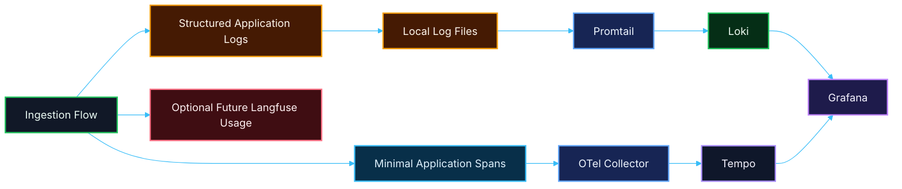

# 🔄 PR 16 — Primeira Integração Mínima da Aplicação com Logging e Tracing Estruturado
## Introdução do primeiro fluxo mínimo de emissão operacional da aplicação para a stack local de observabilidade

---

<div align="left">


</div>

---

> [!IMPORTANT]
> Esta PR introduz apenas a **primeira integração mínima da aplicação com a foundation local de observabilidade** já estabelecida na PR 15.
>
> Esta entrega inclui:
>
> - emissão mínima de **logs estruturados**
> - introdução mínima de **tracing local**
> - uso do fluxo de `ingestion` como **primeiro caso operacional validado**
> - integração explícita da aplicação com a stack local já existente
>
> **Esta PR não expande regras de negócio, não altera o domínio funcional e não transforma observabilidade em nova camada arquitetural da aplicação.**
>
> O objetivo aqui não é expandir a infraestrutura da PR 15, e sim **fazer a aplicação começar a utilizá-la de forma mínima, objetiva e revisável**.

---

## 📚 Sumário

1. [Síntese Executiva](#1-síntese-executiva)
2. [Objetivo do PR](#2-objetivo-do-pr)
3. [Decisão Arquitetural](#3-decisão-arquitetural)
4. [Escopo](#4-escopo)
5. [Fora de Escopo](#5-fora-de-escopo)
6. [Fluxo Arquitetural](#6-fluxo-arquitetural)
7. [Contratos Mínimos](#7-contratos-mínimos)
8. [Regras de Implementação](#8-regras-de-implementação)
9. [Integração Mínima da Aplicação](#9-integração-mínima-da-aplicação)
10. [Tree View Esperada da Entrega](#10-tree-view-esperada-da-entrega)
11. [Conteúdo Esperado dos Pontos de Integração](#11-conteúdo-esperado-dos-pontos-de-integração)
12. [Uso Operacional Local](#12-uso-operacional-local)
13. [Validação Inicial com Ingestion](#13-validação-inicial-com-ingestion)
14. [Critérios de Review](#14-critérios-de-review)
15. [Critérios de Aceite](#15-critérios-de-aceite)
16. [Conclusão](#16-conclusão)

---

## 1. Síntese Executiva

A PR 15 consolidou a **foundation local de observabilidade** do projeto, introduzindo uma stack mínima com:

- **Grafana**
- **Loki**
- **Promtail**
- **OpenTelemetry Collector**
- **Tempo**
- **Langfuse**

Com essa foundation já disponível, o próximo passo mínimo correto deixa de ser infraestrutura e passa a ser **integração real da aplicação com a stack local**.

> **A PR 16 existe para fazer a aplicação começar a emitir sinais operacionais úteis para a foundation já criada.**

Nesta entrega, o foco permanece pequeno e controlado:

- **logs estruturados mínimos**
- **traces mínimos**
- **integração explícita**
- **uso do fluxo de ingestion como primeiro caso validado**

A ideia continua a mesma: entregar um slice pequeno, funcional, revisável e sem overengineering.

Esta PR não busca instrumentar todo o sistema, não busca espalhar observabilidade pelo código inteiro e não tenta transformar tracing ou logging em feature arquitetural.

O fluxo da `ingestion` entra aqui como o primeiro caso natural de validação porque já existe, já percorre estados operacionais relevantes e já é suficiente para gerar sinais úteis de execução.

---

## 2. Objetivo do PR

Introduzir a primeira integração mínima da aplicação com a foundation local de observabilidade, permitindo que o runtime da aplicação emita sinais operacionais úteis para consumo da stack local sem alterar o comportamento funcional do domínio.

### Em termos práticos

Esta PR deve permitir:

- emitir logs estruturados mínimos a partir da aplicação
- emitir traces mínimos a partir de um fluxo útil e real
- utilizar a foundation da PR 15 sem alterar o domínio
- tornar a `ingestion` observável no caminho mínimo já existente
- manter a aplicação funcionalmente igual

### Resultado esperado

Ao final desta PR, o projeto deve ser capaz de:

- continuar executando normalmente
- gerar logs operacionais mínimos úteis
- enviar esses logs para o pipeline já disponível localmente
- gerar traces mínimos no fluxo validado
- permitir leitura local desses sinais na stack já provisionada
- usar a `ingestion` como primeiro fluxo real de validação da integração

> [!NOTE]
> O objetivo desta PR **não** é observabilidade ampla da aplicação.
>
> O objetivo é materializar o **primeiro uso real e mínimo** da foundation introduzida na PR 15.

---

## 3. Decisão Arquitetural

A decisão arquitetural desta PR é manter a foundation local da PR 15 como infraestrutura já estabelecida e introduzir apenas a menor camada possível de integração da aplicação com essa base.

Em termos práticos, isso significa:

- manter a stack da PR 15 como está
- não reabrir decisões de infraestrutura
- não alterar regras de negócio
- não inflar a aplicação com abstrações paralelas de observabilidade
- introduzir somente o logging e tracing mínimos necessários para validar a integração

### Boundary desta PR

A integração introduzida aqui deve ser entendida apenas como:

- emissão mínima de logs úteis
- emissão mínima de traces úteis
- correlação operacional básica do fluxo validado
- integração local com a stack já existente

Não há, neste recorte:

- observabilidade total da aplicação
- rollout transversal em todos os módulos
- engine própria de telemetry
- dashboards ricos
- métricas sofisticadas
- alerta
- tracing distribuído completo
- observability wrappers inflados
- camada genérica artificial só para “ficar bonita”

---

## 4. Escopo

Esta PR inclui:

- introdução do primeiro logging estruturado mínimo na aplicação
- introdução do primeiro tracing mínimo na aplicação
- integração do fluxo de `ingestion` com a foundation local de observabilidade
- correlação operacional mínima entre execução e sinais emitidos
- documentação objetiva do primeiro caso integrado
- preservação integral do comportamento funcional atual da aplicação

### Em termos de implementação

Espera-se que esta PR cubra:

- pontos mínimos de log no fluxo de `ingestion`
- pontos mínimos de span no fluxo de `ingestion`
- uso explícito de identificadores operacionais úteis
- integração da aplicação com a foundation já criada
- documentação objetiva do que foi integrado
- validação local de logs e traces emitidos

### Unidade mínima concluída nesta PR

A unidade operacional mínima desta entrega deve permanecer pequena e verificável:

- a aplicação continua executando como antes
- a `ingestion` passa a emitir logs úteis
- a `ingestion` passa a emitir traces mínimos
- o operador local consegue visualizar esses sinais na stack local
- a integração permanece pequena e revisável

---

## 5. Fora de Escopo

Esta PR **não** inclui:

- reestruturação da stack local da PR 15
- dashboards sofisticados
- alertas
- métricas ricas
- observabilidade aplicada a todos os módulos da aplicação
- tracing distribuído completo
- correlação completa entre múltiplos serviços
- taxonomia rica de eventos
- abstraction layer genérica para observabilidade
- observability SDK interno customizado
- rollout amplo de Langfuse em toda a aplicação
- alteração de comportamento funcional de domínio
- nova fase funcional da `ingestion`

> [!NOTE]
> A regra permanece:
>
> **integrar o mínimo útil antes de expandir.**

---

## 6. Fluxo Arquitetural



> [!IMPORTANT]
> Nesta PR, a observabilidade passa a ser **utilizada pela aplicação**, mas continua **sem interferir no comportamento funcional do domínio**.

---

## 7. Contratos Mínimos

Os contratos da aplicação devem continuar pequenos e aderentes ao recorte atual.

### Regra principal desta PR

Esta entrega **não deve inflar contratos de domínio**.

Isso significa:

- não alterar payloads de fila para acomodar observabilidade além do mínimo necessário de correlação operacional
- não alterar DTOs por causa de Grafana, Tempo ou Langfuse
- não transformar logs em requisito de negócio
- não transformar tracing em requisito de negócio
- não acoplar a execução funcional à disponibilidade da stack local

### Correlação mínima aceitável

É aceitável utilizar apenas identificadores operacionais já naturais do fluxo, como por exemplo:

- `ingestionId`
- `jobId`, quando existir
- `status`
- `failureReason`, quando aplicável

### Regra importante

Fora a materialização explícita de logs e spans mínimos, esta PR **não amplia** contratos de payload, processamento ou execução.

---

## 8. Regras de Implementação

### Aplicação

A aplicação deve:

- continuar simples
- manter o comportamento funcional atual
- emitir apenas logs mínimos úteis
- emitir apenas traces mínimos úteis
- continuar funcionando mesmo sem depender logicamente da stack local
- não absorver abstrações futuras desnecessárias

### Logging

O logging esperado nesta PR deve ser:

- estruturado
- mínimo
- explícito
- operacional
- útil para debugging local
- aderente ao fluxo validado

### Tracing

O tracing esperado nesta PR deve ser:

- mínimo
- pontual
- explícito
- útil
- não invasivo
- restrito ao primeiro fluxo validado

### Langfuse

Embora o Langfuse já faça parte da foundation local da PR 15, esta PR **não precisa forçar uso artificial dele** caso ainda não exista fluxo real de IA que justifique essa instrumentação.

O posicionamento correto nesta fase é:

- manter Langfuse disponível na foundation
- usar logs e traces como foco da primeira integração real
- deixar a integração funcional com Langfuse para o momento em que houver fluxo concreto que a justifique

### Configuração

A configuração deve:

- permanecer centralizada em `environment.ts`, quando aplicável
- seguir o padrão do projeto
- usar Zod quando houver novas variáveis
- não espalhar `process.env`
- não misturar observabilidade com regra de negócio

---

## 9. Integração Mínima da Aplicação

A integração mínima desta PR deve acontecer sobre o fluxo já existente da `ingestion`, por ser o primeiro caminho real e suficiente para validação local.

### Pontos mínimos aceitáveis de logging

É aceitável registrar eventos como:

- abertura da ingestion
- enqueue realizado
- início do processamento
- conclusão com sucesso
- conclusão com falha

### Pontos mínimos aceitáveis de tracing

É aceitável introduzir spans simples para:

- início do fluxo
- enqueue
- processamento
- conclusão terminal

### Correlação mínima útil

Os logs e spans devem permitir leitura mínima da execução com base em elementos como:

- `ingestionId`
- `status`
- `failureReason`, quando houver
- identificadores naturais do job, quando existirem

### Regra importante

O foco desta PR não é “instrumentar tudo”.

O foco é:

> **tornar um fluxo real minimamente observável de ponta a ponta usando a foundation local já criada.**

---

## 10. Tree View Esperada da Entrega

A tree view desta PR deve crescer apenas o necessário para refletir a primeira integração real da aplicação com a foundation já existente.

```text
src/
  modules/
    ingestion/
      ...
      application/
      domain/
      infrastructure/
        observability/
          ...
  shared/
    observability/
      ...
    logger/
      ...
  main.ts
  app.module.ts

docker/
  observability/
    grafana/
      provisioning/
        datasources/
          datasource.yml
    loki/
      config.yml
    promtail/
      config.yml
    otel-collector/
      config.yml
    tempo/
      config.yml
    langfuse/
      .env.example

docker-compose.observability.yml
logs/
.docker_data/
```

> [!NOTE]
> A tree view acima representa o posicionamento esperado da entrega.
>
> Os nomes exatos de arquivos e diretórios podem variar conforme o padrão real do projeto, desde que o recorte permaneça pequeno, explícito e aderente ao shape já existente do repositório.

---

## 11. Conteúdo Esperado dos Pontos de Integração

Abaixo está a forma esperada da integração desta PR em nível conceitual e operacional.

### Logging estruturado mínimo

A aplicação deve emitir logs estruturados contendo, quando aplicável:

```json
{
  "context": "Ingestion",
  "message": "Ingestion moved to processing",
  "ingestionId": "uuid",
  "status": "processing"
}
```

### Logging terminal de falha

```json
{
  "context": "Ingestion",
  "message": "Ingestion failed",
  "ingestionId": "uuid",
  "status": "failed",
  "failureReason": "short predictable reason"
}
```

### Tracing mínimo esperado

Os spans esperados devem ser pequenos e descritivos, por exemplo:

- `ingestion.start`
- `ingestion.enqueue`
- `ingestion.process`
- `ingestion.complete`
- `ingestion.fail`

### Resultado mínimo esperado da integração

Com essa integração aplicada:

- a aplicação passa a emitir sinais operacionais reais
- o fluxo de `ingestion` passa a ser observável localmente
- Loki passa a receber logs gerados pela execução real da aplicação
- Tempo passa a receber traces mínimos úteis
- Grafana passa a refletir sinais concretos da aplicação, e não apenas da infraestrutura

---

## 12. Uso Operacional Local

### Subida da stack

```bash
docker compose -f docker-compose.observability.yml up -d
```

### Execução da aplicação

Após subir a stack local:

1. iniciar a aplicação
2. executar um fluxo de `ingestion`
3. validar logs estruturados gerados no diretório local configurado
4. validar traces mínimos emitidos pelo fluxo integrado
5. consultar logs no Grafana
6. consultar traces no Tempo via Grafana

### Acessos esperados

- **Grafana** → `http://localhost:3003`
- **Loki** → `http://localhost:3101`
- **Tempo** → `http://localhost:3201`
- **Langfuse** → `http://localhost:3004`

### Consulta mínima esperada de logs

```logql
{job="application", env="local"}
```

### Resultado esperado

O operador local deve conseguir:

- ver logs reais da aplicação chegando no Loki
- consultar esses logs no Grafana
- ver traces mínimos do fluxo validado chegando ao Tempo
- usar a stack local da PR 15 como ambiente real de observação do primeiro fluxo integrado

---

## 13. Validação Inicial com Ingestion

Embora esta PR continue sendo transversal no sentido de observabilidade, a validação inicial correta permanece sendo o fluxo de `ingestion`, por já existir e por já representar um caminho pequeno, útil e revisável.

### Por que usar ingestion como primeiro caso

Porque o fluxo já possui:

- abertura
- persistência
- enqueue
- consumo
- transição de status
- encerramento terminal
- erro mínimo persistido

Ou seja, ele já fornece material suficiente para validar:

- logging mínimo útil
- tracing mínimo útil
- correlação operacional local
- integração real com a foundation

### O que validar nesta PR

É aceitável validar se:

- o fluxo gera logs úteis localmente
- o caminho feliz pode ser observado
- o caminho de falha pode ser observado
- spans mínimos podem ser emitidos no fluxo validado
- a aplicação permanece funcionalmente íntegra

### Regra importante

A `ingestion` entra aqui apenas como:

- **primeiro fluxo real validado**
- **fonte inicial de sinais operacionais**
- **caso mínimo de integração com a foundation**

Ela **não redefine o escopo da PR 16 como nova expansão funcional do domínio**.

---

## 14. Critérios de Review

O review desta PR deve validar se:

- a PR 16 está corretamente posicionada como **primeira integração mínima da aplicação com a foundation local**
- a stack local da PR 15 foi reutilizada sem reabertura indevida de infraestrutura
- os logs introduzidos são mínimos, estruturados e úteis
- o tracing introduzido é mínimo, claro e não invasivo
- a aplicação continua funcionalmente igual
- não existe acoplamento indevido entre domínio e observabilidade
- não foram criadas abstrações genéricas desnecessárias
- a `ingestion` foi usada apenas como primeiro caso real de validação
- o recorte permaneceu pequeno, funcional e revisável

---

## 15. Critérios de Aceite

Esta PR pode ser considerada aceita se:

- [ ] o comportamento funcional atual da aplicação continuar operando sem alteração de domínio
- [ ] a aplicação passar a emitir logs estruturados mínimos
- [ ] os logs puderem ser visualizados localmente na stack da PR 15
- [ ] a aplicação passar a emitir traces mínimos no fluxo validado
- [ ] os traces puderem ser inspecionados localmente via Tempo/Grafana
- [ ] a integração permanecer restrita ao primeiro slice útil
- [ ] a `ingestion` puder ser usada como validação inicial da integração
- [ ] não houver abstração prematura de observabilidade
- [ ] não houver reabertura indevida da infraestrutura já concluída na PR 15
- [ ] o recorte permanecer pequeno, funcional e revisável

---

## 16. Conclusão

A PR 16 introduz o próximo passo correto após a foundation local de observabilidade da PR 15:

> **fazer a aplicação começar a utilizar a stack local de observabilidade por meio de logs estruturados e traces mínimos em um fluxo real já existente, preservando o recorte pequeno e sem expandir o domínio.**

Em resumo:

- esta PR é continuação lógica da foundation introduzida na PR 15
- esta PR não amplia infraestrutura
- esta PR introduz o primeiro uso real da observabilidade na aplicação
- **logs estruturados mínimos** passam a existir no fluxo validado
- **traces mínimos** passam a existir no fluxo validado
- a `ingestion` é usada como primeiro caso operacional real
- o ambiente continua pequeno, explícito e revisável

Esta entrega transforma a foundation local da PR 15 em uso real da aplicação, sem inflar arquitetura, sem abstrações cosméticas e sem esconder expansão indevida de escopo.
