# 🔄 PR 17 — Primeira Correlação Operacional Mínima entre Logs e Traces
## Introdução da primeira leitura correlacionada ponta a ponta do fluxo validado na stack local de observabilidade

---

<div align="left">


</div>

---

> [!IMPORTANT]
> Esta PR introduz apenas a **primeira correlação operacional mínima entre logs e traces** sobre a integração mínima da aplicação estabelecida na PR 16.
>
> Esta entrega inclui:
>
> - correlação mínima entre **logs estruturados** e **spans**
> - propagação explícita e pequena de **identificadores operacionais úteis**
> - uso do fluxo de `ingestion` como **primeiro caso correlacionado ponta a ponta**
> - melhoria objetiva da leitura local da execução sem alterar o domínio
>
> **Este PR não expande regras de negócio, não altera o domínio funcional, não reabre a foundation da PR 15, não reabre a integração mínima da PR 16 e não transforma observabilidade em framework interno da aplicação.**

---

## 📚 Sumário

1. [Síntese Executiva](#1-síntese-executiva)
2. [Objetivo do PR](#2-objetivo-do-pr)
3. [Decisão Arquitetural](#3-decisão-arquitetural)
4. [Escopo](#4-escopo)
5. [Fora de Escopo](#5-fora-de-escopo)
6. [Fluxo Arquitetural](#6-fluxo-arquitetural)
7. [Contratos Mínimos](#7-contratos-mínimos)
8. [Regras de Implementação](#8-regras-de-implementação)
9. [Correlação Mínima da Aplicação](#9-correlação-mínima-da-aplicação)
10. [Tree View Esperada da Entrega](#10-tree-view-esperada-da-entrega)
11. [Conteúdo Esperado dos Pontos de Correlação](#11-conteúdo-esperado-dos-pontos-de-correlação)
12. [Uso Operacional Local](#12-uso-operacional-local)
13. [Validação Inicial com Ingestion](#13-validação-inicial-com-ingestion)
14. [Critérios de Review](#14-critérios-de-review)
15. [Critérios de Aceite](#15-critérios-de-aceite)
16. [Conclusão](#16-conclusão)

---

## 1. Síntese Executiva

A PR 15 consolidou a **foundation local de observabilidade** do projeto, com a stack mínima de inspeção local para logs e traces.

A PR 16 introduziu a **primeira integração mínima da aplicação** com essa foundation, permitindo que um fluxo real passasse a emitir:

- **logs estruturados mínimos**
- **traces mínimos**
- **sinais operacionais úteis no fluxo de ingestion**

Com isso resolvido, o próximo passo mínimo correto deixa de ser apenas emitir sinais e passa a ser **conseguir ler esses sinais de forma correlacionada**.

> **A PR 17 existe para tornar logs e traces do fluxo já validado minimamente conectados entre si.**

Nesta entrega, o foco continua pequeno e controlado:

- **correlação mínima entre logs e traces**
- **propagação pequena de contexto operacional**
- **leitura ponta a ponta do fluxo validado**
- **uso do fluxo de ingestion como primeiro caso correlacionado**

Esta PR não introduz uma nova iniciativa, não amplia cobertura transversal do sistema e não cria uma camada genérica de telemetry.

Ela apenas adiciona o próximo passo mínimo correto sobre a base já aprovada: **tornar mais legível a mesma execução que a PR 16 já passou a emitir**.

---

## 2. Objetivo do PR

Introduzir a primeira correlação operacional mínima entre logs estruturados e traces já emitidos pela aplicação, permitindo leitura local mais útil e consistente da execução de um fluxo real sem alterar o comportamento funcional do domínio.

### Em termos práticos

Esta PR deve permitir:

- correlacionar logs e spans do fluxo de `ingestion`
- propagar identificadores operacionais mínimos entre os pontos já instrumentados
- enriquecer os logs existentes apenas com contexto útil de correlação
- facilitar a leitura ponta a ponta da execução local
- manter a aplicação funcionalmente igual

### Resultado esperado

Ao final desta PR, o projeto deve ser capaz de:

- continuar executando normalmente
- emitir logs estruturados já contendo contexto mínimo de correlação
- emitir spans mínimos já alinhados aos identificadores operacionais naturais do fluxo
- permitir inspeção local mais útil da mesma execução em logs e traces
- preservar o escopo pequeno da integração introduzida na PR 16

> [!NOTE]
> O objetivo desta PR **não** é expandir a cobertura de observabilidade.
>
> O objetivo é materializar a **primeira leitura correlacionada mínima** dos sinais já introduzidos na PR 16.

---

## 3. Decisão Arquitetural

A decisão arquitetural desta PR é preservar a foundation local da PR 15 e a integração mínima da PR 16, introduzindo apenas a menor camada possível de **correlação operacional explícita** entre logs e traces.

Em termos práticos, isso significa:

- manter a stack da PR 15 como está
- manter a integração mínima da PR 16 como base já estabelecida
- não reabrir decisões de infraestrutura
- não alterar regras de negócio
- não inflar a aplicação com abstrações paralelas de correlação
- introduzir apenas contexto mínimo útil para leitura ponta a ponta do fluxo validado

### Boundary desta PR

A correlação introduzida aqui deve ser entendida apenas como:

- enriquecimento mínimo de logs com contexto de execução
- associação mínima entre logs e spans do mesmo fluxo
- propagação explícita e pequena de identificadores úteis
- melhoria da leitura local da execução real

Não há, neste recorte:

- observabilidade total da aplicação
- rollout transversal em todos os módulos
- taxonomia rica de eventos
- correlation engine própria
- wrappers genéricos para telemetry
- tracing distribuído completo
- enrichment automático sofisticado
- dashboards ricos
- alertas
- métricas avançadas
- camadas artificiais só para padronizar tudo

---

## 4. Escopo

Esta PR inclui:

- primeira correlação mínima entre logs estruturados e traces
- propagação pequena e explícita de identificadores operacionais no fluxo de `ingestion`
- enriquecimento mínimo dos logs existentes com contexto de correlação
- alinhamento mínimo entre spans e leitura operacional do fluxo
- documentação objetiva do primeiro caso correlacionado
- preservação integral do comportamento funcional atual da aplicação

### Em termos de implementação

Espera-se que esta PR cubra:

- uso consistente de `ingestionId` como identificador operacional principal
- uso de `jobId`, quando existir, como identificador complementar
- inclusão de `traceId` e `spanId` nos logs, quando disponível
- alinhamento entre logs emitidos e spans do mesmo caminho de execução
- integração local sem dependência lógica da stack
- documentação objetiva da correlação adicionada

### Unidade mínima concluída nesta PR

A unidade operacional mínima desta entrega deve permanecer pequena e verificável:

- a aplicação continua executando como antes
- os logs existentes passam a carregar contexto mínimo de correlação
- os spans existentes passam a refletir melhor o fluxo validado
- o operador local consegue cruzar logs e traces da mesma execução
- a integração permanece pequena e revisável

---

## 5. Fora de Escopo

Esta PR **não** inclui:

- reestruturação da stack local das PRs 15 e 16
- dashboards sofisticados
- alertas
- métricas ricas
- observabilidade aplicada a todos os módulos da aplicação
- tracing distribuído completo
- correlação completa entre múltiplos serviços
- baggage complexa
- taxonomia rica de atributos
- abstraction layer genérica para observabilidade
- observability SDK interno customizado
- instrumentação ampla de Langfuse
- alteração de comportamento funcional de domínio
- nova fase funcional da `ingestion`

> [!NOTE]
> A regra permanece:
>
> **correlacionar o mínimo útil antes de expandir.**

---

## 6. Fluxo Arquitetural

```mermaid
%%{init: {
  "theme": "base",
  "themeVariables": {
    "background": "#0b1020",
    "primaryColor": "#111827",
    "primaryTextColor": "#e5f0ff",
    "primaryBorderColor": "#22d3ee",
    "lineColor": "#38bdf8",
    "secondaryColor": "#0f172a",
    "tertiaryColor": "#111827",
    "fontFamily": "Inter, Segoe UI, Arial",
    "clusterBkg": "#0f172a",
    "clusterBorder": "#334155"
  }
}}%%
flowchart LR
    A[Ingestion Flow]:::app --> B[Minimal Spans]:::trace
    B --> C[Active Trace Context]:::trace
    C --> D[Structured Logs with Correlation Fields]:::logs
    D --> E[Local Log Files]:::logs
    E --> F[Promtail]:::collector
    F --> G[Loki]:::storage
    G --> H[Grafana]:::ui

    C --> I[OTel Collector]:::collector
    I --> J[Tempo]:::traceStore
    J --> H

    classDef app fill:#111827,stroke:#22c55e,color:#ecfdf5,stroke-width:2px;
    classDef logs fill:#451a03,stroke:#f59e0b,color:#fff7ed,stroke-width:2px;
    classDef collector fill:#172554,stroke:#60a5fa,color:#eff6ff,stroke-width:2px;
    classDef storage fill:#052e16,stroke:#22c55e,color:#f0fdf4,stroke-width:2px;
    classDef ui fill:#1e1b4b,stroke:#c084fc,color:#f5f3ff,stroke-width:2px;
    classDef trace fill:#082f49,stroke:#38bdf8,color:#e0f2fe,stroke-width:2px;
    classDef traceStore fill:#0f172a,stroke:#a78bfa,color:#f5f3ff,stroke-width:2px;
```



> [!IMPORTANT]
> Nesta PR, a aplicação não apenas emite sinais: ela passa a emitir sinais **minimamente correlacionáveis** no mesmo fluxo validado, sem interferir no comportamento funcional do domínio.

---

## 7. Contratos Mínimos

Os contratos da aplicação devem continuar pequenos e aderentes ao recorte atual.

### Regra principal desta PR

Esta entrega **não deve inflar contratos de domínio**.

Isso significa:

- não alterar payloads de fila para acomodar correlação além do mínimo necessário
- não alterar DTOs por causa de Grafana, Tempo ou correlação de observabilidade
- não transformar `traceId` em requisito de negócio
- não transformar logs enriquecidos em contrato funcional
- não acoplar a execução funcional à disponibilidade da stack local

### Correlação mínima aceitável

É aceitável utilizar apenas identificadores operacionais já naturais do fluxo, como por exemplo:

- `ingestionId`
- `jobId`, quando existir
- `status`
- `failureReason`, quando aplicável
- `traceId`, quando disponível no contexto ativo
- `spanId`, quando disponível no contexto ativo

### Regra importante

Fora a materialização explícita de campos mínimos de correlação em logs e spans, esta PR **não amplia** contratos de payload, processamento ou execução.

---

## 8. Regras de Implementação

### Aplicação

A aplicação deve:

- continuar simples
- manter o comportamento funcional atual
- correlacionar apenas o mínimo útil
- continuar funcionando sem depender logicamente da stack local
- não absorver abstrações futuras desnecessárias

### Logging

O logging esperado nesta PR deve ser:

- estruturado
- mínimo
- explícito
- operacional
- enriquecido apenas com contexto útil de correlação
- aderente ao fluxo validado

### Tracing

O tracing esperado nesta PR deve ser:

- mínimo
- pontual
- explícito
- útil
- não invasivo
- alinhado aos eventos operacionais já logados

### Correlação

A correlação esperada nesta PR deve ser:

- pequena
- previsível
- legível
- consistente
- restrita ao primeiro fluxo validado
- baseada em identificadores naturais do fluxo e no contexto ativo de trace

### Configuração

A configuração deve:

- permanecer centralizada em `environment.ts`, quando aplicável
- seguir o padrão do projeto
- usar Zod quando houver novas variáveis
- não espalhar `process.env`
- não misturar correlação de observabilidade com regra de negócio

---

## 9. Correlação Mínima da Aplicação

A correlação mínima desta PR deve acontecer sobre o fluxo já existente da `ingestion`, por ser o primeiro caminho real e suficiente para validação local.

### Pontos mínimos aceitáveis de correlação em logging

É aceitável enriquecer logs já existentes com campos como:

- `ingestionId`
- `jobId`
- `status`
- `failureReason`
- `traceId`
- `spanId`

### Pontos mínimos aceitáveis de correlação em tracing

É aceitável introduzir ou ajustar atributos simples nos spans, como:

- `ingestion.id`
- `job.id`
- `ingestion.status`
- `ingestion.failure_reason`, quando houver

### Correlação mínima útil

Os logs e spans devem permitir leitura mínima da execução com base em elementos como:

- a mesma `ingestionId`
- o mesmo `jobId`, quando houver
- o `traceId` associado à execução ativa
- a transição de estado do fluxo
- o motivo terminal de falha, quando existir

### Regra importante

O foco desta PR não é enriquecer tudo.

O foco é:

> **tornar os sinais já emitidos minimamente conectados entre si para leitura ponta a ponta de uma execução real.**

---

## 10. Tree View Esperada da Entrega

A tree view desta PR deve crescer apenas o necessário para refletir a primeira correlação real entre logs e traces sobre a integração já existente.

```text
src/
  modules/
    ingestion/
      ...
      application/
      infrastructure/
        observability/
          ...
  shared/
    observability/
      tracing.ts
      correlation.ts
      ...
    infra/
      logger/
        logger.service.ts
      ...
  main.ts
  app.module.ts

docker/
  observability/
    grafana/
      provisioning/
        datasources/
          datasource.yml
    loki/
      config.yml
    promtail/
      config.yml
    otel-collector/
      config.yml
    tempo/
      config.yml
    langfuse/
      .env.example

docker-compose.observability.yml
logs/
.docker_data/
```

> [!NOTE]
> A tree view acima representa o posicionamento esperado da entrega.
>
> Os nomes exatos de arquivos e diretórios podem variar conforme o padrão real do projeto, desde que o recorte permaneça pequeno, explícito e aderente ao shape já existente do repositório.

---

## 11. Conteúdo Esperado dos Pontos de Correlação

Abaixo está a forma esperada da integração desta PR em nível conceitual e operacional.

### Logging estruturado mínimo com correlação

A aplicação deve emitir logs estruturados contendo, quando aplicável:

```json
{
  "context": "Ingestion",
  "message": "Ingestion moved to processing",
  "ingestionId": "uuid",
  "jobId": "bullmq-job-id",
  "status": "processing",
  "traceId": "trace-id",
  "spanId": "span-id"
}
```

### Logging terminal de falha com correlação

```json
{
  "context": "Ingestion",
  "message": "Ingestion failed",
  "ingestionId": "uuid",
  "jobId": "bullmq-job-id",
  "status": "failed",
  "failureReason": "short predictable reason",
  "traceId": "trace-id",
  "spanId": "span-id"
}
```

### Tracing mínimo esperado com atributos úteis

Os spans esperados devem continuar pequenos e descritivos, por exemplo:

- `ingestion.start`
- `ingestion.enqueue`
- `ingestion.process`
- `ingestion.complete`
- `ingestion.fail`

Com atributos mínimos como:

- `ingestion.id`
- `job.id`
- `ingestion.status`
- `ingestion.failure_reason`, quando houver

### Resultado mínimo esperado da correlação

Com essa correlação aplicada:

- a aplicação continua emitindo sinais operacionais reais
- o fluxo de `ingestion` passa a ser lido localmente com melhor contexto
- Loki passa a receber logs com contexto suficiente para cruzamento operacional
- Tempo passa a receber spans mínimos com atributos úteis do fluxo
- Grafana passa a permitir leitura mais clara da mesma execução em logs e traces

---

## 12. Uso Operacional Local

### Subida da stack

```bash
docker compose -f docker-compose.observability.yml up -d
```

### Execução da aplicação

Após subir a stack local:

1. iniciar a aplicação
2. executar um fluxo de `ingestion`
3. validar logs estruturados contendo campos mínimos de correlação
4. validar spans mínimos contendo atributos operacionais úteis
5. consultar logs no Grafana
6. consultar traces no Tempo via Grafana
7. cruzar a mesma execução usando `ingestionId` e, quando disponível, `traceId`

### Acessos esperados

- **Grafana** → `http://localhost:3003`
- **Loki** → `http://localhost:3101`
- **Tempo** → `http://localhost:3201`
- **Langfuse** → `http://localhost:3004`

### Consulta mínima esperada de logs

```logql
{job="application", env="local"} |= "ingestionId"
```

### Resultado esperado

O operador local deve conseguir:

- ver logs reais da aplicação chegando no Loki com contexto de correlação
- consultar esses logs no Grafana
- ver traces mínimos do fluxo validado chegando ao Tempo
- cruzar uma execução real usando identificadores operacionais pequenos e previsíveis
- usar a stack local como ambiente real de debugging correlacionado do primeiro fluxo integrado

---

## 13. Validação Inicial com Ingestion

Embora esta PR continue sendo transversal no sentido de observabilidade, a validação inicial correta permanece sendo o fluxo de `ingestion`, por já existir e por já representar um caminho pequeno, útil e revisável.

### Por que usar ingestion como primeiro caso correlacionado

Porque o fluxo já possui:

- abertura
- persistência
- enqueue
- consumo
- transição de status
- encerramento terminal
- erro mínimo persistido
- logs mínimos já introduzidos
- spans mínimos já introduzidos

Ou seja, ele já fornece material suficiente para validar:

- correlação mínima entre logs e traces
- propagação operacional pequena de contexto
- leitura ponta a ponta da execução local
- integração real mais útil com a foundation

### O que validar nesta PR

É aceitável validar se:

- o fluxo gera logs com campos mínimos de correlação
- o caminho feliz pode ser lido por meio de logs e spans conectáveis
- o caminho de falha pode ser lido por meio de logs e spans conectáveis
- a mesma execução pode ser inspecionada com base em `ingestionId` e `traceId`, quando disponível
- a aplicação permanece funcionalmente íntegra

### Regra importante

A `ingestion` entra aqui apenas como:

- **primeiro fluxo real correlacionado**
- **fonte inicial de contexto operacional conectado**
- **caso mínimo de leitura ponta a ponta sobre a foundation**

Ela **não redefine o escopo da PR 17 como nova expansão funcional do domínio**.

---

## 14. Critérios de Review

O review desta PR deve validar se:

- a PR 17 está corretamente posicionada como **primeira correlação mínima entre logs e traces**
- a foundation da PR 15 e a integração da PR 16 foram reutilizadas sem reabertura indevida
- os logs foram enriquecidos apenas com contexto mínimo útil
- os spans permanecem mínimos, claros e não invasivos
- a correlação introduzida é pequena, explícita e revisável
- a aplicação continua funcionalmente igual
- não existe acoplamento indevido entre domínio e observabilidade
- não foram criadas abstrações genéricas desnecessárias
- a `ingestion` foi usada apenas como primeiro caso real de correlação
- o recorte permaneceu pequeno, funcional e revisável

---

## 15. Critérios de Aceite

Esta PR pode ser considerada aceita se:

- [ ] o comportamento funcional atual da aplicação continuar operando sem alteração de domínio
- [ ] os logs estruturados existentes passarem a carregar contexto mínimo de correlação
- [ ] os logs puderem ser visualizados localmente na stack da PR 15
- [ ] os spans mínimos do fluxo validado permanecerem funcionais e úteis
- [ ] os spans puderem ser inspecionados localmente via Tempo/Grafana
- [ ] uma mesma execução puder ser lida de forma correlacionada em logs e traces
- [ ] a integração permanecer restrita ao primeiro slice útil
- [ ] a `ingestion` puder ser usada como validação inicial da correlação
- [ ] não houver abstração prematura de observabilidade
- [ ] não houver reabertura indevida da infraestrutura já concluída nas PRs 15 e 16
- [ ] o recorte permanecer pequeno, funcional e revisável

---

## 16. Conclusão

A PR 17 introduz o próximo passo correto após a foundation local de observabilidade da PR 15 e a primeira integração mínima da aplicação feita na PR 16:

> **tornar logs estruturados e traces mínimos do fluxo validado minimamente correlacionáveis, preservando o recorte pequeno e sem expandir o domínio.**

Em resumo:

- esta PR é continuação lógica da foundation introduzida na PR 15
- esta PR também é continuação direta da integração mínima introduzida na PR 16
- esta PR não amplia infraestrutura
- esta PR não amplia domínio
- esta PR introduz a primeira leitura correlacionada real da observabilidade na aplicação
- **logs estruturados mínimos** passam a carregar contexto de correlação
- **traces mínimos** passam a refletir atributos operacionais úteis
- a `ingestion` continua sendo o primeiro caso operacional real
- o ambiente continua pequeno, explícito e revisável

Esta entrega transforma a integração mínima da PR 16 em leitura operacional minimamente conectada, sem inflar arquitetura, sem abstrações cosméticas e sem esconder expansão indevida de escopo.

