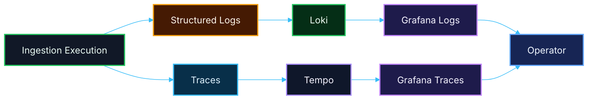

# 🔄 PR 18 — Primeira Leitura Operacional Guiada da Execução Correlacionada
## Introdução do primeiro fluxo guiado de consulta local para logs e traces correlacionados

---

<div align="left">


</div>

---

> [!IMPORTANT]
> Esta PR introduz apenas a **primeira leitura operacional guiada da execução correlacionada** sobre a base estabelecida na PR 17.
>
> Esta entrega inclui:
>
> - definição de fluxo mínimo de consulta entre **logs (Loki)** e **traces (Tempo)**
> - queries simples e reproduzíveis para leitura local
> - uso do fluxo de `ingestion` como primeiro caso guiado ponta a ponta
> - documentação objetiva de como inspecionar uma execução real
>
> **Esta PR não altera domínio, não adiciona infraestrutura e não introduz observabilidade avançada.**
>
> O objetivo é tornar a correlação da PR 17 **utilizável na prática para debugging local**.

---

## 📚 Sumário

1. [Síntese Executiva](#1-síntese-executiva)
2. [Objetivo do PR](#2-objetivo-do-pr)
3. [Decisão Arquitetural](#3-decisão-arquitetural)
4. [Escopo](#4-escopo)
5. [Fora de Escopo](#5-fora-de-escopo)
6. [Fluxo Arquitetural](#6-fluxo-arquitetural)
7. [Contratos Mínimos](#7-contratos-mínimos)
8. [Regras de Implementação](#8-regras-de-implementação)
9. [Fluxo Guiado de Consulta](#9-fluxo-guiado-de-consulta)
10. [Queries Mínimas](#10-queries-mínimas)
11. [Uso Operacional Local](#11-uso-operacional-local)
12. [Critérios de Review](#12-critérios-de-review)
13. [Critérios de Aceite](#13-critérios-de-aceite)
14. [Conclusão](#14-conclusão)

---

## 1. Síntese Executiva

A PR 15 introduziu a foundation local de observabilidade.

A PR 16 integrou a aplicação com logging e tracing mínimos.

A PR 17 introduziu a **correlação mínima entre logs e traces**.

Com isso resolvido, o próximo passo mínimo correto é:

> **tornar essa correlação utilizável de forma clara, reproduzível e operacional no ambiente local.**

A PR 18 não adiciona novos sinais nem amplia a instrumentação.

Ela apenas:

- organiza a forma de leitura
- documenta o fluxo de consulta
- torna explícito como usar o que já foi construído

---

## 2. Objetivo do PR

Permitir que um operador local consiga:

- executar um fluxo real de ingestion
- localizar seus logs
- identificar o trace correspondente
- navegar entre logs e spans da mesma execução

### Em termos práticos

Esta PR deve permitir:

- consultar logs por `ingestionId`
- identificar `traceId` nos logs
- abrir o trace correspondente no Tempo
- entender o fluxo ponta a ponta sem esforço manual excessivo

---

## 3. Decisão Arquitetural

A decisão desta PR é **não adicionar nenhuma nova capacidade técnica**, apenas tornar utilizável a já existente.

Isso implica:

- manter a stack da PR 15
- manter a integração da PR 16
- manter a correlação da PR 17
- não criar novas camadas
- não alterar contratos
- não introduzir abstração adicional

A leitura operacional passa a ser:

> responsabilidade do uso + documentação mínima, não de nova infraestrutura

---

## 4. Escopo

Esta PR inclui:

- definição de fluxo guiado de consulta
- queries mínimas para logs (Loki)
- queries mínimas para traces (Tempo)
- documentação do fluxo de debugging local
- validação do fluxo com `ingestion`

---

## 5. Fora de Escopo

Esta PR **não inclui**:

- dashboards avançados
- alertas
- métricas
- Prometheus
- instrumentação adicional
- tracing distribuído
- abstrações de query
- UI custom
- mudanças no domínio
- expansão de observabilidade

---

## 6. Fluxo Arquitetural



---

## 7. Contratos Mínimos

Nenhum contrato foi alterado nesta PR.

A leitura continua baseada em:

- `ingestionId`
- `jobId`
- `traceId`
- `spanId`
- `status`
- `failureReason`

---

## 8. Regras de Implementação

- nenhuma nova camada deve ser criada
- nenhuma alteração em domínio deve ocorrer
- nenhuma dependência nova deve ser introduzida
- manter foco em documentação e uso real
- evitar abstração de consulta

---

## 9. Fluxo Guiado de Consulta

### Passo a passo mínimo

1. executar um fluxo de ingestion
2. capturar `ingestionId`
3. buscar logs no Grafana (Loki)
4. identificar `traceId` nos logs
5. abrir trace correspondente no Tempo
6. navegar pelos spans da execução

---

## 10. Queries Mínimas

### Logs (Loki)

```logql
{job="application"} |= "ingestionId"
```

ou mais específico:

```logql
{job="application"} |= "ing-1"
```

### Objetivo

- localizar execução
- identificar `traceId`
- entender transição de status

---

## 11. Uso Operacional Local

### Subida da stack

```bash
docker compose -f docker-compose.observability.yml up -d
```

### Execução

- iniciar aplicação
- executar ingestion
- acessar Grafana
- consultar logs
- abrir trace correspondente

### Endpoints

- Grafana → http://localhost:3003
- Loki → http://localhost:3101
- Tempo → http://localhost:3201

---

## 12. Critérios de Review

O review deve validar se:

- a PR não introduz nova infraestrutura
- o fluxo de leitura está claro e reproduzível
- as queries são simples e funcionais
- a correlação da PR 17 foi reaproveitada sem expansão indevida
- a documentação está proporcional ao recorte

---

## 13. Critérios de Aceite

Esta PR pode ser considerada aceita se:

- [ ] um fluxo de ingestion puder ser executado localmente
- [ ] os logs puderem ser localizados por `ingestionId`
- [ ] o `traceId` puder ser identificado a partir dos logs
- [ ] o trace correspondente puder ser aberto no Tempo
- [ ] a navegação entre logs e traces estiver clara e reproduzível
- [ ] nenhuma nova infraestrutura tiver sido adicionada
- [ ] o recorte permanecer pequeno, funcional e revisável

---

## 14. Conclusão

A PR 18 introduz o próximo passo correto após a correlação mínima estabelecida na PR 17:

> **tornar a leitura da execução correlacionada utilizável, guiada e reproduzível no ambiente local.**

Em resumo:

- esta PR não adiciona nova instrumentação
- esta PR não amplia a infraestrutura
- esta PR não altera o domínio
- esta PR transforma a correlação mínima já existente em uso operacional real
- a `ingestion` continua sendo o primeiro caso validado
- o ambiente continua pequeno, explícito e revisável

Esta entrega fecha o primeiro ciclo operacional mínimo da observabilidade local: emitir, correlacionar e consultar com clareza.
