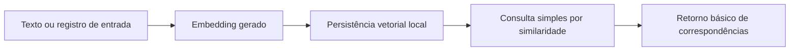

# 🔄 PR 19 — Foundation Mínima de Banco Vetorial para Uso Local
## Introdução do primeiro suporte operacional mínimo para armazenamento e consulta básica de embeddings no ambiente local

---

---

> [!IMPORTANT]
> Esta PR introduz apenas a **foundation mínima de banco vetorial para uso local**, adicionando a primeira capacidade operacional simples de persistir embeddings e executar consulta básica por similaridade.
>
> Esta entrega inclui:
>
> - estrutura mínima de armazenamento vetorial para desenvolvimento local
> - inserção simples de registros com embedding
> - consulta básica por similaridade sem camada genérica adicional
> - continuidade controlada da base atual, sem reabrir a arquitetura já aprovada
>
> **Este PR não introduz pipeline completo de retrieval, orquestração de agents, chunking avançado, ranking sofisticado, nem abstrações futuras de vector store.**

---

## 📚 Sumário

1. [Síntese Executiva](#1-síntese-executiva)
2. [Objetivo do PR](#2-objetivo-do-pr)
3. [Decisão Arquitetural](#3-decisão-arquitetural)
4. [Escopo](#4-escopo)
5. [Fora de Escopo](#5-fora-de-escopo)
6. [Fluxo Arquitetural](#6-fluxo-arquitetural)
7. [Contratos Mínimos](#7-contratos-mínimos)
8. [Regras de Implementação](#8-regras-de-implementação)
9. [Critérios de Review](#9-critérios-de-review)
10. [Critérios de Aceite](#10-critérios-de-aceite)
11. [Conclusão](#11-conclusão)

---

## 1. Síntese Executiva

As PRs anteriores fecharam dois blocos distintos do projeto:

- PRs 09 a 14 consolidaram o fluxo mínimo de ingestion
- PRs 15 a 18 consolidaram a foundation local de observabilidade e sua integração mínima com a aplicação

Com esses recortes já estabilizados, o próximo passo mínimo correto não é expandir ingestion nem aprofundar observabilidade, mas iniciar a base operacional do módulo de dados necessário para uso de embeddings no ambiente local.

Esta PR faz exatamente esse avanço, sem redesenhar a arquitetura já aceita e sem antecipar o restante do workflow de retrieval. O recorte aqui é estritamente inicial: disponibilizar armazenamento vetorial local e uma consulta simples por similaridade, suficientes para abrir o próximo eixo funcional do projeto com baixo ruído e facilidade de revisão.

---

## 2. Objetivo do PR

Este PR tem como objetivo:

- introduzir o primeiro suporte operacional mínimo para persistência local de embeddings
- permitir inserção simples de registros vetoriais
- permitir consulta básica por similaridade no ambiente local
- manter a implementação pequena, explícita e aderente ao padrão atual do projeto

---

## 3. Decisão Arquitetural

A decisão desta PR é iniciar o módulo vetorial pela menor foundation útil possível, preservando a arquitetura atual e adicionando apenas o próximo passo funcional mínimo.

Isso significa:

- manter a estrutura geral já aprovada do projeto
- introduzir apenas a base local necessária para armazenamento vetorial
- usar acesso objetivo e direto ao armazenamento, sem camada genérica de provider
- evitar adapters, wrappers, factories ou abstrações de portabilidade que ainda não têm demanda real
- limitar a entrega a persistência e consulta simples, sem embutir pipeline completo de retrieval

Em termos de posicionamento, esta PR não tenta resolver a experiência final de busca semântica. Ela apenas abre a capacidade mínima necessária para que essa evolução exista depois, de forma controlada e incremental.

---

## 4. Escopo

Esta PR inclui somente:

- foundation mínima de banco vetorial para uso local
- estrutura de persistência para registros com embedding
- operação de inserção simples de dados vetoriais
- operação de consulta básica por similaridade
- configuração local suficiente para validação operacional do fluxo mínimo
- manutenção do padrão arquitetural já consolidado no projeto

---

## 5. Fora de Escopo

Esta PR não inclui:

- workflow de agents
- pipeline completo de retrieval
- chunking de documentos
- ingestão semântica ponta a ponta
- re-ranking
- múltiplas estratégias de busca
- múltiplos backends de vector store
- abstração genérica para troca de engine
- otimizações avançadas de indexação
- filtros complexos de metadata
- observabilidade expandida do módulo vetorial
- redesign de módulos já existentes
- qualquer antecipação da próxima fase dentro deste mesmo slice

---

## 6. Fluxo Arquitetural

O fluxo desta PR permanece deliberadamente curto. Ele existe apenas para validar a capacidade mínima de armazenamento e consulta, sem inflar o módulo com etapas que pertencem a slices posteriores.

---

## 7. Contratos Mínimos

Esta PR introduz apenas os contratos mínimos necessários para o recorte.

Campos esperados no registro persistido, no nível mínimo do slice:

- identificador do registro
- conteúdo associado ao embedding
- vetor do embedding
- metadados mínimos, apenas se já forem necessários para a operação local

Regras para os contratos desta PR:

- não inventar campos além do necessário para persistência e consulta básica
- não modelar estrutura rica de documentos nesta etapa
- não acoplar o contrato atual a workflow futuro de agents
- manter o shape mínimo suficiente para inserção e busca simples

Se o projeto já possuir contratos auxiliares ao redor do fluxo de geração de embeddings, eles devem permanecer enxutos e estritamente aderentes ao uso local introduzido aqui.

---

## 8. Regras de Implementação

Para manter o recorte correto desta PR, a implementação deve seguir estes guardrails:

- controller, se existir no fluxo, deve permanecer fino e focado em entrada HTTP
- service ou módulo equivalente deve concentrar apenas a orquestração mínima da inserção e da consulta
- camada de persistência deve ficar restrita à escrita e leitura dos dados vetoriais
- evitar abstração prematura de vector store
- evitar provider genérico para engines futuras
- evitar helpers sem reutilização real
- evitar separação cosmética de arquivos sem ganho claro de manutenção
- evitar embutir pipeline de retrieval, ranking ou composição de contexto
- evitar preparar nesta PR integrações futuras que ainda não foram pedidas

A prioridade aqui é clareza operacional, não extensibilidade hipotética.

---

## 9. Critérios de Review

O review desta PR deve validar principalmente:

- se o recorte continua pequeno e claramente controlado
- se a PR realmente adiciona apenas storage e consulta vetorial básica
- se a arquitetura anterior foi mantida sem reabertura indevida
- se a implementação evita abstrações prematuras
- se o fluxo principal está explícito e fácil de seguir
- se a persistência vetorial foi introduzida com baixo ruído
- se o módulo permanece simples de testar localmente
- se não há preparação escondida para fases futuras

---

## 10. Critérios de Aceite

- [ ] existe suporte mínimo para persistir embeddings localmente
- [ ] existe operação simples de inserção de registros vetoriais
- [ ] existe operação simples de consulta por similaridade
- [ ] o fluxo pode ser validado localmente sem dependências arquiteturais extras
- [ ] a entrega não introduz abstração genérica de vector store
- [ ] o recorte permanece limitado a foundation local de armazenamento e busca básica

---

## 11. Conclusão

Esta PR inicia o módulo de dados vetoriais pelo menor passo funcional útil possível.

Em vez de antecipar retrieval completo, agents ou uma camada de abstração mais ampla, ela estabelece apenas a capacidade mínima de persistir e consultar embeddings no ambiente local. Com isso, o projeto ganha a base necessária para evoluir depois, preservando o padrão incremental já consolidado, sem inflar arquitetura e sem aumentar desnecessariamente o custo de review.
