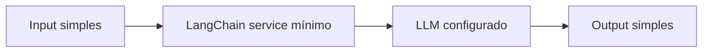

# 🔄 PR 22 — Fundação Inicial de LangChain
## Introdução da configuração mínima de LangChain para habilitar o primeiro eixo de workflows com agents

---

<div align="left">


</div>

---

> [!IMPORTANT]
> Esta PR inaugura o novo eixo do projeto após o fechamento do fluxo vetorial, adicionando apenas a configuração mínima de LangChain necessária para permitir a próxima etapa funcional ligada a agents.
>
> - preserva integralmente a base vetorial consolidada até a PR 21
> - não expande o fluxo de embeddings já encerrado no slice anterior
> - introduz somente o setup mínimo necessário para validação simples via LangChain
>
> **Este PR não implementa agents completos, workflows multi-step, tools, memória, scraping ou orquestração avançada.**

---

## 📚 Sumário

1. [Síntese Executiva](#1-síntese-executiva)  
2. [Objetivo do PR](#2-objetivo-do-pr)  
3. [Decisão Arquitetural](#3-decisão-arquitetural)  
4. [Escopo](#4-escopo)  
5. [Fora de Escopo](#5-fora-de-escopo)  
6. [Fluxo Arquitetural](#6-fluxo-arquitetural)  
7. [Contratos Mínimos](#7-contratos-mínimos)  
8. [Regras de Implementação](#8-regras-de-implementação)  
9. [Critérios de Review](#9-critérios-de-review)  
10. [Critérios de Aceite](#10-critérios-de-aceite)  
11. [Conclusão](#11-conclusão)  

---

## 1. Síntese Executiva

A PR 21 encerrou o recorte vetorial mínimo do projeto, consolidando o fluxo operacional necessário para geração, persistência e consulta inicial de embeddings dentro da arquitetura já aprovada.

Com o redirecionamento de produto, o próximo passo mínimo correto deixa de expandir o eixo vetorial e passa a abrir, de forma controlada, a base do novo eixo orientado a agents.

Esta PR faz exatamente esse movimento, sem redesenhar a aplicação e sem antecipar comportamento futuro. O recorte se limita a introduzir LangChain com a menor integração necessária para permitir uma primeira chamada simples de modelo, preservando tudo o que já foi estabilizado anteriormente.

Em termos práticos, esta entrega não constrói agents. Ela apenas estabelece a fundação mínima para que o primeiro workflow real desse novo eixo possa ser introduzido na sequência, com continuidade explícita e baixo risco de expansão indevida.

---

## 2. Objetivo do PR

- introduzir a dependência mínima de LangChain no projeto
- adicionar a configuração mínima necessária para comunicação com LLM por meio dessa integração
- validar um fluxo simples de entrada e saída mediado por LangChain
- preparar o repositório para o primeiro workflow incremental ligado a agents nas próximas PRs

---

## 3. Decisão Arquitetural

A arquitetura existente é mantida integralmente.

A decisão desta PR é introduzir LangChain apenas como camada mínima de integração com LLM, sem reabrir a organização já aprovada do projeto e sem transformar este slice em uma fundação genérica de agents.

Isso significa que a base vetorial permanece isolada como capability já concluída, enquanto o novo eixo começa de forma separada, explícita e pequena, com foco exclusivo em habilitar a próxima evolução funcional.

Não entram nesta PR:

- abstrações genéricas de agent runtime
- camada própria de orchestration
- registry de tools
- memória conversacional
- estrutura multi-provider além do mínimo necessário para o recorte

---

## 4. Escopo

Entra neste PR apenas:

- instalação das dependências mínimas de LangChain necessárias para o slice
- configuração mínima de acesso ao modelo seguindo o padrão de configuração do projeto
- criação de um serviço simples responsável por receber um input textual e obter um output textual
- validação básica do fluxo `input -> LangChain -> modelo -> output`
- cobertura mínima de teste compatível com o comportamento introduzido

---

## 5. Fora de Escopo

Fica explicitamente fora deste PR:

- implementação de agents completos
- workflow multi-step
- planner, executor ou coordinator
- tools dinâmicas
- integração com scraping ou leitura web
- memória conversacional
- integração com embeddings ou recuperação vetorial
- chains compostas além do fluxo mínimo validado
- abstrações para múltiplos modelos, múltiplos providers ou fallback
- observabilidade expandida específica para agents
- infraestrutura paralela para orquestração futura

---

## 6. Fluxo Arquitetural



O fluxo desta PR permanece intencionalmente pequeno: uma entrada textual simples é recebida pela camada mínima adicionada, encaminhada ao modelo configurado via LangChain e devolvida como resposta textual simples.

---

## 7. Contratos Mínimos

Os contratos deste slice devem permanecer os menores possíveis.

### Entrada mínima

```ts
type LangChainInput = {
  input: string;
};
```

### Saída mínima

```ts
type LangChainOutput = {
  output: string;
};
```

Não há necessidade, nesta fase, de introduzir estrutura adicional para contexto, tools, memory, metadata rica, intermediate steps ou composição de múltiplas mensagens além do mínimo estritamente necessário para o fluxo validado.

---

## 8. Regras de Implementação

Para preservar o recorte correto desta PR, a implementação deve seguir estes guardrails:

- manter controller fino, caso exista exposição HTTP para validação do fluxo
- concentrar a regra do slice em um serviço simples e explícito
- manter DAO/repository fora do fluxo quando não houver persistência real envolvida
- usar somente a configuração mínima necessária para viabilizar a chamada do modelo
- evitar abstrações prematuras para agents, tools, workflows ou providers
- não criar foundation paralela de orchestration
- não acoplar este slice ao fluxo vetorial já concluído
- não antecipar memória, planner, executor ou pipeline composto
- manter o código pequeno, revisável e alinhado ao padrão atual do repositório

---

## 9. Critérios de Review

O review desta PR deve validar principalmente:

- se a introdução de LangChain ficou limitada ao menor recorte funcional necessário
- se a arquitetura anterior permaneceu intacta e sem reabertura de decisões
- se o fluxo simples de entrada e saída está claro, explícito e verificável
- se não houve acoplamento indevido com o eixo vetorial
- se não houve criação de abstrações genéricas sem necessidade real
- se a implementação permanece aderente ao padrão do projeto e fácil de revisar
- se o texto e o código preservam o mesmo nível de controle de escopo das PRs anteriores

---

## 10. Critérios de Aceite

- [ ] LangChain foi adicionado apenas com as dependências mínimas necessárias para o recorte
- [ ] A configuração do modelo segue o padrão já adotado no projeto
- [ ] Existe um fluxo simples funcional de `input -> modelo -> output`
- [ ] O comportamento mínimo introduzido está coberto por teste compatível com o slice
- [ ] Não foram introduzidos agents completos, workflow multi-step, tools ou memória
- [ ] O eixo vetorial anterior permanece inalterado
- [ ] A PR permanece pequena, funcional e pronta para review sem expansão indevida

---

## 11. Conclusão

A PR 22 marca a transição controlada do projeto para o novo eixo ligado a agents sem inflar escopo e sem reabrir a arquitetura já aprovada.

Depois do fechamento do fluxo vetorial na PR 21, o próximo passo mínimo correto é apenas habilitar a integração base que permitirá a construção incremental do primeiro workflow real desse novo eixo. É exatamente isso que esta entrega faz: introduz LangChain no menor nível útil, preserva a simplicidade do projeto e deixa a próxima evolução preparada sem escondê-la dentro da PR atual.
