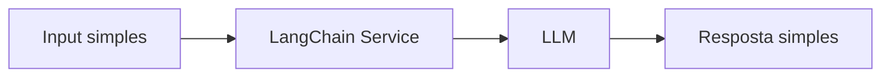

# 🔄 PR 22 — Fundação Inicial de LangChain
## Introdução da configuração mínima de LangChain para habilitar o futuro workflow de agents

---

<div align="left">


</div>

---

> [!IMPORTANT]
> Esta PR inicia o novo eixo do projeto após o fechamento do fluxo vetorial, introduzindo apenas a configuração mínima de LangChain necessária para viabilizar workflows de agents nas próximas etapas.
>
> - mantém intacta a base vetorial já construída
> - não expande o fluxo de embeddings além da PR 21
> - introduz apenas o setup mínimo de LangChain
>
> **Este PR não implementa agents completos, workflow complexo, scraping, tools dinâmicas ou orquestração avançada.**

---

## 📚 Sumário

1. Síntese Executiva  
2. Objetivo do PR  
3. Decisão Arquitetural  
4. Escopo  
5. Fora de Escopo  
6. Fluxo Arquitetural  
7. Contratos Mínimos  
8. Regras de Implementação  
9. Critérios de Review  
10. Critérios de Aceite  
11. Conclusão  

---

## 1. Síntese Executiva

As PRs anteriores (até a PR 21) consolidaram a fundação vetorial mínima do sistema, incluindo geração, persistência e leitura de embeddings.

Com o pivot definido, o projeto passa a focar na construção de workflows baseados em agents. A PR 22 inicia esse novo eixo de forma controlada, adicionando apenas a configuração mínima de LangChain necessária para viabilizar esse próximo passo.

Esta PR não tenta introduzir o conceito completo de agents. Ela apenas prepara o projeto para permitir que isso aconteça de forma incremental nas próximas entregas.

---

## 2. Objetivo do PR

- introduzir LangChain no projeto
- configurar um client mínimo de LLM via LangChain
- validar execução simples de input → modelo → output
- preparar a base para futuros workflows de agents

---

## 3. Decisão Arquitetural

A decisão é introduzir LangChain como camada de integração com LLMs, mantendo:

- a arquitetura existente intacta
- a base vetorial isolada como capability
- o novo eixo desacoplado inicialmente

Nenhuma abstração genérica de agents é criada nesta PR.

---

## 4. Escopo

- instalação e configuração mínima do LangChain
- criação de serviço simples para chamada de LLM
- integração mínima com configuração do projeto
- teste básico de execução

---

## 5. Fora de Escopo

- agents completos
- workflows multi-step
- integração com tools
- web scraping
- memória conversacional
- pipeline de agents
- abstrações genéricas

---

## 6. Fluxo Arquitetural



---

## 7. Contratos Mínimos

Entrada:

```ts
{
  input: string
}
```

Saída:

```ts
{
  output: string
}
```

---

## 8. Regras de Implementação

- manter implementação simples e direta
- não criar abstrações prematuras
- não introduzir múltiplos providers
- não acoplar com embeddings nesta fase

---

## 9. Critérios de Review

- LangChain está corretamente configurado
- fluxo simples funciona de ponta a ponta
- não há overengineering
- código segue padrão do projeto

---

## 10. Critérios de Aceite

- [ ] LangChain instalado e configurado
- [ ] Serviço de chamada LLM funcional
- [ ] Execução simples validada
- [ ] Testes básicos passando

---

## 11. Conclusão

A PR 22 inicia o novo eixo do projeto com o menor passo possível, preparando o terreno para workflows de agents sem antecipar complexidade.

Ela mantém o padrão incremental do projeto e garante que a próxima evolução (PR 23) possa focar na construção do primeiro workflow real.
