# 🔄 PR 23 — Primeiro Workflow Funcional com LangChain
## Introdução do primeiro fluxo operacional mínimo baseado em prompt sobre a fundação estabelecida na PR 22

---

<div align="left">


</div>

---

> [!IMPORTANT]
> Esta PR continua diretamente a PR 22 e adiciona somente o primeiro uso funcional mínimo da fundação de LangChain já introduzida.
>
> - preserva integralmente a base criada anteriormente
> - adiciona um único fluxo real orientado por prompt
> - valida uso fim a fim com recorte pequeno e revisável
>
> **Esta PR não implementa agents completos, tools dinâmicas, memória, planner, multi-step workflows ou orquestração avançada.**

---

## 📚 Sumário

1. [Síntese Executiva](#1-síntese-executiva)
2. [Objetivo do PR](#2-objetivo-do-pr)
3. [Decisão Arquitetural](#3-decisão-arquitetural)
4. [Escopo](#4-escopo)
5. [Fora de Escopo](#5-fora-de-escopo)
6. [Fluxo Arquitetural](#6-fluxo-arquitetural)
7. [Contratos Mínimos](#7-contratos-mínimos)
8. [Regras de Implementação](#8-regras-de-implementação)
9. [Critérios de Review](#9-critérios-de-review)
10. [Critérios de Aceite](#10-critérios-de-aceite)
11. [Conclusão](#11-conclusão)

---

## 1. Síntese Executiva

A PR 22 entregou apenas a fundação mínima necessária para introduzir LangChain no projeto.

Com essa base já estabelecida, o próximo passo mínimo correto é executar um fluxo real, simples e verificável, capaz de receber uma entrada textual, aplicar um prompt explícito e retornar uma saída útil.

Esta PR realiza somente esse avanço. Não há redesign arquitetural, expansão de plataforma ou antecipação de próximos estágios.

Ela converte a fundação anterior em um primeiro comportamento funcional concreto, mantendo o recorte pequeno, controlado e aderente ao padrão incremental já estabelecido.

---

## 2. Objetivo do PR

- introduzir o primeiro workflow funcional usando LangChain
- receber input textual simples
- aplicar prompt explícito e controlado
- retornar output útil ao consumidor
- validar o comportamento com teste proporcional ao slice

---

## 3. Decisão Arquitetural

A fundação da PR 22 permanece inalterada.

A decisão desta PR é consumir a base já criada em um único caso funcional explícito, mantendo o fluxo visível e sem criar abstrações para cenários ainda inexistentes.

O fluxo permanece intencionalmente simples: entrada, composição do prompt, execução via LangChain e retorno da resposta processada.

Não entram nesta PR:

- agents autônomos
- registry de tools
- memória conversacional
- planner
- multi-step workflow
- abstração genérica para múltiplos casos
- camada própria de orquestração

---

## 4. Escopo

Entra neste PR:

- serviço responsável por um workflow único
- prompt mínimo explícito e versionado no código
- execução via LangChain sobre o provider já configurado
- retorno padronizado da resposta
- teste mínimo do comportamento introduzido

---

## 5. Fora de Escopo

Não entra neste PR:

- múltiplos workflows
- agents completos
- tools externas
- memória conversacional
- planner
- execução multi-step
- fallback entre modelos
- observabilidade expandida
- filas, retries ou pipelines paralelos
- framework interno para fluxos futuros

---

## 6. Fluxo Arquitetural

```mermaid
%%{init: {'theme': 'dark', 'themeVariables': {
  'background': '#020617',
  'primaryColor': '#0f172a',
  'primaryTextColor': '#e5e7eb',
  'primaryBorderColor': '#22d3ee',
  'lineColor': '#22d3ee',
  'secondaryColor': '#111827',
  'secondaryTextColor': '#e5e7eb',
  'secondaryBorderColor': '#a855f7',
  'tertiaryColor': '#0b1120',
  'tertiaryTextColor': '#e5e7eb',
  'tertiaryBorderColor': '#38bdf8',
  'fontFamily': 'monospace'
}}}%%
flowchart LR
    A["Input textual"] --> B["Workflow service"]
    B --> C["Prompt explícito"]
    C --> D["LangChain + model"]
    D --> E["Output estruturado"]
```



O fluxo desta PR permanece pequeno e direto: uma entrada textual simples é processada por um único serviço, transformada em prompt explícito, enviada ao modelo por meio de LangChain e devolvida em formato útil ao consumidor.

---

## 7. Contratos Mínimos

### Entrada mínima

```ts
type WorkflowInput = {
  input: string;
};
```

### Saída mínima

```ts
type WorkflowOutput = {
  output: string;
};
```

Os contratos permanecem pequenos e suficientes para este primeiro caso funcional, sem metadata rica, histórico conversacional ou estrutura genérica antecipada.

---

## 8. Regras de Implementação

- manter controller fino, se houver HTTP
- concentrar o comportamento em serviço simples e coeso
- usar prompt explícito e fácil de revisar
- evitar abstrações para múltiplos workflows sem demanda real
- não criar foundation paralela
- não expandir o slice com capabilities futuras
- manter testes proporcionais ao recorte
- preservar código pequeno, claro e aderente ao padrão atual

---

## 9. Critérios de Review

Validar principalmente:

- se existe valor funcional real além da fundação da PR 22
- se o workflow ficou limitado a um caso mínimo e claro
- se o fluxo entrada -> prompt -> modelo -> saída está explícito
- se não houve abstração genérica desnecessária
- se a arquitetura anterior permaneceu intacta
- se o código está simples e fácil de revisar
- se o escopo permaneceu pequeno e controlado

---

## 10. Critérios de Aceite

- [ ] Existe um workflow funcional real usando LangChain
- [ ] O input textual é processado por prompt explícito
- [ ] O sistema retorna output útil e verificável
- [ ] O comportamento mínimo está coberto por teste compatível
- [ ] Não foram introduzidos agents, tools ou memória
- [ ] A arquitetura existente permaneceu preservada
- [ ] A PR segue pequena, funcional e pronta para review

---

## 11. Conclusão

A PR 23 transforma a fundação criada na PR 22 em uso funcional real com o menor passo possível.

Depois de introduzir LangChain no menor nível necessário, o próximo passo mínimo correto é validar um workflow simples, explícito e revisável. Esta entrega faz exatamente isso, sem inflar arquitetura, sem antecipar próximos estágios e sem perder controle de escopo.
