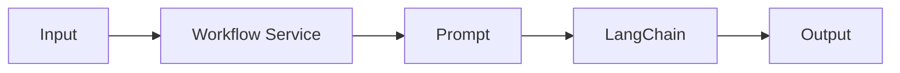

# 🔄 PR 23 — Primeiro Workflow Funcional com LangChain
## Introdução do primeiro fluxo operacional mínimo baseado em prompt sobre a fundação estabelecida na PR 22

---

<div align="left">


</div>

---

> [!IMPORTANT]
> Esta PR continua diretamente a PR 22 e adiciona somente o primeiro uso funcional mínimo da fundação de LangChain já introduzida.
>
> - preserva integralmente a base criada anteriormente
> - adiciona um único fluxo real orientado por prompt
> - valida uso fim a fim com recorte pequeno e revisável
>
> **Esta PR não implementa agents completos, tools dinâmicas, memória, planner, multi-step workflows ou orquestração avançada.**

## 📚 Sumário

1. Síntese Executiva
2. Objetivo do PR
3. Decisão Arquitetural
4. Escopo
5. Fora de Escopo
6. Fluxo Arquitetural
7. Contratos Mínimos
8. Regras de Implementação
9. Critérios de Review
10. Critérios de Aceite
11. Conclusão

## 1. Síntese Executiva

A PR 22 entregou apenas a fundação mínima necessária para introduzir LangChain no projeto.

Com essa base já estabelecida, o próximo passo mínimo correto é executar um fluxo real, simples e verificável, capaz de receber uma entrada textual, aplicar um prompt explícito e retornar uma saída útil.

Esta PR realiza somente esse avanço. Não há redesign arquitetural, expansão de plataforma ou antecipação de próximos estágios.

## 2. Objetivo do PR

- introduzir o primeiro workflow funcional usando LangChain
- receber input textual simples
- aplicar prompt explícito e controlado
- retornar output útil ao consumidor
- validar o comportamento com teste proporcional ao slice

## 3. Decisão Arquitetural

A fundação da PR 22 permanece inalterada.

A decisão desta PR é consumir a base existente em um único caso funcional explícito, mantendo o fluxo visível e sem criar abstrações para cenários ainda inexistentes.

Fluxo esperado: entrada -> prompt -> modelo -> resposta.

## 4. Escopo

Entra neste PR:

- serviço responsável por um workflow único
- prompt mínimo versionado no código
- execução via LangChain sobre provider já configurado
- retorno padronizado da resposta
- teste mínimo do comportamento introduzido

## 5. Fora de Escopo

Não entra neste PR:

- múltiplos workflows
- agents autônomos
- tools externas
- memória conversacional
- planner
- execução multi-step
- fallback entre modelos
- observabilidade expandida
- filas, retries ou pipelines paralelos
- framework interno para fluxos futuros

## 6. Fluxo Arquitetural



## 7. Contratos Mínimos

```ts
type WorkflowInput = {
  input: string;
};

type WorkflowOutput = {
  output: string;
};
```

## 8. Regras de Implementação

- controller fino, se houver HTTP
- serviço coeso e explícito
- prompt simples e fácil de revisar
- sem abstração prematura
- sem foundation paralela
- sem expansão de escopo
- testes proporcionais ao slice

## 9. Critérios de Review

Validar:

- existência de valor funcional real além da fundação
- fluxo claro de entrada até saída
- simplicidade da implementação
- ausência de overengineering
- aderência ao padrão atual do projeto
- recorte pequeno e revisável

## 10. Critérios de Aceite

- [ ] Existe um workflow funcional usando LangChain
- [ ] O input textual é processado por prompt explícito
- [ ] O sistema retorna output verificável
- [ ] Há teste mínimo compatível com o recorte
- [ ] Não foram adicionados agents, tools ou memória
- [ ] A arquitetura anterior foi preservada

## 11. Conclusão

A PR 23 transforma a fundação criada na PR 22 em uso funcional real com o menor passo possível.

A entrega permanece pequena, objetiva e revisável: sai da preparação técnica e entra no primeiro comportamento concreto do novo fluxo baseado em modelo.
