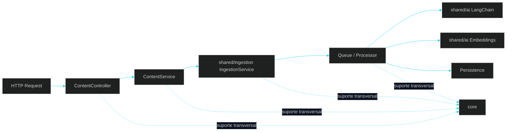

# 🧩 PR 28 — Reestruturação Inicial para Shared AI + Boundary Content
## Consolidação das capacidades reutilizáveis de IA, introdução de `core` e reposicionamento do domínio HTTP

---

<div align="left">


</div>

---

> [!IMPORTANT]
> A PR 27 concluiu o primeiro fluxo funcional de ingestion com processamento, uso aplicado de LangChain, geração de embeddings e persistência de resultado dentro do recorte atual.
>
> A PR 28 não amplia comportamento de negócio, não introduz novo pipeline funcional e não redefine a arquitetura operacional já validada.
>
> Este passo reorganiza a base técnica para separar com mais clareza:
>
> - a infraestrutura transversal da aplicação em `core`
> - as capacidades reutilizáveis de IA em `shared/ai`
> - o fluxo reutilizável de ingestion em `shared/ingestion`
> - o boundary HTTP de domínio em `modules/content`
>
> Esta PR também deixa explícito um ponto importante do ajuste arquitetural: **embeddings, langchain e ingestion não passam a ser tratados como módulos de domínio independentes**. O foco é manter essas capacidades como componentes compartilhados, consumidos pelo módulo de negócio quando necessário, com wiring mínimo e sem expansão estrutural desnecessária.
>
> **Este PR não cria foundation paralela, não antecipa arquitetura futura e não usa a reorganização como pretexto para inflar abstrações.**

# Sumário

1. [Síntese Executiva](#1-síntese-executiva)
2. [Objetivo do PR](#2-objetivo-do-pr)
3. [Decisão Arquitetural](#3-decisão-arquitetural)
4. [Escopo](#4-escopo)
5. [Fora de Escopo](#5-fora-de-escopo)
6. [Fluxo Arquitetural](#6-fluxo-arquitetural)
7. [Contratos Mínimos](#7-contratos-mínimos)
8. [Regras de Implementação](#8-regras-de-implementação)
9. [Critérios de Review](#9-critérios-de-review)
10. [Critérios de Aceite](#10-critérios-de-aceite)
11. [Conclusão](#11-conclusão)

# 1. Síntese Executiva

A PR 27 fechou o primeiro fluxo funcional mínimo de ingestion já conectado ao uso real de IA dentro da aplicação. Com isso, o sistema passou a ter um caminho operacional completo o suficiente para receber uma entrada, processá-la, gerar artefatos derivados e persistir o resultado dentro do recorte aprovado.

A PR 28 entra logo depois desse ponto, mas com um objetivo diferente: em vez de ampliar a capacidade funcional, ela reorganiza a base existente para refletir melhor a separação entre infraestrutura transversal, capacidades compartilhadas e boundary de domínio.

Na prática, este PR introduz `core` como espaço explícito para infraestrutura comum da aplicação, reposiciona as capacidades reutilizáveis de IA em `shared/ai`, mantém o fluxo reutilizável de ingestion em `shared/ingestion` e deixa o acesso HTTP do caso atual sob `modules/content`.

O fluxo continua o mesmo em essência. O que muda é a forma como ele passa a ficar estruturado e apresentado dentro do projeto.

Este é o próximo passo mínimo correto porque a aplicação já possui um fluxo funcional suficiente para justificar o ajuste de organização. Fazer isso agora reduz ambiguidade estrutural, melhora a leitura entre domínio e capability layer, e evita consolidar granulação acima do necessário.

# 2. Objetivo do PR

- introduzir `core` como espaço explícito para infraestrutura transversal da aplicação
- consolidar embeddings e langchain como capacidades compartilhadas sob `shared/ai`
- manter ingestion como fluxo reutilizável em `shared/ingestion`
- reposicionar o boundary HTTP do fluxo atual em `modules/content`
- preservar o fluxo funcional já validado na PR anterior, sem alteração de comportamento de negócio
- explicitar melhor a separação entre domínio exposto, capacidades compartilhadas e infraestrutura comum
- reduzir ambiguidade estrutural sem introduzir uma nova arquitetura paralela

# 3. Decisão Arquitetural

A decisão central desta PR é manter a arquitetura funcional atual e reorganizar sua distribuição física no repositório para deixá-la mais aderente ao papel de cada parte do sistema.

Com isso:

- `core` passa a concentrar infraestrutura transversal como config, observability, logger, database, redis e tipagens globais da aplicação
- `shared/ai` passa a concentrar capacidades reutilizáveis ligadas ao processamento de IA
- `shared/ingestion` passa a concentrar o fluxo reutilizável de ingestion já validado
- `modules/content` passa a representar o boundary de domínio exposto via HTTP para esse fluxo

Esta PR também corrige a leitura de organização para evitar excesso estrutural: embeddings, langchain e ingestion não passam a existir como módulos de domínio independentes. O foco é manter consumo direto dos serviços, DAOs, libs e providers realmente necessários, com o menor nível de ceremony compatível com o funcionamento da aplicação.

Esta PR não propõe redesign do pipeline já introduzido. Ela apenas reposiciona os elementos atuais de forma mais coerente com a direção do projeto: boundary HTTP em módulo de domínio, capability layer compartilhada em `shared` e infraestrutura transversal explícita em `core`.

# 4. Escopo

Entra nesta PR:

- introduzir `core` para infraestrutura comum da aplicação
- mover database, logger, observability, redis, config e tipagens globais para `core`
- consolidar embeddings e langchain em `shared/ai`
- manter ingestion em `shared/ingestion`
- reposicionar o acesso HTTP do fluxo atual no módulo `content`
- introduzir `ContentController` como boundary HTTP explícito do domínio
- introduzir `ContentService` como ponto mínimo de orquestração do domínio exposto
- ajustar imports, wiring, providers e referências de caminho para refletir a nova organização
- remover camadas, arquivos e estruturas desnecessárias quando não sustentarem responsabilidade real
- ajustar testes, paths e setup complementar necessário para manter build, lint e suíte consistentes após a reorganização

# 5. Fora de Escopo

Não entra nesta PR:

- novo comportamento de negócio
- novo pipeline funcional de processamento
- mudança de contrato funcional além do reposicionamento do boundary HTTP
- múltiplos domínios consumidores de `shared/ai`
- abstrações genéricas para plugabilidade futura
- criação de módulos de domínio extras para capabilities compartilhadas
- factories, adapters ou providers extras sem necessidade do recorte atual
- retries, DLQ, observabilidade expandida ou controles adicionais de resiliência
- scraping, enriquecimento adicional ou novos casos de uso de content
- redesign da arquitetura já aprovada nas PRs anteriores

Esta seção é intencionalmente forte porque o objetivo aqui é proteger a leitura da PR: trata-se de um refactor estrutural pequeno e controlado, não de expansão funcional disfarçada.

# 6. Fluxo Arquitetural

O fluxo abaixo representa o que permanece funcionalmente igual após a reorganização, agora com infraestrutura transversal em `core`, boundary HTTP de domínio em `content` e capacidades reutilizáveis distribuídas entre `shared/ai` e `shared/ingestion`.



A principal leitura do diagrama é simples:

- o domínio exposto via HTTP fica claro em `content`
- ingestion permanece como fluxo compartilhado
- langchain e embeddings permanecem como capacidades compartilhadas
- `core` centraliza infraestrutura comum
- a reorganização não adiciona degraus artificiais ao caminho principal

# 7. Contratos Mínimos

Os contratos devem permanecer mínimos e proporcionais ao recorte atual.

## Boundary HTTP

```http
POST /content/ingestions
GET /content/ingestions/:id
```

## Regra de contrato neste PR

- o boundary passa a ser representado sob `content`
- o fluxo funcional já existente continua sendo o mesmo
- não há expansão de payload motivada pela reestruturação
- não há modelagem nova além da necessária para refletir a nova organização do boundary

Se o contrato anterior já estava funcionalmente correto, esta PR deve apenas preservá-lo sob a nova organização, sem inflar DTOs, sem inventar novos campos e sem aproveitar o refactor para reabrir decisões já resolvidas.

# 8. Regras de Implementação

Para manter o recorte controlado, a implementação desta PR deve seguir estas regras:

- `ContentController` deve permanecer fino e estritamente orientado ao boundary HTTP
- `ContentService` deve concentrar apenas a orquestração mínima do domínio exposto
- serviços, DAOs, libs e processors em `shared` devem continuar focados nas capacidades já existentes, sem assumir novas responsabilidades indevidas
- `core` deve concentrar apenas infraestrutura transversal reutilizável pela aplicação
- DAO/repository, quando aplicável, deve continuar restrito à persistência
- a reorganização deve preservar o fluxo visível e fácil de revisar
- não criar módulos extras quando o consumo direto de serviços, DAOs e libs já resolver o recorte
- não criar wrappers paralelos, helpers cosméticos ou camadas sem ganho concreto
- não usar a reestruturação como pretexto para antecipar genericismo ou suportes futuros
- manter o número de moving parts no mínimo necessário para o novo shape

Em resumo, este PR deve reorganizar sem sofisticar.

# 9. Critérios de Review

Na revisão, o foco deve estar em validar se a reestruturação realmente ficou pequena, controlada e aderente ao que o projeto precisa agora.

Validar especialmente:

- se a nova organização separa melhor infraestrutura transversal, capacidades compartilhadas e boundary de domínio
- se `core` ficou restrito a infraestrutura comum da aplicação
- se `content` ficou como boundary HTTP claro, sem assumir responsabilidades indevidas
- se ingestion permanece como fluxo compartilhado reutilizável
- se embeddings e langchain ficaram como capabilities compartilhadas sem expansão estrutural desnecessária
- se não houve criação de módulos e camadas ornamentais além do recorte real
- se o fluxo principal continua explícito e fácil de seguir
- se não houve regressão funcional no caminho já validado na PR 27
- se imports, wiring, providers, paths e setup complementar ficaram consistentes com a reorganização
- se a mudança continua pequena o suficiente para ser revisada sem ruído excessivo

# 10. Critérios de Aceite

- [ ] O fluxo funcional existente continua operando sem mudança de comportamento de negócio
- [ ] O boundary HTTP do recorte atual passa a estar representado em `modules/content`
- [ ] Embeddings e langchain passam a estar organizados em `shared/ai`
- [ ] Ingestion passa a estar organizado em `shared/ingestion`
- [ ] A infraestrutura transversal passa a estar centralizada em `core`
- [ ] Não foram introduzidos módulos e abstrações extras fora da necessidade real desta PR
- [ ] Imports, providers, wiring e referências de caminho foram ajustados corretamente para a nova estrutura
- [ ] Build, lint e suíte afetados pela reorganização permanecem íntegros
- [ ] O reviewer consegue identificar com clareza o que foi movido, o que foi mantido e o que não mudou funcionalmente

# 11. Conclusão

A PR 28 é um passo de reorganização estrutural, não de expansão funcional. Ela vem depois da consolidação do primeiro fluxo real de ingestion justamente para ajustar o shape do projeto a partir de algo já validado, e não com base em hipótese futura.

O ganho desta entrega está em tornar mais clara a separação entre infraestrutura transversal, domínio HTTP exposto e capacidades compartilhadas de IA, preservando o comportamento atual e mantendo o recorte pequeno, legível e revisável.

Com isso, o projeto segue avançando com continuidade, simplicidade e controle arquitetural, sem reabrir decisões já aprovadas e sem inflar a solução além do que esta fase realmente pede.
