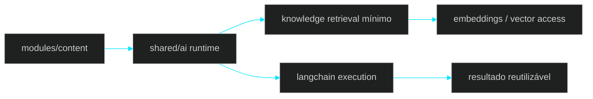

# 🧩 PR 29 — Fase 2: Foundation Inicial do Shared AI Runtime
## Primeira materialização funcional da foundation compartilhada de IA sobre a estrutura consolidada em `shared/ai`

---

---

> [!IMPORTANT]
> Esta PR é o primeiro passo funcional mínimo para materializar a discussion da foundation compartilhada de IA sem transformar a proposta inteira em uma entrega inflada.
>
> - mantém a reorganização estrutural já consolidada em `shared/ai`
> - introduz a primeira composição compartilhada entre runtime de execução e capacidade de retrieval já existente
> - preserva `content` como boundary de negócio, sem abrir novos módulos desnecessários
>
> **Este PR não entrega a discussion inteira, não introduz LangGraph completo, não abre múltiplos agents e não expande a árvore Nest além do que o recorte realmente precisa.**

---

## 📌 Sumário

1. Síntese Executiva  
2. Objetivo do PR  
3. Decisão Arquitetural  
4. Escopo  
5. Fora de Escopo  
6. Fluxo Arquitetural  
7. Contratos Mínimos  
8. Regras de Implementação  
9. Critérios de Review  
10. Critérios de Aceite  
11. Conclusão  

---

## 1. Síntese Executiva

A PR 28 reposicionou os componentes reutilizáveis de IA para `src/shared/ai` e limpou a fronteira entre capacidade compartilhada e boundary de negócio. Com isso, o projeto deixou de tratar LangChain, embeddings e peças correlatas como dependências espalhadas ou candidatas a módulos próprios de domínio.

A PR 29 continua exatamente dessa base. Em vez de abrir um novo produto ou antecipar toda a arquitetura proposta na discussion, ela adiciona o primeiro recorte funcional mínimo da foundation compartilhada: uma composição explícita entre runtime reutilizável de IA e a capacidade de conhecimento vetorial já existente, preservando o shape atual do repositório.

O passo é pequeno de propósito. Ele transforma a discussion em implementação inicial real sem reabrir arquitetura aprovada, sem proliferar módulos Nest e sem deixar o repositório parecer mais complexo do que o slice exige.

---

## 2. Objetivo do PR

- consolidar `shared/ai` como ponto real de composição das capacidades reutilizáveis de IA
- conectar runtime compartilhado e retrieval mínimo dentro da mesma base técnica já existente
- manter `modules/content` como boundary funcional consumidor da foundation
- evitar que cada nova capacidade vire um novo módulo de negócio ou uma nova foundation paralela
- preparar o próximo produto real sobre base comum, sem antecipar as fases posteriores da discussion

---

## 3. Decisão Arquitetural

A decisão central desta PR é manter a estrutura aprovada na PR 28 e dar a ela a primeira utilidade compartilhada real. A foundation passa a existir como composição interna em `src/shared/ai`, e não como um novo módulo de produto nem como uma microarquitetura paralela.

Na prática, o recorte assume que a base reutilizável já deve viver em `shared/ai`, enquanto os módulos em `src/modules` continuam representando boundaries funcionais do sistema. Por isso, a implementação deve privilegiar serviços, contratos e integrações compartilhadas dentro de `shared/ai`, evitando transformar cada pasta interna em um módulo Nest próprio quando isso não é necessário para o fluxo.

A discussion apontou uma direção mais ampla com runtime compartilhado, knowledge base vetorial e evolução posterior para agents mais ricos. Esta PR materializa apenas o começo correto dessa direção: um runtime compartilhado mínimo, apoiado na capacidade de embeddings/retrieval já presente, sem trazer ainda orquestração complexa, graph execution ou expansão transversal artificial.

---

## 4. Escopo

Entram nesta PR apenas os pontos necessários para o primeiro slice funcional da discussion:

- consolidação de `shared/ai` como base de composição compartilhada
- composição mínima entre capacidade de execução com LLM e capacidade de retrieval vetorial já existente
- uso dessa foundation a partir do boundary funcional já presente, sem abrir novo módulo de negócio
- organização interna aderente ao shape atual do repositório, preservando a lógica estrutural já aplicada
- manutenção de controllers finos e fluxo principal visível, com pouca cerimônia

---

## 5. Fora de Escopo

Ficam explicitamente fora desta PR:

- criação de módulo próprio para cada subcapacidade interna de `shared/ai`
- LangGraph completo, state machine ou durable orchestration
- múltiplos agents especializados
- tool registry genérico ou camada transversal inflada de tools
- rollout para vários módulos de negócio ao mesmo tempo
- chatbot jurídico, monitor legislativo, geração ampla de materiais ou qualquer outro produto além do primeiro consumo mínimo da foundation
- redesign de `content`, `auth`, `health` ou da estrutura-base já aprovada
- retries, filas novas, observabilidade expandida, cache, ACL ou qualquer preparo indireto de próximas fases

---

## 6. Fluxo Arquitetural

---

## 7. Contratos Mínimos

Esta PR não deve introduzir novo contrato HTTP nem inflar a modelagem pública do sistema. O foco é a composição interna da foundation compartilhada a partir das capacidades já existentes de LangChain e embeddings.

Quando houver contrato novo, ele deve ser apenas o estritamente necessário para ligar runtime e retrieval dentro de `shared/ai`, sem transformar o slice em uma API genérica de agents e sem inventar abstrações que ainda não têm mais de um consumidor real.

Em outras palavras: os contratos externos permanecem estáveis, e os contratos internos novos, se existirem, devem ser mínimos, explícitos e orientados ao fluxo desta PR.

---

## 8. Regras de Implementação

A implementação desta PR deve seguir a lógica estrutural já aplicada no projeto. `src/modules` continua reservado aos boundaries funcionais, enquanto `src/shared/ai` concentra capacidades reutilizáveis. Isso significa que a evolução da foundation deve acontecer prioritariamente por composição interna, e não por multiplicação de módulos Nest ou por criação de novas camadas com valor apenas organizacional.

O fluxo principal precisa continuar visível. Controllers seguem finos. Services ou orchestrators desta etapa devem ser coesos e explícitos. DAO permanece restrito à persistência e acesso vetorial, sem absorver regra de composição. Libraries ficam limitadas às integrações externas reais, como já ocorre com `langchain.lib.ts`. O que for apenas organização interna pode ser pasta, contrato ou serviço simples; não precisa virar módulo.

Também é regra desta PR não antecipar a arquitetura completa descrita na discussion. Nada de graph complex, nada de registry genérico, nada de estrutura pronta para cinco produtos diferentes. O objetivo é apenas estabelecer a primeira foundation compartilhada utilizável sobre o shape já aprovado.

---

## 9. Critérios de Review

O review desta PR deve validar principalmente os seguintes pontos:

- a PR continua a PR 28 de forma natural e sem redesenho
- `shared/ai` passa a ter utilidade funcional compartilhada real
- o consumo acontece a partir do boundary correto, sem espalhar lógica de IA
- não houve proliferação de módulos Nest sem necessidade real
- o fluxo principal ficou mais claro, não mais indireto
- LangChain, embeddings e retrieval permanecem integrados com baixo acoplamento e sem abstração cosmética
- a documentação e a implementação continuam proporcionais ao slice
- a PR materializa a discussion em primeiro passo real, mas sem tentar entregar o roadmap inteiro de uma vez

---

## 10. Critérios de Aceite

- [ ] `shared/ai` passa a concentrar a primeira composição funcional compartilhada entre execução com LLM e retrieval mínimo
- [ ] `modules/content` ou o boundary funcional equivalente consome a foundation sem duplicar lógica de IA
- [ ] não foram criados módulos Nest adicionais apenas por organização interna de pastas
- [ ] a estrutura do repositório permanece coerente com a separação entre capability compartilhada e módulo de negócio
- [ ] não há introdução de LangGraph completo, múltiplos agents ou abstrações genéricas fora do recorte
- [ ] o fluxo principal da entrega pode ser entendido rapidamente por leitura de poucos arquivos centrais
- [ ] a PR mantém baixo ruído arquitetural e não reabre decisões já aprovadas

---

## 11. Conclusão

A PR 29 é a primeira implementação real da direção definida na discussion, mas em escala compatível com o padrão do projeto. Depois da reorganização estrutural da PR 28, o passo correto agora é dar utilidade compartilhada a `shared/ai` sem transformar essa evolução em um redesign amplo.

O ganho desta entrega está em consolidar a foundation mínima onde ela deve viver, conectar runtime e knowledge retrieval de forma controlada e preservar os módulos de negócio como consumidores, não como donos da infraestrutura de IA. Isso mantém o repositório simples, aderente ao shape atual e pronto para a próxima evolução sem inflar a fase presente.
