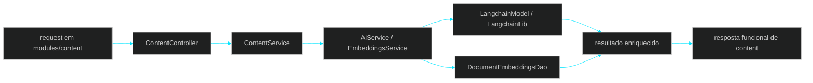

# 🧩 PR 31 — Fase 2: Segundo Consumo Funcional do Shared AI Runtime
## Consolidação do runtime compartilhado com ampliação controlada do fluxo real em `modules/content`

---

---

> [!IMPORTANT]
> Esta PR é a continuação direta da PR 30. Depois de validar o primeiro consumo funcional do runtime compartilhado em `modules/content`, o próximo passo correto é consolidar esse uso com uma evolução pequena e real do mesmo boundary.
>
> - mantém a foundation compartilhada introduzida na PR 29
> - preserva o primeiro consumo funcional entregue na PR 30
> - amplia o valor do fluxo de `content` reutilizando a mesma capability já consolidada
>
> **Este PR não expande a foundation, não introduz novos módulos consumidores, não abre múltiplos fluxos paralelos, não cria framework genérico de agents e não amplia o recorte além da evolução natural do consumo já iniciado.**

---

## 📌 Sumário

1. [Síntese Executiva](#1-síntese-executiva)
2. [Objetivo do PR](#2-objetivo-do-pr)
3. [Decisão Arquitetural](#3-decisão-arquitetural)
4. [Escopo](#4-escopo)
5. [Fora de Escopo](#5-fora-de-escopo)
6. [Fluxo Arquitetural](#6-fluxo-arquitetural)
7. [Contratos Mínimos](#7-contratos-mínimos)
8. [Regras de Implementação](#8-regras-de-implementação)
9. [Critérios de Review](#9-critérios-de-review)
10. [Critérios de Aceite](#10-critérios-de-aceite)
11. [Conclusão](#11-conclusão)

---

## 1. Síntese Executiva

A PR 30 comprovou que a foundation criada em `shared/ai` já podia ser consumida por um fluxo real dentro de `modules/content`. O foco foi validar reutilização concreta com baixo ruído e sem duplicação local.

A PR 31 continua exatamente desse ponto. Em vez de abrir novos boundaries ou crescer a infraestrutura compartilhada, a evolução acontece dentro do mesmo módulo consumidor, enriquecendo o fluxo já existente com uma segunda capacidade funcional real sobre a mesma base.

O ganho desta entrega está em transformar uma validação inicial em uso mais consistente, mostrando que o runtime compartilhado suporta evolução incremental do produto sem exigir reorganização estrutural a cada novo passo.

---

## 2. Objetivo do PR

- consolidar o consumo iniciado na PR 30 no mesmo boundary funcional
- ampliar o fluxo de `modules/content` com nova capacidade útil e proporcional ao slice
- continuar reutilizando `AiService`, `EmbeddingsService`, `LangchainModel`, `LangchainLib` e acesso vetorial existentes
- evitar duplicação local ou especializações prematuras no módulo consumidor
- provar que a foundation suporta evolução incremental real

---

## 3. Decisão Arquitetural

A decisão central desta PR é evoluir comportamento sem mover responsabilidades. `shared/ai` continua dono das capacidades técnicas reutilizáveis; `modules/content` continua responsável apenas pela orquestração do seu caso de uso.

Nesta etapa, o valor não está em criar novas camadas, e sim em reutilizar melhor a base existente. A arquitetura aprovada permanece intacta: capability compartilhada concentrada em `shared/ai` e boundary consumidor enxuto usando somente o que precisa.

---

## 4. Escopo

- evolução de `content.controller.ts`, `content.service.ts` e `content.module.ts` no fluxo já existente
- ampliação controlada do uso de `AiService` e `EmbeddingsService`
- reaproveitamento integral dos componentes existentes em `shared/ai`
- composição mínima entre entrada HTTP, serviço funcional e resposta mais útil ao consumidor
- manutenção do shape atual do projeto, com fluxo principal explícito e poucas moving parts

---

## 5. Fora de Escopo

- expansão estrutural adicional dentro de `shared/ai`
- novos módulos consumidores além de `content`
- múltiplos fluxos funcionais simultâneos
- abstração genérica para prompts, agents, tools ou pipelines
- LangGraph, planner, memória conversacional ou orquestração complexa
- redesign de contratos públicos sem pressão real
- retries, cache, observabilidade expandida, fila dedicada, fallback de modelo
- qualquer antecipação indireta da próxima fase

---

## 6. Fluxo Arquitetural

---

## 7. Contratos Mínimos

Esta PR não deve inflar contratos públicos nem introduzir interfaces genéricas de IA. Qualquer ajuste de contrato deve existir apenas para suportar a evolução real do fluxo em `content`.

Os contratos internos de `shared/ai` permanecem pequenos e orientados às capacidades já existentes. O boundary consumidor continua pedindo somente o necessário para seu caso de uso atual.

---

## 8. Regras de Implementação

O controller em `content` deve permanecer fino e focado em HTTP. O `ContentService` continua concentrando a orquestração mínima do caso de uso, agora com evolução controlada do fluxo já iniciado.

Em `shared/ai`, os serviços existentes permanecem responsáveis pelas capacidades reutilizáveis. Esta PR não existe para redistribuir responsabilidades, e sim para provar continuidade funcional usando a mesma base compartilhada.

---

## 9. Critérios de Review

- a PR continua a PR 30 de forma natural e incremental
- `modules/content` evolui o consumo de `shared/ai` sem duplicação local
- o fluxo entregue continua pequeno, concreto e fácil de revisar
- não houve expansão estrutural desnecessária em `shared/ai`
- o boundary de negócio permaneceu consumidor
- não foram criadas abstrações genéricas além da pressão real
- o fluxo principal continua explícito e com pouca cerimônia
- a entrega consolida a utilidade da foundation com novo valor funcional

---

## 10. Critérios de Aceite

- [ ] existe evolução funcional real em `modules/content` sobre o consumo introduzido na PR 30
- [ ] `content.controller.ts`, `content.service.ts` e `content.module.ts` permanecem simples e integrados ao uso de `shared/ai`
- [ ] `AiService` e `EmbeddingsService` seguem reutilizados como capability compartilhada
- [ ] `LangchainModel`, `LangchainLib` e `DocumentEmbeddingsDao` permanecem concentrados em `shared/ai`
- [ ] o controller do boundary permanece fino e o fluxo principal pode ser entendido rapidamente
- [ ] não foram introduzidos novos frameworks internos ou expansão estrutural indevida
- [ ] a implementação permanece proporcional ao slice e aderente ao shape atual do projeto

---

## 11. Conclusão

A PR 31 é o passo natural após a validação inicial feita na PR 30. Depois de comprovar o primeiro consumo funcional do runtime compartilhado, a evolução correta é consolidar esse uso com mais valor real dentro do mesmo boundary.

O ganho desta entrega está em mostrar continuidade arquitetural: a base compartilhada permanece estável, o módulo consumidor evolui sem duplicação e o projeto cresce por incrementos pequenos, revisáveis e coerentes.
