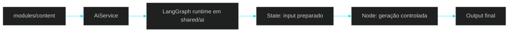

# 🧩 PR 32 — Fase 2: Foundation Inicial de LangGraph no Shared AI Runtime
## Introdução mínima de execução orientada a grafo sobre a foundation compartilhada existente

---

---

> [!IMPORTANT]
> Esta PR é a continuação natural da PR 31. Após consolidar o segundo consumo funcional do runtime compartilhado em um fluxo real dentro de `modules/content`, o próximo passo mínimo correto é introduzir a foundation inicial de LangGraph em `shared/ai`, sem alterar os boundaries aprovados e sem expandir a fase além do necessário.
>
> - preserva a foundation compartilhada consolidada nas PRs 29, 30 e 31
> - introduz execução mínima orientada a estado explícito dentro de `shared/ai`
> - mantém `modules/content` como consumidor fino, sem conhecer detalhes internos do graph
>
> **Este PR não cria sistema de agents completo, não introduz planner, memory, tool calling avançado, múltiplos grafos genéricos ou orquestração expandida.**

---

## 📌 Sumário

1. [Síntese Executiva](#1-síntese-executiva)
2. [Objetivo do PR](#2-objetivo-do-pr)
3. [Decisão Arquitetural](#3-decisão-arquitetural)
4. [Escopo](#4-escopo)
5. [Fora de Escopo](#5-fora-de-escopo)
6. [Fluxo Arquitetural](#6-fluxo-arquitetural)
7. [Contratos Mínimos](#7-contratos-mínimos)
8. [Regras de Implementação](#8-regras-de-implementação)
9. [Critérios de Review](#9-critérios-de-review)
10. [Critérios de Aceite](#10-critérios-de-aceite)
11. [Conclusão](#11-conclusão)

---

## 1. Síntese Executiva

A PR 29 consolidou a foundation inicial do `shared/ai` como boundary técnico reutilizável para capacidades de IA. A PR 30 validou o primeiro consumo funcional real dessa base em `modules/content`. A PR 31 deu sequência a essa linha, expandindo o mesmo fluxo real com reaproveitamento explícito do runtime já introduzido, sem reorganização estrutural e sem duplicação de capacidades.

A PR 32 continua exatamente essa trilha. Em vez de abrir uma nova frente arquitetural, ela adiciona o próximo passo funcional mínimo dentro da mesma foundation: a entrada controlada de LangGraph como mecanismo interno de execução orientada a estado explícito. O objetivo aqui não é sofisticar o produto, mas validar a presença do graph runtime dentro de `shared/ai` com o menor slice possível, preservando a simplicidade da integração atual.

Com isso, a arquitetura aprovada permanece a mesma. `shared/ai` continua como dono das capacidades técnicas reutilizáveis, enquanto `modules/content` segue como consumidor fino. O ganho desta PR está em provar que a base compartilhada já comporta um primeiro fluxo com LangGraph sem inflar escopo, sem introduzir abstrações genéricas e sem antecipar a próxima fase.

---

## 2. Objetivo do PR

- introduzir LangGraph de forma mínima dentro de `shared/ai`
- validar um primeiro fluxo com estado explícito e encadeamento controlado
- manter o boundary consumidor simples em `modules/content`
- preservar a foundation existente sem reestruturação ou duplicação
- estabelecer o primeiro uso real de graph runtime apenas no limite deste slice

---

## 3. Decisão Arquitetural

A decisão central desta PR é incorporar LangGraph como capability interna do runtime compartilhado, e não como nova camada dominante da aplicação. A foundation introduzida nas PRs anteriores permanece intacta: `shared/ai` segue como owner das capacidades reutilizáveis e `modules/content` continua consumindo um ponto funcional simples, sem conhecer estados, nós, edges ou detalhes internos do grafo.

Isso significa que LangGraph entra aqui como continuação controlada da foundation existente, apenas para suportar um fluxo mínimo com estado explícito. Não há redesign da arquitetura aprovada, não há criação de runtime paralelo e não há abertura prematura de uma abstração genérica de agents. A intenção da PR é apenas validar a entrada da tecnologia no lugar correto, com o menor acoplamento e a menor expansão estrutural possível.

---

## 4. Escopo

- adicionar o wiring mínimo necessário para LangGraph em `shared/ai`
- criar um graph inicial pequeno e legível, com estado simples
- executar um fluxo funcional real com um número mínimo de nós
- integrar esse fluxo ao runtime compartilhado já existente
- preservar `modules/content` como consumidor fino do boundary funcional atual
- manter a evolução proporcional ao slice e coerente com a sequência das PRs 29–31

---

## 5. Fora de Escopo

- sistema completo de agents
- planner, supervisor ou decisão dinâmica entre múltiplos caminhos
- memória conversacional ou persistência de estado entre execuções
- tool calling avançado ou ferramentas dinâmicas
- registry genérico de grafos
- múltiplos graphs reutilizáveis para cenários distintos
- rollout transversal para outros módulos consumidores
- observabilidade expandida específica para graph execution
- redesign de `shared/ai`, `modules/content` ou dos boundaries já aprovados
- qualquer expansão que antecipe fases posteriores dentro desta entrega

---

## 6. Fluxo Arquitetural

O fluxo continua pequeno e explícito. O consumidor aciona o mesmo boundary funcional, enquanto a composição orientada a estado passa a acontecer internamente dentro de `shared/ai`. Isso preserva a leitura do fluxo principal e evita expor complexidade desnecessária para fora da foundation.

---

## 7. Contratos Mínimos

Os contratos externos permanecem simples neste slice. `modules/content` não precisa conhecer estrutura de estado, definição de nós, edges ou qualquer shape interno do graph. A mudança desta PR é interna ao runtime compartilhado.

Se houver ajuste mínimo de contrato interno para suportar a execução orientada a estado, ele deve permanecer encapsulado em `shared/ai` e restrito ao necessário para o fluxo atual. Não há, nesta fase, criação de contrato público genérico para graphs, agents ou orchestration.

---

## 8. Regras de Implementação

A implementação deve seguir o menor graph possível, com estado explícito, fluxo visível e número mínimo de moving parts. O ponto central é tornar a entrada do LangGraph tecnicamente clara e funcional, sem transformar esta PR em preparação estrutural para uma plataforma futura.

O controller continua fino. O consumo em `modules/content` continua simples. A lógica de composição orientada a estado deve permanecer concentrada no runtime compartilhado, sem espalhar detalhes de graph pelo módulo consumidor. Também não devem ser introduzidos registries, factories, wrappers genéricos, abstrações de nodes, pipelines paralelos ou qualquer camada cosmética sem pressão real do recorte atual.

Sempre que houver dúvida entre granularizar mais ou manter o fluxo mais legível e coeso, esta PR deve favorecer a segunda opção.

---

## 9. Critérios de Review

- LangGraph foi introduzido com recorte pequeno, explícito e controlado
- a PR mantém continuidade direta com as PRs 29, 30 e 31
- `shared/ai` permaneceu owner das capacidades reutilizáveis
- `modules/content` continuou como consumidor fino, sem vazamento de complexidade do graph
- o fluxo principal segue fácil de revisar e explicar
- não houve criação de runtime paralelo ou foundation duplicada
- não foram introduzidas abstrações genéricas sem pressão real
- a documentação e a implementação permanecem proporcionais ao slice entregue

---

## 10. Critérios de Aceite

- [ ] existe integração mínima de LangGraph dentro de `shared/ai`
- [ ] o graph inicial executa um fluxo funcional pequeno e real
- [ ] o estado do fluxo está explícito apenas no nível necessário para este slice
- [ ] `modules/content` continua consumindo um boundary simples e estável
- [ ] não há duplicação arquitetural nem expansão estrutural indevida
- [ ] a implementação permanece coerente com a sequência das PRs 29, 30 e 31
- [ ] testes e validações existentes continuam passando

---

## 11. Conclusão

A PR 32 introduz LangGraph da forma mais controlada possível dentro da foundation já consolidada de `shared/ai`. Em vez de usar a entrada dessa tecnologia para reabrir arquitetura ou antecipar um ecossistema completo de agents, a entrega valida apenas o próximo movimento mínimo correto: um primeiro fluxo com estado explícito, integrado ao runtime compartilhado e consumido sem ruído por `modules/content`.

A progressão permanece pequena, coerente e revisável. O projeto segue evoluindo por incrementos reais, preservando simplicidade, clareza e controle de escopo.
