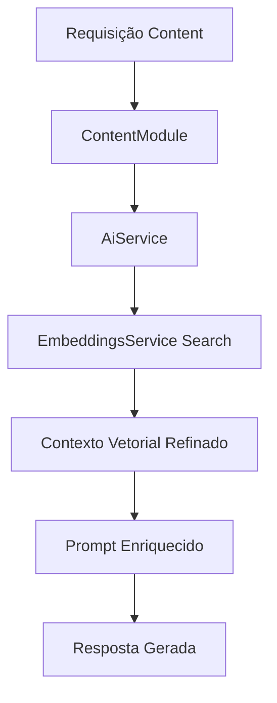

# 🚀 PR 36 — Fase 2: Content Knowledge Retrieval Refinement
## Primeiro refinamento mínimo da recuperação vetorial consumida pelo fluxo real de `content`

---

<div align="left">


</div>

---

> [!IMPORTANT]
> Esta PR aplica o próximo passo mínimo após a centralização do consumo em `content`: melhorar a utilidade do contexto vetorial já existente.
>
> - refina recuperação e composição do contexto no fluxo real
> - preserva `shared/ai` como owner técnico da capacidade compartilhada
> - mantém o recorte pequeno e revisável
>
> **Este PR não introduz reranking, novas fontes, pipelines paralelos ou expansão arquitetural.**

## 📌 Sumário
1. [Síntese Executiva](#1--síntese-executiva)
2. [Objetivo do PR](#2--objetivo-do-pr)
3. [Decisão Arquitetural](#3--decisão-arquitetural)
4. [Escopo](#4--escopo)
5. [Fora de Escopo](#5--fora-de-escopo)
6. [Fluxo Arquitetural](#6--fluxo-arquitetural)
7. [Contratos Mínimos](#7--contratos-mínimos)
8. [Regras de Implementação](#8--regras-de-implementação)
9. [Critérios de Review](#9--critérios-de-review)
10. [Critérios de Aceite](#10--critérios-de-aceite)
11. [Conclusão](#11--conclusão)

## 1. 🔎 Síntese Executiva

A PR 34 introduziu a base jurídica local e a ingestão vetorial mínima. A PR 35 consolidou o consumo funcional dessa capacidade dentro do `ContentModule`, mantendo `shared/ai` como boundary compartilhada.

A PR 36 não muda essa direção. O foco agora é refinar a recuperação já existente para que o contexto entregue ao modelo seja mais útil, previsível e melhor aproveitado no prompt enriquecido do fluxo real de negócio.

Trata-se de evolução incremental direta: melhorar o uso do que já existe antes de adicionar novas camadas.

## 2. 🎯 Objetivo do PR

- ajustar o consumo de contexto vetorial no `ContentModule`
- calibrar `knowledgeLimit` no fluxo real
- melhorar a composição do prompt enriquecido
- elevar utilidade prática das respostas baseadas na base local
- manter simplicidade operacional e facilidade de review

## 3. 🧱 Decisão Arquitetural

A arquitetura aprovada é mantida integralmente. `ContentModule` continua como consumidor funcional, enquanto `shared/ai` permanece responsável por `AiService`, `EmbeddingsService` e acesso vetorial.

A decisão desta PR é refinar comportamento de consumo e composição, sem criar módulo paralelo, sem redistribuir responsabilidades e sem antecipar mecanismos mais sofisticados de busca.

## 4. 📦 Escopo

- refinamento da recuperação vetorial usada por `content`
- ajustes no uso de `knowledgeLimit`
- melhoria da montagem de contexto no prompt final
- preservação do fluxo centralizado já aprovado
- manutenção do comportamento dentro do recorte atual

## 5. 🚫 Fora de Escopo

- reranking
- hybrid search
- filtros ricos de metadata
- múltiplas fontes documentais
- scheduler
- retry pipeline
- novos agents
- expansão de LangGraph
- observabilidade adicional fora do slice

## 6. 🔄 Fluxo Arquitetural



## 7. 🧩 Contratos Mínimos

Os contratos públicos permanecem os mesmos. O refinamento ocorre na forma de consumir contexto e compor o prompt, sem exigir nova superfície contratual obrigatória.

```ts
type ExecuteAiInput = {
  prompt: string;
  knowledgeQuery?: string;
  knowledgeLimit?: number;
};
```

## 8. ⚙️ Regras de Implementação

- controller permanece fino
- `ContentModule` orquestra apenas o fluxo de uso
- `shared/ai` concentra lógica compartilhada
- refino deve ser explícito e legível
- evitar abstrações novas sem necessidade
- não preparar próximas fases dentro desta entrega

## 9. 👀 Critérios de Review

Validar se:

- o fluxo continua simples
- houve melhoria real no uso do contexto recuperado
- responsabilidades seguem preservadas
- não houve expansão indevida de escopo
- o código permanece claro e proporcional ao slice
- a PR segue continuidade natural das PRs 34 e 35

## 10. ✅ Critérios de Aceite

- [ ] `content` utiliza recuperação vetorial refinada no fluxo atual
- [ ] `knowledgeLimit` está calibrado para o caso real
- [ ] prompt enriquecido usa melhor o contexto retornado
- [ ] `shared/ai` permanece owner técnico da capacidade compartilhada
- [ ] nenhuma nova fundação paralela foi introduzida
- [ ] testes e comportamento existente permanecem consistentes

## 11. 🏁 Conclusão

A PR 36 representa o próximo passo mínimo correto após a centralização do consumo funcional: melhorar a qualidade prática do contexto já disponível. O ganho está no refinamento do fluxo existente, mantendo simplicidade, continuidade arquitetural e baixo ruído para review.
