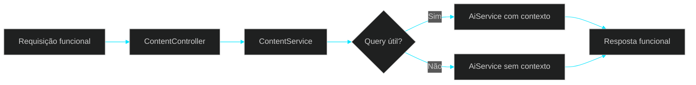

# 🧩 PR 38 — Fase 2: Normalização Mínima da Query Funcional da Base Local em `content`
## Calibração mínima do disparo contextual no boundary centralizador já aprovado

---

<div align="left">


</div>

---

> [!IMPORTANT]
> Esta PR substitui uma evolução redundante por um passo funcional real após a PR 37. Depois de tornar explícito quando o fluxo utilizou contexto local, o próximo movimento natural é melhorar quando esse contexto deve ser consultado.
>
> - preserva `content` como boundary funcional centralizador
> - calibra o uso da base local sem alterar a arquitetura atual
> - reduz consultas contextuais desnecessárias
> - mantém o recorte pequeno, interno e revisável
>
> **Este PR não adiciona reranking, NLP, classificação de intenção, múltiplas estratégias de busca, nova API pública ou expansão estrutural.**

---

## 📌 Sumário

1. [Síntese Executiva](#1-síntese-executiva)
2. [Objetivo do PR](#2-objetivo-do-pr)
3. [Decisão Arquitetural](#3-decisão-arquitetural)
4. [Escopo](#4-escopo)
5. [Fora de Escopo](#5-fora-de-escopo)
6. [Fluxo Arquitetural](#6-fluxo-arquitetural)
7. [Contratos Mínimos](#7-contratos-mínimos)
8. [Regras de Implementação](#8-regras-de-implementação)
9. [Critérios de Review](#9-critérios-de-review)
10. [Critérios de Aceite](#10-critérios-de-aceite)
11. [Conclusão](#11-conclusão)

---

## 1. Síntese Executiva

A PR 37 consolidou a visibilidade funcional do uso da base local em `content`. O sistema passou a informar quando o fluxo incluiu contexto recuperado internamente.

O passo seguinte precisa agregar valor real sem repetir o movimento anterior. Por isso, esta PR atua antes da recuperação: calibrar de forma mínima quando a query funcional deve acionar a busca contextual.

O foco não está em sofisticar retrieval, e sim em tornar o consumo da base local mais previsível, econômico e coerente com o boundary já aprovado.

---

## 2. Objetivo do PR

- normalizar a query funcional derivada do payload em `content`
- evitar busca contextual quando não houver conteúdo minimamente útil
- reduzir consultas desnecessárias à base local
- preservar `AiService` como executor contextual
- evoluir com baixo ruído e alta revisabilidade

---

## 3. Decisão Arquitetural

A decisão central desta PR é manter a inteligência mínima de disparo contextual dentro de `ContentService`, que já é o owner do caso de uso funcional.

Em vez de mover essa regra para novas camadas ou expandir `AiService`, o boundary centralizador decide se existe query útil para recuperação. Quando existir, o fluxo contextual segue normalmente. Quando não existir, a execução permanece funcional sem busca adicional.

Com isso, a evolução continua local, proporcional e aderente ao desenho atual.

---

## 4. Escopo

- normalizar texto usado como `knowledgeQuery`
- aplicar critério mínimo para decidir se a busca contextual deve ocorrer
- manter prompt funcional atual
n- preservar contrato externo enxuto
- ajustar testes proporcionais ao slice

---

## 5. Fora de Escopo

- reranking adicional
- stemming ou NLP
- classificação de intenção
- múltiplas estratégias de busca
- filtros semânticos avançados
- score no retorno
- lista de documentos usados
- dashboard operacional
- nova API pública de knowledge base
- reorganização estrutural para cenários futuros

---

## 6. Fluxo Arquitetural



O fluxo público permanece o mesmo. A diferença desta PR está em calibrar o disparo da recuperação antes da chamada contextual.

---

## 7. Contratos Mínimos

O contrato externo continua pequeno. A mudança principal é interna: decidir se `knowledgeQuery` deve ou não ser enviada ao fluxo contextual.

```ts
type ContentExecuteOutput = {
  output: string;
  metadata: {
    knowledgeQuery: string;
    knowledgeLimit: number;
    includedKnowledgeContext: boolean;
  };
};
```

Nenhum detalhe adicional de retrieval deve ser exposto ao consumidor externo.

---

## 8. Regras de Implementação

A implementação deve seguir o menor caminho útil. `ContentService` pode normalizar o payload e aplicar um critério simples de tamanho mínimo ou utilidade básica antes de enviar `knowledgeQuery`.

`ContentController` permanece fino. `AiService` continua responsável pela recuperação e composição contextual quando acionado. Nenhuma nova camada deve ser criada para esta decisão local.

Se houver dúvida entre regra simples local ou framework de query intelligence, esta PR deve favorecer a primeira opção.

---

## 9. Critérios de Review

- `content` permanece como boundary funcional centralizador
- a busca contextual só ocorre quando houver query minimamente útil
- `AiService` não recebeu responsabilidade indevida
- o contrato externo permaneceu enxuto
- o ajuste ficou pequeno, claro e proporcional ao slice
- a PR se posiciona como continuação natural da PR 37

---

## 10. Critérios de Aceite

- [ ] payload continua validado no fluxo funcional
- [ ] query funcional é normalizada antes do uso
- [ ] consultas contextuais desnecessárias foram reduzidas
- [ ] `AiService` continua owner da execução contextual
- [ ] nenhum detalhe interno adicional vazou no contrato externo
- [ ] testes afetados continuam passando

---

## 11. Conclusão

A PR 38 evolui o eixo iniciado na PR 37 sem redundância. Em vez de apenas renomear contratos, a entrega melhora o momento em que a base local é consultada dentro do fluxo funcional de `content`.

O resultado é uma evolução pequena, revisável e útil: consumo contextual mais previsível, menos ruído operacional e preservação total do boundary já aprovado.

