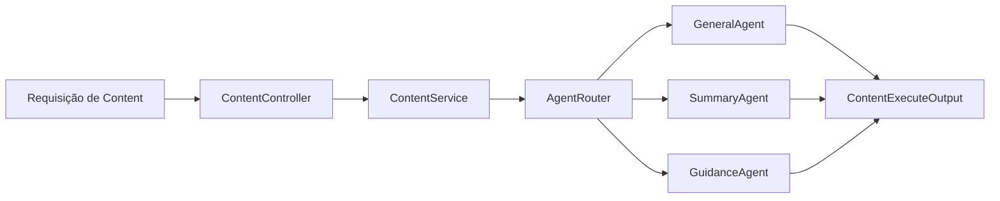

# 🧩 PR 42 — Fase 2: Foundation de Agents Básicos no `content`
## Primeiro passo operacional orientado por agentes sobre o boundary funcional já consolidado

---

<div align="left">


</div>

---

> [!IMPORTANT]
> Esta PR aplica o direcionamento validado em review após a consolidação do eixo funcional de `content`: iniciar agents básicos dentro do fluxo já existente, sem abrir uma arquitetura paralela e sem transformar o recorte em uma solução multi-agente mais ampla do que o momento pede.
>
> - preserva `content` como boundary principal
> - introduz roteamento mínimo por intenção
> - adiciona agents básicos especializados com responsabilidades pequenas
> - mantém controller fino e composição central no service
> - protege o recorte contra expansão prematura de arquitetura
>
> **Este PR não adiciona memória avançada, tools externos dinâmicos, planner multi-step, grafo complexo, nova API paralela ou orquestração distribuída.**

---

## 📌 Sumário

1. [Síntese Executiva](#1-síntese-executiva)
2. [Objetivo do PR](#2-objetivo-do-pr)
3. [Decisão Arquitetural](#3-decisão-arquitetural)
4. [Escopo](#4-escopo)
5. [Fora de Escopo](#5-fora-de-escopo)
6. [Fluxo Arquitetural](#6-fluxo-arquitetural)
7. [Contratos Mínimos](#7-contratos-mínimos)
8. [Regras de Implementação](#8-regras-de-implementação)
9. [Critérios de Review](#9-critérios-de-review)
10. [Critérios de Aceite](#10-critérios-de-aceite)
11. [Conclusão](#11-conclusão)

---

## 1. Síntese Executiva

A PR 41 consolidou o primeiro ganho perceptível no boundary de `content`, organizando retorno funcional com `summary`, `output` e `metadata` dentro de um fluxo já útil para consumo. Com esse contorno estabilizado, o próximo passo mínimo não é redesenhar a camada nem abrir um subsistema novo, mas introduzir organização interna de decisão para respostas mais orientadas ao tipo de solicitação recebida.

A PR 42 faz exatamente esse avanço. O fluxo público permanece o mesmo, enquanto a execução interna passa a contar com um roteamento simples por intenção e com agents básicos especializados. O objetivo é melhorar a composição da inteligência aplicada ao request sem romper contrato, sem inflar arquitetura e sem antecipar capacidades que ainda não fazem parte deste momento da fase.

---

## 2. Objetivo do PR

- introduzir foundation mínima de agents básicos dentro do fluxo de `content`
- adicionar roteamento interno simples por intenção da solicitação
- delegar a execução para agents especializados sem criar nova superfície pública
- manter compatibilidade com o contrato funcional já consolidado
- preparar a próxima evolução do eixo de `content` sobre base pequena, clara e revisável

---

## 3. Decisão Arquitetural

A decisão arquitetural desta PR é manter `content` como boundary funcional e tratar agents como composição interna de aplicação. Em vez de criar um módulo paralelo, um endpoint novo ou um runtime separado de orquestração, a mudança acontece no interior do fluxo já aprovado: o `ContentService` continua como ponto central da execução e passa a delegar a decisão para um roteador leve que seleciona o agent adequado conforme a intenção identificada.

Essa escolha preserva continuidade com a fase anterior e mantém o recorte sob controle. Os agents entram como especializações pequenas e coesas de comportamento, não como uma plataforma genérica de automação. A separação existe para organizar a resposta, não para reabrir arquitetura nem antecipar abstrações que ainda não se justificam.

---

## 4. Escopo

- criar contrato base para agents internos do fluxo de `content`
- implementar router simples para seleção do agent por intenção
- adicionar agents básicos iniciais para cenários já coerentes com o boundary atual
- integrar a delegação ao fluxo existente sem alterar o endpoint público
- preservar a forma de retorno já consolidada em `output`, `summary` e `metadata`
- adicionar testes unitários proporcionais ao roteamento e à delegação principal

---

## 5. Fora de Escopo

- agents autônomos com múltiplas etapas
- planner avançado de execução
- memória persistente entre interações
- tools externas dinâmicas
- execução paralela entre agents
- observabilidade expandida por agent
- dashboard operacional de agents
- novo endpoint dedicado, como `/agents`
- grafo de orquestração complexo
- expansão do slice para multi-agents completos

---

## 6. Fluxo Arquitetural



O fluxo externo permanece inalterado. A mudança desta PR é interna e controlada: `ContentService` continua responsável pelo boundary, enquanto o roteador direciona a execução para um agent básico compatível com a intenção identificada.

---

## 7. Contratos Mínimos

```ts
type ContentAgentInput = {
  input: string;
  knowledgeContext?: string[];
};

type ContentAgentOutput = {
  output: string;
  summary: string;
  metadata: ContentMetadata;
};

type ContentAgent = {
  supports(input: string): boolean;
  execute(input: ContentAgentInput): Promise<ContentAgentOutput>;
};
```

O contrato público de saída permanece alinhado ao eixo anterior. O que esta PR adiciona é apenas o contrato mínimo interno necessário para permitir roteamento e delegação sem inflar modelagem.

---

## 8. Regras de Implementação

- manter controller sem regra de negócio
- preservar `ContentService` como ponto central de composição do fluxo
- implementar router de forma simples, previsível e legível
- manter agents pequenos, coesos e com responsabilidade objetiva
- restringir cada agent ao comportamento mínimo que o recorte pede
- evitar abstrações genéricas antecipadas, factories e camadas paralelas
- não alterar o contrato público atual de `content`
- adicionar testes proporcionais ao slice, cobrindo seleção e delegação principais

Se houver dúvida entre uma fundação mais sofisticada e um fluxo mais claro, a decisão correta nesta PR é manter o fluxo mais claro.

---

## 9. Critérios de Review

- `content` permanece como boundary central da funcionalidade
- a introdução de agents ocorre sem nova superfície pública
- o roteamento interno está simples e fácil de seguir
- os agents têm responsabilidades pequenas e explícitas
- o contrato já consolidado do retorno foi preservado
- a mudança permanece incremental e proporcional ao slice
- não há sinais de overengineering ou preparação indevida de fases futuras
- os testes cobrem o caminho principal de roteamento e delegação

---

## 10. Critérios de Aceite

- [ ] requests de `content` continuam entrando pelo mesmo fluxo público
- [ ] a execução é delegada para um agent compatível com a intenção identificada
- [ ] o retorno permanece compatível com consumidores atuais
- [ ] os agents básicos estão isolados por responsabilidade sem inflar a arquitetura
- [ ] os testes passam cobrindo roteamento e delegação principais
- [ ] nenhum componente fora do recorte foi introduzido nesta PR

---

## 11. Conclusão

A PR 42 posiciona o primeiro passo de agents básicos de forma aderente ao padrão do projeto: mantendo o boundary já consolidado, adicionando apenas o próximo avanço funcional mínimo e evitando transformar o slice em uma iniciativa maior do que ele realmente é. O resultado é uma evolução interna clara, pequena e revisável, que melhora a organização da execução sem reabrir decisões já aprovadas.
