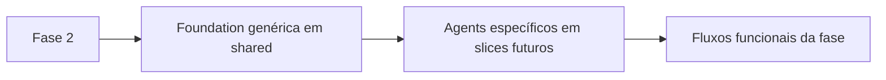

# 🧩 PR 42 — Fase 2: Foundation Inicial de Agents Genéricos em Shared
## Estrutura mínima compartilhada para iniciar a trilha de agents da fase sem acoplar ao módulo de content

---

<div align="left">


</div>

---

> [!IMPORTANT]
> Esta PR reposiciona corretamente o início da Fase 2 no boundary compartilhado da aplicação. O primeiro passo da trilha de agents básicos passa a ser uma foundation genérica em `shared`, sem especialização por domínio e sem antecipação de fluxo funcional.
>
> - abre a base mínima compartilhada para agents
> - define contrato comum e neutro de execução
> - evita acoplamento prematuro ao módulo de `content`
> - mantém a fase no menor recorte revisável possível
>
> **Este PR não implementa content agents, classificação por intenção, roteamento, prompting especializado, integração com tools nem fluxo funcional completo da fase.**

---

## 📌 Sumário

1. [Síntese Executiva](#1-síntese-executiva)
2. [Objetivo do PR](#2-objetivo-do-pr)
3. [Decisão Arquitetural](#3-decisão-arquitetural)
4. [Escopo](#4-escopo)
5. [Fora de Escopo](#5-fora-de-escopo)
6. [Fluxo Arquitetural](#6-fluxo-arquitetural)
7. [Contratos Mínimos](#7-contratos-mínimos)
8. [Regras de Implementação](#8-regras-de-implementação)
9. [Critérios de Review](#9-critérios-de-review)
10. [Critérios de Aceite](#10-critérios-de-aceite)
11. [Conclusão](#11-conclusão)

---

## 1. Síntese Executiva

A PR 42 realinha a abertura da Fase 2 para o ponto arquitetural correto. Em vez de iniciar a trilha por especializações ligadas ao módulo de `content`, o slice passa a estabelecer primeiro uma base genérica e compartilhada para agents em `shared`.

A mudança é pequena, mas importante para a continuidade da fase. Ela preserva baixo acoplamento, evita fundação paralela em módulo de domínio e cria o menor ponto comum necessário para que as próximas PRs especializem comportamento sem redesenhar a base.

O ganho desta entrega é estrutural e direcional: começar a fase no boundary certo, mantendo simplicidade, previsibilidade e baixo ruído para review.

---

## 2. Objetivo do PR

- criar a foundation mínima de agents genéricos em `shared`
- definir contrato comum de execução para a trilha da fase
- posicionar a responsabilidade fora de módulos de domínio
- abrir o próximo passo incremental sem inflar a arquitetura

---

## 3. Decisão Arquitetural

A decisão central desta PR é tratar agents básicos como capacidade compartilhada da aplicação, e não como detalhe interno inicial de `content`.

Por isso, a foundation nasce em `shared`, com contrato mínimo e estrutura enxuta. Esta PR não introduz registry, factory, descoberta dinâmica, hierarquia extensa ou mecanismo de orquestração. O recorte permanece deliberadamente simples para consolidar primeiro o boundary correto e só depois permitir especializações incrementais nos slices seguintes.

---

## 4. Escopo

- criar estrutura base de agents em `shared`
- adicionar contrato mínimo compartilhado de agent
- organizar o ponto inicial da fase no local arquitetural correto
- manter o slice pequeno, genérico e revisável
- incluir cobertura mínima de teste quando aplicável ao recorte

---

## 5. Fora de Escopo

- implementação de content agents
- classificação de intenção
- roteamento entre agents
- instruções especializadas por tipo de conteúdo
- integração com PDF, search ou resolução de identificadores
- planner, memória, tools externas ou execução multi-step
- qualquer fluxo funcional completo da Fase 2

---

## 6. Fluxo Arquitetural



Esta PR entrega apenas o primeiro bloco do fluxo: a foundation compartilhada que antecede especializações de domínio e comportamento funcional.

---

## 7. Contratos Mínimos

```ts
export type AgentInput = unknown;
export type AgentOutput = unknown;

export interface Agent<TInput = AgentInput, TOutput = AgentOutput> {
  execute(input: TInput): Promise<TOutput>;
}
```

O contrato permanece propositalmente pequeno, neutro e suficiente para este momento da fase. Não há expansão de tipagem, metadados adicionais ou convenções que antecipem necessidades ainda não introduzidas pelo recorte.

---

## 8. Regras de Implementação

A implementação deve manter controller inexistente neste slice, fluxo visível e estrutura direta. Como o recorte é compartilhado e estrutural, o foco é apenas abrir a base comum de agents sem acoplar `shared` a `content` ou a qualquer outro módulo de domínio.

Também não devem entrar abstrações prematuras. Registry dinâmico, factories, providers desnecessários, camadas adicionais ou preparação explícita para próximas etapas fogem do objetivo desta PR. O código deve permanecer pequeno, legível e estritamente limitado ao que sustenta a continuidade imediata da fase.

---

## 9. Critérios de Review

O review deve validar se a PR realmente reposiciona o início da fase para `shared`, se o contrato compartilhado está mínimo e claro, e se não houve acoplamento indevido com `content` ou com outro domínio específico.

Também deve ficar evidente que o slice continua pequeno, sem arquitetura paralela, sem preparação excessiva e sem embutir etapas futuras da Fase 2 sob a justificativa de foundation.

---

## 10. Critérios de Aceite

- [ ] existe estrutura base de agents em `shared`
- [ ] existe contrato mínimo comum de execução
- [ ] não há dependência de módulo de domínio
- [ ] não foram introduzidas abstrações prematuras
- [ ] o recorte permanece pequeno, legível e revisável
- [ ] os testes passam, quando aplicável ao slice

---

## 11. Conclusão

A PR 42 passa a iniciar a Fase 2 no ponto arquitetural correto: primeiro uma base genérica em `shared`, depois especializações incrementais por domínio quando elas de fato entrarem em escopo.

Com isso, o slice preserva simplicidade, reduz ruído de revisão e mantém a continuidade da fase sem reabrir arquitetura nem inflar a entrega além do necessário.
