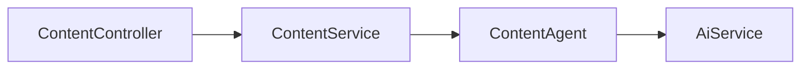

# 🧩 PR 43 — Fase 2: Primeiro Uso do Contrato de Agent no Módulo Content
## Especialização mínima de content sobre a foundation compartilhada criada na PR 42

---

<div align="left">


</div>

---

> [!IMPORTANT]
> Esta PR continua a trilha aberta na PR 42. Após definir o contrato compartilhado de agents em `shared/ai`, o próximo passo mínimo é realizar o primeiro uso concreto desse contrato dentro de `content`, sem roteamento e sem múltiplos agents.
>
> - aplica a foundation compartilhada em um caso real
> - mantém `ContentService` como fluxo principal
> - introduz uma única especialização mínima de agent
> - preserva contrato público atual do endpoint
>
> **Este PR não implementa AgentRouter, classificação por intenção, múltiplos agents, metadata de seleção ou orquestração expandida.**

---

## 📌 Sumário

1. Síntese Executiva
2. Objetivo do PR
3. Decisão Arquitetural
4. Escopo
5. Fora de Escopo
6. Fluxo Arquitetural
7. Contratos Mínimos
8. Regras de Implementação
9. Critérios de Review
10. Critérios de Aceite
11. Conclusão

---

## 1. Síntese Executiva

A PR 42 consolidou a base compartilhada de agents por meio de um contrato genérico em `shared/ai`. Com essa foundation estabelecida, a progressão natural da fase é aplicar o contrato em um uso real e controlado.

Esta PR introduz a primeira especialização mínima no módulo `content`, sem alterar a superfície pública existente. O objetivo é validar a integração entre domínio e foundation compartilhada mantendo o recorte pequeno, simples e revisável.

---

## 2. Objetivo do PR

- criar um agent mínimo para `content` baseado no contrato compartilhado
- delegar a execução atual de `content` para esse agent
- preservar request/response já existentes
- manter a evolução incremental da fase sem inflar arquitetura

---

## 3. Decisão Arquitetural

A arquitetura-base definida na PR 42 é mantida. Esta PR apenas conecta o módulo `content` à foundation compartilhada por meio de uma única implementação concreta de `Agent`.

`ContentService` continua como owner do fluxo externo. O agent entra como detalhe interno de especialização, sem registry, sem router e sem múltiplas estratégias concorrentes.

---

## 4. Escopo

- adicionar um `ContentAgent` mínimo aderente ao contrato `Agent`
- ajustar `ContentService` para delegar execução ao agent
- preservar contratos públicos atuais
- adicionar testes cobrindo delegação e integração mínima

---

## 5. Fora de Escopo

- `AgentRouter`
- `SummaryAgent`, `GuidanceAgent`, `GeneralAgent`
- classificação por intenção
- metadata do agent selecionado
- múltiplos caminhos de decisão
- mudanças no endpoint público
- tools externas ou planner

---

## 6. Fluxo Arquitetural



O fluxo externo permanece o mesmo. A mudança é interna: `ContentService` passa a delegar a execução para um agent concreto.

---

## 7. Contratos Mínimos

```ts
export interface Agent<TInput = unknown, TOutput = unknown> {
  execute(input: TInput): Promise<TOutput>;
}

export type ContentAgentInput = string;
```

A PR reutiliza o contrato existente e adiciona apenas o necessário para a especialização de `content`.

---

## 8. Regras de Implementação

- manter `ContentService` simples e legível
- agent com responsabilidade direta e única
- sem abstrações adicionais
- sem criar camadas paralelas
- sem preparar múltiplos agents nesta PR
- testes proporcionais ao recorte

---

## 9. Critérios de Review

- `content` passou a usar o contrato compartilhado
- a integração ficou simples e clara
- não houve alteração indevida de contrato público
- o recorte permaneceu pequeno
- não houve overengineering

---

## 10. Critérios de Aceite

- [ ] existe um `ContentAgent` mínimo implementando `Agent`
- [ ] `ContentService` delega execução ao agent
- [ ] endpoint atual permanece compatível
- [ ] testes cobrem fluxo principal
- [ ] suíte permanece verde

---

## 11. Conclusão

A PR 43 transforma a foundation criada na PR 42 em uso real dentro de `content`, com o menor passo possível. A fase evolui com continuidade clara, sem redesenho e sem expandir a solução além do necessário.
