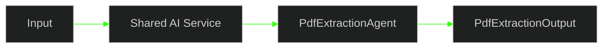

# 🚀 PR 44 — Fase 2: Execução Compartilhada Inicial do PDF Extraction Agent
## Primeiro consumo controlado do agent já introduzido na fase, sem ampliar a arquitetura existente

---

<div align="left">


</div>

---

> [!IMPORTANT]
> Esta PR continua diretamente a PR 43. Após introduzir o primeiro agent funcional da fase, o próximo passo mínimo correto é permitir seu consumo controlado dentro do boundary compartilhado de IA, sem criar pipeline ou coordenação expandida.
>
> - adiciona ponto mínimo de uso do `PdfExtractionAgent`
> - preserva o contrato já aprovado
> - mantém a execução simples e explícita
> - evita nova foundation ou abstração prematura
>
> **Este PR não implementa router de agents, múltiplos executores, integração com `content`, `ClassificationAgent`, `SearchAgent` ou pipeline encadeado.**

---

## 📌 Sumário

1. [Síntese Executiva](#1-síntese-executiva)
2. [Objetivo do PR](#2-objetivo-do-pr)
3. [Decisão Arquitetural](#3-decisão-arquitetural)
4. [Escopo](#4-escopo)
5. [Fora de Escopo](#5-fora-de-escopo)
6. [Fluxo Arquitetural](#6-fluxo-arquitetural)
7. [Contratos Mínimos](#7-contratos-mínimos)
8. [Regras de Implementação](#8-regras-de-implementação)
9. [Critérios de Review](#9-critérios-de-review)
10. [Critérios de Aceite](#10-critérios-de-aceite)
11. [Conclusão](#11-conclusão)

---

## 1. Síntese Executiva

A PR 42 consolidou o contrato base de agents em `shared/ai`. A PR 43 validou essa foundation com o primeiro agent concreto da fase, o `PdfExtractionAgent`, mantendo o boundary compartilhado enxuto e sem antecipar coordenação maior.

Com esse passo anterior estabilizado, a evolução mínima correta agora é permitir um primeiro consumo compartilhado desse agent dentro da própria camada de IA. O objetivo não é expandir a arquitetura, mas sair do agent isolado para um uso explícito e reutilizável, ainda com fluxo linear e baixa cerimônia.

Esta PR se posiciona exatamente nesse ponto. Ela adiciona um serviço mínimo de execução para o `PdfExtractionAgent`, preserva os contratos já aprovados e mantém a fase sob controle, sem introduzir registry, router, composição expandida ou integração com outros domínios.

---

## 2. Objetivo do PR

- adicionar um ponto compartilhado e mínimo de execução para o `PdfExtractionAgent`
- centralizar esse primeiro consumo dentro de `shared/ai`
- manter o fluxo linear entre entrada, delegação e retorno
- validar o comportamento principal com testes unitários
- continuar a fase sem ampliar o desenho arquitetural já aprovado

---

## 3. Decisão Arquitetural

A decisão central desta PR é manter a arquitetura já aprovada e apenas adicionar o próximo passo funcional mínimo dentro dela. Em vez de introduzir mecanismos genéricos de coordenação entre agents, a implementação deve expor somente um serviço compartilhado e explícito que consome o `PdfExtractionAgent` e devolve seu resultado.

Essa escolha preserva a leitura da fase. O agent continua responsável pela execução do comportamento de extração, enquanto o serviço passa a representar o primeiro ponto compartilhado de consumo desse capability dentro do boundary de IA. O ganho aqui é reutilização controlada, não sofisticação estrutural.

Com isso, a PR continua a trilha iniciada anteriormente sem reabrir decisões já estabilizadas. O fluxo permanece simples, verificável e proporcional ao slice.

---

## 4. Escopo

- criação de serviço mínimo em `shared/ai` para executar o `PdfExtractionAgent`
- delegação explícita do input recebido para o agent já existente
- retorno do output produzido pelo agent sem transformação paralela
- cobertura unitária do fluxo principal de execução
- preservação da estrutura atual da fase e dos contratos já introduzidos

---

## 5. Fora de Escopo

- router de agents
- registry dinâmico de implementações
- factory ou composition root expandido
- suporte a múltiplos agents no mesmo fluxo
- integração com `content`
- `ClassificationAgent`, `SearchAgent` ou qualquer novo agent
- encadeamento entre etapas
- observabilidade expandida
- retries, filas, pipeline ou coordenação assíncrona

---

## 6. Fluxo Arquitetural



O fluxo desta PR é deliberadamente direto. Um serviço compartilhado recebe o input, delega a execução ao `PdfExtractionAgent` e retorna o resultado produzido, sem coordenação adicional e sem ramificações paralelas.

---

## 7. Contratos Mínimos

Os contratos centrais da fase permanecem os mesmos. Esta PR reutiliza o contrato genérico já introduzido em `shared/ai` e os tipos específicos do PDF extraction, sem expandir a superfície pública da fase além do necessário.

```ts
export type PdfExtractionInput = {
  content: string;
};

export type PdfExtractionOutput = {
  text: string;
};
```

O contrato base de agent continua inalterado e segue sendo o mesmo ponto de tipagem já consolidado anteriormente:

```ts
Agent<TInput, TOutput>
```

Não há necessidade de novos contratos globais, DTOs adicionais ou camadas intermediárias para este slice.

---

## 8. Regras de Implementação

- o serviço deve ser fino e orientado apenas ao fluxo principal
- o `PdfExtractionAgent` deve continuar concentrando a responsabilidade de execução
- a delegação deve ser explícita, sem abstrações que escondam o caminho principal
- a implementação não deve preparar suporte genérico para próximos agents
- nenhum contrato já aprovado deve ser alterado sem necessidade real do slice
- testes devem validar o comportamento principal de forma objetiva e proporcional
- qualquer separação adicional só se justifica se melhorar clareza imediata do recorte atual

---

## 9. Critérios de Review

- o consumo compartilhado do `PdfExtractionAgent` foi introduzido sem inflar a arquitetura
- a PR mantém continuidade direta com a PR 43
- o fluxo principal está claro, linear e fácil de revisar
- não houve acoplamento indevido com domínio externo ao boundary de IA
- os contratos já aprovados foram preservados
- os testes cobrem o caminho principal de execução
- a implementação permanece pequena, explícita e proporcional ao slice
- o documento e o código evitam overengineering e preparação desnecessária de fase futura

---

## 10. Critérios de Aceite

- [ ] existe um serviço mínimo em `shared/ai` consumindo `PdfExtractionAgent`
- [ ] o serviço delega a execução ao agent sem lógica paralela desnecessária
- [ ] o resultado retornado pelo serviço corresponde ao output esperado do agent
- [ ] os contratos existentes da fase permanecem inalterados
- [ ] os testes unitários do fluxo principal estão passando
- [ ] nenhum componente estrutural extra foi introduzido além do necessário para este recorte
- [ ] a suíte relacionada permanece verde

---

## 11. Conclusão

A PR 44 continua a Fase 2 com o próximo passo mínimo após a introdução do primeiro agent concreto: seu consumo compartilhado e controlado dentro do boundary de IA. O avanço é pequeno, funcional e direto, exatamente como a fase pede neste momento.

O recorte preserva os contratos já aprovados, mantém a arquitetura estável e evita antecipar coordenação maior entre agents. Com isso, a fase avança com ganho funcional real, sem reabrir desenho e sem inflar a solução além do necessário.
