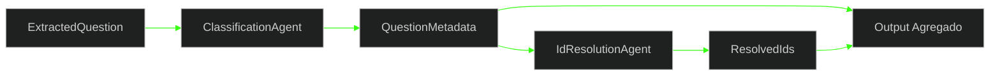

# 🔗 PR 50 — Fase 2: Primeira Composição Funcional Mínima entre Agents
## Encadeamento inicial entre classificação e resolução de IDs sem tocar a pipeline de ingestion

---

<div align="left">


</div>

---

> [!IMPORTANT]
> Esta PR continua diretamente a PR 49. Após consolidar os agents como unidades isoladas, o próximo passo mínimo correto é provar composição funcional entre eles. O foco é encadear classificação e resolução de IDs em um fluxo simples, previsível e testável, sem reabrir ingestion e sem introduzir orquestração prematura.
>
> - compõe agents já existentes em fluxo único
> - transforma peças isoladas em capacidade funcional mínima
> - mantém baixo acoplamento e leitura simples
> - preserva o boundary de agents como eixo principal da fase
>
> **Este PR não implementa LangGraph completo, integração com ingestion, múltiplos fluxos paralelos, retry distribuído ou pipeline final de geração de questões.**

---

## 📌 Sumário

1. [Síntese Executiva](#1-síntese-executiva)
2. [Objetivo do PR](#2-objetivo-do-pr)
3. [Decisão Arquitetural](#3-decisão-arquitetural)
4. [Escopo](#4-escopo)
5. [Fora de Escopo](#5-fora-de-escopo)
6. [Fluxo Arquitetural](#6-fluxo-arquitetural)
7. [Contratos Mínimos](#7-contratos-mínimos)
8. [Regras de Implementação](#8-regras-de-implementação)
9. [Critérios de Review](#9-critérios-de-review)
10. [Critérios de Aceite](#10-critérios-de-aceite)
11. [Conclusão](#11-conclusão)

---

## 1. Síntese Executiva

A PR 49 consolidou os agents como unidades isoladas, com contratos claros, implementações iniciais e cobertura mínima. O próximo passo funcional correto agora é deixar de tratá-los apenas como peças independentes e provar que conseguem operar em sequência com um resultado agregado simples.

A PR 50 introduz essa primeira composição mínima. Uma questão extraída passa pela classificação para gerar metadados e, na sequência, pela resolução de IDs baseada nesses metadados. O avanço é pequeno, direto e suficiente para validar o primeiro encadeamento funcional da fase sem tocar a pipeline de ingestion.

---

## 2. Objetivo do PR

- criar um fluxo mínimo de composição entre agents já existentes
- executar `ClassificationAgent` como primeira etapa do encadeamento
- executar `IdResolutionAgent` consumindo a saída da classificação
- retornar um resultado agregado contendo `metadata` e `ids`
- validar integração e ordem de execução por testes
- manter o recorte isolado da pipeline atual de ingestion

---

## 3. Decisão Arquitetural

A arquitetura já aprovada é mantida. Esta PR não reabre a fase nem introduz um orchestrator mais amplo. A decisão central é materializar a primeira composição funcional como uma unidade simples, explícita e focada apenas no fluxo atual entre classificação e resolução de IDs.

Com isso, o projeto valida encadeamento real antes de avançar para coordenação mais sofisticada. A escolha segue a linha já consolidada no histórico da fase: conectar e consolidar antes de orquestrar.

---

## 4. Escopo

- criar um agent de composição inicial, como `initial-question-processing.agent.ts` ou equivalente aderente ao módulo
- injetar `ClassificationAgent`
- injetar `IdResolutionAgent`
- executar as etapas de forma sequencial e explícita
- expor output agregado tipado
- adicionar testes cobrindo fluxo completo e ordem básica de execução
- manter providers consistentes com o módulo atual de agents

---

## 5. Fora de Escopo

- integração com `IngestionProcessor`
- integração com a pipeline operacional de ingestion
- inclusão de `LegalSearchAgent` no fluxo principal
- inclusão de `StatementAdaptationAgent` no fluxo principal
- inclusão de `AnswerKeyAgent` no fluxo principal
- adoção de LangGraph ou state machine
- paralelização de etapas
- persistência externa nova
- observabilidade expandida
- retries, DLQ ou coordenação distribuída

---

## 6. Fluxo Arquitetural



O fluxo desta PR é propositalmente curto. A entrada continua restrita a uma questão já extraída, a classificação produz os metadados mínimos e a resolução de IDs fecha a composição com um resultado agregado único, sem camadas adicionais de coordenação.

---

## 7. Contratos Mínimos

```ts
export type InitialQuestionProcessingInput = {
  question: ExtractedQuestion;
};

export type InitialQuestionProcessingOutput = {
  metadata: QuestionMetadata;
  ids: ResolvedIds;
};
```

Os contratos dos agents já existentes permanecem os mesmos. Esta PR adiciona apenas o contrato mínimo da composição, suficiente para representar a entrada do fluxo e o resultado agregado final.

Exemplo esperado:

```json
{
  "metadata": {
    "article": "Art. 1º",
    "law": "Lei 6.015/73",
    "bank": "IESES",
    "year": 2026
  },
  "ids": {
    "bankId": "bank-1",
    "lawId": "law-1",
    "articleId": "article-1",
    "yearId": "year-2026"
  }
}
```

---

## 8. Regras de Implementação

O fluxo deve ser explícito, sequencial e fácil de ler. Controller fino, quando houver ponto de exposição nesta fase, e agent de composição simples, sem abstrações genéricas de pipeline, sem factory de steps e sem fundação paralela para futuras composições.

A responsabilidade da composição deve se limitar a coordenar a chamada do `ClassificationAgent`, repassar a saída ao `IdResolutionAgent` e devolver o resultado agregado. Persistência continua fora desse agent, e qualquer falha deve emergir de forma transparente, preservando diagnóstica simples e baixo custo de manutenção.

---

## 9. Critérios de Review

Validar se a PR realmente representa continuação direta da 49 e se o recorte permanece pequeno. O reviewer deve conseguir verificar rapidamente que houve composição funcional real entre agents, sem expansão indevida para ingestion, LangGraph ou pipeline maior.

Também deve ser confirmado que a implementação mantém baixo acoplamento, usa injeção de dependências de forma direta, protege a ordem do fluxo por testes e não adiciona abstrações que antecipem fases ainda não abertas.

---

## 10. Critérios de Aceite

- [ ] existe um fluxo de composição inicial entre `ClassificationAgent` e `IdResolutionAgent`
- [ ] `ClassificationAgent` executa antes de `IdResolutionAgent`
- [ ] `IdResolutionAgent` consome os metadados gerados pela etapa anterior
- [ ] o resultado final retorna `metadata` e `ids` em output agregado tipado
- [ ] os testes cobrem o fluxo completo e a ordem básica da composição
- [ ] não há alteração indevida na pipeline de ingestion
- [ ] não foi introduzida orquestração complexa ou infraestrutura paralela

---

## 11. Conclusão

A PR 50 transforma a base isolada consolidada na PR 49 em uma capacidade funcional mínima entre agents. O ganho aqui não é ampliar a arquitetura, mas provar que as peças já criadas conseguem operar em cadeia simples, com resultado previsível e revisável.

O recorte permanece pequeno, coerente com a fase e alinhado ao histórico do projeto. A entrega adiciona o próximo passo mínimo correto sem antecipar pipeline maior, mantendo a evolução controlada e a leitura confortável para review.
