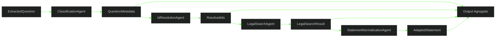

# 📝 PR 52 — Fase 2: Primeira Composição Funcional Mínima com Adaptação de Enunciado
## Inclusão incremental do `StatementNormalizationAgent` após busca legal sem ampliar a pipeline operacional

---

<div align="left">


</div>

---

> [!IMPORTANT]
> Esta PR continua diretamente a PR 51. Após incluir a busca legal na composição mínima entre agents, o próximo passo correto é adaptar o enunciado usando o contexto já produzido nas etapas anteriores. O objetivo é enriquecer o fluxo com uma saída textual mais útil ao domínio, sem reabrir ingestion e sem introduzir orquestração complexa.
>
> - adiciona `StatementNormalizationAgent` ao fluxo já existente
> - amplia utilidade funcional sem inflar a arquitetura
> - mantém composição sequencial e leitura simples
> - preserva o boundary de agents como eixo principal da fase
>
> **Este PR não implementa LangGraph operacional, integração com ingestion, geração de gabarito, retries distribuídos ou pipeline final de questões.**

---

## 📌 Sumário

1. [Síntese Executiva](#1-síntese-executiva)
2. [Objetivo do PR](#2-objetivo-do-pr)
3. [Decisão Arquitetural](#3-decisão-arquitetural)
4. [Escopo](#4-escopo)
5. [Fora de Escopo](#5-fora-de-escopo)
6. [Fluxo Arquitetural](#6-fluxo-arquitetural)
7. [Contratos Mínimos](#7-contratos-mínimos)
8. [Regras de Implementação](#8-regras-de-implementação)
9. [Critérios de Review](#9-critérios-de-review)
10. [Critérios de Aceite](#10-critérios-de-aceite)
11. [Conclusão](#11-conclusão)

---

## 1. Síntese Executiva

A PR 51 evoluiu a composição mínima ao conectar a questão processada ao contexto normativo por meio da busca legal. O fluxo passou a devolver referência jurídica sem ampliar a arquitetura da fase.

A PR 52 adiciona a próxima evolução incremental: utilizar o contexto já obtido para adaptar e normalizar o enunciado. O resultado continua pequeno e revisável, mas agora entrega uma saída textual mais preparada para os próximos passos do domínio.

Esse é o próximo passo mínimo correto porque amplia a utilidade do fluxo atual sem criar nova coordenação, sem reabrir boundaries e sem antecipar pipeline maior.

---

## 2. Objetivo do PR

- incluir `StatementNormalizationAgent` na composição existente
- manter `ClassificationAgent` como primeira etapa
- manter `IdResolutionAgent` como segunda etapa
- manter `LegalSearchAgent` como terceira etapa
- executar adaptação de enunciado como próxima etapa sequencial
- retornar output agregado com `metadata`, `ids`, `legalSearch` e `adaptedStatement`
- validar a cadeia completa por testes
- preservar isolamento da pipeline operacional atual

---

## 3. Decisão Arquitetural

A arquitetura aprovada é mantida integralmente. Em vez de criar orchestrator dedicado, pipeline genérica ou nova infraestrutura, a evolução ocorre no mesmo fluxo simples já consolidado, adicionando apenas a próxima etapa funcional necessária.

A decisão preserva a linha do projeto: composições pequenas, reais e progressivas antes de qualquer coordenação mais sofisticada. O desenho continua explícito, fácil de revisar e proporcional ao estágio atual da fase.

---

## 4. Escopo

- evoluir o agent de composição atual
- injetar `StatementNormalizationAgent`
- manter etapas anteriores inalteradas
- executar adaptação após a busca legal
- agregar o enunciado adaptado no output final
- adicionar testes cobrindo o novo encadeamento
- manter providers consistentes no módulo atual

---

## 5. Fora de Escopo

- integração com `IngestionProcessor`
- integração com `ContentService`
- inclusão de `AnswerKeyAgent` no fluxo principal
- LangGraph operacional
- persistência adicional
- observabilidade expandida
- retries e DLQ
- paralelização de etapas
- pipeline final de geração de questões

---

## 6. Fluxo Arquitetural



O fluxo permanece linear e legível. A composição recebe a questão, classifica, resolve identificadores, busca o contexto legal, adapta o enunciado e consolida o resultado final sem abrir novas ramificações operacionais.

---

## 7. Contratos Mínimos

```ts
export type InitialQuestionProcessingOutput = {
  metadata: QuestionMetadata;
  ids: ResolvedIds;
  legalSearch: LegalSearchResult | null;
  adaptedStatement: string;
};
```

Os contratos existentes permanecem os mesmos. Esta PR apenas amplia o output da composição para incluir `adaptedStatement`, sem remodelar a base tipada já aprovada.

---

## 8. Regras de Implementação

O fluxo deve continuar explícito e sequencial. A composição permanece responsável apenas por coordenar chamadas entre agents e devolver o resultado agregado, sem absorver persistência, sem criar abstrações genéricas de pipeline e sem preparar etapas futuras.

A adaptação do enunciado deve consumir somente os dados necessários produzidos nas etapas anteriores. Falhas devem emergir de forma transparente, mantendo diagnóstica simples e baixo custo de manutenção. Sempre que houver dúvida, favorecer fluxo visível e menos fragmentado.

---

## 9. Critérios de Review

Validar se a PR continua diretamente a 51, se o recorte segue pequeno e se a inclusão de `StatementNormalizationAgent` realmente adiciona utilidade funcional sem inflar a solução.

Confirmar também que a cadeia está clara, que os testes cobrem a nova etapa e que não houve expansão indevida para ingestion, LangGraph, answer key ou pipeline maior.

---

## 10. Critérios de Aceite

- [ ] `StatementNormalizationAgent` foi integrado ao fluxo atual
- [ ] classificação continua executando primeiro
- [ ] resolução de IDs continua recebendo os metadados corretos
- [ ] busca legal continua executando após as etapas anteriores
- [ ] adaptação executa após o contexto legal estar disponível
- [ ] output final retorna `metadata`, `ids`, `legalSearch` e `adaptedStatement`
- [ ] testes cobrem a cadeia completa
- [ ] nenhuma alteração indevida em ingestion
- [ ] nenhuma orquestração complexa foi adicionada

---

## 11. Conclusão

A PR 52 evolui a composição atual para um fluxo funcional mais útil ao domínio, conectando a questão processada a um enunciado adaptado com base no contexto legal já obtido. O ganho vem por uma única etapa adicional, sem ampliar desnecessariamente a arquitetura.

O recorte permanece pequeno, coerente com a fase e alinhado ao histórico incremental do projeto. Há continuidade clara, utilidade prática e baixo ruído para review.
