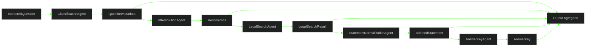

# ✅ PR 53 — Fase 2: Fechamento do Fluxo Básico entre Agents com Answer Key
## Inclusão incremental do AnswerKeyAgent como etapa final da composição mínima da fase

---

<div align="left">


</div>

---

> [!IMPORTANT]
> Esta PR continua diretamente a PR 52. Após consolidar classificação, resolução de IDs, busca legal e adaptação de enunciado em uma cadeia funcional mínima, o próximo passo correto é concluir o fluxo básico da fase com geração de gabarito. O objetivo é adicionar a etapa final de resposta sem reabrir ingestion e sem introduzir orquestração complexa.
>
> - adiciona `AnswerKeyAgent` como última etapa do fluxo
> - fecha a composição básica prevista para a fase
> - amplia valor funcional sem inflar a arquitetura
> - preserva o boundary de agents como eixo principal da evolução
>
> **Este PR não implementa LangGraph operacional, integração com ingestion, persistência final, retries distribuídos ou pipeline expandida de produção.**

---

## 📌 Sumário

1. [Síntese Executiva](#1-síntese-executiva)
2. [Objetivo do PR](#2-objetivo-do-pr)
3. [Decisão Arquitetural](#3-decisão-arquitetural)
4. [Escopo](#4-escopo)
5. [Fora de Escopo](#5-fora-de-escopo)
6. [Fluxo Arquitetural](#6-fluxo-arquitetural)
7. [Contratos Mínimos](#7-contratos-mínimos)
8. [Regras de Implementação](#8-regras-de-implementação)
9. [Critérios de Review](#9-critérios-de-review)
10. [Critérios de Aceite](#10-critérios-de-aceite)
11. [Conclusão](#11-conclusão)

---

## 1. Síntese Executiva

A PR 52 elevou a composição funcional ao incluir adaptação de enunciado após a construção do contexto legal. O fluxo já produzia uma saída mais útil ao domínio, mas ainda sem a etapa final de resposta.

A PR 53 adiciona a última peça do conjunto básico de agents da fase: geração de gabarito. Com isso, a cadeia mínima passa a produzir não apenas contexto e texto adaptado, mas também resposta e justificativa associadas.

---

## 2. Objetivo do PR

- incluir `AnswerKeyAgent` na composição existente
- manter etapas anteriores inalteradas
- executar geração de gabarito como etapa final sequencial
- retornar output agregado com `metadata`, `ids`, `legalSearch`, `adaptedStatement` e `answerKey`
- validar a cadeia completa por testes
- preservar isolamento da pipeline operacional atual

---

## 3. Decisão Arquitetural

A arquitetura aprovada é mantida. Em vez de abrir nova camada de orquestração, a evolução ocorre no mesmo fluxo simples já consolidado nas PRs anteriores, adicionando somente a etapa final necessária para concluir o ciclo básico da fase.

A decisão preserva a linha do projeto: composições pequenas, reais e progressivas antes de qualquer coordenação mais sofisticada.

---

## 4. Escopo

- evoluir o agent de composição atual
- injetar `AnswerKeyAgent`
- manter etapas anteriores inalteradas
- executar geração de gabarito ao final da cadeia
- agregar `answerKey` ao output final
- adicionar testes cobrindo o novo encadeamento
- manter providers consistentes no módulo atual

---

## 5. Fora de Escopo

- integração com `IngestionProcessor`
- integração com `ContentService`
- LangGraph operacional
- persistência externa nova
- observabilidade expandida
- retries e DLQ
- paralelização de etapas
- pipeline final de produção
- refactor amplo fora do boundary atual

---

## 6. Fluxo Arquitetural



---

## 7. Contratos Mínimos

```ts
export type InitialQuestionProcessingOutput = {
  metadata: QuestionMetadata;
  ids: ResolvedIds;
  legalSearch: LegalSearchResult | null;
  adaptedStatement: string;
  answerKey: AnswerKey;
};
```

Os contratos existentes permanecem os mesmos. Esta PR apenas amplia o output da composição para incluir a resposta final gerada pelo `AnswerKeyAgent`.

---

## 8. Regras de Implementação

O fluxo deve continuar explícito e sequencial. A composição permanece responsável apenas por coordenar chamadas entre agents e devolver o resultado agregado, sem absorver persistência, sem criar abstrações genéricas de pipeline e sem antecipar fases futuras.

A geração de gabarito deve consumir somente os dados necessários já produzidos pela cadeia atual. Falhas devem emergir de forma transparente, mantendo diagnóstica simples e baixo custo de manutenção.

---

## 9. Critérios de Review

Validar se a PR continua diretamente a 52, se o recorte segue pequeno e se a inclusão de `AnswerKeyAgent` realmente conclui o fluxo básico sem inflar a solução.

Confirmar também que a cadeia está clara, que os testes cobrem a nova etapa e que não houve expansão indevida para ingestion, LangGraph ou pipeline maior.

---

## 10. Critérios de Aceite

- [ ] `AnswerKeyAgent` foi integrado ao fluxo atual
- [ ] etapas anteriores permanecem íntegras
- [ ] geração de gabarito executa ao final da cadeia
- [ ] output final retorna `metadata`, `ids`, `legalSearch`, `adaptedStatement` e `answerKey`
- [ ] testes cobrem a cadeia completa
- [ ] nenhuma alteração indevida em ingestion
- [ ] nenhuma orquestração complexa foi adicionada

---

## 11. Conclusão

A PR 53 conclui o fluxo básico entre agents previsto para a fase ao adicionar geração de gabarito sobre a composição já existente. O ganho funcional é claro e vem por uma única etapa adicional, sem ampliar desnecessariamente a arquitetura.

O recorte permanece pequeno, coerente com a fase e alinhado ao histórico incremental do projeto.
