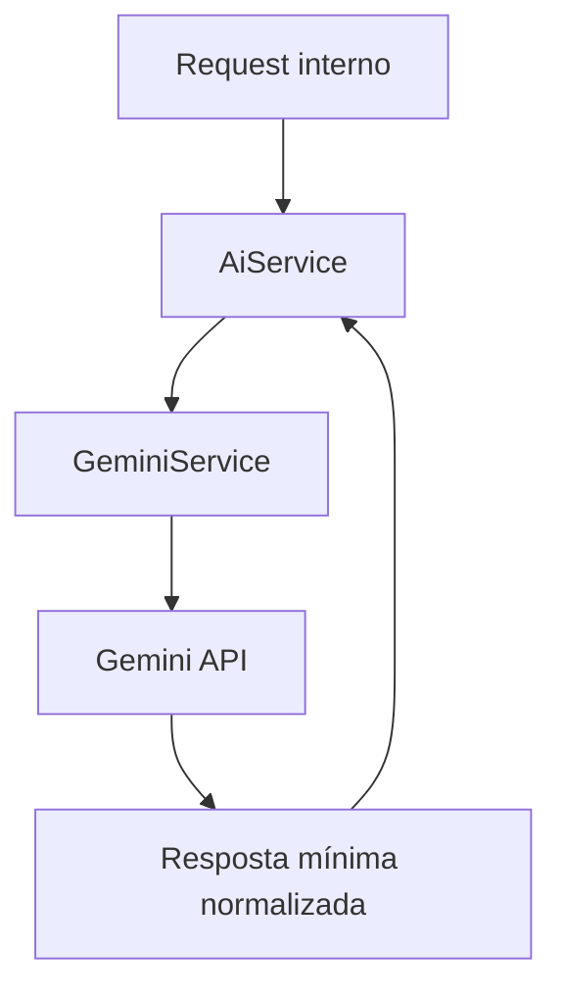

# 🤖 PR 58 — Fase 2: Primeiro Consumo Funcional do Gemini no AI Service
## Introdução controlada de provider alternativo validando integração real sem expandir a arquitetura

---

<div align="left">


</div>

---

> [!IMPORTANT]
> Esta PR introduz o primeiro consumo funcional do Gemini dentro do runtime já existente do `AiService`, reaproveitando a arquitetura atual e limitando a mudança ao recorte mínimo necessário para validar execução real.
>
> - adiciona configuração mínima e versionada para uso do Gemini
> - integra um `GeminiService` simples ao fluxo atual do `AiService`
> - valida sucesso e falha sem abrir uma arquitetura multi-provider completa nesta etapa
>
> **Este PR não transforma o `AiService` em um orquestrador de múltiplos providers, não adiciona fallback automático e não antecipa abstrações que ainda não foram exigidas pelo slice atual.**

---

## Sumário

1. [Síntese Executiva](#1-síntese-executiva)
2. [Objetivo do PR](#2-objetivo-do-pr)
3. [Decisão Arquitetural](#3-decisão-arquitetural)
4. [Escopo](#4-escopo)
5. [Fora de Escopo](#5-fora-de-escopo)
6. [Fluxo Arquitetural](#6-fluxo-arquitetural)
7. [Contratos Mínimos](#7-contratos-mínimos)
8. [Regras de Implementação](#8-regras-de-implementação)
9. [Critérios de Review](#9-critérios-de-review)
10. [Critérios de Aceite](#10-critérios-de-aceite)
11. [Conclusão](#11-conclusão)

---

## 1. Síntese Executiva

A PR anterior validou a conectividade mínima com o Gemini como integração externa isolada, sem ainda posicioná-lo no fluxo regular de execução do runtime. O próximo passo mínimo correto, portanto, é comprovar que esse provider alternativo consegue ser consumido de forma funcional a partir do `AiService`, preservando o desenho já aprovado e sem reabrir a arquitetura.

Esta PR faz exatamente esse avanço. O runtime atual continua o mesmo, o contrato público permanece controlado e a mudança fica concentrada na introdução da configuração necessária, na execução encapsulada via `GeminiService` e na integração mínima com o `AiService`. O objetivo não é resolver multi-provider como iniciativa completa, mas apenas confirmar que a aplicação já consegue consumir o Gemini de ponta a ponta dentro da base existente.

Com isso, o projeto passa a ter uma validação funcional real de provider alternativo, ainda em recorte pequeno, revisável e proporcional à fase atual.

## 2. Objetivo do PR

- Permitir que o `AiService` execute prompt usando Gemini dentro do runtime atual.
- Garantir leitura segura de `GEMINI_API_KEY` e `GEMINI_MODEL` pelo environment centralizado.
- Normalizar a resposta mínima do provider para consumo interno consistente.
- Tornar falhas de integração explícitas sem mascarar erro externo.
- Validar o fluxo principal com teste unitário cobrindo sucesso e falha.

## 3. Decisão Arquitetural

A decisão central desta PR é manter a arquitetura aprovada e adicionar apenas o próximo passo funcional mínimo dentro dela. Em vez de antecipar uma camada de abstração genérica para múltiplos providers, o projeto passa primeiro pela validação operacional concreta do Gemini como dependência externa real integrada ao `AiService`.

Na prática, isso significa introduzir um `GeminiService` simples, com responsabilidade objetiva de executar a chamada ao provider e devolver um resultado mínimo normalizado, enquanto o `AiService` permanece como ponto de consumo dentro do runtime já consolidado. Essa escolha preserva a visibilidade do fluxo, reduz risco de abstração prematura e evita que uma necessidade ainda não estabilizada gere expansão estrutural desnecessária.

## 4. Escopo

- inclusão de `GEMINI_API_KEY` e `GEMINI_MODEL` no environment centralizado
- ajuste do schema de configuração para suportar o novo provider
- criação do `GeminiService` com contrato mínimo de execução
- tratamento básico de erro para resposta inválida ou falha externa
- integração mínima do `GeminiService` ao `AiService`
- cobertura unitária do fluxo principal de sucesso e falha

## 5. Fora de Escopo

- seleção dinâmica de provider por request
- arquitetura multi-provider completa
- fallback automático entre providers
- política de retry avançada
- métricas, telemetria ou comparação entre providers
- cache por provider
- alteração ampla de contratos públicos além do estritamente necessário para o slice

## 6. Fluxo Arquitetural



O fluxo permanece deliberadamente curto. O `AiService` continua como ponto de entrada do runtime atual e delega a execução ao `GeminiService`, que encapsula a comunicação externa com o provider. Após a resposta do Gemini, o retorno é normalizado no menor formato necessário para reutilização local, sem introduzir camadas paralelas ou coordenação adicional.

## 7. Contratos Mínimos

Os contratos públicos não são expandidos além do necessário para suportar o novo consumo. O acréscimo principal desta PR está na configuração centralizada e no contrato mínimo interno de execução do provider.

```ts
export const Env = {
  GEMINI_API_KEY: 'string',
  GEMINI_MODEL: 'string',
};

export type GeminiExecuteInput = {
  prompt: string;
};

export type GeminiExecuteOutput = {
  output: string;
};
```

A intenção aqui é manter o contrato enxuto: prompt entra, texto útil sai. Qualquer enriquecimento adicional de payload, estratégia de provider ou metadata comparativa fica explicitamente fora deste recorte.

## 8. Regras de Implementação

A implementação deve preservar o mesmo princípio de simplicidade que guiou os slices anteriores. O environment continua centralizado; o `GeminiService` deve concentrar apenas a comunicação com o provider e a normalização mínima do retorno; e o `AiService` deve integrar esse consumo sem se transformar, nesta PR, em camada de seleção sofisticada de providers.

Também é esperado que prompt vazio falhe de forma explícita, que output vazio seja tratado como resposta inválida e que erros externos sejam normalizados apenas no nível necessário para manter clareza operacional. Não entram abstrações genéricas, factories, mapeadores extras ou fundações paralelas preparatórias.

## 9. Critérios de Review

O review deve validar se a PR realmente permaneceu no recorte mínimo correto: integração real do Gemini, configuração consistente no environment, fluxo visível dentro do `AiService`, tratamento básico de erro e cobertura unitária suficiente para sucesso e falha. Também deve ser observado se a solução evitou antecipar arquitetura multi-provider, fallback, telemetria ou abstrações ainda não exigidas.

Em especial, esta PR só está alinhada ao padrão do projeto se a leitura do fluxo continuar simples, se o acoplamento permanecer baixo sem abstração ornamental e se a documentação e a implementação estiverem proporcionais ao tamanho real da entrega.

## 10. Critérios de Aceite

- [ ] a aplicação reconhece `GEMINI_API_KEY` e `GEMINI_MODEL` pelo environment centralizado
- [ ] o `GeminiService` executa chamada funcional ao provider e devolve output mínimo normalizado
- [ ] o `AiService` passa a consumir o Gemini no fluxo previsto por esta PR
- [ ] prompt inválido ou output vazio falham de forma explícita
- [ ] erro externo do provider é tratado sem ocultar a falha operacional
- [ ] testes unitários cobrem pelo menos o caminho principal de sucesso e um cenário de falha
- [ ] o fluxo atual permanece simples, sem regressão indevida e sem expansão arquitetural além do slice

## 11. Conclusão

A PR 58 avança de uma validação isolada de conectividade para o primeiro consumo funcional real do Gemini dentro do `AiService`. O ganho entregue é objetivo: o projeto confirma que a base atual consegue integrar um provider alternativo em execução real, mantendo o fluxo controlado e sem reabrir a arquitetura para um desenho multi-provider antes da hora.

Trata-se, portanto, de uma continuação direta da etapa anterior, com recorte pequeno, impacto previsível e alinhamento explícito ao padrão de evolução incremental do Questions-IA.
