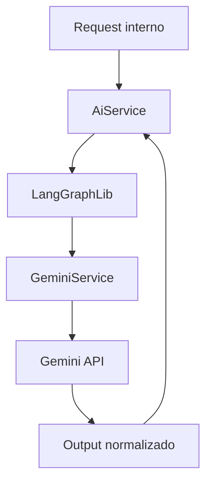

# 🤖 PR 58 — Fase 2: Primeiro Consumo Funcional do Gemini no AI Service
## Introdução controlada de provider alternativo validando integração real sem expandir a arquitetura

---

<div align="left">


</div>

> [!IMPORTANT]
> Esta PR introduz o primeiro consumo funcional do Gemini dentro do runtime já existente, preservando o `AiService`, mantendo o `LangGraphLib` como ponto de execução e limitando a mudança ao recorte mínimo necessário para validar integração real.
>
> - adiciona `GeminiService` como integração concreta com provider externo
> - redireciona o `LangGraphLib` para executar via Gemini
> - preserva contratos atuais do `AiService`
> - valida sucesso e falha com cobertura automatizada
>
> **Esta PR não cria arquitetura multi-provider, não adiciona fallback automático e não expande o desenho além do necessário.**

---

## Sumário
1. Síntese Executiva
2. Objetivo do PR
3. Decisão Arquitetural
4. Escopo
5. Fora de Escopo
6. Fluxo Arquitetural
7. Contratos Mínimos
8. Regras de Implementação
9. Critérios de Review
10. Critérios de Aceite
11. Conclusão

---

## 1. Síntese Executiva

A etapa anterior validou conectividade mínima com o Gemini. O próximo passo correto era comprovar consumo funcional real dentro do runtime já existente, sem reabrir a arquitetura.

A implementação final manteve o `AiService` intacto como fachada principal, preservou o `LangGraphLib` no fluxo e substituiu apenas o executor interno por `GeminiService`. Com isso, o sistema passa a usar Gemini em execução real sem alterar contratos superiores nem espalhar mudanças pelo projeto.

---

## 2. Objetivo do PR

- Integrar Gemini ao runtime atual.
- Manter `AiService` e fluxo de knowledge context existentes.
- Reaproveitar `LangGraphLib` como ponto de execução.
- Garantir tratamento explícito de erro.
- Cobrir caminho principal e falhas relevantes com testes.

---

## 3. Decisão Arquitetural

A decisão adotada foi evolutiva e conservadora:

- `AiService` permanece responsável pelo fluxo de negócio atual.
- `LangGraphLib` permanece como boundary de execução.
- `GeminiService` assume a integração HTTP com o provider.
- Nenhuma abstração genérica adicional foi introduzida.

Isso reduz risco, mantém legibilidade e evita sobreengenharia.

---

## 4. Escopo

- criação de `GeminiService`
- validação de prompt vazio
- chamada ao endpoint Gemini
- normalização de resposta textual
- erro explícito para falha externa ou output vazio
- ajuste do `LangGraphLib` para delegar ao Gemini
- manutenção do `AiService`
- atualização dos testes automatizados
- ajuste do script de conectividade

---

## 5. Fora de Escopo

- seleção dinâmica de provider
- múltiplos providers simultâneos
- fallback entre modelos
- retry avançado
- métricas comparativas
- cache por provider
- refactor amplo do runtime

---

## 6. Fluxo Arquitetural



---

## 7. Contratos Mínimos

```ts
export type GeminiExecuteInput = {
  prompt: string;
};

export type GeminiExecuteOutput = {
  output: string;
};
```

Entrada simples, saída simples.

---

## 8. Regras de Implementação

- prompt vazio falha explicitamente
- erro HTTP externo falha explicitamente
- output vazio é inválido
- `AiService` não sofre expansão estrutural
- knowledge context continua funcionando
- testes preservam regressão zero

---

## 9. Critérios de Review

Validar se:

- Gemini entrou no runtime real
- fluxo segue simples
- `AiService` permaneceu estável
- `LangGraphLib` delega corretamente
- testes cobrem sucesso e falha
- não houve abstração prematura

---

## 10. Critérios de Aceite

- [x] `GeminiService` executa provider real
- [x] `LangGraphLib` usa Gemini
- [x] `AiService` permanece funcional
- [x] prompt inválido falha
- [x] output vazio falha
- [x] erro externo é propagado
- [x] suíte de testes aprovada

---

## 11. Conclusão

A PR 58 entregou o primeiro consumo funcional real do Gemini dentro do runtime existente com recorte pequeno, impacto controlado e preservação da arquitetura atual. O avanço foi incremental, testado e proporcional à fase do projeto.
