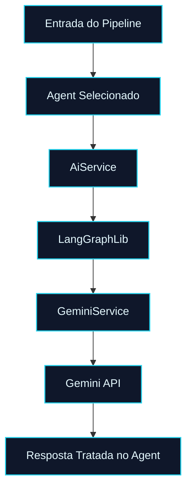

# 🤖 PR 59 — Fase 2: Primeiro Agent com Execução Real via Gemini
## Validação funcional de negócio consumindo o runtime Gemini já integrado

---

<div align="left">


</div>

---

> [!IMPORTANT]
> Esta PR representa o próximo passo natural após a PR 58: validar uso real do runtime Gemini dentro de um agent de negócio do pipeline.
>
> - conecta um agent básico ao `AiService`
> - executa chamada real via Gemini no fluxo do agent
> - mantém recorte pequeno e impacto controlado
> - cobre sucesso e falha no ponto de negócio
>
> **Este PR não migra todos os agents, não altera o orchestrator completo, não adiciona multi-provider e não introduz abstrações prematuras.**

---

## Sumário

1. [Síntese Executiva](#1-síntese-executiva)
2. [Objetivo do PR](#2-objetivo-do-pr)
3. [Decisão Arquitetural](#3-decisão-arquitetural)
4. [Escopo](#4-escopo)
5. [Fora de Escopo](#5-fora-de-escopo)
6. [Fluxo Arquitetural](#6-fluxo-arquitetural)
7. [Contratos Mínimos](#7-contratos-mínimos)
8. [Regras de Implementação](#8-regras-de-implementação)
9. [Critérios de Review](#9-critérios-de-review)
10. [Critérios de Aceite](#10-critérios-de-aceite)
11. [Conclusão](#11-conclusão)

---

## 1. Síntese Executiva

A PR 58 validou a integração real do runtime Gemini dentro da base compartilhada de IA. Com isso resolvido, o próximo passo mínimo correto é provar que essa integração já sustenta uma responsabilidade concreta do domínio, sem bypass técnico e sem reabrir a arquitetura.

Esta PR faz exatamente esse avanço ao conectar um primeiro agent ao `AiService` já aprovado, permitindo execução real via Gemini em um fluxo funcional do pipeline. O ganho aqui não está em expandir a solução, mas em confirmar que a camada integrada na etapa anterior já entrega comportamento útil em contexto de negócio.

O recorte permanece controlado: um único agent, uma chamada real, tratamento explícito de sucesso e falha, e preservação integral das fronteiras existentes.

---

## 2. Objetivo do PR

- Conectar um agent básico do pipeline ao `AiService`.
- Executar chamada real via Gemini usando o runtime já integrado.
- Validar resposta funcional no contexto do agent selecionado.
- Tratar falha operacional sem expandir a arquitetura.
- Cobrir o recorte com testes automatizados de sucesso e erro.

---

## 3. Decisão Arquitetural

A arquitetura aprovada é mantida. Esta PR não cria novo client, não introduz provider paralelo e não desloca a responsabilidade do runtime para dentro do agent. O avanço ocorre apenas no consumo da interface pública já existente.

A decisão central é usar um único agent como ponto inicial de validação funcional. Isso preserva o recorte pequeno, reduz risco de propagação desnecessária e permite comprovar aderência do `AiService` como boundary oficial entre o domínio e a execução real via Gemini.

Com isso, `AiService` permanece como entrada única, `LangGraphLib` continua como runtime interno e `GeminiService` segue encapsulado, sem acoplamento direto do agent ao provider.

---

## 4. Escopo

- seleção de um agent básico para primeiro consumo real
- injeção e uso do `AiService` no agent escolhido
- montagem de prompt mínimo orientado ao contexto do agent
- execução real via Gemini no fluxo funcional
- parse mínimo da resposta retornada
- tratamento explícito de falha operacional
- testes cobrindo cenário de sucesso e cenário de erro
- manutenção dos demais agents sem alteração

---

## 5. Fora de Escopo

- migração de múltiplos agents nesta fase
- redesign do orchestrator
- escolha dinâmica de provider
- fallback entre modelos
- retry avançado
- observabilidade expandida
- telemetria específica de provider
- refactor amplo de contratos ou da árvore de IA

---

## 6. Fluxo Arquitetural



---

## 7. Contratos Mínimos

A interface pública consumida pelo agent permanece mínima e inalterada no ponto de integração com IA:

```ts
export type ExecuteAiInput = {
  prompt: string;
};

export type ExecuteAiResult = {
  output: string;
};
```

O agent continua responsável apenas por montar o contexto do prompt, consumir o resultado retornado e aplicar o parse mínimo necessário ao seu fluxo específico.

---

## 8. Regras de Implementação

A implementação deve manter o agent simples e visível. O agent consome apenas `AiService`, sem acesso direto a `GeminiService`, sem atalhos de runtime e sem helpers genéricos antecipados. O prompt deve permanecer pequeno, específico e coerente com a responsabilidade real do slice.

O parse da resposta deve ser estritamente o necessário para o fluxo atual. Tratamento de erro precisa ser explícito, mas sem transformar este passo em foundation paralela para retry, fallback, observabilidade ou múltiplos providers. O objetivo aqui é validar consumo funcional real, não expandir a superfície arquitetural.

---

## 9. Critérios de Review

Validar se o agent selecionado realmente consome o `AiService` e se a execução via Gemini ocorre dentro do fluxo funcional, sem bypass e sem dependência direta do provider. Confirmar também que o recorte permaneceu pequeno, que o código segue legível e que não foram introduzidas abstrações ou preparações indevidas para fases futuras.

É importante revisar se os testes cobrem o comportamento essencial do slice, especialmente sucesso e falha, e se a documentação continua proporcional ao tamanho real da entrega.

---

## 10. Critérios de Aceite

- [ ] um agent básico do pipeline passa a consumir `AiService`
- [ ] a execução real via Gemini ocorre no fluxo desse agent
- [ ] o resultado retornado é consumido de forma útil no contexto do agent
- [ ] falhas de execução são tratadas de forma explícita
- [ ] `GeminiService` permanece encapsulado atrás do boundary já aprovado
- [ ] os demais agents permanecem sem alteração funcional
- [ ] testes cobrem sucesso e erro do recorte
- [ ] a PR mantém simplicidade e não expande a arquitetura

---

## 11. Conclusão

A PR 59 consolida a transição entre integração técnica e uso funcional real do runtime Gemini. Depois de validar a integração na PR 58, o projeto passa a exercê-la dentro de um agent concreto de negócio, sem ampliar o desenho da solução e sem antecipar a próxima fase.

O resultado é um avanço pequeno, revisável e coerente com a linha evolutiva do Questions-IA: preservar a arquitetura aprovada, validar valor real em produção de código e seguir por incrementos controlados.
