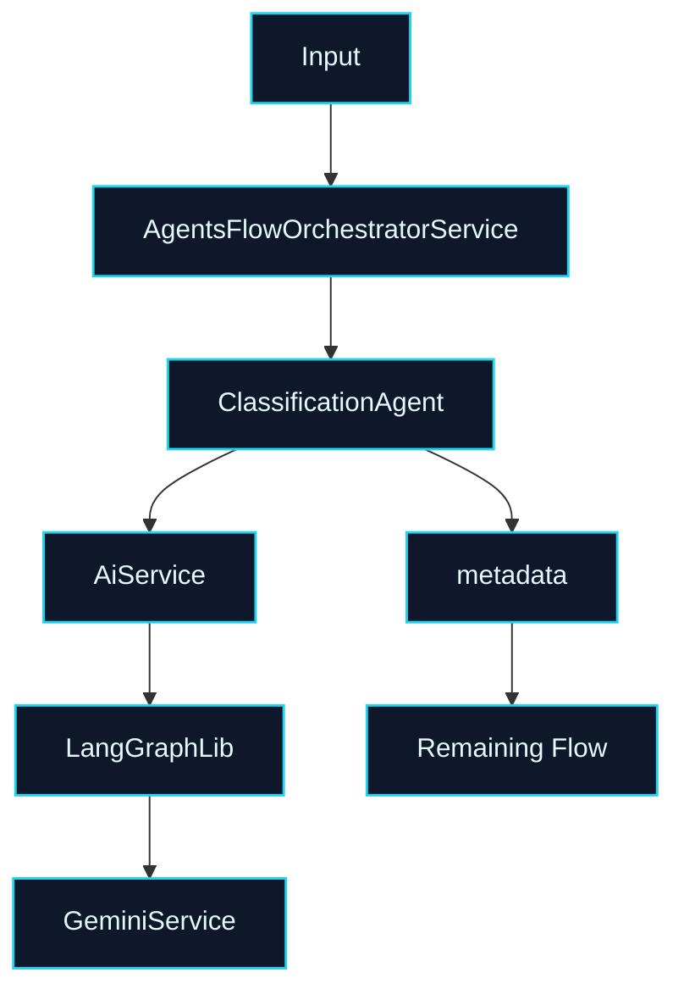

# 🤖 PR 61 — Fase 2: Consolidação do Classification Agent no Fluxo Principal
## Promoção do primeiro agent real validado para etapa oficial da orquestração principal

---

<div align="left">


</div>

---

> [!IMPORTANT]
> Esta PR representa o próximo passo natural após a PR 60: transformar a validação operacional real do `ClassificationAgent` em uso oficial e consolidado dentro do fluxo principal.
>
> - promove o `ClassificationAgent` como etapa estável da orquestração
> - preserva `AgentsFlowOrchestratorService` como boundary oficial
> - mantém saída focada em `metadata`
> - mantém recorte pequeno e sem expansão arquitetural
>
> **Este PR não adiciona persistência de tokens, não cria fallback, não amplia observabilidade e não redesenha o pipeline.**

---

## Sumário

1. Síntese Executiva
2. Objetivo do PR
3. Decisão Arquitetural
4. Escopo
5. Fora de Escopo
6. Fluxo Arquitetural
7. Contratos Mínimos
8. Regras de Implementação
9. Critérios de Review
10. Critérios de Aceite
11. Conclusão

---

## 1. Síntese Executiva

As PRs 59 e 60 validaram o primeiro uso real do Gemini dentro do `ClassificationAgent`, incluindo execução operacional real, retorno válido do provider externo e consumo de tokens. O próximo passo mínimo correto é consolidar esse agent como etapa oficial do fluxo principal.

Esta PR foca em remover o status implícito de experimento validado e posicionar o `ClassificationAgent` como componente estável da orquestração principal. O objetivo não é expandir a arquitetura, e sim cristalizar no fluxo real o que já foi comprovado tecnicamente.

Com isso, o projeto evolui de validação funcional isolada para adoção oficial do primeiro agent real dentro da cadeia principal de processamento.

---

## 2. Objetivo do PR

- Consolidar o `ClassificationAgent` como etapa oficial do fluxo principal.
- Preservar o `AgentsFlowOrchestratorService` como ponto central de coordenação.
- Garantir continuidade do contrato baseado em `metadata`.
- Reforçar testes do fluxo principal com classificação consolidada.
- Manter simplicidade e recorte incremental.

---

## 3. Decisão Arquitetural

A arquitetura permanece inalterada. O `ClassificationAgent` continua especializado em extração de metadados, o `AiService` segue como gateway interno de IA e o `AgentsFlowOrchestratorService` permanece responsável pela composição do fluxo.

A decisão central desta PR é institucionalizar um componente já validado, em vez de abrir novas frentes técnicas. O ganho está na consolidação operacional do fluxo atual, não em novas abstrações.

---

## 4. Escopo

- consolidação do `ClassificationAgent` no fluxo principal
- manutenção da orquestração atual
- continuidade do contrato de `metadata`
- reforço dos testes do orquestrador
- alinhamento do fluxo principal ao uso real já validado
- ajustes mínimos de clareza e robustez

---

## 5. Fora de Escopo

- persistência de tokens
n- dashboards
- tracing distribuído
- retry avançado
- fallback entre modelos
- multi-provider
- redesign do pipeline
- refactor amplo de agents
- novas etapas de IA além da classificação

---

## 6. Fluxo Arquitetural



---

## 7. Contratos Mínimos

Nenhum contrato público novo é introduzido. O fluxo preserva a saída já estabelecida.

```ts
type ClassificationAgentOutput = {
  metadata: QuestionMetadata;
};
```

---

## 8. Regras de Implementação

A consolidação deve ocorrer sem alterar responsabilidades existentes. O `ClassificationAgent` continua responsável apenas por classificação, e o orquestrador continua responsável apenas por compor etapas.

Evitar acoplamentos novos, vazamento de detalhes do provider externo ou ampliação de contrato sem necessidade clara do recorte atual.

---

## 9. Critérios de Review

Validar se o `ClassificationAgent` está claramente posicionado como etapa oficial do fluxo principal, se a orquestração permanece limpa e se os contratos continuam enxutos.

Confirmar também que a PR manteve recorte pequeno, sem aproveitar a mudança para introduzir concerns paralelos.

---

## 10. Critérios de Aceite

- [ ] `ClassificationAgent` consolidado no fluxo principal
- [ ] `AgentsFlowOrchestratorService` preservado como boundary oficial
- [ ] contrato de `metadata` mantido
- [ ] testes do fluxo principal atualizados e passando
- [ ] nenhuma nova camada arquitetural introduzida
- [ ] recorte pequeno e revisável mantido

---

## 11. Conclusão

A PR 61 consolida o primeiro agent real já validado como parte oficial da cadeia principal de processamento. Após provar integração real e comportamento operacional nas etapas anteriores, o projeto transforma agora essa capacidade em componente estável do fluxo principal.

O resultado é evolução incremental, coerente com o desenho atual e sem inflar a arquitetura.

