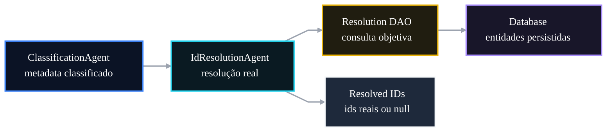

# 🤖 PR 62 — Fase 2: Match Real de IDs com Banco
## Substituição progressiva de IDs sintéticos por resolução real persistida

---

<div align="left">


</div>

---

> [!IMPORTANT]
> Esta PR evolui o `IdResolutionAgent` do modo determinístico/sintético para o primeiro match real com a base persistida, conectando o metadata classificado com entidades reais do banco sem reabrir arquitetura nem expandir o fluxo além do necessário.
>
> - substitui a resolução prioritariamente sintética por consulta real controlada ao banco
> - preserva o contrato atual de saída do fluxo para manter continuidade com a PR anterior
> - mantém fallback previsível para ausência de correspondência, sem heurísticas infladas
>
> **Este PR não introduz fuzzy matching, ranking, cache, múltiplas estratégias paralelas nem enriquecimento adicional de metadata.**

## Sumário

1. [Síntese Executiva](#1-síntese-executiva)
2. [Objetivo do PR](#2-objetivo-do-pr)
3. [Decisão Arquitetural](#3-decisão-arquitetural)
4. [Escopo](#4-escopo)
5. [Fora de Escopo](#5-fora-de-escopo)
6. [Fluxo Arquitetural](#6-fluxo-arquitetural)
7. [Contratos Mínimos](#7-contratos-mínimos)
8. [Regras de Implementação](#8-regras-de-implementação)
9. [Critérios de Review](#9-critérios-de-review)
10. [Critérios de Aceite](#10-critérios-de-aceite)
11. [Conclusão](#11-conclusão)

## 1. Síntese Executiva

A PR 61 consolidou o `ClassificationAgent` no fluxo principal, garantindo execução real e produção de metadata utilizável dentro da Fase 2. O próximo passo mínimo correto é tirar a resolução de IDs do campo sintético e conectá-la ao domínio persistido real, sem alterar o desenho já aprovado do orchestrator e sem expandir a arquitetura para mecanismos mais sofisticados.

Esta PR faz exatamente esse avanço: o `IdResolutionAgent` passa a resolver `lawId`, `articleId`, `bankId` e `yearId` por consulta objetiva ao banco quando houver correspondência direta. Quando não houver match, o comportamento continua explícito e previsível, retornando `null` sem transformar ausência de dado em erro operacional.

## 2. Objetivo do PR

- permitir match real de IDs a partir do metadata classificado
- reduzir a dependência de IDs sintéticos como caminho principal de resolução
- preservar o contrato atual de saída do fluxo para manter compatibilidade incremental
- manter comportamento previsível e simples quando não houver correspondência

## 3. Decisão Arquitetural

A arquitetura aprovada é mantida. O `IdResolutionAgent` continua sendo o boundary responsável por transformar metadata classificado em referências resolvidas, mas agora passa a usar uma camada dedicada de acesso à persistência para executar consultas objetivas ao banco. Com isso, o fluxo principal continua limpo, o SQL não se espalha entre agentes e o avanço fica restrito ao próximo passo funcional mínimo da fase.

Não há redesign do pipeline, mudança de contratos externos ou introdução de mecanismos paralelos de resolução. A decisão central desta PR é apenas substituir a origem sintética da resolução por leitura real persistida, preservando simplicidade e controle de escopo.

## 4. Escopo

Incluído nesta PR:

- introdução de acesso ao banco para resolução real de IDs
- match direto a partir de campos normalizados do metadata classificado
- retorno de IDs reais quando houver correspondência objetiva
- retorno `null` quando não houver match
- testes cobrindo caminhos de sucesso e ausência de correspondência

## 5. Fora de Escopo

Ficam explicitamente fora desta PR:

- fuzzy matching avançado
- score de similaridade
- cache
- múltiplas estratégias paralelas de resolução
- enriquecimento adicional de metadata
- correção automática de inconsistências da base
- ranking de candidatos ou reconciliação textual expandida

## 6. Fluxo Arquitetural



O fluxo permanece linear e pequeno: o metadata produzido pelo `ClassificationAgent` entra no `IdResolutionAgent`, que delega a consulta para uma camada dedicada e devolve IDs reais quando houver match, ou `null` quando não houver correspondência. Não há bifurcações artificiais nem expansão visual além do recorte efetivamente entregue.

## 7. Contratos Mínimos

A entrada conceitual permanece a mesma da etapa anterior: metadata já classificado e suficientemente estruturado para permitir consulta objetiva à base. O ganho desta PR está na fonte da resolução, não na redefinição do contrato do fluxo.

```ts
type QuestionMetadata = {
  law?: string | null;
  article?: string | null;
  bank?: string | null;
  year?: string | null;
};
```

A saída também permanece compatível com o desenho atual, preservando o boundary já utilizado pelo fluxo principal:

```ts
type ResolvedIds = {
  lawId?: string | null;
  articleId?: string | null;
  bankId?: string | null;
  yearId?: string | null;
};
```

## 8. Regras de Implementação

- manter o `IdResolutionAgent` como ponto único de resolução dentro do fluxo
- concentrar acesso ao banco em camada dedicada, sem espalhar query no orchestrator ou em outros agentes
- priorizar match exato após normalização mínima e legível
- não lançar erro por ausência de correspondência
- lançar erro apenas em falhas reais de infraestrutura ou acesso
- preservar implementação simples, sem preparar mecanismos futuros dentro desta PR

## 9. Critérios de Review

- o `IdResolutionAgent` continua coeso e restrito ao papel de resolução
- o acesso ao banco está encapsulado em boundary próprio de persistência
- a PR mantém continuidade com a PR 61 sem redesenhar o fluxo
- o comportamento de fallback para `null` está claro e previsível
- não houve introdução de heurística excessiva, cache ou múltiplas estratégias
- a documentação e a implementação permanecem proporcionais ao slice entregue

## 10. Critérios de Aceite

- [ ] metadata conhecido resolve IDs reais a partir da base persistida
- [ ] metadata sem correspondência retorna `null` sem quebrar o fluxo
- [ ] contrato de saída permanece compatível com o fluxo principal atual
- [ ] acesso ao banco fica encapsulado em camada dedicada
- [ ] suíte de testes cobre sucesso e ausência de match
- [ ] nenhuma estratégia adicional de fuzzy matching, cache ou ranking é introduzida nesta PR

## 11. Conclusão

Esta PR posiciona a Fase 2 no próximo avanço funcional mínimo após a consolidação da classificação real: sair da resolução sintética e começar a apontar para entidades persistidas de fato. O ganho é objetivo e controlado, porque conecta metadata a IDs reais sem reabrir arquitetura, sem inflar a solução e sem esconder a próxima fase dentro do slice atual.
